# 8. 基于假设检验的统计套利

统计套利是一种市场中性交易策略，利用统计方法识别和利用金融资产之间的显著关系。通过假设检验，它能够发现相关资产对中由于暂时性市场低效而导致的价格差异。通过买入被低估的资产并卖出被高估的资产，该策略能够在市场纠正这些低效时确保盈利，而不受整体市场波动的影响。

## 统计套利

统计套利指运用统计方法识别多种金融资产间具有统计显著性的关系，并据此生成交易信号。这一过程包含两个部分：统计分析与套利。在此语境下，统计分析主要指假设检验——这是一套统计程序，允许我们根据观测数据判断多种金融工具间特定关系是否具有统计显著性。而套利则意味着获取确定性的盈利。

该策略的核心依赖于均值回归理论，即假设偏离历史关系的金融工具最终会重新收敛。例如，考虑两只高度相关的股票`A`与`B`。若因短期市场因素导致`A`价格相较`B`不成比例地上涨，统计套利策略可能涉及做空`A`（当前估值过高）并买入`B`（估值过低）。当`A`与`B`的价格回归历史相关性时，套利者将同时平仓——买入`A`以平掉空头头寸，卖出`B`以兑现收益。净利润来源于价格的收敛。因此，统计套利本质上是一种市场中性策略，通过利用暂时性的市场失效来获取利润。

注意，统计套利策略若要生效，需预期两个标的资产间存在相对稳定的长期均衡关系。同时，这类策略的利润空间较小，需要通过高频交易来积累可观收益。

深入探究，统计套利过程的第一步是识别具有高度协同运动特征的交易工具对。这可通过相关性分析或协整检验等统计程序实现。例如，考虑通常同步波动的股票`A`与`B`。尽管金融市场中完美相关性罕见，但我们可借助历史价格数据寻找高度相关的股票（通常处于同一行业或板块）。

然而，这种协同运动并不总意味着价格变动幅度相等。市场情绪、突发新闻公告或疫情等不可预见事件引发的短期波动，可能导致价格关系暂时偏离。在给定示例中，若股票`A`上涨 10%而股票`B`仅上涨 5%，则表明存在暂时性错误定价——`B`相对`A`被低估。

由此进入第二步：通过配对交易等操作利用这种错误定价获利。以`A`与`B`为例，投资者可对低估的股票`B`建立多头仓位，预期其价格将上涨并与`A`的价格收敛。

必须注意的是，统计套利极大依赖于以下前提：这些定价失效是暂时的，价格关系终将回归历史常态。因此，该策略需要勤勉的监控与稳健的风险管理体系，以确保及时入场与离场。

图`8-1`展示了执行统计套利的一种方式。我们假设股票`A`与`B`存在完美相关性，在时期 0、1、2 中观察到相同百分比变动。然而在第 3 期，股票`A`上涨 10%，而股票`B`仅上涨 5%。根据统计套利原理，我们可以做多被视为低估的股票`B`，或做空被视为高估的股票`A`，亦可同时进行两种操作。

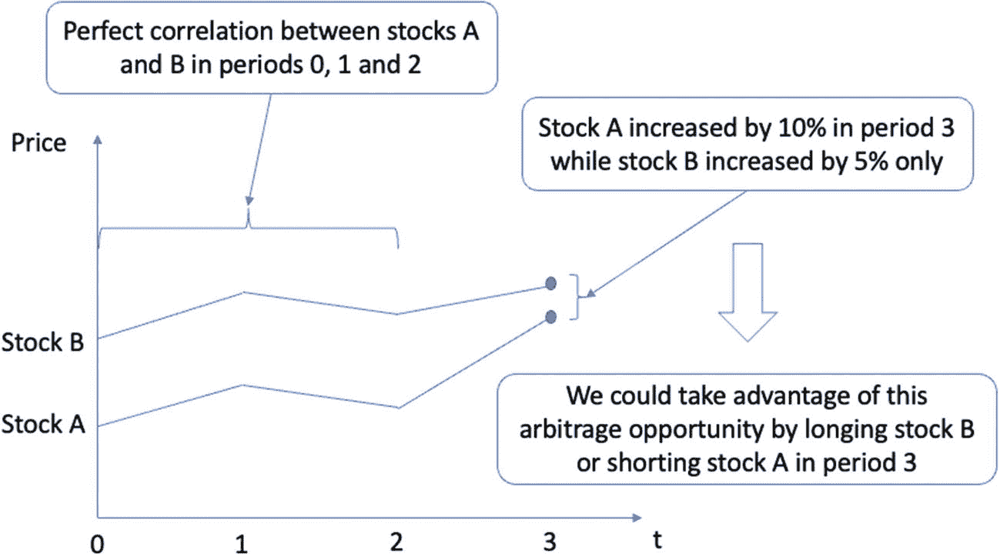

价格对时间折线图。包含股票 A 与股票 B 两条上升曲线。股票 A 在第 3 期上涨 10%，股票 B 上涨 5%。股票 A 与 B 在时期 0、1、2 中呈现完美相关性。

图 8-1

阐释统计套利概念。通过统计技术识别股票`A`与`B`的完美相关性（如时期 0、1、2 价格所示），我们将通过做多股票`B`（被低估）和/或做空股票`A`（被高估）来利用市场错误定价。

## 配对交易

配对交易是一种市场中性策略，它利用统计分析来产生潜在收益，无论市场整体方向如何。配对交易中的“配对”指同时建立两个头寸：做多一项资产并做空另一项资产，关键要求是这些资产具有高度相关性。交易信号源于这两种资产之间的价差或价格差异。

与历史数据相比，异常大的价差表明出现了暂时性的背离，且预期这种背离最终会自我修正，随着时间的推移回归其均值或平均值。交易者可以利用这种均值回归行为，在价差异常扩大时开仓，并在价差缩窄并恢复至正常范围时平仓。

确定何为“异常”或“正常”价差至关重要，并构成了配对交易策略的核心参数。这通常涉及广泛的回测，即分析历史价格数据以识别价格发散与收敛的一致模式，从而确定交易开仓和平仓的阈值。配对交易尽管在市场中性立场上稳健，但仍需深刻理解配对资产之间的长期均衡关系，并谨慎管理预期价格收敛未能实现时的潜在风险。

在配对交易策略中，资产选择基于一种称为假设检验的统计程序，特别是协整检验。此过程利用历史价格数据来识别表现出高度相关性的金融工具对。当两种资产高度相关时，它们倾向于同步移动。这意味着一种资产的价格变动通常会被另一种资产按比例反映，从而产生相对稳定的价差，不会显著偏离其历史均值。然而，有时这种价差会明显偏离其历史常态，表明资产存在暂时性错误定价。这种偏离表明资产价格的偏离程度超出了其通常相关性所能预测的范围。

这种偏离在配对交易中创造了独特的盈利机会。交易者可以通过押注价差的未来收缩来利用这些巨大的价差。具体来说，策略是做多被低估的资产，同时做空被高估的资产，预期随着资产价格的自我修正，价差将回归历史均值。这种回归为以获利平仓两个头寸提供了机会。

图 8-2 展示了实施配对交易策略的整体工作流程。首先，我们分析一组金融资产（如股票），并识别出通过协整检验的配对。协整检验是一种统计检验，用于确定一组资产是否协整，意味着它们的组合生成一个平稳的时间序列，尽管每个单独的时间序列不具备这种平稳性。换句话说，两种协整资产的历史价差形成了一个平稳的时间序列。因此，我们可以监控当前价差，并检查其是否超出了历史价差的合理范围。超出正常范围意味着一个交易信号，可以建立两个头寸：做多被低估的资产，做空被高估的资产。然后，我们将持有这些头寸，直到当前价差收缩回正常范围，此时我们将平仓并锁定利润，防止其进一步收缩（否则会导致亏损）。

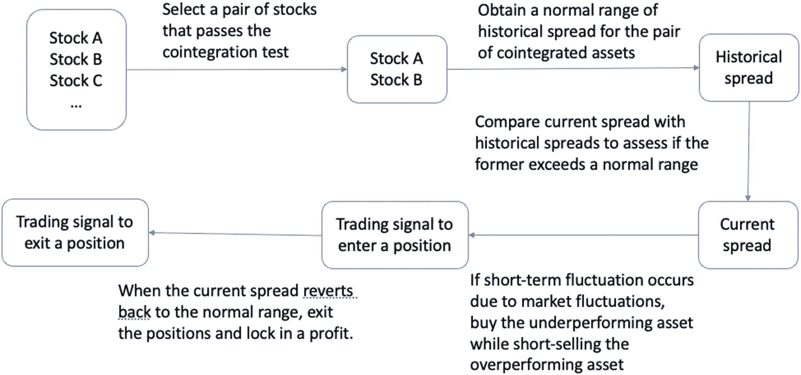

一个工作流程图。选择一对通过协整检验的股票。获取历史价差的正常范围。将当前价差与历史价差进行比较。如果出现短期波动，则建仓。当当前价差回归正常时，平仓。

**图 8-2**

实施配对交易策略的整体工作流程

## 协整

协整是假设检验中一个关键概念，它提出了两种可能的情形：原假设认为两个或多个非平稳时间序列不是协整的；而备择假设则相反，即如果这些时间序列的线性组合生成一个平稳的时间序列，则它们是协整的（稍后会详细说明）。

让我们来澄清这里的一些术语。时间序列是指按时间顺序索引（或列出或绘制）的一系列数据点，每个数据点都分配有特定的时间戳。该数据集可以通过若干汇总统计量或统计特性进行分析。这些统计量可以包括在特定时间范围或窗口内计算的平均值和方差等指标。

将这个窗口移动到不同时期，平稳时间序列的均值和方差平均而言表现出恒定性。这意味着无论何时观察它，其基本属性都不会改变。另一方面，非平稳时间序列则呈现出趋势或漂移，表明其均值和方差在不同时间段会发生变化。这些时间序列是动态的，其基本属性会随时间推移而变化，这通常是由趋势和季节性等因素造成的。

因此，协整过程检验了非平稳时间序列之间是否存在长期均衡关系，尽管存在短期波动。这种长期均衡表现为两个非平稳时间序列的线性组合构成的一个平稳时间序列。

许多传统统计方法，包括普通最小二乘 (OLS) 回归，都基于所分析的变量（也是时间序列数据点）表现出平稳性的假设。这意味着它们的基本统计特性随时间保持一致。然而，当处理非平稳变量时，这种平稳性假设就被违反了。因此，需要使用不同的技术来建模。一种常见策略是对非平稳变量进行差分处理（通过计算两个连续时间点观测值的差来导出新的时间序列），以消除任何可观察到的趋势或漂移。

非平稳时间序列可能存在单位根，这意味着其自回归 (AR) 多项式中有一个根为 1。换句话说，下一时间段的值受到当前时间段值的强烈影响。这种依赖性反映了一种序列相关性，即前期的值会对后续的值产生影响，从而可能导致非平稳行为。

因此，单位根检验是一种检验时间序列是否为非平稳且是否存在单位根的方法。识别并处理单位根的存在是时间序列建模过程中的关键步骤，尤其是在旨在理解长期趋势和预测时。

本质上，协整检验考察了一个假设：尽管个别时间序列可能各自存在单位根因而是非平稳的，但这些时间序列的线性组合可能产生一个平稳序列。这构成了该检验的备择假设。

准确地说，备择假设认为，由个别时间序列线性组合得出的汇总时间序列达到了平稳性。如果是这种情况，则意味着这些时间序列变量之间存在持续的长期关系。由于错误定价等因素，这种长期关系会时不时地被市场的短期波动所掩盖。因此，协整检验有助于揭示时间序列变量间这些隐藏的长期关系。

当资产被判定为协整（即备择假设成立）时，它们将被输入到配对交易策略的交易信号生成阶段。在这里，我们预期两个时间序列变量之间的长期关系将占据主导地位，无论短期市场如何动荡。

因此，协整在统计分析中是一个有价值的工具，它揭示了两条看似无关的非平稳时间序列之间潜在的长期关系。这种长期关联在单独分析这些时间序列时很难发现，但可以通过以特定方式组合这些单独的非平稳资产来发现。这种组合通常使用`Johansen`检验完成，生成一个新的、组合后的时间序列，该序列表现出平稳性，其特征是在不同时期具有恒定的均值和方差。或者，也可以使用`Engle-Granger`检验，从两个资产之间的线性回归模型的残差中生成一个价差序列。

图 8-3 展示了协整和策略制定的过程。协整的目的是将单个非平稳时间序列数据转换为一个组合的平稳序列，这可以通过`Johansen`检验（线性组合）、`Engle-Granger`检验（通过线性回归模型）或其他检验程序来实现。然后，我们将导出另一个称为价差的序列，以指示与长期均衡关系相比的短期波动程度。借助预先定义的入场和出场阈值，价差用于生成交易信号，形式是基于每个时间点偏离程度的入场点和出场点。

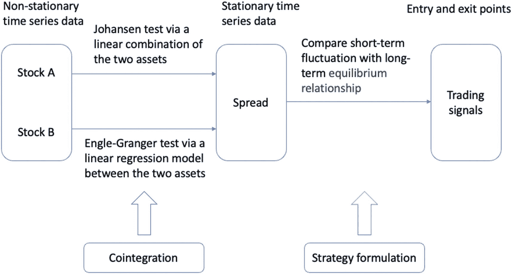

**图 8-3**  

说明使用不同检验和策略制定进行协整以生成交易信号的过程

下一节将更深入地讨论平稳性。

## 平稳性

股票价格是时间序列数据。平稳时间序列是指该序列的统计特性（包括不同时间点的均值、方差和协方差）保持恒定，不随时间变化。因此，平稳时间序列的特征是数据中没有可观察到的趋势或周期。

我们以正态分布为例。正态分布`y = f(x; μ, σ)`是一个概率密度函数，它假设一组固定的参数：均值`μ`作为中心趋势，标准差`σ`作为与平均值的平均偏差，将输入`x`映射到概率输出`y`。概率分布的具体形式如下：

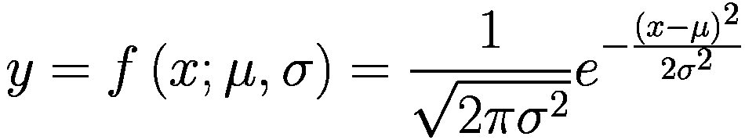

一个广泛使用的正态分布是标准正态分布，指定`μ = 0`且`σ = 1`。得到的概率密度函数为：

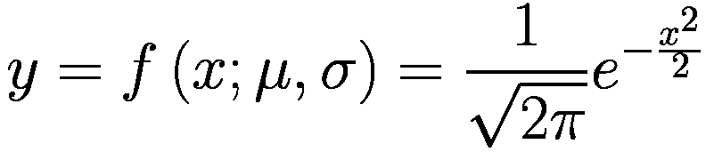

我们可以使用 NumPy 的`random.normal()`函数生成遵循此特定形式的随机样本。在代码清单 8-1 中，我们定义了一个函数`generate_normal_sample()`，通过以列表形式传入输入参数`μ`和`σ`来生成正态分布的随机样本。

```
#### 从正态分布生成随机样本
def generate_normal_sample(params):
"""
输入：params，包含 params[0] 中的均值和 params[1] 中的标准差
输出：一个由输入参数化后的正态分布的随机样本
"""
mean = params[0]
sd = params[1]
return np.random.normal(mean, sd)
```

**代码清单 8-1**  

生成正态分布样本

现在我们通过指定一个标准正态分布来生成一个样本：

```
#### 从标准正态分布生成样本
>>> print(generate_normal_sample([0,1]))
0.09120471661981977
```

为了观察从非平稳分布生成的样本所受到的影响，我们将指定三个不同的非平稳分布。具体来说，我们将生成 100 个样本，这些样本遵循均值或标准差递增的分布。代码清单 8-2 执行了 100 轮随机抽样，并将结果与标准正态分布的样本进行比较。

```
#### 为平稳和非平稳分布各生成 100 个随机样本
T = 100
stationary_list, nonstationary_list1, nonstationary_list2 = [], [], []
for i in range(T):
#### 生成一个平稳样本并添加到列表
stationary_list.append(generate_normal_sample([0,1]))
#### 生成一个均值递增的非平稳样本并添加到列表
nonstationary_list1.append(generate_normal_sample([i,1]))
# # 生成一个均值和标准差都递增的非平稳样本并添加到列表
nonstationary_list2.append(generate_normal_sample([i,np.sqrt(i)]))
x = range(T)
#### 将列表绘制为折线图，并为每条线添加标签
plt.plot(x, stationary_list, label='平稳')
plt.plot(x, nonstationary_list1, label='均值递增的非平稳')
plt.plot(x, nonstationary_list2, label='均值和标准差都递增的非平稳')
#### 设置坐标轴标签
plt.xlabel('样本索引')
plt.ylabel('样本值')
#### 添加图例
plt.legend()
#### 显示图表
plt.show()
```

**代码清单 8-2**  

从平稳和非平稳正态分布生成样本

运行代码将生成图 8-4，其中随着我们在后续轮次中增加幅度，变化的均值和标准差带来的影响变得更加明显。

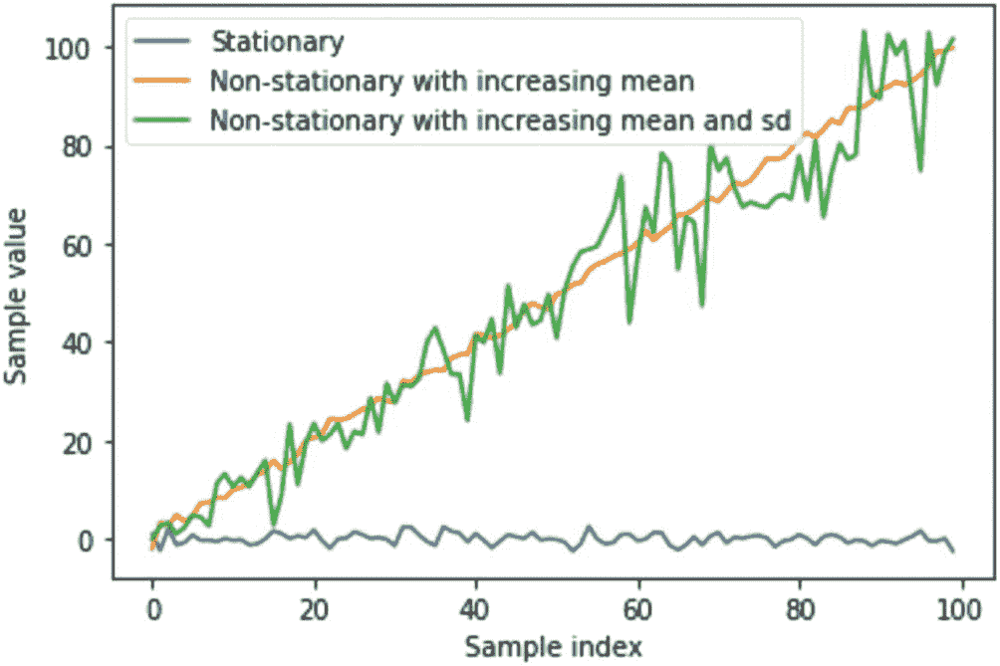

#### 平稳性与协整检验

样本值与样本索引的折线图。图中包含一条水平波动的线（表示平稳序列），以及两条线性上升且波动的线（分别表示均值递增的非平稳序列，以及均值递增且标准差轻微振荡的非平稳序列）。

**图 8-4**

从不同参数设定的非平稳分布中生成正态分布随机样本

请注意，我们可以使用增强型迪基-富勒（ADF）检验来检查序列是否平稳。`stationarity_test()`函数定义在清单 8-3 中，它接受两个输入：待检验平稳性的时间序列，以及用于与 p 值比较并判断统计显著性的显著性水平。注意，p 值是通过`adfuller()`函数从检验结果对象中作为第二个参数获取的。详见清单 8-3。

```python
#### test for stationarity
def stationarity_test(x, threshold=0.05):
    """
    input:
    x: a list of scalar values
    threshold: significance level
    output: print out message on stationarity
    """
    pvalue = adfuller(x)[1]
    if pvalue < threshold:
        return 'p-value is ' + str(pvalue) + '. The series is likely stationary.'
    else:
        return 'p-value is ' + str(pvalue) + '. The series is likely non-stationary.'
```

**清单 8-3** 时间序列平稳性检验

让我们将此函数应用于之前的时间序列数据。结果表明，ADF 检验能够根据预设的显著性水平区分时间序列是否平稳（参数固定）：

```
>>> print(stationarity_test(stationary_list))
>>> print(stationarity_test(nonstationary_list1))
>>> print(stationarity_test(nonstationary_list2))
p-value is 1.2718058919122438e-12\. The series is likely stationary.
p-value is 0.9925665941220737\. The series is likely non-stationary.
p-value is 0.9120355459829741\. The series is likely non-stationary.
```

让我们看一个具体示例，了解如何检验两只股票之间的协整关系。

## 协整检验

本节提供了一个使用 Engle-Granger 两步法执行协整检验的示例。以下是所涉及步骤的总体概述：

-   使用普通最小二乘法（OLS）估计一只股票（作为因变量）与另一只股票（作为自变量）之间的线性回归模型系数。

-   计算线性回归模型的残差。

-   使用单位根检验（如增强型迪基-富勒（ADF）检验）检验残差的平稳性。

-   如果残差是平稳的，则两只股票存在协整关系。如果残差是非平稳的，则两只股票不存在协整关系。

让我们用两只股票（谷歌和微软）来演示这一过程。清单 8-4 导入必要的包并下载 2022 年全年的每日股票价格。我们将使用调整后的收盘价进行协整检验。

```python
import os
import random
import numpy as np
import yfinance as yf
import pandas as pd
from statsmodels.tsa.stattools import adfuller
from statsmodels.regression.linear_model import OLS
import statsmodels.api as sm
from matplotlib import pyplot as plt
%matplotlib inline
SEED = 8
random.seed(SEED)
np.random.seed(SEED)
#### download data from yfinance
start_date  = "2022-01-01"
end_date  = "2022-12-31"
stocks = ['GOOG','MSFT']
df = yf.download(stocks, start=start_date, end=end_date)['Adj Close']
>>> df.head()
GOOG       MSFT
Date
2022-01-03 145.074493 330.813873
2022-01-04 144.416504 325.141357
2022-01-05 137.653503 312.659882
2022-01-06 137.550995 310.189301
2022-01-07 137.004501 310.347382
```

**清单 8-4** 导入包并下载股票数据

现在我们来深入研究这两只股票之间的线性回归模型。我们将谷歌股票视为（唯一的）自变量，微软股票视为待预测的因变量。该模型假定以下形式：

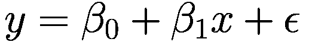

其中，`β[0]` 表示截距，`β[1]` 是这两只股票之间拟合的线性直线的斜率。`ϵ` 表示未被预测变量 `x` 建模的随机噪声。请注意，我们假设 `x` 和 `y` 之间存在线性关系，这在现实环境中不太可能成立。`ϵ` 的另一个名称是残差，它被解释为预测值 `β[0] + β[1]*x` 与目标值 `y` 之间的（垂直）距离。即，`ϵ = y - (β[0] + β[1]*x)`。

我们的关注点随后将转向这些残差，目的是评估残差时间序列是否平稳。让我们首先从线性回归模型中获取残差。

在清单 8-5 中，我们将第一只股票分配为目标变量 `Y`，第二只股票分配为预测变量 `X`。然后，我们使用 `add_constant()` 函数向 `X` 变量添加一列 1，这也可以视为将截距项 `β[0]` 纳入的偏置技巧。接下来，我们使用 `OLS()` 函数构建一个线性回归模型对象，通过调用 `fit()` 函数执行学习，并将残差计算为目标值与通过 `predict()` 方法获得的预测值之间的差值。

```python
#### build linear regression model
#### Extract prices for two stocks of interest
#### target var: Y; predictor: X
Y = df[stocks[0]]
X = df[stocks[1]]
#### estimate linear regression coefficients of stock1 on stock2
X_with_constant = sm.add_constant(X)
model = OLS(Y, X_with_constant).fit()
residuals = Y - model.predict()
```

**清单 8-5** 从 OLS 中提取残差

模型对象本质上是模型权重（也称为参数）和控制数据从输入到输出流动的架构的集合。让我们访问模型权重：

```
#### 访问模型权重
>>> print(model.params)
const   -47.680218
MSFT      0.610303
dtype: float64
```

模型中包含两个参数：`const` 对应 *β*[0]，`MSFT` 对应 *β*[1]。

除了使用 `predict()` 方法获取预测值外，我们还可以构建显式的预测表达式并手动计算。也就是说，我们可以按如下方式计算预测值 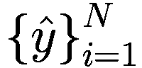：

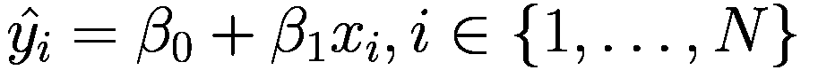

以下代码片段实现了该表达式，并手动计算了模型预测值。我们还使用 `equals()` 函数检查手动计算的残差是否与之前的值相等：

```
#### 替代方法
residuals2 = Y - (model.params['const'] + model.params[stocks[1]] * X)
#### 检查两组残差是否相同
print(residuals.equals(residuals2))
```

最后，我们再次使用增强迪基-富勒（ADF）检验来测试残差序列的平稳性。该检验可以使用 `statsmodels` 包中的 `adfuller()` 函数进行。每个统计检验都有两个相关指标：检验统计量和 p 值。这两个指标都传达了关于原假设统计显著性的相同信息，其中 p 值是一种标准化指标，因此更易于解读。p 值常用的阈值（也称为显著性水平）为 5%。也就是说，如果统计检验得出的 p 值小于 5%，我们就可以在 95% 的置信水平下安全地拒绝原假设，接受备择假设。如果 p 值大于 5%，则无法拒绝原假设，并判定这两只股票不存在协整关系。

原假设通常代表现状。在使用恩格尔-格兰杰检验进行协整检验时，原假设是这两只股票不存在协整关系，即历史价格在长期内不呈现线性关系。备择假设是这两只股票存在协整关系，表现为两者之间存在线性关系且残差序列平稳。

现在，让我们执行 ADF 检验，并使用显著性水平 5% 的结果来判断这两只股票是否协整。在代码清单 8-6 中，我们将 `adfuller()` 函数应用于预测残差，并输出检验统计量和 p 值。随后通过 if-else 语句判断是否有足够信心拒绝原假设，从而认定这两只股票是协整的。

```
#### 检验残差的平稳性
adf_test = adfuller(residuals)
print(f"ADF 检验统计量: {adf_test[0]}")
print(f"p 值: {adf_test[1]}")
if adf_test[1] < 0.05:
    print("这两只股票是协整的。")
else:
    print("这两只股票不是协整的。")
ADF 检验统计量: -3.179800920038961
p 值: 0.021184058997635733
这两只股票是协整的。
代码清单 8-6
检验残差的平稳性
```

结果表明，由于 p 值较小（2%），谷歌和微软股票是协整的。事实上，根据我们之前对最大回撤的分析，谷歌和微软的股价总体上趋于同步变动。然而，随着 ChatGPT 在必应搜索中的引入，整体格局可能开始发生变化。这种协整性（同向变动）可能会逐渐减弱，因为该工具为微软提供了制胜的一切（得益于网络搜索的少量收入），而谷歌则面临失利（主要收入来自网络搜索）。

接下来，我们将讨论另一个密切相关但不同的统计概念：相关性。

## 相关性与协整性

相关性和协整性都是用于分析两个时间序列数据集之间关系的重要统计指标。相关性量化了两个时间序列之间线性关联的程度。本质上，它揭示了两个变量是否同向增减以及这种关系的强度。相关系数的取值范围在 -1 到 1 之间。系数为 1 表示完全正线性关系，-1 表示完全负线性关系，而 0 则表示不存在任何线性关系。

相比之下，协整性关注的是两个可能非平稳的时间序列之间的长期均衡关系。如果两个时间序列是协整的，则表明它们共享一个共同的长期趋势，而不受短期波动的影响。因此，虽然这两个时间序列在短期内可能不呈现线性相关，但在适当组合后，它们在长期内可以展现出平稳的模式。这使得分析师能够发现被暂时性市场波动所掩盖的持久关系。

以下代码片段提供了一个具有相关性但不协整的两个时间序列的示例。我们首先从正态分布中抽取两个包含 100 个随机值的序列，其均值不同但方差相同。然后进行累积求和操作，并将结果存储为 Pandas Series 对象。最后，我们将这两个序列在 DataFrame 中水平合并，并调用 `plot()` 函数，将两个序列绘制成线图：

```
np.random.seed(123)
X = np.random.normal(1, 1, 100)
Y = np.random.normal(2, 1, 100)
X = pd.Series(np.cumsum(X), name='X')
Y = pd.Series(np.cumsum(Y), name='Y')
pd.concat([X, Y], axis=1).plot()
```

运行代码将生成图 8-5。如设计所示，序列 `Y` 比序列 `X` 具有更高的漂移，并且在全部 100 个数据点的历史区间内表现出高度的相关性（或同向变动）。

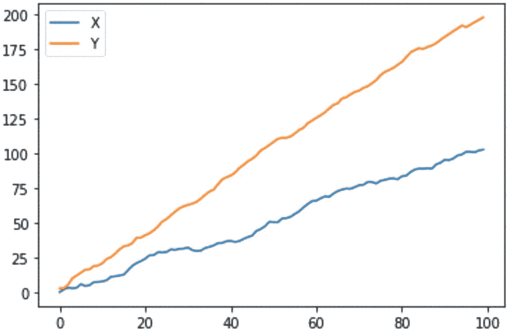

一张 Y 轴与 X 轴的折线图。图中包含两条从原点开始上升且波动的线，分别代表 `X` 和 `Y`。`Y` 线比 `X` 线上升得更快。

图 8-5

展示两个高度相关但不协整的序列的演变过程

让我们计算精确的相关系数和协整性 p 值。在以下代码片段中，我们调用 `corr()` 方法获取 `X` 与 `Y` 的相关系数，并使用 `statsmodels` 包中的 `coint()` 函数执行协整检验并获取相应的 p 值。`coint()` 函数执行的是增强的恩格尔-格兰杰两步协整检验，与我们之前手动执行的两步过程类似。结果表明，这两个序列高度相关，但并非协整。

```
from statsmodels.tsa.stattools import coint
#### 计算相关系数
>>> print('相关系数: ' + str(X.corr(Y)))
#### 执行协整检验
score, pvalue, _ = coint(X,Y)
>>> print('协整检验 p 值: ' + str(pvalue))
相关系数: 0.994833254077976
协整检验 p 值: 0.17830098966789126
```

在下一节中，我们将深入探讨配对交易策略的具体实现。

#### 实现配对交易策略

作为一种市场中性交易策略，配对交易利用历史数据，通过特定的统计检验程序，识别出两只具有协整关系的股票。策略同时对这两只股票建立多头和空头头寸。因此，无论市场对这两只股票是上涨还是下跌，只要它们的相对价差保持不变，配对交易策略就不会受到影响。实际上，该策略监控的是两只股票之间的价差（该价差应随时间保持相对稳定），并在出现短期价格波动时，根据预设的阈值进行交易操作。

我们首先下载股票价格数据。本次将聚焦于几家主要科技巨头的股票代码：谷歌、微软、苹果、特斯拉、Meta 和奈飞。以下代码片段下载了 2022 全年的历史股价，并将调整后的收盘价提取到 `df` 变量中：

```
#### 从 yfinance 下载数据
stocks = ['GOOG','MSFT','AAPL','TSLA','META','NFLX']
df = yf.download(stocks, start=start_date, end=end_date)['Adj Close']
```

接下来，我们分析每一个独特的股票对，并进行协整检验，以寻找那些具有长期均衡关系的股票对。

## 识别协整的股票对

我们的搜索空间中共有六只股票，从而产生总共 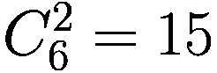 个股票对。可以通过 `itertools` 包中的 `combinations()` 函数生成所有独特股票对的列表，如代码清单 8-7 所示。

```
from itertools import combinations
#### 获取所有股票对
stock_pairs = list(combinations(df.columns, 2))
>>> stock_pairs
[('AAPL', 'GOOG'),
('AAPL', 'META'),
('AAPL', 'MSFT'),
('AAPL', 'NFLX'),
('AAPL', 'TSLA'),
('GOOG', 'META'),
('GOOG', 'MSFT'),
('GOOG', 'NFLX'),
('GOOG', 'TSLA'),
('META', 'MSFT'),
('META', 'NFLX'),
('META', 'TSLA'),
('MSFT', 'NFLX'),
('MSFT', 'TSLA'),
('NFLX', 'TSLA')]
代码清单 8-7
生成所有独特的股票对
```

这 15 个独特的股票对以元组形式存储在一个列表中。每个元组都将在下一节中进行协整检验。

## 测试成对协整

在代码清单 8-8 中，我们遍历每个股票对，并使用 `coint()` 函数执行恩格尔-格兰杰检验。对于每个独特的股票对，我们首先通过按列名子集化来提取对应的 DataFrame，然后使用这两个时间序列进行协整检验，以获得检验分数和 p 值。接着将 p 值与预设阈值进行比较，并打印结果，以评估检验结果是否具有统计显著性。

```
threshold = 0.1
#### 对每个股票对运行恩格尔-格兰杰协整检验
for pair in stock_pairs:
    # 根据当前股票对子集化 df
    df2 = df[list(pair)]
    # 对当前股票对执行检验
    score, pvalue, _ = coint(df2.values[:,0], df2.values[:,1])
    # 检查当前股票对是否具有协整关系
    if pvalue < threshold:
        print(pair, 'are cointegrated')
    else:
        print(pair, 'are not cointegrated')
代码清单 8-8
对每个独特股票对执行协整检验
```

请注意，这里阈值设置为 10% 而不是之前的 5%，因为如果设置为 5%，检验将显示没有协整的股票对。事实证明，`coint()` 函数与我们之前手动实现的检验程序略有不同。例如，`coint()` 函数假定的时间序列顺序可能不一致。

运行代码将产生以下结果：

```
('AAPL', 'GOOG') are not cointegrated
('AAPL', 'META') are not cointegrated
('AAPL', 'MSFT') are not cointegrated
('AAPL', 'NFLX') are not cointegrated
('AAPL', 'TSLA') are not cointegrated
('GOOG', 'META') are not cointegrated
('GOOG', 'MSFT') are cointegrated
('GOOG', 'NFLX') are not cointegrated
('GOOG', 'TSLA') are not cointegrated
('META', 'MSFT') are not cointegrated
('META', 'NFLX') are not cointegrated
('META', 'TSLA') are not cointegrated
('MSFT', 'NFLX') are not cointegrated
('MSFT', 'TSLA') are not cointegrated
('NFLX', 'TSLA') are not cointegrated
```

结果显示，在 10% 的显著性水平阈值下，只有谷歌和微软的股票价格具有协整关系。这两只股票将成为我们接下来配对交易策略的重点，首先需要识别出这两只股票之间的平稳价差。

## 获取价差

如前所述，价差是一个时间序列，源自配对交易策略中两只股票的历史数据。计算价差的方法有很多，我们将采用协整检验程序中使用的那个方法。具体来说，我们将价差定义为两只股票之间线性回归模型的残差。如果它们通过了协整检验，我们就有信心（高达 90% 的置信水平）认为，这两只股票通过线性组合，能够产生一个平稳的价差时间序列。

代码清单 8-9 生成了价差时间序列，并用折线图进行了可视化。和之前一样，我们首先提取预测变量 `X` 和目标变量 `Y`，通过向 `X` 添加一列常数项来应用偏置技巧，运行线性回归模型，最后将目标值与预测值之间的残差作为价差。

```
#### 计算 GOOG 和 MSFT 的价差
Y = df["GOOG"]
X = df["MSFT"]
#### 估计线性回归系数
X_with_constant = sm.add_constant(X)
model = OLS(Y, X_with_constant).fit()
#### 将残差作为价差
spread = Y - model.predict()
spread.plot(figsize=(12,6))
代码清单 8-9
计算价差
```

运行代码将生成图 8-6。此时的价差看起来像是白噪声，即遵循正态分布的高斯分布。由于不同股票的价差尺度不同，建议将它们标准化到同一个标量上，以便于比较和制定策略。下一节将介绍将价差转换为 z 分数的过程。

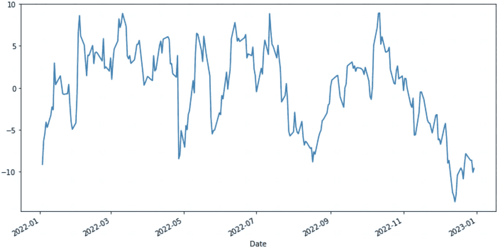

一张价差相对于日期的折线图。曲线呈现波动，带有尖锐的高峰和低谷。曲线在波动中上升，然后下降，并再次上升和下降。

图 8-6

将价差可视化为线性回归模型的残差

## 转换为 Z 分数

Z 分数（z-score）衡量的是每日价差偏离其均值多少个标准差。这是一种标准化分数，可用于比较不同分布。用 `x` 表示原始观测值，则 Z 分数计算公式如下：

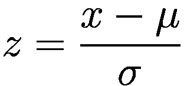

其中 `μ` 和 `σ` 分别表示时间序列的均值和标准差。

因此，Z 分数的绝对值表示当前观测值以标准差为单位偏离均值的程度，而 Z 分数的正负则表明偏离方向是高于均值（正 Z 分数）还是低于均值（负 Z 分数）。

例如，假设某个分布的均值为 10，标准差为 2。若某观测值为 8，则该观测值的 Z 分数为 `(10-8)/2 = 1`。换言之，该观测值距分布均值有一个标准差的距离。

在假设检验中，Z 分数常用于评估观测值的统计显著性。当 Z 分数大于或等于 1.96（或小于或等于 -1.96）时，对应 p 值为 0.05 或更小，这是评估统计显著性的常用阈值。

在代码清单 8-10 中，我们通过均值为 0、标准差为 1 的标准正态分布，展示了其概率密度函数（PDF）的可视化结果。首先，我们使用 `np.linspace()` 函数生成一组等间距的输入值作为 Z 分数，然后使用位置参数为 0（对应均值）和尺度参数为 1（对应标准差）的 `norm.pdf()` 函数，获取标准正态分布 PDF 中对应的概率值。同时，我们对小于 -1.96 和大于 1.96 的区域进行了着色，其中 Z 分数 1.96 对应统计检验中 95% 的显著性水平。换句话说，大于等于 1.96 的 Z 分数占总概率的 5%，小于等于 -1.96 的 Z 分数也同样占 5%。

```python
#### 通过生成均值为 0、标准差为 1 的标准正态分布来演示 Z 分数
from scipy.stats import norm
#### 输入：无界标量，此处假定范围为 [-5, 5]
x = np.linspace(-5, 5, 100)
#### 输出：介于 0 和 1 之间的概率
y = norm.pdf(x, loc=0, scale=1)
#### 设置绘图
fig, ax = plt.subplots()
#### 绘制正态分布的概率密度函数
ax.plot(x, y)
#### 对 Z 分数 >=1.96 和 <= -1.96 的区域进行着色
z_critical = 1.96
x_shade = np.linspace(z_critical, 5, 100)
y_shade = norm.pdf(x_shade, loc=0, scale=1)
ax.fill_between(x_shade, y_shade, color='red', alpha=0.3)
z_critical2 = -1.96
x_shade2 = np.linspace(-5, z_critical2, 100)
y_shade2 = norm.pdf(x_shade2, loc=0, scale=1)
ax.fill_between(x_shade2, y_shade2, color='red', alpha=0.3)
#### 添加标签和标题
ax.set_xlabel('Z 分数')
ax.set_ylabel('概率密度')
#### 添加垂直线以标示 Z 分数为 1.96 和 -1.96 的位置
ax.axvline(x=z_critical, linestyle='--', color='red')
ax.axvline(x=z_critical2, linestyle='--', color='red')
#### 显示图形
plt.show()
```

运行代码将生成图 8-7。

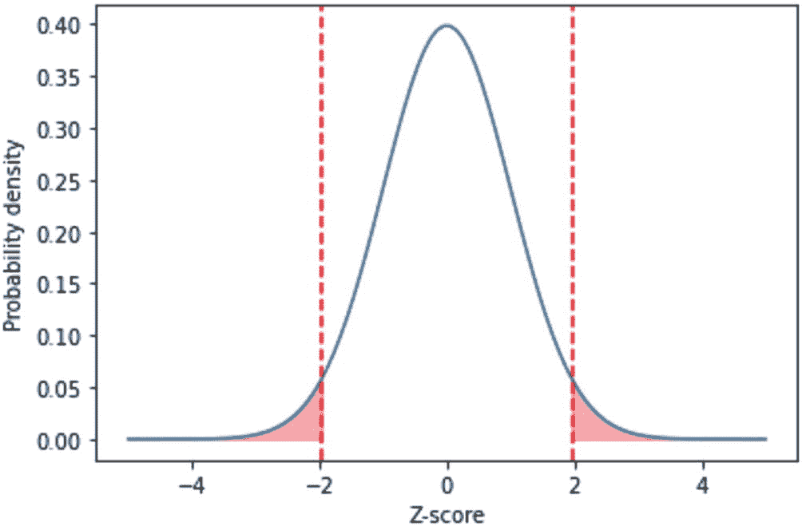

在假设检验的语境中，着色区域代表在原假设成立时观察到 Z 分数大于 1.96 的概率。执行统计检验会给出一个 Z 分数。在单侧检验中，如果 Z 分数高于 1.96 或低于 -1.96，我们将在 0.05 的显著性水平下拒绝原假设，转而支持备择假设，因为原假设下观察到该现象的概率太小了。

总而言之，我们将 Z 分数作为一种标准化分数，用于衡量某个观测值距离其分布均值有多少个标准差。它被用于假设检验中，以判断某个观测值的统计显著性，即该事件在原假设下发生的概率。显著性水平通常设定为 0.05。我们可以利用 Z 分数来计算在原假设下观测到与当前观测值同等极端值的概率。最后，我们决定是拒绝原假设，还是无法拒绝原假设。

现在，让我们回到之前的运行示例。由于股票价格经常波动，我们转而采用移动平均法来推导运行均值和运行标准差。也就是说，每个每日价差在滚动窗口内，都会对应一个基于价差集合计算出的运行均值和运行标准差。在代码清单 8-11 中，我们使用窗口大小为 10 来推导运行均值和运行标准差，并应用变换得到标准化的价差，即 Z 分数。

```python
#### 转换为 Z 分数
#### Z 分数衡量价差偏离其均值多少个标准差
#### 使用移动窗口推导均值和标准差
window_size = 10
spread_mean = spread.rolling(window=window_size).mean()
spread_std = spread.rolling(window=window_size).std()
zscore = (spread - spread_mean) / spread_std
zscore.plot(figsize=(12,6))
```

运行代码将生成图 8-8，此时标准化后的价差看起来更接近正态分布，如同白噪声。

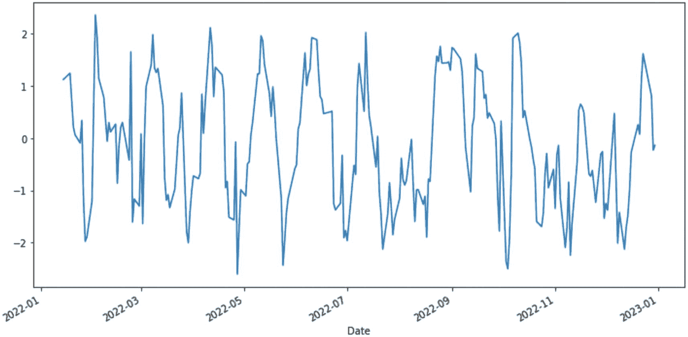

由于我们使用窗口大小为 10，移动平均序列中的前 9 个观测值会显示为 NA。我们先使用 `first_valid_index()` 函数找到第一个有效索引，然后对 Z 分数序列进行子集选取，以去除这些初始的 NA 值，如下代码所示：

```python
#### 去除初始的 NA 天数
first_valid_idx = zscore.first_valid_index()
zscore = zscore[first_valid_idx:]
>>> zscore
Date
2022-01-14    1.123748
2022-01-18    1.245480
2022-01-19    0.742031
2022-01-20    0.211878
2022-01-21    0.064889
...
2022-12-23    1.618937
2022-12-27    0.977235
2022-12-28    0.807607
2022-12-29   -0.230086
2022-12-30   -0.137035
名称：GOOG，长度：242，dtype：float64
```

下一节将使用 Z 分数来制定交易策略。

### 制定交易策略

如前所述，配对交易策略利用 `z-score` 来应对价差的短期波动，对两只协整资产进行多空操作，并从价差的长期均值回归中获利。

当上一节计算出的 `z-score` 穿过特定阈值时，就会产生交易信号。例如，当 `z-score` 低于 –2 时，我们可以做多第一只股票并做空第二只股票，这意味着价差比平时更负，且价差长期内很有可能回归其均值。同样，当 `z-score` 高于 2 时，我们可以做空第一只股票并做多第二只股票，这表明价差比平时更正，且价差很有可能回归其均值。这些构成了我们的入场信号。

另一方面，当我们持有一个未平仓头寸时，股票可能会在极短时间内朝不利方向移动。为了保护利润并止损，我们可以设置一个充当止损订单的离场信号。例如，假设我们在前一步 `z-score` 低于 –2 时建立了一个多头头寸。我们可以设置另一个阈值，当 `z-score` 返回一个小值（比如 –1）时平仓。穿过此阈值表明价差已回归其均值。

以下列表总结了建立和退出多头与空头头寸的交易信号制定规则：

- **多头入场**：当 `z-score` 低于预设的负阈值（例如 –2）时，对第一只股票建立多头头寸。

- **多头离场**：当 `z-score` 向上穿过另一个预设的负阈值（例如 –1）时，平掉第一只股票的多头头寸。

- **空头入场**：当 `z-score` 高于预设的正阈值（例如 2）时，对第二只股票建立空头头寸。

- **空头离场**：当 `z-score` 向下穿过另一个预设的正阈值（例如 1）时，平掉第二只股票的空头头寸。

在实现中管理这四种信号时，我们可以为每只股票维护一个`Pandas Series`对象，其中每个值为 1（代表多头）、–1（代表空头）或 0（代表平仓）。为简化流程，我们还假设每只股票的多头和空头头寸也是同时建立和同时平仓。换句话说，当对一只股票建立多头头寸时，我们会同时对另一只股票建立空头头寸。

图 8-9 将这四个交易信号叠加到了之前的 z-score 时间序列上。外部阈值 2 和 –2 代表多头和空头头寸的入场信号，内部阈值 1 和 –1 代表现有头寸的离场信号。在这两个阈值之间，我们仅维持当前头寸不变。

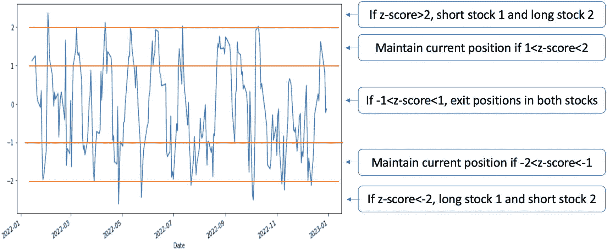

一张显示 z-score 相对于日期的折线图。曲线水平波动，伴有尖锐的高峰和低谷。在 z-score –2、–1、1 和 2 处有四条水平线。图中还对水平线之间划分出的 5 个区域内的交易信号进行了说明。

**图 8-9** – 说明基于预设入场和离场阈值为 z-score 制定交易信号的过程

在代码清单 8-12 中，我们首先分别初始化入场和离场阈值。我们创建两个 `Pandas Series` 对象（`stock1_position` 和 `stock2_position`）来存储每只股票的每日头寸。基于当前的 z-score 以及建立或退出多头或空头头寸的预设阈值，我们在一个循环中检查每日的 z-score，并根据以下规则将其匹配到信号生成的四种情况之一：

- 如果 z-score 低于 –2 且股票 1 没有先前头寸，则做多股票 1，做空股票 2。

- 如果 z-score 高于 2 且股票 2 没有先前头寸，则做空股票 1，做多股票 2。

- 如果 z-score 介于 –1 和 1 之间，则平掉股票 1 和股票 2 的头寸。

- 其余情况，即 z-score 介于 –2 和 –1 之间或介于 1 和 2 之间时，维持股票 1 和股票 2 的现有头寸。

```
#### 设置入场和离场信号的阈值
entry_threshold = 2.0
exit_threshold = 1.0
#### 将每日头寸初始化为零
stock1_position = pd.Series(data=0, index=zscore.index)
stock2_position = pd.Series(data=0, index=zscore.index)
#### 为每只股票生成每日入场和离场信号
for i in range(1, len(zscore)):
    # zscore2 and no existing short position for stock 2
    elif zscore[i] > entry_threshold and stock2_position[i-1] == 0:
        stock1_position[i] = -1 # 做空股票 1
        stock2_position[i] = 1 # 做多股票 2
    # -1<zscore<1
    elif abs(zscore[i]) < exit_threshold:
        stock1_position[i] = 0 # 平掉现有头寸
        stock2_position[i] = 0
    # -2<zscore<-1 or 1<zscore<2
    else:
        stock1_position[i] = stock1_position[i-1] # 维持现有头寸
        stock2_position[i] = stock2_position[i-1]
```

**代码清单 8-12** – 实现配对交易

现在我们就可以计算配对交易策略的总利润了。在代码清单 8-13 中，我们首先使用每只股票的 `pct_change()` 函数，从有效索引开始，获取每日百分比变化。这些每日收益率将根据前一交易日持有的头寸进行调整。换句话说，将平移后的头寸与每日收益率相乘，得到该策略下每只股票的每日收益率，并将可能的 NA 值用零填充。最后，我们将两只股票的每日收益率相加，转换为 `1+R` 收益率，并使用 `cumprod()` 函数执行顺序复利计算，以获取财富指数。

```
#### 计算每只股票的收益率
stock1_returns = (df["GOOG"][first_valid_idx:].pct_change() * stock1_position.shift(1)).fillna(0)
stock2_returns = (df["MSFT"][first_valid_idx:].pct_change() * stock2_position.shift(1)).fillna(0)
#### 计算策略的总收益率
total_returns = stock1_returns + stock2_returns
cumulative_returns = (1 + total_returns).cumprod()
#### 绘制累积收益曲线
>>> cumulative_returns.plot()
```

**代码清单 8-13** – 计算累积收益率

运行上述代码生成图 8-10。

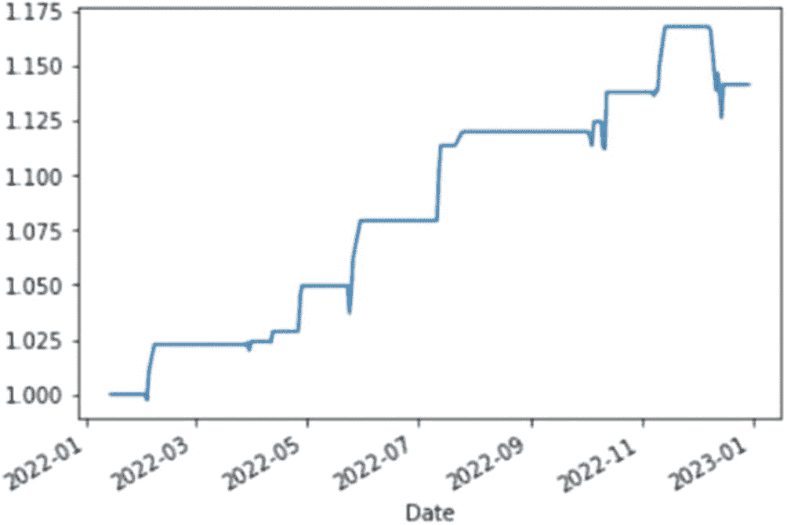

一张显示累积收益率相对于日期的折线图。曲线在 2022 年 1 月至 2023 年 1 月期间呈阶梯式向上波动。

**图 8-10** – 配对交易策略的累积收益率

通过以下代码提取的最终收益率显示，配对交易策略在交易年度末实现了 14.1% 的总利润。

同样，这个结果还需要在投资资产选择、交易时段和评估指标方面进行更严格的回测。

## 总结

在本章中，我们介绍了统计套利和假设检验的概念，以及基于配对交易策略的实现细节。我们首先梳理了制定配对交易策略的总体流程，并介绍了协整和平稳性等新概念。接着，我们比较了协整和相关性的区别，两者密切相关但截然不同。最后，我们通过一个案例研究，介绍了如何使用配对交易策略计算累积收益率。

在下一章中，我们将介绍贝叶斯优化，这是一种用于搜索交易策略最优参数的原则性方法。

## 练习题

-   评估所选股票对在牛市和熊市期间分别的协整性。结果是否存在显著差异？如果存在，讨论可能的原因。

-   对一对时间序列数据实施滚动协整检验，观察协整状态（协整或非协整）随时间如何演变。

-   对于给定的股票对，使用`ADF`检验测试价差的平稳性。如果价差是平稳的，这对配对交易策略意味着什么？

-   给定一对股票的价差时间序列数据，执行假设检验以检查价差的均值是否为零。

-   计算不同回溯期（例如 30、60 和 90 天）下价差的`z-score`。改变回溯期如何影响`z-score`的分布以及配对交易策略的表现？