# 使用贝叶斯优化优化交易策略

金融交易采用众多策略以最大化收益。这些策略的有效性通常取决于相应参数的微调，而这一任务既耗时又计算成本高昂。贝叶斯优化作为一种高效的策略优化方法应运而生。它是一种基于模型的优化算法，利用过去的评估结果（以训练集的形式）构建概率代理模型，并通过所谓的采集函数来确定下一个评估点。这种方法在交易策略优化中尤其有用，因为目标函数通常是带噪声的、非凸的且评估成本高昂。

在本章中，我们将探讨贝叶斯优化的原理及其在交易策略优化中的应用。通过本章的学习，读者将深入理解如何利用贝叶斯优化来微调参数，从而增强交易策略，最终可能带来更高的收益和更高效的计算资源利用。

## 优化交易策略

我们旨在通过特定的交易策略最大化最终盈利能力，该策略通常附带一组参数。当正确定位时，最优参数集可以在回测期间产生最高利润（如果目标是最大化最终收益）。由于不同测试期在资产价格曲线方面可能表现出不同特征，一种稳健的方法是在覆盖最具代表性场景的不同测试期内对特定参数集进行回测。因此，最优参数集能在多个回测期内一致地产生最高最终收益。

最优参数集是能在多个回测期内一致产生最高最终收益的那一组。这意味着该策略不仅在某一特定市场条件下表现良好，而且在各种典型场景下均能有效运作。这种方法有助于确保策略的稳健性和适应性，无论市场波动如何，都能带来强劲回报。

然而，通过设置不同参数值来手动微调交易策略是一个极其耗时的过程。一方面，需要测试的可能参数值数量可能过于庞大。当需要测试的配置组合过多时，执行网格搜索（逐一搜索每种独特配置）可能代价过高，尤其是当每个参数有多个备选值且参数数量众多时。特别地，连续参数由于存在无限多个值，将使这种手动搜索变得不可行。另一方面，对每组特定参数进行回测并非即时完成。相反，每轮执行可能耗时很长，这进一步加剧了全局搜索最优策略的挑战，使手动微调交易策略成为一项艰巨的任务。

这正是自动化优化技术（如贝叶斯优化）的用武之地。这些方法能高效地遍历搜索空间（也称为域），根据先前结果智能地选择下一组要测试的参数。这使得参数空间的采样更加高效，从而节省时间和计算资源。

事实上，有许多优化技术旨在为特定交易策略定位最优参数集。让我们首先理解在搜索最优交易策略时出现的优化问题。

### 参数化交易策略

参数作为特定交易策略的输入变量。一个典型的交易策略拥有一个或多个参数，每个参数在预先设定的范围内取特定值。每个参数都可以在其定义范围内变化，从而产生多种可能的策略配置。在接受这些输入参数后，策略将生成相应的交易信号，据此可以计算出特定回测期内的最终收益，作为这些参数“优劣”的指标。输入参数并非固定值，而是可以在预定范围内变化的变量。

我们来看一个具体例子。回顾之前讲过的趋势跟随策略。该交易策略依赖两条移动平均线来生成交易信号：一条短期移动平均线和一条长期移动平均线。如果短期移动平均线上穿长期移动平均线，我们将在平掉现有空头头寸（如有）后建立多头头寸。或者，如果短期移动平均线下穿长期移动平均线，我们将在平掉现有多头头寸（如有）后建立空头头寸。

因此，该策略依赖于两个输入参数：短期和长期移动平均线的窗口长度`l[1]`和`l[2]`。每一组参数都对应着若干绩效指标，例如最终收益或夏普比率。每一组参数（`l[1]`和`l[2]`）都会产生一系列独特的交易信号，进而导致特定的最终收益或夏普比率。这些绩效指标作为所选参数“优劣”或有效性的指示。

为了继续寻找最优窗口长度参数集，我们需要一个单一的数值指标来进行优化。这种标量目标函数作为反馈信号，表明当前输入参数集的好坏程度。该目标函数作为反馈信号，指示给定输入参数集的有效性。例如，假设我们选择夏普比率作为要最大化的目标。这就产生了一个目标函数，其输出是特定回测期内的夏普比率`S`，输入参数是窗口长度`l[1]`和`l[2]`，我们可以将目标函数表示为`S = f(l[1], l[2])`。这里，`f`代表一个黑箱函数，这意味着我们不知道其显式数学形式或导数信息。黑箱函数是指我们对其数学形式或导数信息没有显式了解的函数。这意味着我们可以评估该函数（即，我们可以确定给定参数集下的夏普比率），但我们没有一个能够直接计算出最优参数的简单公式。这使得全局优化极其困难，因为我们对这个函数的特性知之甚少，而我们的目标是找到它的全局最大值点。

这种对函数缺乏显式了解的情况使得优化问题充满挑战。我们本质上是在搜索一个我们知之甚少的函数的全局最大值。然而，这恰恰是贝叶斯优化旨在解决的问题类型。

更正式地说，我们可以将问题表述为：对于给定的股票，在`[1,10]`和`[11,20]`的范围内（注意，我们需要确保`l[1] < l[2]`），找到使得整个一年回测期内夏普比率最大化的`l[1]`和`l[2]`值。图 9-1 总结了优化问题的特征。请注意，不同的交易策略对应不同的未知黑箱函数`f`。即使策略相同，改变回测期也会产生目标函数`f`的不同函数实现。

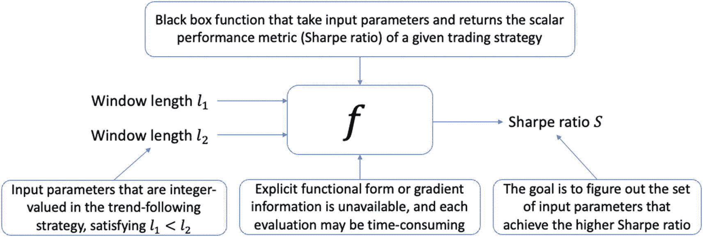

优化问题的示意图。黑箱函数`f`接收满足窗口长度`l[1]`小于`l[2]`的输入参数，其显式函数形式或梯度信息不可用，目标是找出能够实现更高夏普比率的那组输入参数。

**图 9-1**

说明优化问题。所选交易策略呈现为一个未知函数，我们的目标是搜索能够提供最高绩效指标（本例中为夏普比率）的最优窗口长度集。

下一节将提供关于整个优化过程的更多视角。

### 关于优化的更多内容

优化的目标是在最大化问题中，为所有输入值`x in X`找到最优值`f* = f(x*)`或最大化点`x* = argmax f(x)`，这同样也可以是极小化问题。执行优化过程的过程称为优化器。优化器有多种类型，其中随机梯度下降（`SGD`）是深度学习领域最流行的优化器。在交易策略回测的背景下，我们最感兴趣的是优化风险调整后的收益，通常用夏普比率或最大回撤等其他风险指标表示。此外，我们还面临一个额外的挑战：输入并非连续值，而是离散的，例如窗口大小或交易量。

优化器接收函数`f`，并计算出所需的最优值`f*`或其对应的输入参数`x*`。成为最优值意味着`f(x*)`大于（在极小化问题中则小于）邻域内的任何其他值。这里，`f*`可能是局部最优或全局最优。局部最优意味着`f(x*)`是一座山的山顶，而全局最优意味着该区域所有山峰中的最高点。也就是说，在最大化问题中，我们可以找出所有局部最大值，相互比较，并将其中的最大值作为全局最大值报告。两者都表现为在点`x*`处梯度为零，然而全局最优通常才是我们的目标。优化器需要一种策略来逃离这些局部最优，并继续搜索全局最优。有多种技术可以处理这个问题，包括通过多重启动程序使用不同的初始值，在参数空间中进行随机跳跃，以及使用模拟退火或遗传算法等复杂算法，这些算法采用特定机制来逃离局部最优。

在开发交易策略的背景下，我们感兴趣的是能够给出最大夏普比率的全局最大化点（最优输入参数）。这是一项复杂的任务，因为可能存在许多能产生良好结果的参数集（局部最大值），但我们想找到绝对最好的那个（全局最大值）。

请注意，利用梯度信息来识别最优解代表着我们对优化问题理解的巨大进步，这一方法最初由艾萨克·牛顿提出。在他那个时代之前，我们需要对每一对独特组合进行手动比较，这是一个组合问题，需要耗费大量时间。当函数形式已知时，例如`y = x²`，我们可以借助微积分工具，求解梯度为零的点，即`y' = 2x = 0`，得到`x = 0`。然后，我们可以计算二阶导数或应用符号图法来确定这是最大值点还是最小值点。

下一节将进一步介绍全局优化问题。

#### 全局优化

优化旨在通过精心分配有限资源，在整个搜索域中定位最优的参数集。例如，当您需要在两分钟后出门上班前在家中寻找车钥匙时，我们自然会从最有可能放钥匙的地方开始找起。如果那里没有，就会稍作思考可能的其他位置，然后前往下一个最有可能的地方。这个过程会不断重复，直到找到钥匙为止。在这个例子中，搜索策略在某种程度上表现得非常智能。它会消化之前搜索中获得的可用信息，并提出下一个有希望的位置，从而明智地利用有限资源。这里的资源可以是项目截止日期（明天）前我们能进行的有限尝试次数，或者在这个例子中寻找钥匙的两分钟预算。未知函数就是房子本身，它是一个二进制值，在每次对特定位置采样时，会揭示钥匙是否被放在了所提议的位置。

这种智能搜索策略代表了优化中的一个基石概念，尤其是在无导数优化领域，因为未知函数不会透露任何导数信息。在这里，策略需要平衡**探索**（在搜索域中的不同位置探测未知函数）和**利用**（专注于我们已经发现良好候选值的有前景区域）。这种权衡通常通过一条学习曲线来表征，该曲线显示了最佳已发现解的函数值随函数评估次数的变化情况。

寻找钥匙的例子被认为是一个简单的例子，因为我们熟悉其结构设计所构成的环境。但是，想象一下在一个完全陌生的环境中定位一个物品。优化器在通过多次顺序采样确定下一个采样位置时，需要考虑到因环境不熟悉所带来的不确定性。当采样预算有限（在现实生活中的搜索中，时间与资源常常如此受限）时，优化器需要仔细权衡每个候选输入参数值的效用。

这个过程的特点是**在不确定性下的序贯决策**，这也是优化领域的核心问题。当面临这种情况时，优化器需要制定一个智能的搜索策略，以有效管理探索（搜索新区域）与利用（利用已知的有前景位置）之间的权衡。在陌生环境中搜索物品的语境下，探索涉及搜索物品可能存在的全新区域，而利用则涉及聚焦于已经找到物品线索或迹象的周围区域。挑战在于平衡这两种方法，因为过于侧重探索可能导致时间和资源浪费，而过于侧重利用则可能导致错失良机。

在交易策略的世界里，这种情况相当于在一个高维参数空间中进行搜索，每个维度代表交易策略的一个不同方面。探索将涉及尝试一套全新的参数，而利用则涉及对已经发现的最有前景的参数集进行微调。优化器的目标是有效地在这片高维空间中导航，并找到一组参数，使其在夏普比率或其他预设指标方面表现出最佳性能。

让我们用数学术语来形式化这个序贯全局优化问题。我们面对的是一个定义在特定域 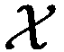 上的未知标量值目标函数 `f`。换句话说，这个未知的感兴趣对象 `f` 是一个函数，它将  中的某个候选参数映射到  中的一个实数，即 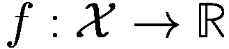。通常，我们对域  的性质不做特别假设，除了它应该是一个有界、紧致且凸的集合。

有界集  意味着它具有上限和下限，并且包含在  内的所有参数值都落在这些边界内。紧致集是指既有界又封闭的集合，意味着它包含其边界。凸集则是指对于集合内的任意两点，该集合包含连接这两点的整个线段。这些假设使我们的问题在数学上易于处理，并且在现实世界场景中具有实际意义。

除非另有说明，我们关注的是最大化问题而非最小化问题，因为最大化目标函数等价于最小化其相反数，然后再取反得到原始最大值。因此，优化过程旨在以一种有原则且系统化的方式定位全局最大值 `f^*` 或其对应位置 `x^*`。从数学上讲，我们希望定位到满足下式的 `f^*`：

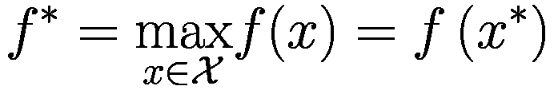

或者等价地，我们感兴趣的是其位置 `x^*`，满足：

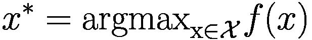

`argmax` 操作在数学中用于表示函数 `f` 取得最大值的自变量或域  中的点集。当用于此优化问题时，它意味着我们在寻找能够产生函数最大值的那些特定的输入参数值。

再次注意，`f(x)` 是未知的，只能通过采样间接观察，并且  可能是一个高维空间中的集合。因此，我们在一个高维空间中寻找最佳参数，而每次只能探索一个样本。这正是使全局优化问题在实践中具有挑战性的原因。

图 9-2 展示了一个一维目标函数的例子，并突出显示了其全局最大值 `f^*` 及其位置 `x^*`。因此，全局优化的目标是在整个搜索空间  内系统地推演一系列采样决策，以尽可能快地定位全局最大值——即尽可能少地采样，而不是进行随机试验或网格搜索。此外，当优化器就参数空间中下一个采样位置做出系列决策时，每个决策都会受到先前样本（也称为训练集）结果的影响，并且旨在改进对最优值的估计。

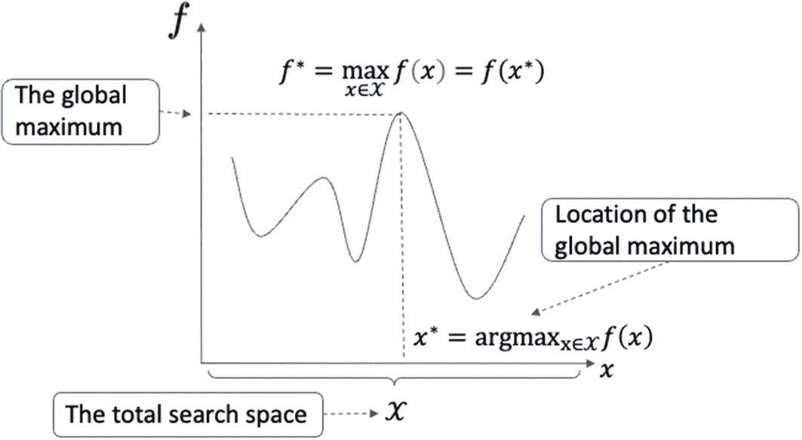

`f` 相对于 `x` 的折线图描绘了一条具有 2 个波峰和 3 个波谷的递减曲线。波峰标记了全局最大值。`x` 轴代表整个搜索空间。

**图 9-2**

一个带有全局最大值`f^∗`及其位置`x^∗`的示例目标函数。全局优化的目标是系统地推理一系列采样决策，以便尽可能快地定位全局最大值。

请注意，这是一个非凸函数，这在我们优化的现实函数中很常见。非凸函数意味着函数中存在多个局部最优点。因此，我们无法像处理凸函数`y = x²`那样，依赖基于一阶梯度的可靠方法来搜索全局最优解。使用基于梯度的方法（例如求解使原始函数梯度为零的解）很可能会收敛到局部最优解。这也是贝叶斯优化（后面将作为全局优化技术介绍）与其它用于局部搜索的基于梯度优化程序相比的优势之一。

下一节将更多讨论目标函数。

## 目标函数

目标函数决定了感兴趣的量是如何生成的。如果我们知道其显式表达式，整个章节就可以完成；如果我们能够访问其底层数学形式，问题就可以被认为解决了。不幸的是，现实生活中的许多目标函数对我们来说是黑盒：例如某公司第二天的股票价格、两天后的天气，或者利率开始下降的确切时间点。即使目标函数是一个黑盒，我们仍然可以利用优化技术，在给定的数据和资源下找到尽可能最好的解决方案。

目标函数有不同的类型。例如，有些函数形状蜿蜒曲折，而有些则平滑；有些是凸函数，而另一些是非凸函数。许多复杂的函数几乎无法用显式表达式来表示。针对决定交易策略性能的特定类型目标函数，我们总结出以下常见属性：

-   我们无法访问目标函数的显式表达式，使其成为一个“黑盒”函数。这意味着我们只能通过在特定位置进行采样来执行函数评估，从而与目标函数交互。

-   通过探查特定输入参数值所返回的值，对回测期的选择高度敏感。换句话说，它经常被噪声污染，并不代表该位置目标函数的真实精确值。由于对其实际值的间接评估，我们需要考虑函数评估实际观测值中所蕴含的这种噪声。

-   每次函数评估的成本很高，因此排除了进行全面探查的可能性。我们需要一种样本高效的评估方法，以最小化对交易策略的评估次数，同时尝试定位其全局最优解。换句话说，优化器需要充分利用已有的观测结果，并系统地推理下一个采样决策，以便将有限的资源合理用于有希望的候选参数值上。

-   我们无法访问其梯度。当函数评估相对廉价且函数形式平滑时，通过计算/估计梯度并使用诸如梯度下降等一阶程序进行优化会非常方便。访问梯度对于我们理解特定评估点附近的曲率是必要的。有了梯度评估，后续的移动方向就更容易确定。

由于上述原因，像根据两个窗口长度参数计算夏普比率这样的黑盒函数，优化起来颇具挑战性。为了进一步阐述目标可能存在的函数形式，我们在最小化场景中列出了三个代表性示例，如图 9-3 所示。左侧是一个只有一个全局最小值的凸函数；这对于全局优化来说是容易的，因为我们只需将函数的导数设为零，然后求解输入变量的最优值。中间是一个具有多个局部最优点的非凸函数；很难确定当前的局部最优点是否也是全局最优的。对于右侧面板所示的、充满鞍点的平坦区域的函数，也很难辨别这是一个平坦区域还是一个局部最优点。这种非凸性使得高效执行全局优化变得困难。

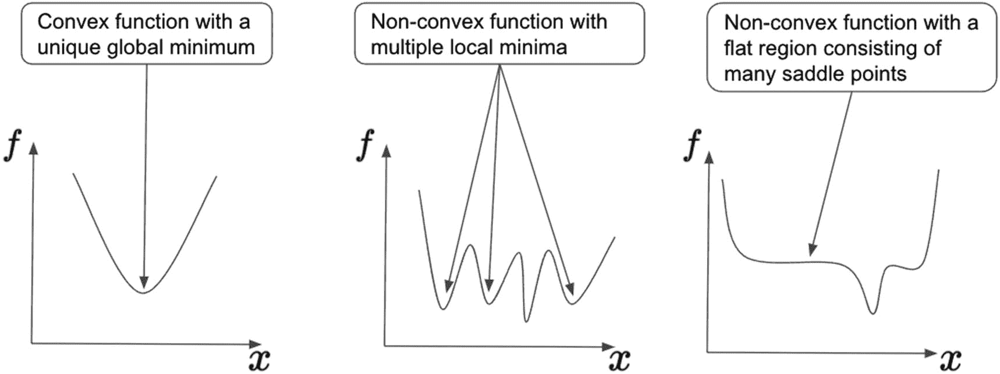

3 条 `f` 相对于 `x` 的折线图。左侧：抛物线。弯曲的波谷代表具有唯一全局最小值的凸函数。中间：波动趋势。3 个波谷代表具有多个局部最小值的非凸函数。右侧：下降、平稳、然后上升。具有平坦区域（包含许多鞍点）的非凸函数。

#### 图 9-3

三种可能的函数形式。左侧是易于优化的凸函数。中间是具有多个局部极小值的非凸函数，右侧同样是非凸函数，包含一个充满鞍点的宽阔平坦区域。后两种情况的优化工作量远大于第一种情况。

我们来看一个训练机器学习模型时超参数调优的示例。机器学习模型是一个函数，包含一组需要根据输入数据进行优化的参数。这些参数通过特定的优化过程自动调整，该过程通常由一组对应的元参数（即超参数）控制，这些超参数在模型训练开始前就已固定。例如，在使用梯度下降算法训练深度神经网络时，需要预先手动选择一个决定每次参数更新步长的学习率。如果学习率过大，模型可能会发散，最终无法学习。如果学习率过小，由于权重每次迭代仅更新微小幅度，模型可能收敛得非常慢。图 9-4 直观展示了这两种情况。

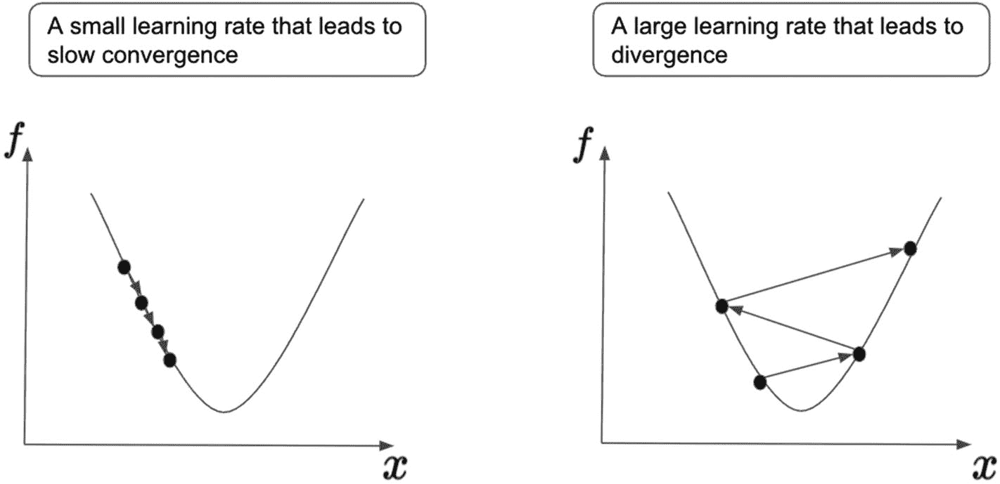

两个关于 `f` 随 `x` 变化的抛物线折线图。左侧：学习率过小导致收敛缓慢，用左臂上间隔很小的几个点以及向下的箭头表示。右侧：学习率过大导致发散，箭头在两侧以大间隔之字形来回摆动。

#### 图 9-4

左侧因学习率过小导致收敛缓慢，右侧因学习率过大导致发散。

因此，选择一个合理的学习率作为预设超参数，对于训练出优秀的机器学习模型至关重要。定位最佳学习率及其他超参数是一个优化问题，正符合贝叶斯优化（后文将介绍）的目的。在超参数调优的场景中，评估每个学习率是一项耗时的工作。目标函数通常是模型收敛后的最终测试集损失（在最小化设定中）。为了在训练集上取得合理表现，模型需要被充分训练，这通常需要数百个训练周期（epoch）才能达到稳定收敛。这里，一个周期是指完整遍历整个训练数据集一次。

测试集损失或准确率的函数形式对于超参数而言，也可能是高度非凸且多峰的。在收敛时，我们难以判断当前处于局部最优、鞍点还是全局最优。此外，某些超参数可能是离散的，例如训练深度神经网络时的节点数和层数。在这种情况下，我们无法计算其梯度，因为这需要定义域中的连续支持。

贝叶斯优化方法正是为应对所有这些挑战而设计的。它已被证明能够在有限预算（即允许的评估次数）下，有效地定位最佳超参数。该方法也广泛且成功地应用于其他领域，如化学工程。

## 贝叶斯优化

顾名思义，贝叶斯优化是一个使用贝叶斯方法研究优化问题的领域。优化的目标是在搜索域（也称为环境）内，定位所有可能值中的最优目标值（即全局最大值或最小值），或最优值对应的位置。搜索过程从特定的初始位置开始，遵循特定的策略来迭代地引导后续的采样位置、收集新的观测值，并更新引导搜索的策略。

贝叶斯优化的核心是使用概率模型（如高斯过程）来表示未知函数，并使用效用函数（也称为采集函数）来决定下一步在哪里采样。它用新的样本点迭代地更新概率模型，并利用这个更新后的模型来选择下一个采样位置。

如图 9-5 所示，整个优化过程包括策略（优化器）与环境（未知目标函数）之间的重复交互。策略是一个映射函数，它接收新的输入参数（以及历史参数）并以一种有原则的方式输出下一个待尝试的参数值。在此过程中，随着搜索的进行，我们不断地学习和改进策略。一个好的策略能比差的策略更快地引导我们的搜索走向全局最优。在决定尝试哪个参数值时，好的策略会将有限的采样预算投入到有希望的候选值上。

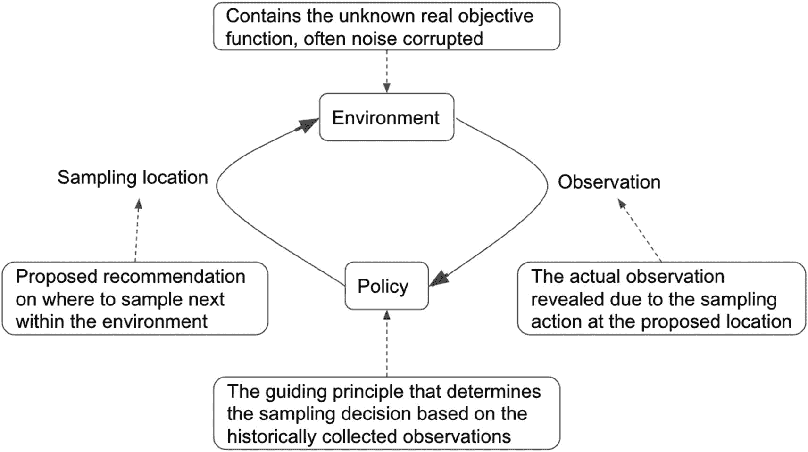

一个循环过程展示了通过观测和采样位置连接的环境和策略。环境包含未知的真实目标函数，策略包含指导原则，该原则基于收集到的观测值决定采样决策。

#### 图 9-5

整体的贝叶斯优化过程。策略消化历史观测值并提出新的采样位置。环境决定了在新提出的位置上，观测值（可能受噪声污染）如何被呈现给策略。我们的目标是学习一个高效且有效的策略，使其能够尽可能快地导航至全局最优。

另一方面，环境包含策略需要在特定边界（参数值的最大值和最小值）内学习的未知目标函数。当根据策略的要求探测函数值时，环境向策略揭示的实际观测值通常会因回测周期的选择而受到噪声污染，使得学习更具挑战性。因此，贝叶斯优化作为一种特定的全局优化方法，旨在学习一个策略，帮助我们尽可能高效、有效地导航至一个未知的、受噪声污染的目标函数的全局最优。

在决定接下来尝试哪个参数值时，大多数搜索策略都面临探索与利用的权衡。探索意味着在未知的遥远区域进行搜索，而利用则指在之前访问过的邻域内搜索，以期找到更优的函数评估值。贝叶斯优化也面临同样的困境。理想情况下，我们希望初始阶段多进行探索，以增加对环境的了解（黑箱函数），然后逐渐转向利用模式，利用现有知识并深入挖掘已知的有前景区域。

贝叶斯优化通过两个组件实现这种权衡：一个用于近似底层黑箱函数的高斯过程（GP），以及一个将探索-利用权衡编码为标量值的采集函数，该标量值作为域内所有候选点采样效用的指标。接下来，我们将详细探讨每一个组件。

### 高斯过程

作为一种广泛使用的随机过程（能够对未知黑箱函数及其相应的建模不确定性进行建模），高斯过程将有限维概率分布进一步扩展到包含无限多个变量的连续搜索域中，其中该域内的任意有限点集共同构成一个多元高斯分布。它是一个灵活的框架，可以对广泛的函数族进行建模并量化其不确定性，因此成为用于逼近真实底层函数的强大代理模型。让我们看几个可视化示例来了解其功能。

图 9-6 展示了一个从高斯过程的先验信念中选出的、关于单个随机变量的"翻转"先验概率分布示例。尽管现在每个点都被建模为一个随机变量，因而其实现具有随机性，但每个点都代表一个参数值。具体来说，每个点都服从正态分布。绘制所有这些先验分布的均值（实线）和 95%置信区间（虚线），就得到了关于域中每个位置的客观函数的先验过程。因此，高斯过程通过在一个有界范围内使用无限多个正态分布的随机变量，以概率方法对底层目标函数进行建模并量化相关不确定性。

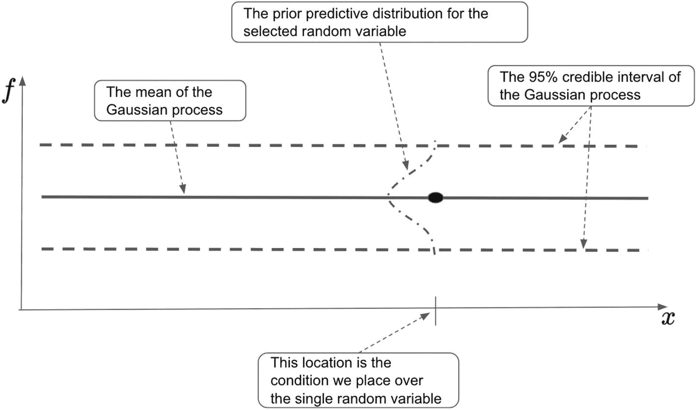

函数 `f` 相对于 `x` 的折线图在两条虚线中间呈现一条连续的水平线。连接所有三条线的虚线曲线是随机变量的先验预测分布。实线是高斯过程的均值。虚线表示 95%置信区间。

**图 9-6：** 由域中每个位置的均值和 95%置信区间表示的高斯过程先验信念样本。每个目标值都由一个服从正态先验预测分布的随机变量建模。收集所有随机变量的分布，并随着更多观测数据的收集而更新这些分布，可以帮助我们量化真实底层函数的潜在形状及其概率。

因此，先验过程可以作为未知黑箱函数的代理数据生成过程，它也可以用于以函数形式生成样本，这是从概率分布中采样单个点的扩展。例如，如果我们反复从先验过程中采样，我们会预期大多数（约 95%）样本落在置信区间内，而少数样本落在此范围之外。图 9-7 展示了从先验过程中采样的三个函数。

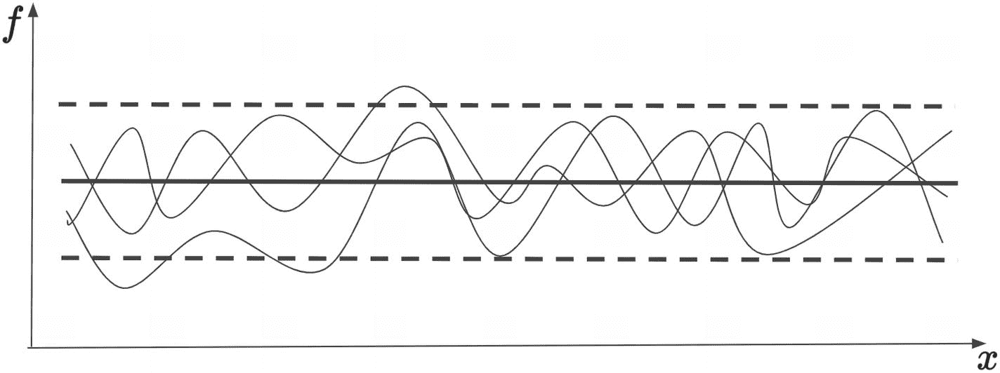

函数 `f` 相对于 `x` 的折线图在两条水平虚线之间呈现一条实线。这些线由三条幅度和相位各异的正弦趋势组成，它们大多位于虚线范围内。

**图 9-7：** 从先验过程中采样的三个示例函数，其中大多数函数落在 95%置信区间内。

在高斯过程中，每个位置（即交易策略的参数值）目标值的不确定性通过置信区间来量化。当我们开始收集观测数据并假设一个无噪声且精确的观测模型时，采集位置处的不确定性将被消除，导致这些位置方差为零且直接内插。此外，随着我们远离观测数据，方差会增加，这是将先验过程（关于未知黑箱函数的先验信念）与实际观测数据提供的信息相结合的结果。图 9-8 展示了收集两个观测数据后更新的后验过程。基于观测数据具有更新知识的后验过程将由此构建出更准确的代理模型，并能更好地估计目标函数。

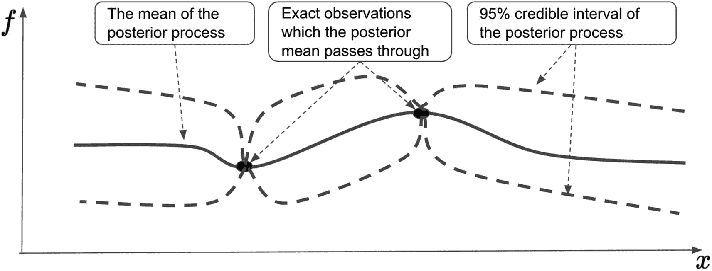

函数 `f` 相对于 `x` 的折线图有两条相交的虚线，中间包含一条连续线。实线是后验过程的均值，虚线标记了 95%置信区间。交点标记了精确的观测点。

**图 9-8：** 在高斯过程中纳入两个精确观测数据后的更新后验过程。后验均值通过观测点进行插值，并且随着我们靠近观测点，相关的方差会减小。

在数学上，对于一个新的采样位置 `x*`（位于 `X` 中），遵循高斯过程的相应函数评估值 `f*` 将假设一个条件正态分布：

`p(f*; x*, D_n) = N(f* | μ*, σ*²)`

其中 `D_n = {(x_i, f_i)}`（对于 `i = 1` 到 `n`）包含历史观测到的成对采样位置和标量观测值。通过调用多元高斯定理可以推导出后验均值和方差函数的闭式解，得到：

`μ* = k(x_{1:n}, x*) K(x_{1:n}, x_{1:n})⁻¹ f_{1:n}`

`σ*² = k(x*, x*) - k(x_{1:n}, x*) K(x_{1:n}, x_{1:n})⁻¹ k(x_{1:n}, x*)`

因此，我们可以基于后验高斯过程模型获得任意位置的后验均值和方差，该模型充当特定交易策略底层函数的代理模型。

现在让我们看看另一个关键组成部分：采集函数。

## 采集函数

贝叶斯推断的工具与高斯过程的结合，为我们提供了关于目标函数潜在分布的原则性推理。然而，我们仍然需要在决策中融入这种概率信息，以搜索全局最大值。我们需要构建一个策略（通过最大化采集函数），该策略吸收目标函数的最新信息，并在面对整个领域的不确定性时，推荐下一个最有前景的采样位置。因此，通过最大化采集函数来引导的优化策略，在连接高斯过程与贝叶斯优化的最终目标中发挥着至关重要的作用。特别是，从更新后的高斯过程中获得的后验预测分布，为尚未探索的位置提供了目标值及其相关不确定性的展望，优化策略可利用这一点来量化领域内任何备选位置的效用。

当将候选位置的后验知识（即每个位置上的高斯分布的后验参数，如均值和方差）转换为单一标量效用分数时，采集函数便发挥作用。采集函数是一种人工设计的机制，它以标量分数的形式评估每个候选位置的相对潜力，得分最高的位置将被选为下一个采样点。它是一个评估当我们采集/采样某个候选位置时该位置价值的函数。

采集函数同时考虑了高斯过程后验分布所提供的未探索位置上的期望值与不确定性（方差）。在此语境下，探索意味着在高不确定性区域进行采样，而利用则意味着在函数值预期较高的区域进行采样。

作为一项辅助计算，采集函数的评估成本也很低，因为我们需要在每个候选位置评估它，然后定位最大效用分数，这构成了另一个（内部）优化问题。图 9-9 提供了采集函数的示例曲线。

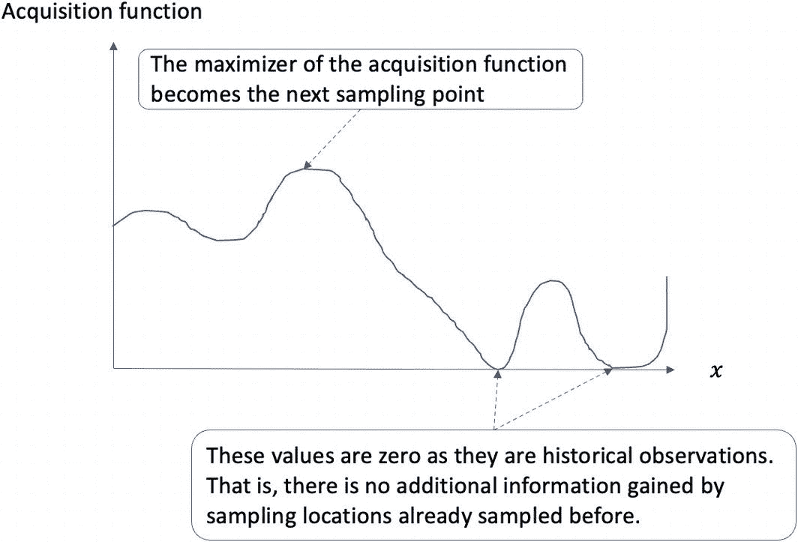

一幅采集函数关于 x 的折线图呈现出波动趋势。峰值点标志着采集函数的最大化，即下一个采样点。两个为零的谷值表明，对这些位置进行采样不会获得额外信息。

**图 9-9** – 展示一条示例采集函数曲线。对应采集函数最高值的位置是下一个要采样的位置（交易策略的参数值）。由于如果采样之前已经采样过的位置不会增加价值，因此采集函数在这些位置上的值为零。

文献中提出了许多采集函数的选择。常用的选择包括期望改进量（EI）和上置信界（UCB）。不过，目前只需理解它是一个预先设计好的函数，需要平衡两种对立的力量：探索与利用。探索鼓励通过在陌生且遥远的位置进行采样来解决整个领域的不确定性，因为这些区域由于高不确定性可能会带来巨大惊喜。利用则建议在期望观测值较高的有前景区域进行贪婪行动。探索-利用权衡是许多优化设置中的常见主题。

另一个显著特征是短期（近视性）与长期（非近视性）的权衡。短期采集函数只关注下一步，并假设这是从环境中采样的最后机会；因此，它的建议是最大化即时效用。长期采集函数则采用多步前瞻方法，通过模拟未来的潜在演变/路径，并最大化长期效用来做出最终推荐。

在采集函数的设计中还有许多其他新兴变体，例如为所研究的系统添加安全约束。无论如何，我们将根据在预算耗尽时，距离全局最大值位置有多近来评判使用特定采集函数的策略质量。当前位置与最优位置之间的距离通常被称为即时遗憾或简单遗憾。或者，也可以使用整个采样过程中产生的累积遗憾（历史位置与最优位置之间的累积距离）。

让我们深入探讨两种常用的采集函数：期望改进量（EI）和上置信界（UCB）。

### EI 与 UCB

采集函数在多个方面有所区别，包括效用函数的选择、前瞻步数、风险规避或偏好程度等。引入风险偏好直接受益于对目标函数的后验信念。当以高斯过程回归作为代理模型时，风险通过协方差函数量化，其置信区间表达了目标可能取值的不确定性水平。

关于已收集观测值的效用，期望提升法将历史观测最大值作为基准，用于比较在额外采样位置的选择。该方法还隐含假设在优化过程终止前仅剩一次额外采样。效用的期望边际收益（即采集函数）成为观测最大值的期望提升，计算方式为：在任意采样位置进行额外采样后，观测最大值与新观测值之间的期望差值。

具体来说，记 `y[1:n] = {y[1], ..., y[n]}` 为在对应位置 `x[1:n] = {x[1], ..., x[n]}` 处收集的观测值集合。在无噪声设定下，实际观测值将是精确的，即 `y[1:n] = f[1:n]`。给定已收集数据集 `D_n = {x_{1:n}, y_{1:n}}`，相应的效用为 `u(D_n) = max{f_{1:n}} = f_n^*`，其中 `f_n^*` 是迄今为止观测到的当前最大值。类似地，假设我们在新位置 `x[n+1]` 处获得另一个观测值 `y[n+1] = f[n+1]`，则产生的效用为 `u(D_{n+1}) = u(D_n ∪ {x_{n+1}, f_{n+1}}) = max{f_{n+1}, f_n^*}`。两者相减即可得到因增加一个观测值而产生的效用增量：

```
u(D_{n+1}) - u(D_n) = max{f_{n+1}, f_n^*} - f_n^* = max{f_{n+1} - f_n^*, 0}
```

由于观测到 `f[n+1]`，当 `f_{n+1} >= f_n^*` 时，该式返回当前最大值的边际增量，否则为零。熟悉神经网络中激活函数的读者会立刻将此形式与 `ReLU`（修正线性单元）函数联系起来，后者保留正信号并抑制负信号。

由于 `y[n+1]` 具有随机性，我们可以引入期望算子对其进行积分，从而得到效用的期望边际增益，即期望提升采集函数：

```
α_EI(x_{n+1}; D_n) = E[u(D_{n+1}) - u(D_n) | x_{n+1}, D_n]
                    = ∫ max{f_{n+1} - f_n^*, 0} p(f_{n+1} | x_{n+1}, D_n) df_{n+1}
```

在高斯过程回归框架下，可以得到期望提升采集函数的闭式表达式如下：

```
α_EI(x_{n+1}; D_n) = (μ_{n+1} - f_n^*) Φ((μ_{n+1} - f_n^*) / σ_{n+1}) + σ_{n+1} φ((μ_{n+1} - f_n^*) / σ_{n+1})
```

其中 `f_n^*` 是迄今为止观测到的最佳值，`φ` 和 `Φ` 分别表示待定点 `x[n+1]` 处标准正态分布的概率密度函数和累积分布函数。`μ[n+1]` 和 `σ[n+1]` 分别表示 `x[n+1]` 处的后验均值和后验标准差。

EI 的闭式表达式包含两个部分：利用（第一项）和探索（第二项）。利用意味着继续在具有高后验均值的已观测区域邻域采样，而探索则鼓励在具有高后验不确定性的未访问区域采样。因此，期望提升采集函数隐式地平衡了这两种相反的力量。

另一方面，如下所定义的 UCB 采集函数则显式地编码了这种权衡：

```
α_UCB(x_{n+1}; D_n) = μ_{n+1} + β_{n+1} σ_{n+1}
```

其中 `β[n+1]` 是用户定义的分阶段超参数，用于控制后验均值与标准差之间的权衡。较低的 `β[n+1]` 值鼓励利用，而较高的 `β[n+1]` 值则更倾向于探索。

随后，这两个采集函数将在全局范围内进行评估，以寻找最大化位置，该位置将作为下一个采样选择。让我们在下一节中总结完整的 BO（贝叶斯优化）循环。

### 完整的 BO 循环

贝叶斯优化是在（非受控的）环境与（受控的）策略之间进行的迭代过程。该策略包含两个支持序贯决策的组件：一个高斯过程作为代理模型来近似真实的底层函数（即环境），以及一个采集函数来推荐最佳采样位置。环境接收在特定位置的探测请求，并通过揭示符合特定观测模型的新观测值来做出响应。高斯过程代理模型随后利用新观测值获得后验过程，以支持预设采集函数进行后续决策。此过程持续进行，直到满足停止标准（例如耗尽给定预算）为止。图 [9-10] 展示了这一过程。

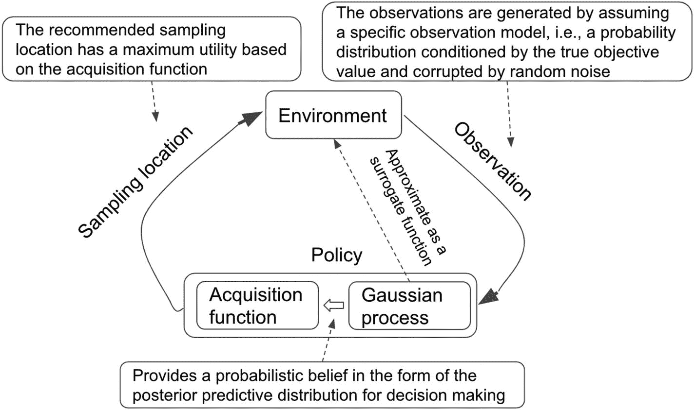

图 9-10：完整的贝叶斯优化循环，其特点在于未知（黑箱）环境与决策策略之间的迭代交互。该决策策略由用于概率评估的高斯过程和用于评估环境中候选位置效用的采集函数组成

了解了基本的 BO 框架后，让我们通过优化配对交易策略的窗口长度来对其进行测试。

#### 优化配对交易策略

如前所述，配对交易策略具有两个输入参数：入场阈值和出场阈值。更具体地说，我们希望应用贝叶斯优化技术来搜索最优的入场和出场阈值，使黑箱函数达到最大值。为简化起见，我们仅在一个回测周期内计算一次夏普比率。更稳健的降低观测噪声的方法是在多个有代表性的回测周期上进行测试，并报告平均夏普比率，作为给定输入参数优劣的公平指标。

首先，我们将安装两个软件包：基于 `PyTorch` 执行贝叶斯优化的 `botorch` 包，以及便于数据下载的 `yfinance` 包。

```
!pip install botorch
!pip install yfinance
```

接下来，我们还会导入一些辅助包，并设置随机种子以确保可重复性：

```
import os
import math
import torch
import random
import numpy as np
from matplotlib import pyplot as plt
import torch.nn as nn
import yfinance as yf
import pandas as pd
from statsmodels.tsa.stattools import adfuller
from statsmodels.regression.linear_model import OLS
import statsmodels.api as sm
%matplotlib inline
SEED = 1
random.seed(SEED)
np.random.seed(SEED)
torch.manual_seed(SEED)
```

下一节将探讨作为黑箱函数的配对交易策略的表现。

## 作为黑箱函数的交易策略表现

趋势跟踪策略将决定黑箱函数的输出。之前，我们已经说明了如何在给定一组特定的入场和出场参数的情况下计算夏普比率。假设在单个回测周期内计算的夏普比率具有足够的代表性，我们希望将一组输入参数映射到输出性能指标的整个过程模块化。换句话说，我们需要编写一个函数（或类），用于输出给定入场和出场阈值下的夏普比率。

首先，我们定义一个名为`QTS_OPTIMIZER`的类，它继承自`nn.Module`类。该类将成为在给定任何查询点时生成观测值的主要动力。在`__init__()`方法中，我们需要三个强制参数：`ticker_pair`中的股票代码对、`start_date`中的股票价格起始日期，以及`end_date`中的结束日期。我们还设置了一个可选参数`riskfree_rate`，用于控制夏普比率计算中使用的无风险利率。如代码清单 9-1 所示。

```
class QTS_OPTIMIZER(nn.Module):
def __init__(self, ticker_pair, start_date, end_date, riskfree_rate=0.04):
super(QTS_OPTIMIZER, self).__init__()
self.ticker_pair = ticker_pair
self.start_date = start_date
self.end_date = end_date
self.riskfree_rate = riskfree_rate
self.stock = self.get_stock_data()
代码清单 9-1
为贝叶斯优化定义黑箱函数
```

实例化该类时，`__init__()`函数会被触发，其中还包括为选定的股票代码和日期范围下载股票数据。代码清单 9-2 包含了`get_stock_data()`方法的定义，我们使用常用的`download()`函数来下载数据，并提取考虑了股息和拆股的调整后收盘价。

```
def get_stock_data(self):
print("===== 正在下载股票数据 =====")
df = yf.download(['GOOG'], start=self.start_date, end=self.end_date)['Adj Close']
print("===== 下载完成 =====")
return pd.DataFrame(df)
代码清单 9-2
定义检索股票数据的方法
```

接下来，我们介绍`forward()`方法，该方法在调用类对象本身时自动触发。这里我们实现了黑箱函数的机制，该函数以两个参数作为输入，并在预设的股票数据和回测周期内输出相应的夏普比率。如代码清单 9-3 所示，传入入场阈值`entry_threshold`和出场阈值`exit_threshold`后，我们估计线性回归系数，计算残差，并得到 z 分数。然后我们创建持仓列，表示由每日入场和出场信号决定的交易头寸。基于每日收益率，我们可以计算联合收益率以及由此产生的年化收益率和波动率，最后得到夏普比率作为`forward()`函数的最终返回值。

```python
def forward(self, entry_threshold, exit_threshold, window_size=10):
    # 添加 SMA 列
    stock_df = self.stock.copy()
    # 计算 GOOG 和 MSFT 的价差
    Y = stock_df[self.ticker_pair[0]]
    X = stock_df[self.ticker_pair[1]]
    # 估计线性回归系数
    X_with_constant = sm.add_constant(X)
    model = OLS(Y, X_with_constant).fit()
    # 将残差作为价差
    spread = Y - model.predict()
    # 计算滚动均值和标准差
    spread_mean = spread.rolling(window=window_size).mean()
    spread_std = spread.rolling(window=window_size).std()
    zscore = (spread - spread_mean) / spread_std
    # 移除初始的 NA 天数
    first_valid_idx = zscore.first_valid_index()
    zscore = zscore[first_valid_idx:]
    # 将每日持仓初始化为零
    stock1_position = pd.Series(data=0, index=zscore.index)
    stock2_position = pd.Series(data=0, index=zscore.index)
    # 为每只股票生成每日入场和出场信号
    for i in range(1, len(zscore)):
        # zscore > entry_threshold 且股票 2 无现有空头头寸
        elif zscore[i] > entry_threshold and stock2_position[i-1] == 0:
            stock1_position[i] = -1 # 做空股票 1
            stock2_position[i] = 1 # 做多股票 2
        # -exit_threshold < zscore < exit_threshold
        elif abs(zscore[i]) < exit_threshold:
            stock1_position[i] = 0 # 退出现有头寸
            stock2_position[i] = 0
        # -entry_threshold < zscore < -exit_threshold 或 exit_threshold < zscore < entry_threshold
        else:
            stock1_position[i] = stock1_position[i-1] # 维持现有头寸
            stock2_position[i] = stock2_position[i-1]
    # 计算每只股票的收益率
    stock1_returns = (Y[first_valid_idx:].pct_change() * stock1_position.shift(1)).fillna(0)
    stock2_returns = (X[first_valid_idx:].pct_change() * stock2_position.shift(1)).fillna(0)
    # 计算策略的总收益率
    total_returns = stock1_returns + stock2_returns
    # 计算年化收益率
    annualized_return = (1 + total_returns).prod()**(252/Y[first_valid_idx:].shape[0])-1
    # 计算年化波动率
    annualized_vol = total_returns.std()*(252**0.5)
    if annualized_vol==0:
        annualized_vol = 100
    # 计算夏普比率
    sharpe_ratio = (annualized_return - self.riskfree_rate) / annualized_vol
    return sharpe_ratio
```

代码清单 9-3：定义计算夏普比率的方法

让我们测试一下这个类。下面的代码通过传入谷歌和微软的股票代码以及 2022 年起止日期范围，将类实例化为`qts`变量。请注意运行这行代码后打印的信息，显示`get_stock_data()`函数在此过程中被触发。注意，在此阶段没有提到入场和出场信号；初始化阶段旨在处理`forward()`函数实际评分前的所有准备工作。

```
>>> qts = QTS_OPTIMIZER(ticker_pair=["GOOG","MSFT"], start_date="2022-01-01", end_date="2023-01-01")
===== 下载股票数据 =====
[*********************100%***********************]  1 of 1 completed
===== 下载完成 =====
```

我们也可以打印对象股票属性的前几行作为验证：

```
>>> qts.stock.head()
GOOG       MSFT
Date
2022-01-03 145.074493 330.813873
2022-01-04 144.416504 325.141388
2022-01-05 137.653503 312.659851
2022-01-06 137.550995 310.189270
2022-01-07 137.004501 310.347412
```

让我们测试评分函数。在下面的代码片段中，我们传入不同的入场和出场阈值值，并获取 2022 年整年对应的夏普比率：

```
>>> qts(entry_threshold=2, exit_threshold=1)
1.690533096171306
>>> qts(entry_threshold=1.5, exit_threshold=0.5)
1.8278364562046485
```

我们看到不同的阈值值对应不同的夏普比率。我们的任务是尽快找到与最高夏普比率相对应的最优入场和出场阈值组合。这正是贝叶斯优化的用武之地。

## 为贝叶斯优化生成训练集

大多数机器学习模型都需要一个训练集作为起点。训练集为模型提供正确的输入-输出映射关系，以便模型微调其权重，从而学习这种映射关系。贝叶斯优化模型也是如此。具体而言，训练集有助于更新高斯过程使用的先验分布，从而更新其控制超参数，进而用于获得更具代表性的后验分布。

下面的代码片段创建了几个后续使用的预备变量，其中 `device` 表示后续运行计算的设备（CPU 或 GPU），`dtype` 指定 PyTorch 张量的数据类型，`x1_bound` 和 `x2_bound` 分别包含短期和长期窗口的上下界。在此，我们将短期窗口指定为 1 到 10，长期窗口指定为 11 到 20：

```
#### 为优化生成初始训练数据集
device = torch.device("cuda" if torch.cuda.is_available() else "cpu")
dtype = torch.double
x1_bound = [1,3]
x2_bound = [0,1]
```

接下来，我们定义一个名为 `generate_initial_data()` 的函数来获取一组训练数据。如代码清单 9-4 所示，该函数接受单个输入 `n` 来指定训练集中的观测数量。在函数内部，我们首先使用 Torch 的 `torch.rand()` 函数生成一组随机值。将一组入场和出场阈值合并为单个变量 `train_x` 后，我们遍历每一行以应用黑盒评分函数 `qts()`，并获取相应的夏普比率，这些比率统一存储在 `train_y` 中。除了返回 `train_x` 和 `train_y`，我们还在 `best_observed_value` 中报告最高得分，因为我们将维护一个累积最大值的列表来指示搜索质量。迄今为止观察到的当前最佳值也代表了到目前为止收集的数据集的效用，即数据集在帮助我们定位最优窗口长度方面的效用值。

```
def generate_initial_data(n=10):
    # 生成随机初始位置
    train_x1 = x1_bound[0] + (x1_bound[1] - x1_bound[0]) * torch.rand(size=(n,1), device=device, dtype=dtype)
    train_x2 = torch.rand(size=(n,1), device=device, dtype=dtype)
    train_x = torch.cat((train_x1, train_x2), 1)
    # 获取目标函数的精确值并添加输出维度
    train_y = []
    for i in range(len(train_x)):
        train_y.append(qts(entry_threshold=train_x1[i], exit_threshold=train_x2[i]))
    train_y = torch.Tensor(train_y, device=device).to(dtype).unsqueeze(-1)
    # 获取当前最佳观测值，即可用数据集的效用
    best_observed_value = train_y.max().item()
    return train_x, train_y, best_observed_value
```

代码清单 9-4：生成初始训练数据

让我们按如下方式在训练集中生成三个样本：

```
train_x, train_y, best_observed_value = generate_initial_data(n=3)
>>> print(train_x)
>>> print(train_y)
>>> print(best_observed_value)
tensor([[1.1221, 0.1771],
        [1.4491, 0.5561],
        [1.4685, 0.1094]], dtype=torch.float64)
tensor([[0.0550],
        [2.2504],
        [1.0004]], dtype=torch.float64)
2.250356674194336
```

接下来，我们实现贝叶斯优化中的第一个组件：高斯过程模型。

### 实现高斯过程模型

如前所述，我们可以利用这个训练集来优化高斯过程（GP）模型的超参数，使其更贴合当前数据。这是因为 GP 模型在初始化时也受其自身超参数（例如长度尺度）的支配。不同的 GP 模型拥有不同的超参数，我们将采用 BoTorch 提供的默认选择。

在代码清单 [9-5] 中，我们创建了一个名为 `initialize_model()` 的函数来初始化 GP 模型。我们使用 `botorch.models` 中的 `SingleTaskGP()` 类，基于先前的训练数据实例化一个 GP 模型，然后使用 `ExactMarginalLogLikelihood()` 函数获取该 GP 模型的精确边际对数似然。

```python
#### 初始化 GP 模型
from botorch.models import SingleTaskGP
from gpytorch.mlls import ExactMarginalLogLikelihood
def initialize_model(train_x, train_y):
#### 创建一个单任务精确 GP 模型实例
#### 默认使用带有 Matern 核函数和常数均值函数的 GP 先验
model = SingleTaskGP(train_X=train_x, train_Y=train_y)
mll = ExactMarginalLogLikelihood(model.likelihood, model)
return mll, model
代码清单 9-5
初始化 GP 模型
```

让我们在优化之前打印出 GP 模型的超参数（包括核函数参数和噪声方差）的值：

```python
mll, model = initialize_model(train_x, train_y)
>>> list(model.named_hyperparameters())
[('likelihood.noise_covar.raw_noise', Parameter containing:
tensor([2.0000], dtype=torch.float64, requires_grad=True)),
('mean_module.raw_constant', Parameter containing:
tensor(0., dtype=torch.float64, requires_grad=True)),
('covar_module.raw_outputscale', Parameter containing:
tensor(0., dtype=torch.float64, requires_grad=True)),
('covar_module.base_kernel.raw_lengthscale', Parameter containing:
tensor([[0., 0.]], dtype=torch.float64, requires_grad=True))]
```

优化 GP 超参数可以通过遵循最大对数似然（MLL）方法完成，该方法在 `botorch.fit` 的 `fit_gpytorch_mll()` 函数中实现。代码清单 [9-6] 拟合了 GP 超参数并打印出它们的值。

```markdown
#### 优化 GP 超参数

```python
from botorch.fit import fit_gpytorch_mll
#### 拟合 GPyTorch 模型的超参数（核函数参数和噪声方差）
fit_gpytorch_mll(mll.cpu());
mll = mll.to(train_x)
model = model.to(train_x)
>>> list(model.named_hyperparameters())
[('likelihood.noise_covar.raw_noise', Parameter containing:
tensor([0.2238], dtype=torch.float64, requires_grad=True)),
('mean_module.raw_constant', Parameter containing:
tensor(1.1789, dtype=torch.float64, requires_grad=True)),
('covar_module.raw_outputscale', Parameter containing:
tensor(1.8917, dtype=torch.float64, requires_grad=True)),
('covar_module.base_kernel.raw_lengthscale', Parameter containing:
tensor([[-0.8823, -0.9687]], dtype=torch.float64, requires_grad=True))]
```

代码清单 9-6 优化 GP 超参数

结果显示优化后得到了一组不同的超参数。注意，我们需要将 `mll` 对象移动到 GPU 上执行优化，之后可以（如果可用）再将其移回 CPU。

优化后的 GP 模型随后可以整合到采集函数中，以指导后续的搜索过程，详情见下一节。

### 通过最大化采集函数引导顺序搜索

我们将使用几种流行的采集函数，包括期望提升（EI）、置信上界（UCB）、并行期望提升（qEI）和并行知识梯度（qKG）。我们将直接切入它们的实现和使用，而不是专注于每种选择的推导和推理。对不同的采集函数有更深入讨论感兴趣的读者可以参考《贝叶斯优化：使用 Python 的理论与实践》一书。

首先，通过 `botorch.acquisition` 中的 `ExpectedImprovement()`、`qExpectedImprovement()`、`UpperConfidenceBound()` 和 `qKnowledgeGradient()` 来实例化这些采集函数。注意，不同的采集函数期望不同的输入参数。例如，除了上一节中的 GP 模型实例外，EI 需要当前最佳观测值，而 UCB 则期望一个 `beta` 参数来调整探索与利用之间的权衡。这种调整在 EI 中是隐式处理的。代码清单 [9-7] 展示了这一点。

```python
#### 定义采集函数
from botorch.acquisition import ExpectedImprovement
from botorch.acquisition import qExpectedImprovement
from botorch.acquisition import UpperConfidenceBound
from botorch.acquisition.knowledge_gradient import qKnowledgeGradient
#### 调用辅助函数生成初始训练数据并初始化模型
train_x, train_y, best_observed_value = generate_initial_data(n=3)
train_x_ei = train_x
train_x_qei = train_x
train_x_ucb = train_x
train_x_qkg = train_x
train_y_ei = train_y
train_y_qei = train_y
train_y_ucb = train_y
train_y_qkg = train_y
mll_ei, model_ei = initialize_model(train_x_ei, train_y_ei)
mll_qei, model_qei = initialize_model(train_x_qei, train_y_qei)
mll_ucb, model_ucb = initialize_model(train_x_ucb, train_y_ucb)
mll_qkg, model_qkg = initialize_model(train_x_qkg, train_y_qkg)
EI = ExpectedImprovement(model=model_ei, best_f=best_observed_value)
qEI = qExpectedImprovement(model=model_qei, best_f=best_observed_value)
beta = 0.8
UCB = UpperConfidenceBound(model=model_ucb, beta=beta)
num_fantasies = 64
qKG = qKnowledgeGradient(
model=model_qkg,
num_fantasies=num_fantasies,
X_baseline=train_x,
q=1
)
```

代码清单 9-7 定义和初始化采集函数

采集函数用于生成下一个待采样的参数值，该值通过最大化当前采集函数来确定。在搜索域内寻找采集函数最大值的过程由 `optimize_acqf()` 函数处理，该函数由 `botorch.optim` 模块提供。新的参数值，连同从未知目标函数获得的对应得分，将作为一个额外的训练数据点，用于支持下一轮更新后的 GP 模型和采集函数。

代码清单 [9-8] 提供了详细的实现，展示了如何传递一个采集函数并获取下一个采样决策和观测函数值。注意优化过程 `optimize_acqf()` 所需的附加参数：`bounds` 用于定义每个参数的搜索域，`BATCH_SIZE` 用于指定每轮探测的样本数量（可以并行探测多个点），`NUM_RESTARTS` 用于控制优化开始时的初始条件数量，`RAW_SAMPLES` 用于指示支持基于启发式的采集函数优化的初始样本数量。

#### 优化并获取新的观测值

```python
from botorch.optim import optimize_acqf

#### 获取搜索边界
bounds = torch.tensor([[x1_bound[0], x2_bound[0]], [x1_bound[1], x2_bound[1]]], device=device, dtype=dtype)

#### 每次迭代生成的并行候选位置数
BATCH_SIZE = 1

#### 多起点优化的起始点数量
NUM_RESTARTS = 10

#### 初始化的采样数量
RAW_SAMPLES = 1024

def optimize_acqf_and_get_observation(acq_func):
    """优化采集函数，并返回一个新的候选点及其带噪观测值。"""
    ## 优化
    candidates, value = optimize_acqf(
        acq_function=acq_func,
        bounds=bounds,
        q=BATCH_SIZE,
        num_restarts=NUM_RESTARTS,
        raw_samples=RAW_SAMPLES,  # 用于初始化启发式方法
    )
    #### 观测新值
    new_x = candidates.detach()
    #### 采样输出值
    new_y = qts(entry_threshold=new_x.squeeze()[0].item(), exit_threshold=new_x.squeeze()[1].item())
    #### 添加输出维度
    new_y = torch.Tensor([new_y], device=device).to(dtype).unsqueeze(-1)
    #### print("新函数值:", new_y)
    return new_x, new_y
```

**代码清单 9-8** 通过优化采集函数获取新的提议

让我们用 `qKG` 采集函数测试这个函数：

```
>>> optimize_acqf_and_get_observation(qKG)
(tensor([[1.5470, 0.6003]], dtype=torch.float64),
tensor([[2.2481]], dtype=torch.float64))
```

在扩展到多次迭代之前，我们还将测试随机搜索策略，该策略在每一轮为每个移动序列随机选择一个窗口长度。这作为比较的基准，因为手动选择在初始阶段通常等同于随机搜索策略。在代码清单 9-9 所示的 `update_random_observations()` 函数中，我们传入一个运行中的最佳观测函数值列表，执行一次随机选择，观测相应的函数评估值，将其与当前运行最大值进行比较，然后返回追加当前最大值后的运行最大值列表。
```

```
def update_random_observations(best_random):
    """通过抽取新的随机点、观测其数值并更新当前最佳候选点到运行列表，来模拟随机策略。"""
    new_x1 = x1_bound[0] + (x1_bound[1] - x1_bound[0]) * torch.rand(size=(1,1), device=device, dtype=dtype)
    new_x2 = torch.rand(size=(1,1), device=device, dtype=dtype)
    new_x = torch.cat((new_x1, new_x2), 1)
    new_y = qts(entry_threshold=new_x[0,0].item(), exit_threshold=new_x[0,1].item())
    best_random.append(max(best_random[-1], new_y))
    return best_random
```

**代码清单 9-9** 定义随机搜索策略

现在，我们基于上述采集函数以及随机搜索策略执行顺序搜索。

## 执行顺序搜索

这三种搜索策略在相同的采样预算内，根据找到的最大夏普比率展现不同的搜索质量。为了衡量每轮搜索策略的有效性，我们使用黑箱函数返回的累积最大值，该设计确保该值是非递减的。在相同的环境设置下，更有效的搜索策略将能比替代策略更快地识别出更高的夏普比率。

代码清单 9-10 创建了几个列表（`best_observed_ei`、`best_observed_ucb`、`best_observed_qei`、`best_observed_qkg` 和 `best_random`），用于存储每轮中观测到的最佳夏普比率。每个搜索策略都使用由三个样本组成的相同训练集，通过 `initialize_model()` 函数初始化其 GP 模型（如果有的话），生成的 GP 模型实例分别存储在 `model_ei`、`model_qkg`、`model_qei` 和 `model_ucb` 中。对于随机搜索策略，我们只需模拟随机选择并更新其运行最大值，无需任何显式的学习过程。

```python
#### 单次试验
import time
N_ROUND = 20
verbose = True
beta = 0.8
best_random, best_observed_ei, best_observed_qei, best_observed_ucb, best_observed_qkg  = [], [], [], [], []
best_random.append(best_observed_value)
best_observed_ei.append(best_observed_value)
best_observed_qei.append(best_observed_value)
best_observed_ucb.append(best_observed_value)
best_observed_qkg.append(best_observed_value)
#### 在初始随机批次之后运行 N_ROUND 轮贝叶斯优化
for iteration in range(1, N_ROUND + 1):
    t0 = time.monotonic()
    #### 拟合模型
    fit_gpytorch_mll(mll_ei)
    fit_gpytorch_mll(mll_qei)
    fit_gpytorch_mll(mll_ucb)
    fit_gpytorch_mll(mll_qkg)
    #### 对于 best_f，我们使用观测到的确切最大值
    EI = ExpectedImprovement(model=model_ei, best_f=train_y_ei.max())
    qEI = qExpectedImprovement(model=model_qei,
                               best_f=train_y_ei.max(),
                               num_samples=1024
                              )
    UCB = UpperConfidenceBound(model=model_ucb, beta=beta)
    qKG = qKnowledgeGradient(
        model=model_qkg,
        num_fantasies=64,
        objective=None,
        X_baseline=train_x_qkg,
    )
    #### 优化并获取新的观测值
    new_x_ei, new_y_ei = optimize_acqf_and_get_observation(EI)
    new_x_qei, new_y_qei = optimize_acqf_and_get_observation(qEI)
    new_x_ucb, new_y_ucb = optimize_acqf_and_get_observation(UCB)
    new_x_qkg, new_y_qkg = optimize_acqf_and_get_observation(qKG)
    #### 更新训练点集
    train_x_ei = torch.cat([train_x_ei, new_x_ei], dim=0)
    train_x_qei = torch.cat([train_x_qei, new_x_qei], dim=0)
    train_x_ucb = torch.cat([train_x_ucb, new_x_ucb], dim=0)
    train_x_qkg = torch.cat([train_x_qkg, new_x_qkg], dim=0)
    train_y_ei = torch.cat([train_y_ei, new_y_ei], dim=0)
    train_y_qei = torch.cat([train_y_qei, new_y_qei], dim=0)
    train_y_ucb = torch.cat([train_y_ucb, new_y_ucb], dim=0)
    train_y_qkg = torch.cat([train_y_qkg, new_y_qkg], dim=0)
    #### 更新进度
    best_random = update_random_observations(best_random)
    best_value_ei = max(best_observed_ei[-1], new_y_ei.item())
    best_value_qei = max(best_observed_qei[-1], new_y_qei.item())
    best_value_ucb = max(best_observed_ucb[-1], new_y_ucb.item())
    best_value_qkg = max(best_observed_qkg[-1], new_y_qkg.item())
    best_observed_ei.append(best_value_ei)
    best_observed_qei.append(best_value_qei)
    best_observed_ucb.append(best_value_ucb)
    best_observed_qkg.append(best_value_qkg)
    #### 重新初始化模型，以便它们为下一轮的拟合做好准备
    mll_ei, model_ei = initialize_model(
        train_x_ei,
        train_y_ei
    )
    mll_qei, model_qei = initialize_model(
        train_x_qei,
        train_y_qei
    )
    mll_ucb, model_ucb = initialize_model(
        train_x_ucb,
        train_y_ucb
    )
    mll_qkg, model_qkg = initialize_model(
        train_x_qkg,
        train_y_qkg
    )
    t1 = time.monotonic()
```

**代码清单 9-10** 执行顺序搜索

让我们通过以下代码片段绘制目前为止的搜索进度：

```python
iters = np.arange(N_ROUND + 1) * BATCH_SIZE
plt.plot(iters, best_random, label='random')
plt.plot(iters, best_observed_ei, label='EI')
plt.plot(iters, best_observed_qei, label='qEI')
plt.plot(iters, best_observed_ucb, label='UCB')
plt.plot(iters, best_observed_qkg, label='qKG')
plt.legend()
plt.xlabel("Sampling iteration")
plt.ylabel("Sharpe ratio")
plt.show()
```

在每一次迭代中，我们针对每种策略拟合 GP 模型以优化其超参数；基于更新后的 GP 模型实例实例化采集函数；优化采集函数并提出下一个采样点；获取相应的函数评估值；将新的观测值（参数值和夏普比率）追加到训练集中；通过追加到运行中的最大夏普比率来更新搜索进度；最后，为下一次迭代重新初始化 GP。

运行代码后生成图 9-11。该对比展示了采用基于模型的原则性搜索策略相比随机选择的优势。UCB 在所有迭代中表现最佳，显示出该采集函数更注重早期探索的优势。其他策略在后期才逐渐提升，之后趋于平稳。两种基于模型的策略均优于随机策略。

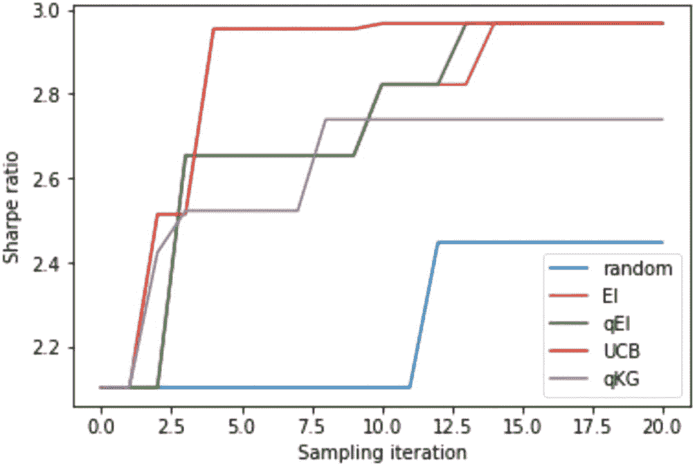

一张夏普比率与采样迭代次数的多线图，曲线呈上升趋势，UCB、qEI 和 EI 达到最大值，随后是 qKG 和随机策略。曲线呈现阶梯式增长。

**图 9-11**

所有搜索策略的累积最大夏普比率。UCB 策略表现最佳，因为它仅在一次迭代中就能识别出最高的夏普比率。其他策略在后期才跟上，但在后续迭代中缺乏探索。随机策略表现最差，体现了原则性搜索策略相比随机选择的优势。

让我们重复多次实验以评估结果的稳定性，如代码清单 9-11 所示。

```python
#### 多次试验
#### 用于评估不同BO循环标准差的运行次数
`N_TRIALS = 4`
#### 打印诊断信息的指示器
`verbose = True`
#### 外层BO循环的步数
`N_ROUND = 20`
`best_random_all, best_observed_ei_all, best_observed_qei_all, best_observed_ucb_all, best_observed_qkg_all = [], [], [], [], []`
#### 多次试验的平均值
for trial in range(1, `N_TRIALS` + 1):
    `best_random, best_observed_ei, best_observed_qei, best_observed_ucb, best_observed_qkg = [], [], [], [], []`
    # 调用辅助函数生成初始训练数据并初始化模型
    `train_x, train_y, best_observed_value = generate_initial_data(n=3)`
    `train_x_ei = train_x`
    `train_x_qei = train_x`
    `train_x_ucb = train_x`
    `train_x_qkg = train_x`
    `train_y_ei = train_y`
    `train_y_qei = train_y`
    `train_y_ucb = train_y`
    `train_y_qkg = train_y`
    `mll_ei, model_ei = initialize_model(train_x_ei, train_y_ei)`
    `mll_qei, model_qei = initialize_model(train_x_qei, train_y_qei)`
    `mll_ucb, model_ucb = initialize_model(train_x_ucb, train_y_ucb)`
    `mll_qkg, model_qkg = initialize_model(train_x_qkg, train_y_qkg)`
    `best_random.append(best_observed_value)`
    `best_observed_ei.append(best_observed_value)`
    `best_observed_qei.append(best_observed_value)`
    `best_observed_ucb.append(best_observed_value)`
    `best_observed_qkg.append(best_observed_value)`
    # 在初始随机批次之后运行`N_ROUND`轮贝叶斯优化
    for iteration in range(1, `N_ROUND` + 1):
        `t0 = time.monotonic()`
        # 拟合模型
        `fit_gpytorch_mll(mll_ei)`
        `fit_gpytorch_mll(mll_qei)`
        `fit_gpytorch_mll(mll_ucb)`
        `fit_gpytorch_mll(mll_qkg)`
        # 对于`best_f`，我们使用观察到的最佳精确值
        `EI = ExpectedImprovement(model=model_ei, best_f=train_y_ei.max())`
        `qEI = qExpectedImprovement(model=model_qei, best_f=train_y_ei.max(), num_samples=1024)`
        `UCB = UpperConfidenceBound(model=model_ucb, beta=beta)`
        `qKG = qKnowledgeGradient(model=model_qkg, num_fantasies=64, objective=None, X_baseline=train_x_qkg)`
        # 优化并获取新观测值
        `new_x_ei, new_y_ei = optimize_acqf_and_get_observation(EI)`
        `new_x_qei, new_y_qei = optimize_acqf_and_get_observation(qEI)`
        `new_x_ucb, new_y_ucb = optimize_acqf_and_get_observation(UCB)`
        `new_x_qkg, new_y_qkg = optimize_acqf_and_get_observation(qKG)`
        # 更新训练点
        `train_x_ei = torch.cat([train_x_ei, new_x_ei], dim=0)`
        `train_x_qei = torch.cat([train_x_qei, new_x_qei], dim=0)`
        `train_x_ucb = torch.cat([train_x_ucb, new_x_ucb], dim=0)`
        `train_x_qkg = torch.cat([train_x_qkg, new_x_qkg], dim=0)`
        `train_y_ei = torch.cat([train_y_ei, new_y_ei], dim=0)`
        `train_y_qei = torch.cat([train_y_qei, new_y_qei], dim=0)`
        `train_y_ucb = torch.cat([train_y_ucb, new_y_ucb], dim=0)`
        `train_y_qkg = torch.cat([train_y_qkg, new_y_qkg], dim=0)`
        # 更新进度
        `best_random = update_random_observations(best_random)`
        `best_value_ei = max(best_observed_ei[-1], new_y_ei.item())`
        `best_value_qei = max(best_observed_qei[-1], new_y_qei.item())`
        `best_value_ucb = max(best_observed_ucb[-1], new_y_ucb.item())`
        `best_value_qkg = max(best_observed_qkg[-1], new_y_qkg.item())`
        `best_observed_ei.append(best_value_ei)`
        `best_observed_qei.append(best_value_qei)`
        `best_observed_ucb.append(best_value_ucb)`
        `best_observed_qkg.append(best_value_qkg)`
        # 重新初始化模型，以便在下一次迭代中进行拟合
        `mll_ei, model_ei = initialize_model(train_x_ei, train_y_ei)`
        `mll_qei, model_qei = initialize_model(train_x_qei, train_y_qei)`
        `mll_ucb, model_ucb = initialize_model(train_x_ucb, train_y_ucb)`
        `mll_qkg, model_qkg = initialize_model(train_x_qkg, train_y_qkg)`
        `t1 = time.monotonic()`
    `best_observed_ei_all.append(best_observed_ei)`
    `best_observed_qei_all.append(best_observed_qei)`
    `best_observed_ucb_all.append(best_observed_ucb)`
    `best_observed_qkg_all.append(best_observed_qkg)`
    `best_random_all.append(best_random)`
```

**代码清单 9-11** — 通过重复实验评估结果的稳定性

运行代码后生成图 9-12，表明基于贝叶斯优化的搜索策略始终优于随机搜索策略。

```markdown
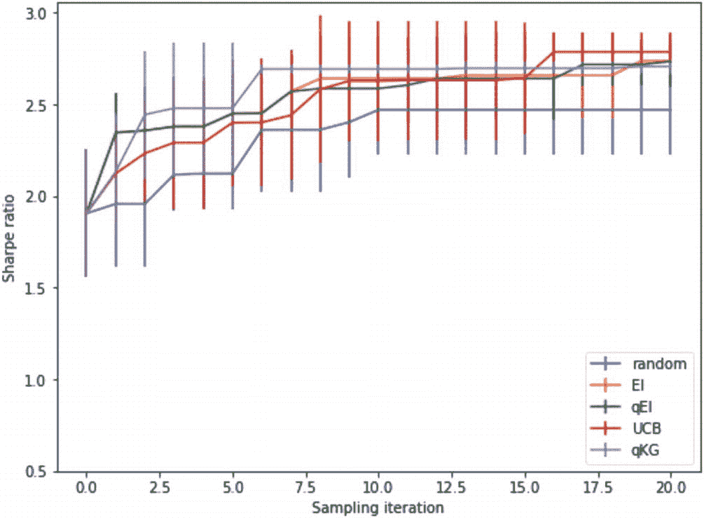

一张夏普比率与采样迭代次数的多线图，所有结果均呈现上升趋势。图中显示，UCB 获得了最大夏普比率，随机方法获得最小夏普比率。EI、qEI 和 qKG 则介于两者之间。曲线呈阶梯状上升。

**图 9-12** 通过重复实验评估结果的稳定性
```

最后，我们提取所有实验的均值和标准差，如代码清单 9-12 所示。

```python
def extract_last_entry(x):
    tmp = []
    for i in range(4):
        tmp.append(x[i][-1])
    return tmp

rst_df = pd.DataFrame({
    "EI": [np.mean(extract_last_entry(best_observed_ei_all)), np.std(extract_last_entry(best_observed_ei_all))],
    "qEI": [np.mean(extract_last_entry(best_observed_qei_all)), np.std(extract_last_entry(best_observed_qei_all))],
    "UCB": [np.mean(extract_last_entry(best_observed_ucb_all)), np.std(extract_last_entry(best_observed_ucb_all))],
    "qKG": [np.mean(extract_last_entry(best_observed_qkg_all)), np.std(extract_last_entry(best_observed_qkg_all))],
    "random": [np.mean(extract_last_entry(best_random_all)), np.std(extract_last_entry(best_random_all))],
}, index=["mean", "std"])

>>> rst_df
          EI      qEI      UCB      qKG   random
mean  2.736916  2.734416  2.786065  2.706545  2.470426
std   0.116130  0.146371  0.106940  0.041464  0.247212
```

**代码清单 9-12** 提取所有实验的均值和标准差

由于贝叶斯优化社区中存在多种采集函数可供选择，我们预计这种方法未来将更受欢迎。但需要注意的是，我们示例中的卓越表现可能是过拟合的结果。建议不要只选择一个回测期，而是在多个有代表性的回测期上对一组参数进行评分，以便更公平地评估特定采样点处的函数评估结果。换句话说，我们需要为黑箱函数建立一个更稳健的观测模型，以最大限度地降低对当前训练数据集过拟合的风险。

## 本章小结

在本章中，我们介绍了如何使用贝叶斯优化技术来搜索交易策略的最优参数。我们首先阐述了通过调整相应的控制参数来优化交易策略的概念，这是一项艰巨的任务。通过将性能指标视为调整参数的*黑箱函数*，我们引入了贝叶斯优化框架，该框架利用高斯过程和采集函数（如 `EI` 和 `UCB`）来以样本高效的方式支持最优参数的搜索。在完整的贝叶斯优化循环视角下，我们通过一个案例研究来优化配对交易策略的入场和退出阈值，从而获得最优夏普比率。

在最后一章中，我们将探讨机器学习模型在配对交易策略中的应用。

## 练习题

-   贝叶斯优化是如何处理交易策略中超参数调优问题的？是什么使得这种方法特别适合这项任务？
-   更改目标函数，以搜索最小化趋势跟踪策略最大回撤的参数。
-   贝叶斯优化基于目标函数的概率模型，通常是高斯过程（GP）。这个模型如何帮助识别搜索空间中需要探索或利用的区域？
-   您能描述一个在优化交易策略的背景下，长期（非短视）采集函数会带来益处的场景吗？在什么情况下，短期（短视）函数可能更可取？
-   请讨论如何在贝叶斯优化过程中利用先验知识来调整交易策略的参数？
-   在交易策略参数的优化过程中，贝叶斯优化如何处理金融市场中常见的噪声评估问题？

# 10. 利用机器学习的配对交易

机器学习可以通过多种方式用于配对交易，以提高交易策略的有效性。示例包括配对选择、特征工程、价差预测等。在本最后一章中，我们将重点研究使用不同的机器学习算法进行价差预测，以生成交易信号。

## 配对交易中的机器学习

正如前一章所讨论的，配对交易是一种量化交易策略，涉及同时对两种高度相关/协整的资产进行方向相反的交易。金融工具可以是两只股票或两个指数，基于它们的相对价格差异来推导价差序列并生成交易信号。配对交易背后的主要假设是，两种高度相关或协整资产之间的价格差应随时间表现出均值回复行为。在此期间，如果市场因暂时波动而出现错误定价，交易者可以通过买入表现不佳的资产并卖空表现过度的资产来获利。换句话说，该策略识别的两种资产应具有长期均衡关系并同步波动，而任何偏离这种模式的情况都可能是暂时的，并最终会回复到均值。

在进行配对交易时，我们首先识别出两种高度相关/协整且具有相似风险敞口的资产。当 `z-score` 超过预定义阈值时，对一种资产做多，对另一种资产做空，我们希望从它们价差的收敛中获利。具体来说，随着两种资产间的价差扩大，我们卖出定价过高的资产并买入定价过低的资产。类似地，随着价差收窄且 `z-score` 降至另一个预定义阈值以下，我们将平仓并锁定利润。

作为一种市场中性策略，配对交易在牛市、熊市或盘整市场中均可盈利。该策略的成功取决于两个因素：能否识别出具有相似风险特征的配对相关/协整资产，以及能否准确预测两种资产之间的价差。例如，在上一章中，我们使用移动平均线将每日价差标准化为 `z-score`。这个移动平均线充当了预测的价差，然后用于与实际价差进行比较，并以标准差为单位推导出偏差量。

此外，我们还需要建立适当的风险管理机制。当价差因意外市场事件而继续扩大并朝不利方向移动时，更大的价差可能导致重大损失。因此，通常会设置止损单来限制策略的潜在损失。

图 10-1 总结了配对交易策略的三个关键组成部分。第二部分将是以下各节的重点，我们将说明如何使用机器学习技术来预测价差序列。

```markdown
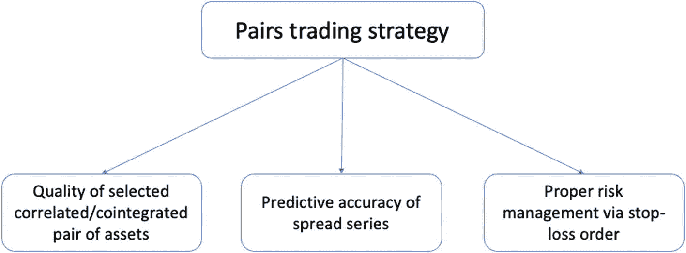

一个树状图展示了配对交易策略的 3 个组成部分。选定的相关配对资产的质量、价差序列的预测准确性以及通过止损单进行适当的风险管理。

**图 10-1** 总结决定配对交易策略成败的三个组成部分
```

### 机器学习工作流

机器学习模型是预测函数，能在给定特定输入集时生成预测结果。在本例中，我们计划在配对交易中使用机器学习模型来预测两种资产之间的价差，进而识别有利可图的交易信号。由于价差是一个连续量，本章将探讨回归模型，包括支持向量机（`SVM`）、随机森林（`RF`）和神经网络模型。我们还会对特征空间（即历史价差序列）进行扩充，加入诸如技术指标等额外特征。一旦价差被预测出来，我们就可以通过做多表现较差的资产、做空表现较好的资产来生成交易信号。

机器学习模型是一种数学算法或函数，它在训练数据集上进行训练，并用于对未见过的未来测试数据集进行预测。根据具体的模型类别，该函数能从给定数据中学习潜在的模式和关系，在监督学习的情境下，这通常表现为输入-输出对的形式。这个过程被称为插值，即模型需要在给定数据点之间进行插值拟合，同时要对数据集中的随机噪声具备一定程度的鲁棒性，这通常由相对较低的训练误差来体现。

接下来，训练好的模型将使用一组新的测试数据进行评估，这一过程称为外推。测试数据可能与训练数据有所不同。模型应当在测试集上表现良好，这样将其应用于实际场景时才能让人有信心。测试集的性能也被称为泛化性能，它是衡量模型在测试集数据上泛化能力好坏的一个指标。

一个典型的机器学习模型由两部分组成：参数（或权重）作为模型的构建模块，而模型架构则规定了输入数据如何与参数交互以生成输出。模型训练指的是调整这些参数的过程，目的是使模型在测试集上表现良好，同时在训练集上也往往能有相对较好的表现。在训练过程中，机器学习算法会根据输入数据调整模型参数，以提高其在训练数据上的预测准确性。一旦模型训练完成，它就可以用于对之前可能未见过的新数据进行预测。

如果模型在训练集上表现过于出色，但在测试集上表现不佳，那么该模型就被认为对训练数据过拟合了。由于现代模型通常架构复杂且参数数量庞大，过拟合在许多训练场景中都是常见现象。可以采用适当的正则化技术来降低过拟合的风险。

让我们回顾一下第一章图中展示的整体模型训练流程工作流图示，为方便参考，此处也将其呈现于图 10-2。我们可以应用正则化技术，通过以下四个组件来获得更好的泛化性能：训练数据、模型、代价度量以及优化过程。每个组件都有特定程度的正则化效果，并且可以组合使用，以在特定的训练情境下实现良好的泛化性能。

```markdown


此图展示了整体模型训练流程的工作流。它包含四个组件：带有输入特征和目标标签的训练数据、带参数和架构的模型、代价度量，以及带有代价反馈的模型优化过程。
```


**图 10-2**

典型模型训练过程示例。工作流从可用的训练数据开始，逐步调整模型。调整过程需要将模型预测与目标输出进行匹配，两者之间的差距由特定的代价度量来衡量，并作为反馈用于下一轮调整。每一轮调整都会产生一个新模型，而我们希望找到一个能最小化代价的模型。

在接下来的部分中，我们将介绍三种不同类型机器学习算法的高级原理：支持向量机、随机森林和神经网络。

### 支持向量机

支持向量机（SVM）是一种流行的监督学习算法，特别在 Kaggle 社区中，常用于分类和回归任务。在分类问题中，SVM 通过核函数将输入数据从原始特征空间映射到高维特征空间，然后找到能最佳区分不同类别数据的超平面。该超平面以最大化类别间间隔为原则进行选择。基于最大间隔原则寻找边界通常能带来更好的泛化性能，从而降低过拟合风险。

由于我们关注的是将传播量作为连续结果进行预测（即回归任务），SVM 在此场景下寻找的是既能最佳分离输入数据，同时又能最小化间隔违规的超平面。在这种情况下，回归任务的目标是通过最小化预测输出与真实目标值之间的成本度量——`误差平方和（SSE）`，使超平面尽可能贴近实际数据点。由于将误差平方和最小化至零容易导致过拟合模型，用于回归的 SVM 模型通常采用`ϵ`-不敏感损失函数，该函数允许模型在预测中容忍一定程度的误差（不超过阈值`ϵ`）。

这里有多个技术术语需要进一步解释。让我们从`超平面`的概念开始。在回归问题中，超平面是一条用于预测连续输出的决策线。超平面两侧一定距离（具体为`ϵ`范围内）的数据点称为`支持向量`。我们也可以利用这些支持向量，在超平面周围以`ϵ`为距离绘制两条`决策边界`。

接下来，`核函数`是一组数学函数，它接收数据作为输入，并将其转换为所需形式（可能是在不同维度下）。核函数通常用于在高维空间中寻找超平面，这通常比在原始特征空间中寻找相同的分离超平面更容易实现线性分离。在 SVM 中使用核函数为分类和回归任务提供了强大而灵活的工具，使 SVM 能够处理复杂甚至非线性可分离的数据集。

图 10-3 有助于说明这些概念。给定一组以输入-输出对形式存在的训练观测值，支持向量回归模型将构建一个超平面作为回归线，以预测未来的测试数据。超平面由两个决策边界环绕，这两个边界由用户指定的超参数`ϵ`决定。在此，`ϵ`指定了回归线周围`ϵ`-不敏感区间（或容忍区间）的宽度，在该区间内的误差不受惩罚。并非所有数据点都落在决策边界内，SVM 的设计目标是通过在估计超平面时最大化决策边界内的数据点数量，来最小化此类间隔违规。

``

一个 X-Y 平面展示了一些位于决策边界之间的点，超平面位于其中央，作为预测该区域目标值的决策线。有些点不在决策边界内。容忍误差项表示从超平面到边界的距离。

图 10-3

说明支持向量回归模型的训练机制

注意，`ϵ`控制着对间隔违规的容忍度。它决定了模型复杂度与预测精度之间的权衡。较小的`ϵ`值会导致模型复杂，能紧密拟合训练数据，但存在过拟合训练集的风险，从而对新数据的泛化能力较差。另一方面，较大的`ϵ`值会产生更简单的模型，误差较大，但可能具有更好的泛化性能。

作为用户指定的超参数，`ϵ`的选择对最终预测性能极为敏感。一种常见的方法是交叉验证，即将原始数据多次划分为训练集和验证集，每次使用不同的随机种子。平均预测性能最高的`ϵ`值即为最佳选择。

下一节将介绍随机森林模型。

### 随机森林

随机森林是一种集成模型，它结合多个简单模型共同做出最终预测。这是一种功能强大且灵活的模型，可用于回归和分类任务。顾名思义，该算法构建了多棵决策树，并整合森林中的所有树来做出最终预测。

随机森林与其他模型的主要区别在于原始训练数据集是如何划分以支持每棵树训练的。具体来说，每棵树都在数据的不同子集和特征的不同子集上进行训练，这一过程称为`装袋`或`自助聚合`。通过使用数据和特征的随机子集，该算法创建了多个独立的子模型，这些模型具有低偏差和高方差的特点。最终预测结果是取所有单棵树预测的平均值，类似于收集多位独立顾问的意见，并取平均建议作为最终决策。

注意，在树的每个节点上，会考虑一个随机特征子集来确定最佳分裂点，而不是考虑所有特征。这个过程称为特征袋装。特征选择中的随机性确保了树之间的去相关性，并降低了过拟合的可能性。

随机森林因其简单性、多功能性和鲁棒性而被广泛使用。它们可以处理数值型和类别型特征的混合数据，几乎不需要数据预处理，并内置了处理缺失值的方法。此外，它们还能提供特征重要性度量，这有助于洞察数据的底层结构。

图 10-4 展示了随机森林模型的整体训练过程。我们从原始训练集中进行抽样，得到总共`B`个子集。每次抽样都随机选择观测值和特征，使得生成的子集相互独立，并在特征空间中不相关。然后，我们将为每个子集训练一个决策树模型，得到`B`个子模型。当评估一个新的测试数据点时，这`B`个预测结果将被汇总并取平均值，以生成最终预测。

``

随机森林模型的图表描述了训练过程从原始训练集抽样开始，得到总共 B 个子集。为每个子集训练一个决策树模型。将所有预测结果汇总并取平均值作为最终预测。

图 10-4

说明随机森林模型的训练机制

在下一节中，我们将介绍基本的前馈神经网络。

### 神经网络

神经网络由多个相互连接的节点（也称为神经元）组成，这些节点分层堆叠在一起。每个神经元作为一个函数，接收来自前一层神经元的输入，对该输入进行非线性变换，并将输出发送给下一层神经元。在这些神经元之间是权重，也称为神经网络的参数。学习一个神经网络模型本质上意味着调整权重，以使最终预测准确，并且模型能够很好地泛化到测试集。

一个典型的神经网络包含一个表示输入数据的输入层和一个生成输出的输出层。它还可以包含任意数量的中间层（称为隐藏层）。每一层至少包含一个神经元，其被解释为提取到的隐藏特征。当我们谈及神经网络的层数时，指的是隐藏层加上输出层的总数。例如，感知机是一个单层神经网络，这意味着它只有输入层和输出层，中间没有任何隐藏层。

作为神经网络的基本组成单元，感知机是一个完成两步数学运算的单个神经元：加权求和与非线性变换。对于单个具有`p`维特征的观测值`x ∈ ℝ^p`，感知机首先计算`x`与其对应的权重向量`w ∈ ℝ^p`（该向量也应是`p`维）之间的加权和`Σ_{i=1}^p w_i x_i`。加权和通常还伴随一项称为`截距`或`偏置`的项，它作为一个额外参数，对加权和进行全局性的偏移调整，以更好地拟合数据。

在添加截距/偏置项`b`后，该和会经过一个`激活函数`，该函数对加权和引入非线性变换。请注意，偏置项是通过在输入数据中插入一列全为 1 的值来添加的，这与线性回归中的偏置技巧相同。这种非线性变换，连同层的数量和宽度，共同决定了神经网络的灵活性、表达能力以及逼近能力。图 10-5 总结了感知机的处理流程。

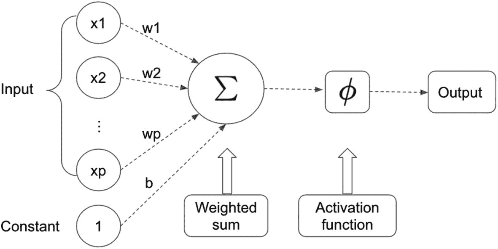

**图 10-5** — 感知机的处理流程图，其包含一个加权和运算，随后是一个激活函数。会自动添加一列全为 1 的值以对应权重向量中的偏置项

最流行的激活函数选择是`修正线性单元`（ReLU），它像一个开关：如果输入信号的值高于特定阈值，则原样通过；如果低于阈值，则输出零将其屏蔽。换句话说，如果输入为正，ReLU 运算是一个恒等函数；否则，输出被设置为零。没有这种非线性激活，多层神经网络就只会变成一系列线性函数堆叠在一起，最终形成一个线性模型。

图 10-6 可视化了 ReLU 函数的形状，并总结了到目前为止讨论的感知机运算的特征。除了神经网络模型在层的数量和宽度上的结构灵活性之外，另一个主要的额外灵活性在于非线性运算。事实上，许多令人兴奋且有意义的隐藏特征，都可以通过使用 ReLU 作为激活函数来自动提取。例如，在使用一种称为卷积神经网络的特殊架构训练图像分类器时，初始隐藏层中的低级特征往往倾向于类似线条或边缘的基本结构组件，而后期隐藏层中的高级特征则开始学习结构模式，如正方形、圆形，甚至更复杂的形状，比如汽车轮子。如果我们局限于特征的线性变换，这是不可能实现的；而如果我们要手动设计这些信息丰富的特征，那将是一项极其困难的任务。

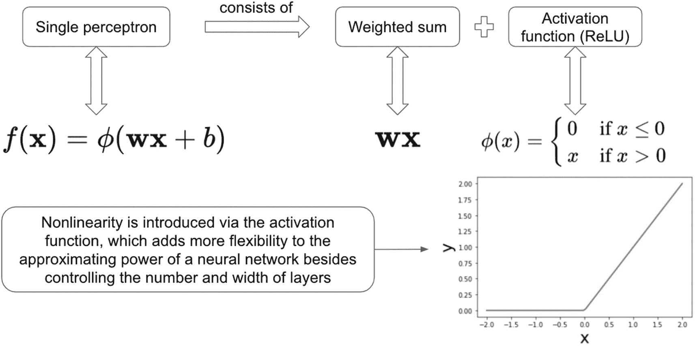

**图 10-6** — 将单个感知机分解为加权和与激活函数（通常是 ReLU）。ReLU 运算在信号为正时通过，为负时将其屏蔽。除了在设计层的数量和宽度上的灵活性外，这种非线性也为神经网络引入了强大的逼近能力

ReLU（及其变体）仍然是最流行的激活函数的原因之一是其快速的梯度计算。当输入小于或等于零时，（常数的）梯度变为零，从而节省了反向传播和参数更新的需要。当输入为正时，（原始输入变量的）梯度就是 1，它会按原样进行反向传播。

回顾完这三类模型后，让我们转向配对交易的具体实现，并比较在使用机器学习模型预测每日价差后的表现。

#### 使用机器学习实现配对交易策略


在本节中，我们将沿用上一章类似的方法来开发配对交易策略，唯一的改动在于预测价差的计算方式。上一章使用滚动窗口来计算每日价差的均值和标准差。换句话说，预测价差是移动窗口中历史价差集合的平均值，其波动性也被用来标准化实际价差与预测价差之间的差异。

首先，我们导入所需的包。如代码清单 10-1 所示，我们将关注同一对股票（谷歌和微软）以及相同的交易区间（2022 年全年）。

```python
import os
import random
import numpy as np
import yfinance as yf
import pandas as pd
from statsmodels.tsa.stattools import adfuller
from statsmodels.regression.linear_model import OLS
import statsmodels.api as sm
from matplotlib import pyplot as plt
%matplotlib inline
SEED = 8
random.seed(SEED)
np.random.seed(SEED)
#### 从 yfinance 下载数据
stocks = ['GOOG','MSFT']
start_date  = "2022-01-01"
end_date  = "2022-12-31"
df = yf.download(stocks, start=start_date, end=end_date)['Adj Close']
df.head()
GOOG       MSFT
Date
2022-01-03 145.074493 330.813873
2022-01-04 144.416504 325.141327
2022-01-05 137.653503 312.659882
2022-01-06 137.550995 310.189270
2022-01-07 137.004501 310.347412
代码清单 10-1
下载股票数据
```

为简化起见，我们将价差定义为两只股票对数价格之差，计算方法及可视化如代码清单 10-2 所示。

```python
#### 计算两项资产之间的价差
spread = np.log(df[stocks[0]]) - np.log(df[stocks[1]])
plt.plot(spread, label='使用对数价格差计算的价差')
plt.legend()
plt.show()
代码清单 10-2
计算价差
```

运行此代码将生成图 10-7。

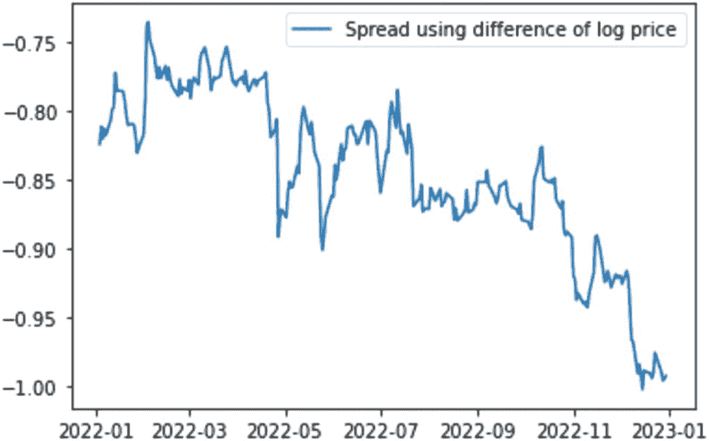

一条描述 2022 年 1 月至 2023 年 1 月期间价差（通过使用对数价格差计算）的下降趋势折线图，伴有波动。

**图 10-7** 将每日价差（定义为两只股票对数价格之差）可视化

接下来，我们将进行特征工程以扩充特征空间。

## 特征工程

特征工程是从原始数据中选择、转换和提取相关特征的过程，旨在提升机器学习模型的性能。特征的质量（有时也包括数量）是影响机器学习模型性能的关键因素。从可解释性的角度来看，这些额外工程化的特征可能不一定有实际意义，但它们很可能通过为模型提供新的可调参数来提升机器学习算法的预测性能。

我们在之前的讨论中已经接触过特征工程，其中最典型的例子是移动平均线。在本练习中，我们将使用五个特征来预测价差序列，包括两只股票的日收益率、价差序列的五日移动平均线，以及日收益率的 20 日移动标准差。这些特征在代码清单 10-3 中创建。

```python
#### 定义额外的特征
asset1_returns = np.log(df[stocks[0]]).diff()
asset2_returns = np.log(df[stocks[1]]).diff()
spread_ma5 = spread.rolling(5).mean()
asset1_volatility = asset1_returns.rolling(20).std()
asset2_volatility = asset2_returns.rolling(20).std()
代码清单 10-3
生成额外的特征
```

请注意，这只是创建额外特征的一种方式。在实践中，如果目标是最大化预测精度，我们会创建更多的特征来支持 SVM 和随机森林等算法。然而，对于神经网络而言，此类特征工程虽有帮助，但并非必需。神经网络是强大的函数逼近器，只要拥有足够复杂的架构和充足的训练时间，它们就能学习到正确的特征提取方法。

然后，我们将这些特征整合到一个 DataFrame `X` 中，并将 NA 值填充为零。同时，将价差序列赋值给 `y`：

```python
#### 将特征组合到单个 DataFrame 中
X = pd.DataFrame({'Asset1Returns': asset1_returns,
'Asset2Returns': asset2_returns,
'SpreadMA5': spread_ma5,
'Asset1Volatility': asset1_volatility,
'Asset2Volatility': asset2_volatility})
X = X.fillna(0)
y = spread
```

接下来，我们将数据分为训练集和测试集。我们将采用常见的 80-20 法则；即 80%的数据用于训练集，20%用于测试集。同时，我们将遵循时间顺序，确保 80%的训练集不会窥探到未来信息，如代码清单 10-4 所示。

```python
#### 将数据分割为训练集和测试集
train_size = int(len(spread) * 0.8)
train_X = X[:train_size]
test_X = X[train_size:]
train_y = y[:train_size]
test_y = y[train_size:]
代码清单 10-4
执行训练-测试集分割
```

准备好训练数据和测试数据后，我们现在可以进入模型训练部分，首先从 SVM 开始。

### 使用 `SVM` 进行配对交易

由于这是一个回归任务，我们将使用来自 `sklearn` 的 `SVR` 类，并指定一个线性核。实例化模型类后，我们使用 `fit()` 方法将模型参数拟合到训练数据上，并使用 `predict()` 方法生成对测试数据的预测。我们还将检查训练集和测试集的均方根误差（`RMSE`）。代码清单 10-5 完成了训练和测试操作。

```python
from sklearn.svm import SVR
from sklearn.metrics import mean_squared_error
svm_model = SVR(kernel='linear')
svm_model.fit(train_X, train_y)
train_pred = svm_model.predict(train_X)
>>> print("training rmse: ", np.sqrt(mean_squared_error(train_y, train_pred)))
test_pred = svm_model.predict(test_X)
>>> print("test rmse: ", np.sqrt(mean_squared_error(test_y, test_pred)))
training rmse:  0.039616044798431914
test rmse:  0.12296547390274865
Listing 10-5
使用 SVM 进行模型训练和测试
```

`RMSE` 衡量了模型的预测性能。然而，我们仍需要将模型嵌入到交易策略中，并评估其在配对交易策略中的最终盈利能力。由于唯一的变更在于基于特定机器学习模型预测的价差，我们可以定义一个函数，将模型作为输入参数进行评分，并输出最终收益。代码清单 10-6 中的 `score_fn()` 函数完成了评分操作。

```python
import torch
def score_fn(model, type="non_neural_net"):
    # 使用 SVM 模型生成预测价差
    if type == "non_neural_net":
        test_pred = model.predict(test_X)
    else:
        test_pred = model(torch.Tensor(test_X.values)).detach().numpy()
    # 计算实际价差与预测价差的 z-score
    zscore = (spread - test_pred.mean()) / test_pred.std()
    # 设置入场和出场信号的阈值
    entry_threshold = 2.0
    exit_threshold = 1.0
    # 将每日持仓初始化为零
    stock1_position = pd.Series(data=0, index=zscore.index)
    stock2_position = pd.Series(data=0, index=zscore.index)
    # 为每只股票生成每日入场和出场信号
    for i in range(1, len(zscore)):
        # zscore 大于 2 且股票 2 没有现有空头仓位
        elif zscore[i] > entry_threshold and stock2_position[i-1] == 0:
            stock1_position[i] = -1 # 做空股票 1
            stock2_position[i] = 1 # 做多股票 2
        # -1<zscore<1
        elif abs(zscore[i]) < exit_threshold:
            stock1_position[i] = 0 # 退出现有仓位
            stock2_position[i] = 0
        # -2<zscore<-1 或 1<zscore<2
        else:
            stock1_position[i] = stock1_position[i-1] # 维持现有仓位
            stock2_position[i] = stock2_position[i-1]
    # 计算每只股票的收益率
    stock1_returns = (np.exp(test_X['Asset1Returns']) * stock1_position.shift(1)).fillna(0)
    stock2_returns = (np.exp(test_X['Asset2Returns']) * stock2_position.shift(1)).fillna(0)
    # 计算策略的总收益率
    total_returns = stock1_returns + stock2_returns
    cumulative_returns = (1 + total_returns).cumprod()
    return cumulative_returns[-1]
```

Listing 10-6
在给定预测模型下使用配对交易计算累计收益

在这个函数中，我们添加了另一个输入参数来控制该模型是否属于神经网络。这个控制选项放在此处是为了确定要使用的具体预测方法。对于标准的 `sklearn` 算法（如 `SVM` 和随机森林），我们可以调用模型对象的 `predict()` 方法，为给定的输入数据生成预测。然而，当模型是使用 PyTorch 训练的神经网络时，我们需要首先使用 `torch.Tensor()` 将输入转换为张量对象，通过调用模型对象本身（底层会调用模型类中的 `forward()` 函数）生成预测，然后使用 `detach()` 方法提取不含梯度信息的输出，最后使用 `numpy()` 将其转换为 NumPy 对象。

接下来，我们使用预测价差序列的均值和标准差计算 z-score。然后，我们使用入场阈值为 2、出场阈值为 1，根据标准化后的 z-score 生成交易信号。其余计算与前一章采用相同的方法。

现在我们可以使用这个函数来获取采用 `SVM` 模型的配对交易策略的最终收益：

```python
>>> score_fn(svm_model)
1.143746922303926
```

同样地，我们也可以使用随机森林回归器获得相同指标。

### 使用随机森林进行配对交易

为了构建一个用于回归的随机森林模型，我们可以使用 `RandomForestRegressor` 类并指定两个主要参数：`n_estimators` 作为随机森林中要构建的树的数量，以及 `random_state` 作为用于重现结果的随机种子。代码清单 10-7 训练了随机森林模型，并使用 `RMSE` 评估其在训练集和测试集上的性能。

```python
## 随机森林
from sklearn.ensemble import RandomForestRegressor
#### 创建随机森林回归器
rf_model = RandomForestRegressor(n_estimators=100, random_state=42)
#### 在训练集和测试集上训练模型
rf_model.fit(train_X, train_y)
train_pred = rf_model.predict(train_X)
>>> print("training rmse: ", np.sqrt(mean_squared_error(train_y, train_pred)))
test_pred = rf_model.predict(test_X)
>>> print("test rmse: ", np.sqrt(mean_squared_error(test_y, test_pred)))
training rmse:  0.005741011378501151
test rmse:  0.07322761976891506
```

Listing 10-7
使用随机森林进行模型训练和测试

结果显示，与 `SVM` 相比，随机森林能够更好地拟合数据，其训练集和测试集的 `RMSE` 都更低。

我们也计算了最终收益如下：

```python
>>> score_fn(svm_model)
0.9489411965252148
```

结果报告了一个较低的最终收益，尽管预测性能更好。这也是一种过拟合，从某种意义上说，在第一阶段预测任务中预测能力更强的模型，在第二阶段交易任务中却导致了更低的最终收益。将这两个任务结合在一个阶段中，是一个有趣且活跃的研究领域。

我们将在下一节中探讨神经网络。

### 使用神经网络进行配对交易

训练深度神经网络需要指定四个主要组成部分：输入数据、模型架构、目标函数和优化器。我们从输入数据开始，使用 `torch.Tensor()` 函数将它们转换为张量对象，如下所示：

```python
#### 将数据转换为 PyTorch 张量
train_X_ts = torch.Tensor(train_X.values)
train_y_ts = torch.Tensor(train_y).view(-1, 1)
test_X_ts = torch.Tensor(test_X.values)
test_y_ts = torch.Tensor(test_y).view(-1, 1)
```

请注意，我们使用 `.values` 属性从 DataFrame 中访问数值，并使用 `view()` 函数将目标值重塑为一列。

接下来，我们在清单 10-8 中定义神经网络模型。这里，我们将各个属性传入初始化函数，包括一个输入线性层、一个隐藏线性层和一个输出线性层。输入层的输入神经元数量（即 `train_X.shape[1]`）和输出层的输出神经元数量（即 1）由具体问题决定。中间层的神经元数量由用户定义，并直接决定了模型的复杂度。所有这些层通过 `forward()` 函数与中间的 ReLU 激活函数链接在一起。同时，请注意不需要对最后一层应用 ReLU，因为输出将是一个表示预测价差的标量值。

```python
#### 定义神经网络模型
class Net(nn.Module):
def __init__(self):
super(Net, self).__init__()
self.fc1 = nn.Linear(train_X.shape[1], 64)
self.fc2 = nn.Linear(64, 32)
self.fc3 = nn.Linear(32, 1)
self.relu = nn.ReLU()
def forward(self, x):
x = self.fc1(x)
x = self.relu(x)
x = self.fc2(x)
x = self.relu(x)
x = self.fc3(x)
return x
```

清单 10-8
定义网络架构

现在，我们在`nn_model`中实例化一个神经网络模型，并使用`summary()`函数检查模型的架构信息，如清单 10-9 所示。

```
from torchsummary import summary
#### 创建神经网络模型的一个实例
nn_model = Net()
#### 打印自定义神经网络的摘要
>>> summary(nn_model, input_size=(1, train_X.shape[1]))

Layer (type)               Output Shape         Param #
================================================================
Linear-1                [-1, 1, 64]             384
ReLU-2                [-1, 1, 64]               0
Linear-3                [-1, 1, 32]           2,080
ReLU-4                [-1, 1, 32]               0
Linear-5                 [-1, 1, 1]              33
================================================================
Total params: 2,497
Trainable params: 2,497
Non-trainable params: 0

Input size (MB): 0.00
Forward/backward pass size (MB): 0.00
Params size (MB): 0.01
Estimated Total Size (MB): 0.01

清单 10-9
检查网络模型摘要
```

结果显示，该神经网络在三个线性层中共包含 2497 个参数。请注意，ReLU 层没有任何相关参数，因为它只涉及确定性映射。

接下来，我们使用`MSELoss()`将损失函数定义为均方误差，并选择 Adam 作为网络权重的优化器，初始学习率为 0.001：

```
#### 定义损失函数和优化器
criterion = nn.MSELoss()
optimizer = torch.optim.Adam(nn_model.parameters(), lr=0.001)
```

我们现在进入迭代训练循环，通过最小化指定的损失函数来更新权重，如清单 10-10 所示。

```
#### 训练模型
for epoch in range(100):
    optimizer.zero_grad()
    outputs = nn_model(train_X_ts)
    loss = criterion(outputs, train_y_ts)
    loss.backward()
    optimizer.step()
    #### 每 10 个 epoch 打印一次损失
    if epoch % 10 == 0:
        print("Epoch {}, Loss: {:.4f}".format(epoch, loss.item()))
清单 10-10
完整的模型训练过程
```

这里，我们在训练集上总共迭代了 100 个 epoch。在每个 epoch 中，我们首先使用优化器的`zero_grad()`函数清除内存中现有的梯度。接着，我们在训练集上进行评分以获得`outputs`中的预测目标值，计算相应的 MSE 损失，通过`backward()`方法利用`autograd`功能执行反向传播来计算梯度，最后使用`step()`函数执行梯度下降更新。

运行代码会生成以下结果，我们可以看到训练损失随着迭代次数的增加持续下降：

```
Epoch 0, Loss: 0.4154
Epoch 10, Loss: 0.2246
Epoch 20, Loss: 0.0850
Epoch 30, Loss: 0.0093
Epoch 40, Loss: 0.0043
Epoch 50, Loss: 0.0051
Epoch 60, Loss: 0.0013
Epoch 70, Loss: 0.0016
Epoch 80, Loss: 0.0013
Epoch 90, Loss: 0.0012
```

我们还可以如下检查样本内和样本外的 RMSE：

```
#### 在训练集和测试集上评估模型
train_pred = nn_model(train_X_ts).detach().numpy()
>>> print("training rmse: ", np.sqrt(mean_squared_error(train_y_ts, train_pred)))
test_pred = nn_model(test_X_ts).detach().numpy()
>>> print("test rmse: ", np.sqrt(mean_squared_error(test_y_ts, test_pred)))
training rmse:  0.033806544
test rmse:  0.08466047
```

结果表明，与随机森林模型相比，神经网络过拟合程度更低。

现在我们获取基于神经网络模型的配对交易策略的终端收益：

```
>>> score_fn(nn_model, type="nn")
0.8999874304248494
```

这个结果再次表明，一个准确的机器学习模型并不一定能在配对交易策略中带来更高的终端收益。即使机器学习模型能够预测未来的价差，配对交易策略施加的另一层假设是，短暂的市场波动将会平息，并且两种资产将恢复到长期均衡关系。这种假设不一定成立，况且市场中还存在许多不可预测的因素。

## 总结

在本章中，我们介绍了用于预测价差（配对交易策略中的关键组成部分）的不同机器学习算法。我们首先介绍了训练任何机器学习算法时的总体框架，然后详细阐述了三种具体算法：支持向量机、随机森林和神经网络。最后，我们将这些模型应用于策略中，发现机器学习模型更高的预测性能（这是过拟合的迹象）可能导致累积收益方面的性能得分降低。因此，在预测阶段不要过度拟合机器学习模型，而应该更多关注实际交易行动发生的决策阶段中交易策略的最终表现，这一点至关重要。

## 练习题

*   SVM 模型如何确定用于预测配对交易策略中价差的最优超平面？在 SVM 中需要调整哪些关键参数？

*   在预测配对交易策略中的价差时，随机森林算法如何处理特征选择？在此背景下，特征重要性有何含义？

*   解释 SVM、随机森林和神经网络在处理预测配对交易策略中价差时的过拟合问题方面有何不同。

*   在预测配对交易策略中的价差时，你如何在 SVM、随机森林和神经网络中处理特征之间的非线性关系？

*   如何优化神经网络中的层，以改进配对交易策略中价差的预测？