# 机器学习和深度学习的新式金融应用

## 国际运筹学与管理科学系列

Mohammad Zoynul Abedin Petr Hajek 编辑

### 算法、产品建模和应用


## 国际运筹学与管理科学系列

### 创始编辑

Frederick S. Hillier， 斯坦福大学， 美国加利福尼亚州斯坦福

### 第336卷

### 系列编辑

Camille C. Price， 斯蒂芬·F·奥斯汀州立大学计算机科学系， 美国德克萨斯州纳科多奇斯

### 编辑委员会成员

- Emanuele Borgonovo， 博科尼大学决策科学系， 意大利米兰
- Barry L. Nelson， 西北大学工业工程与管理科学系
- Bruce W. Patty， Veritec Solutions， 美国加利福尼亚州米尔谷
- Michael Pinedo， 纽约大学斯特恩商学院， 美国纽约
- 罗伯特·J·范德贝， 普林斯顿大学， 新泽西州普林斯顿， 美国

### 副编辑

朱乔， 福伊斯商学院， 伍斯特理工学院， 马萨诸塞州伍斯特， 美国

这本书系列国际运筹学与管理科学系列涵盖了运筹学和管理科学的各个领域。既包括理论书籍，也包括应用书籍。它描述了世界各地在该领域处于前沿的当前进展。该系列主要面向研究人员、高级研究生和高级从业人员。

该系列图书有三种类型：

- 高级说明性图书，扩展和统一我们对特定领域的理解。
- 研究专著，对知识做出重要贡献。
- 手册，定义特定领域的最新技术水平。每本手册将由该领域的权威人士担任编辑，组织一组专家撰写各个主题的章节。手册可以强调说明性调查，也可以是全新的进展（无论是研究还是应用），或者两者兼而有之。

该系列强调以下四个领域：

**数学规划**：包括线性规划、整数规划、非线性规划、内点法、博弈论、网络优化模型、组合数学、均衡规划、互补理论、多目标优化、动态规划、随机规划、复杂性理论等。

**应用概率**：包括排队论、模拟、更新理论、布朗运动和扩散过程、决策分析、马尔可夫决策过程、可靠性理论、预测、其他应用驱动的随机过程等。

**生产与运营管理**：包括库存理论、生产调度、产能规划、设施选址、供应链管理、分销系统、物料需求计划、精益生产系统、生产线设计、物流规划、战略问题等。

**运筹学与管理科学的应用**：包括电信、医疗保健、资本预算和金融、经济学、市场营销、公共政策、军事运筹学、人道主义救援和灾害缓解、服务运营、交通系统等。

该书系列已被 Scopus 索引。

Mohammad Zoynul Abedin • Petr Hajek 编辑

## 机器学习和深度学习的新型金融应用

### 算法、产品建模和应用


## 编辑

**Mohammad Zoynul Abedin**

金融、绩效和经济与管理学院

营销系

提赛德大学国际商务帕尔杜比采，捷克共和国

学校，提赛德大学

米德尔斯堡，英国

**Petr Hajek**

帕尔杜比采大学

- ISSN 0884-8289
- ISSN 2214-7934（电子版）
- 国际运筹学与管理科学系列
- ISBN 978-3-031-18551-9
- ISBN 978-3-031-18552-6（电子书）
- https://doi.org/10.1007/978-3-031-18552-6

©编辑（如适用）和作者，独家许可给Springer Nature Switzerland AG 2023

本作品受版权保护。出版商独家授权，所有权利均属于出版商，包括全部或部分材料的翻译、重印、重用插图的使用、朗读、广播、微缩胶片复制或以任何其他实体方式的复制以及信息存储和检索、电子适应、计算机软件或通过已知或今后开发的类似或不同的方法。

在本出版物中使用一般描述性名称、注册名称、商标、服务标志等，并不意味着即使在没有明确声明的情况下，这些名称也不受相关保护法律和法规的限制，因此可以自由使用。

出版商、作者和编辑可以安全地假设本书中的建议和信息在出版日期时被认为是真实准确的。出版商、作者或编辑对本文所包含的材料不提供明示或暗示的保证，也不对可能存在的错误或遗漏负责。出版商在发表的地图和机构关系上保持中立。

这个Springer印记由注册公司Springer Nature Switzerland AG出版，注册公司地址为：瑞士Cham市Gewerbestrasse 11号，邮编6330。

# 前言

机器学习和深度学习在金融领域的新型应用：算法、产品建模和应用展示了机器学习（ML）和深度学习（DL）在金融领域的最新技术。我们将提供一系列实证证据，涵盖各个领域的金融领域，使本书对学者、从业人员和决策者有用，他们希望培训新颖和最先进的机器学习分类器。因此，本书的目的是提供不同领域的广泛应用，包括金融资产和市场。此外，通过广泛的文献评估，可以明显看出目前没有现有的教材来叙述机器学习和深度学习在金融领域或广泛的产品和市场中的应用。

商业风险和不确定性无疑是许多研究人员和管理者在金融领域面临的最大挑战。这种不确定性从而引发了一种不可避免的风险因素，这是金融理论的基本要素。据我们所知，金融领域还没有一本专注于机器学习的好书。关于如何使用机器学习和深度学习算法进行金融应用的信息也很稀缺。

金融企业需要监督危机事件并实现转型。为了解决金融问题的多样性，这本编辑书提倡基于机器学习的跨学科方法。

机器学习涉及对大量和多个特征实例的分析。它主要指的是通过处理过的训练样本从中获取知识和智能（通过计算机程序）以生成预测。它处理计算密集型技术，如聚类分析、维度降低和支持向量分析。它主要是计算机科学领域，已经广泛应用于社会科学、金融和银行业、市场营销研究、运筹学和应用科学。此外，计算金融是应用计算机科学的领域，关注金融中的实际问题。它可以被描述为应用于金融中的特征、实例和学习算法的研究。它是一个将计算工具与数值金融相结合的跨学科领域。此外，计算金融应用可以适用于经济实验的算术证明，从而有助于金融数据建模技术和系统的进展。这些计算技术被应用于金融风险管理、企业破产预测、股票价格预测和投资组合管理。最后，这本教材的提出对金融数据学习起着重要作用。

此外，这本书将成为实证和理论实践的基础。经验性实验旨在通过涵盖和拟合最先进和新颖的机器学习算法来最小化金融风险和不确定性。此外，它还产生学术文献以及金融产品和金融建模推断，用于客户信用风险评估、数据挖掘、模式识别、破产预测等等。具体而言，本书分为三个部分，第一组章节重点关注最近的趋势和问题金融科技（FinTech）。第二组章节包括应用ML和DL工具和技术对风险进行预测和预测的经验性论文。第三组章节结合了金融时间序列数据预测的经验证据。本书以一组新兴技术在金融教育和医疗保健中的应用结束及其经验性应用。

## 第一部分：金融科技的最新发展

第一部分介绍了金融科技的四个章节。

章节“金融科技风险管理与监控”重点关注金融科技中的风险管理和监控。通过定性研究方法，调查了金融服务业中金融技术创新的最新出现以及一些重要的风险。此章还讨论了减轻风险的适当方式。除此目标外，本章还讨论了金融科技快速发展背后的主要风险以及金融科技风险管理的步骤。本章还介绍了在金融科技管理和监控中具有重要应用的四种关键监管技术，并总结了金融科技风险管理的主要挑战。

章节“区块链环境下供应链数字化转型与支持性文化”探讨了区块链对供应链管理的数字化转型的影响。本章还旨在确定支持性文化在供应链中采用区块链的重要性。研究结果表明，通过采用区块链技术实现供应链管理的数字化与组织繁荣呈正相关。本章还指出，支持性文化对于实践区块链技术至关重要。本研究建议决策者和利益相关者确保建立一个可追溯、高效和有效的供应链所需的支持性文化。

章节“管理会计信息系统中人工智能技术整合的实证研究”对管理会计信息系统中人工智能技术整合进行了实证研究。本研究建立了基于人工神经网络的模型来预测管理信息，并使用一些真实数据验证模型的准确性。考虑了五个维度来开发模型，即会计分析管理系统、会计决策支持系统、绩效管理信息系统、风险管理信息系统和环境管理信息系统。

章节“大数据对会计实践的影响：来自非洲的实证证据”中讨论了在会计和金融领域分析大数据的重要性。证据表明，大数据对会计和审计会计有重大影响，利用数据量、数据种类和数据速度的多样性。本章展示了大数据对会计实践的影响，研究区域是非洲。本章的主要目标是通过尼日利亚的会计师来探索大数据对会计的影响。使用多元回归对151个回答进行分析，并使用随机抽样方法收集样本。本研究证明大数据对财务报告、绩效衡量、企业预算、审计证据、风险管理和欺诈管理有积极且显著的影响。本研究对会计师、潜在会计师和会计毕业生的学习有所帮助。

## 第二部分：使用机器学习进行金融风险预测

第二部分包含四章，讨论了使用机器学习和深度学习算法预测和预测金融风险的应用。

## 第一部分 金融科技的最新发展

### 金融科技风险管理和监控

Morshadul Hasan 和 Ariful Hoque

### 支持性文化下的供应链数字化转型

在区块链环境中

Shakila Akter, Mohammad Samiul Haque, Ashrafuzzaman Sohag, Md. Jahangir Alam Siddikee 和 Mohammad Zoynul Abedin

### 人工智能技术在管理中的整合

会计信息系统：一项实证研究

Emon Kalyan Chowdhury

### 大数据对会计实践的影响：实证

来自非洲的证据

Mandella Osei-Assibey Bonsu, Naheed Roni 和 Yongsheng Guo

## 第二部分 使用机器学习进行金融风险预测

### 使用异常值修正规则改善性能

在金融数据情况下的分类算法

Md. Rabiul Auwul, Md. Ajijul Hakim, Fahmida Tasnim Dhonno, Nusrat Afrin Shilpa, Ashrafuzzaman Sohag, 和 Mohammad Zoynul Abedin

### 基于支持向量机的违约风险预测

和逻辑回归支持向量机

Fahmida-E-Moula, Nusrat Afrin Shilpa, Preity Shaha, Petr Hajek, 和 Mohammad Zoynul Abedin

### 使用集成极限学习预测企业失败机器

David Veganzones

### 评估和预测小企业的信用评级：一种多准则方法

Baofeng Shi

## 第三部分 金融时间序列预测

### 基于集成LGBM（轻梯度提升机）的方法 原油价格预测方法

Sad Wadi Sajid, Mahmudul Hasan, Md. Fazle Rabbi, 和 Mohammad Zoynul Abedin

### 预测原油价格的模型开发：比较集成和机器学习方法的评估

Mahmudul Hasan, Ushna Das, Rony Kumar Datta, 和 Mohammad Zoynul Abedin

## 第四部分 金融教育和医疗保健中的新兴技术

### 发现金融学学生中移动学习的作用：在线教育的未来

Armana Hakim Nadi, Syed Far Abid Hossain, Al Mahmud Hasan, Mahbuba Rahman Sofin, Saadman Shabab, Md. Ahmedul Islam Sohan, 和 Chunyun Yuan

### 探索移动技术在高等教育中的作用：在线教学对传统学习的影响

Syed Far Abid Hossain, Armana Hakim Nadi, Rahma Akhter, Md. Ahmedul Islam Sohan, Faiza Tanaz Ahsan, Mahbuba Rahman Shofin, Saadmman Shabab, Tanusree Karmoker, 和 Krishna Paul

### 从健康数据中挖掘知识：特征应用选择方法

Md. Rabiul Auuwul, Md. Ajijul Hakim, Fahmida Tasnim Dhonno, Nusrat Afrin Shilpa 和 Mohammad Zoynul Abedin

## 金融科技的最新发展

### 金融科技风险管理和监控

Morshadul Hasan 和 Ariful Hoque

摘要 金融科技在金融服务行业的最新发展也面临着许多挑战，因为存在一些重大风险。本章旨在确定具体的金融科技风险和适当的风险管理方式。本研究采用定性研究方法探索本研究的目标。本研究的结果包括金融科技快速发展背后的主要风险以及金融科技风险管理步骤。此外，本研究确定了四种重要的监管技术，这些技术在管理和监控金融科技风险方面具有重要应用。最后，研究结果总结了主要挑战。

金融科技 · FinTech · 风险管理 · 风险监控

## 1 引言

近年来，金融科技（Fintech）如人工智能（AI）、大数据、机器学习（ML）、云存储、区块链等技术的大规模发展，持续推动金融机构的数字化转型（Deloitte, 2019; Hasan等，2020a; Wang等，2021）。金融产品和工具的应用越来越丰富，金融服务的效率和包容性显著提高。例如，电子支付特别是移动支付的普及，增加了基本金融服务的覆盖范围。金融科技的推广和应用（i）增加了金融服务的广度、深度和速度，（ii）为用户带来了好处和便利，（iii）帮助金融机构实现了质量和效率的提升，（iv）提高了金融服务在新冠疫情下的可用性（Hasan等，2020b）。

鉴于金融科技的重要性，近年来消费者金融快速发展的大部分积极影响可以归因于金融科技。这些改进包括增强包容性、融资和行业的广度和深度以及整体效率（Hasan等，2022；Long，2016）。传统金融机构已经找到了金融服务转型的新方向。金融科技转型也可以在改革未来经济结构和提高效率方面发挥作用。同时，金融科技的发展带来了重大的下行风险。例如，金融科技的快速增长也带来了新的问题，因为它解决了传统金融服务的缺点。这些下行风险常常使决策者面临很大的挑战，以便创造新的机会并保护传统的弱点。此外，风险对金融科技公司的战略目标产生影响。因此，管理金融科技服务中涉及的风险是金融科技机构的重要工作之一。金融科技机构通常以不同的方式衡量、管理和监控金融科技风险。本章的下一节将详细介绍金融科技风险管理和监控过程的细节。

## 2 FinTech的定义

Fintech一词是金融（Fin）和技术（Tech）的综合体（Hasan等，2020b，2021）。Fintech是一种以技术为导向的金融创新，通过利用现代科学和技术的成果来改进或创新金融产品和商业模式，以促进金融服务的质量和效率（Aggarwal，2014；Gai等，2018；Gomber等，2017）。Fintech指的是通过技术，特别是人工智能、区块链、大数据分析、云计算和其他手段来重新设计传统金融产品、流程、模型和组织结构的金融创新（Goldstein等，2019；Hasan等，2020a）。Fintech服务包括数字支付、数字投资、众筹借贷和在线银行业务。全球范围内金融科技的崛起显著提高了服务水平。此外，银行的运营效率也从根本上改变了银行业原有的竞争环境。

为了应对快速变化的竞争环境，银行已经开始了与金融科技的合作之旅。银行可以利用移动互联网、生物识别、大数据、人工智能和其他技术来拓宽服务渠道，减少手动服务，提高金融机构的全流程风险管理和控制能力，降低合规和额外运营成本。

## 3 什么是金融科技风险？

新金融科技公司的崛起也意味着一些未知的挑战和风险必须得到适当的解决。重要的创新不仅对金融机构构成挑战，也对监管机构构成挑战。金融科技风险是一种在消费者金融交易和通过金融科技技术进行交易期间产生的威胁。换句话说，当使用技术创新时，存在的危险。此外，金融科技风险可以被定义为任何可能导致消费者金融交易中断的技术故障、缺陷和滥用。金融科技风险包括许多隐藏的风险和传染性问题，这些问题在下面的部分中讨论。此外，一些风险和挑战是由于不当使用金融技术和金融技术本身的问题引起的。

## 4 维护金融科技证券的重要性

升级风险监管和新技术的出现使得风险管理的未来发展与当前众所周知的风险管理能力之间存在很大差异。对于金融机构来说，重新考虑和利用新兴技术改变现有的风险管理方法以提高风险管理质量和效率是非常重要的。此外，机构需要考虑金融科技风险，使风险管理方法更具动态性和快速响应新发展趋势的能力。然而，维护金融安全是与一个国家整体经济和社会发展相关的基本战略问题。准确判断隐藏风险是确保金融安全的先决条件。因此，在推动金融创新和加强预防的同时，建设金融实力时，必须注意和维护金融风险安全。在这方面，使用新兴的风险管理技术对于提高风险管理的质量也很重要。

## 5 金融科技快速发展背后的5个风险

本研究认为技术是中立的；关键的区别在于如何以及谁使用它。由于金融科技的特殊性质，金融机构在处理金融服务时必须应对一系列新的风险。一些重要的风险将在以下几个部分中进行讨论。Barefoot（2020）将科技风险分为不同的类别。这些包括隐私丧失、欺诈和骗局风险的上升、数据安全受损、对消费者行为进行有害操纵、对消费者和监管机构都不透明的数据使用以及对数据和数据分析的歧视性和不公平使用。此外，金融科技公司进入或监管部门缺乏足够的知识、稳定性和运营效率。

德勤还确定了一些最重要的风险，用技术后的金融服务中，如战略风险、网络安全风险、信息技术供应商风险、信息技术弹性和连续性风险、数据管理风险、应对风险、第三方风险、技术运营风险、风险管理无效风险和信息技术项目执行风险。¹ Zhentao（2021年7月28日）补充市场风险、运营风险、流动性风险、法律风险、监管风险和信用风险。风险可能以各种形式出现；然而，本研究指出需要考虑的金融科技风险包括网络攻击、数据隐私风险、数据滥用和质量、技术风险、信用风险、市场风险、流动性风险和监管风险。下一节将讨论所述的风险。

### 5.1 网络攻击

对于金融科技服务而言，最为知名的风险之一是网络攻击、网络入侵、电子邮件钓鱼、恶意软件和其他危险（Alhayani等，2021年；Khan等，2022年b；Miao等，2022年）。不同的恶意软件和勒索软件可以轻易破坏数据，干扰和关闭计算过程，并造成重大的财务和声誉损失（Ankita和Rani，2021年；Sharma等，2021年）。

### 5.2 数据隐私风险

数据隐私是金融科技行业最关键的问题之一。数据隐私风险主要集中在客户数据盗窃上，这是当今最紧迫的问题之一。由于客户数据被黑客攻击，如个人身份信息、银行账户和卡信息，金融科技用户和公司都在持续损失资金。由于金融科技公司的蓬勃发展，数据隐私问题也在迅速增加。

### 5.3 数据滥用和质量

金融科技服务每天处理数百万条数据。因此，处理大数据会产生数据滥用和数据质量差的显著风险（Clarke，2016年）。此外，由于缺乏适当的数据监管标准，在某些情况下，金融科技公司处理质量差的数据，因此，质量差的数据对有效决策过程构成重要威胁（Barefoot，2020年）。数据滥用也被视为违反数据隐私的行为，最终损害了金融机构关于数据隐私问题的声誉，并损害了机构的商业利益。

### 5.4 技术风险

由于金融技术在安全技术方面尚未取得有效突破，金融科技的技术缺陷以及其对信息系统的依赖将降低金融科技的安全性能并扩大安全挑战的范围。此外，新技术的应用尚未得到必要的风险评估。因此，一些组织盲目追求所谓的颠覆性技术，没有经过严格的测试和风险评估。

### 5.5 运营风险

金融科技行业整合了金融行业、科技公司和市场基础设施运营商。在这个方面，与其他行业相比，它的运作更加复杂。因此，在任何不同行业高度集中的情况下，一旦任何一个行业出现风险，也可能出现金融风险。

### 5.6 信用风险

在线信贷或贷款是最受欢迎的金融科技服务之一。在线贷款业务很容易导致借款人的信用风险或违约（Bussmann等，2020年；Santoso等，2020年）。传统金融机构面临着金融科技公司带来的风险。金融机构与P2P在线贷款、第三方支付和众筹之间的合作不断加强。任何不规范的合作、违规行为和不充分的监管都可能导致信用风险上升。此外，与传统银行相比，缺乏借款人的信息也存在风险（Bussmann等，2020年）。

### 5.7 市场风险

金融科技已经突破了传统金融机构、金融机构与非金融机构之间存在的时间和空间障碍，以及经济实体之间的障碍。当风险爆发时，它传播更快，并对金融机构产生更重大的影响。例如，商业银行面临由于持续的市场转型而带来的意外变化。这种持续的市场转型还增加了商业银行破产的风险（Yao & Song, 2021b）。此外，金融科技产品的回报率不稳定，在某些情况下吸引投资者的高收益模式是不可持续的。这些市场风险始终影响着金融稳定性和金融科技服务提供商的绩效（Li, 2021; Yao & Song, 2021a）。

### 5.8 流动性风险

金融机构与P2P借贷、替代性金融、互联网财富管理、第三方资金转移服务和互联网银行的合作可能会轻易引发流动性风险。市场失灵导致金融市场基础设施的系统性流动性风险（Avgouleas和Kiayias，2019年）。流动性风险可能出现在不同的方面，例如P2P在线贷款使用高利率时，会造成不公平的市场竞争。不公平的市场竞争还会影响传统银行的现金管理。不公平竞争还会影响银行的资金链，从而引发流动性风险。此外，一旦金融行业出现重大不稳定，将导致大规模的资金提取困难，从而引发流动性风险和利率风险（Lee和Shin，2018年）。因此，这种具有普及性和网络外部性特征的P2P和其他在线金融产品将给社会带来不可预测的损失。

### 5.9 监管风险

金融科技在很短的时间内进入市场，业务流程复杂，行业法律制度尚未建立。因此，合规或监管风险在金融科技服务中更加突出。例如，在现有的金融行业法律、法规和监管规定中存在许多盲点和漏洞。行业缺乏法律处理和监管基础，导致一些非法业务的存在。机构利用法律漏洞进行犯罪和非法活动，给金融机构造成经济损失。

## 6 金融科技风险管理、监控和应用

金融机构在提供金融交易、产品营销、业务处理和售后服务的同时，必须做好风险监控和管理工作。有效处理或管理风险是成功的金融科技服务的重要因素。³考虑到有效的金融科技风险管理、监控和应用的重要性，金融科技机构应关注以下问题。

### 6.1 金融科技风险管理

通常，行业应首先关注一般风险管理实践。之后，他们可以专注于帮助管理金融科技风险的具体行动或流程。本研究重点关注以下部分中金融科技风险管理的必要步骤。

#### 6.1.1 识别和分类金融科技风险

风险管理团队使用不同的工具，如人工智能、机器学习算法和其他技术，来识别金融科技风险。风险分析师应该识别金融科技风险可能发生的时间、地点、原因和方式。此外，风险分析师还需要得到内部和外部相关方的认可。此外，风险分析师还应该识别可能受到任何风险影响的相关方。⁴识别风险是基本的持续风险管理过程。

#### 6.1.2 风险测量

风险测量是指确定风险发生的概率以及这些风险对机构的可能影响。在确定主要和有影响力的风险之后，所有风险应该被分类并放在一个优先级列表上，以确定哪些风险排名第一并需要紧急解决。负责的团队应该对金融数据分析技术有很好的理解，以识别和分类风险。风险测量是使用定性和定量工具分析风险的最重要阶段之一（Alvarez-dionisi, 2020）。

#### 6.1.3 针对反欺诈方法和技术模型的风险缓解计划

金融机构需要在第三阶段制定有效的风险缓解计划和程序。对于金融机构来说，设计基于产品特征的有效反欺诈方法（Fang等，2021年）以防止申请欺诈、交易欺诈和营销欺诈是最重要的问题之一。此外，为了追踪新兴网络犯罪或非法财产趋势等外部风险情况，金融机构应准备好有效的风险缓解计划，并在风险出现时及时作出响应。此外，金融机构需要明确并建立适用于缓解不同风险的技术模型。

#### 6.1.4 分析和缓解

在缓解风险之前，风险管理团队会分析风险及其影响（Ward，1999年）。在分析风险后，团队将进入风险缓解阶段。在这个阶段，风险管理团队确定预防或管理风险的可能解决方案，并实施技术模型和其他有效的缓解风险的方法。团队应该与最重要的优先事项和风险一起工作，这些风险相对于其他风险具有最大的影响。在某些情况下，团队会采取即时行动以主动防止风险发生。

#### 6.1.5 监控和监督模型的性能

有必要持续监控外部参与者的风险，包括参与者本身的风险监控和参与者的异常行为。此外，金融机构必须监控建立的用于减轻风险的模型的性能。金融科技产品通常涉及大数据和人工智能模型，一些模型或算法在快速执行过程中存在问题。因此，需要对模型性能进行持续监控，例如及时进行模型验证以检查功能效率以管理机构风险。

### 6.2 关键监管技术和应用

金融科技监管的发展至关重要。应更加关注监管过程中监管技术的发展。在银行、证券、保险、互联网金融等领域的监管中已广泛使用了许多监管技术。这些监管技术预计将向全链条应用金融监管。该行业呼吁关注以下监管技术的发展，以严密防范金融技术发展中的未知风险。

#### 6.2.1 新加密技术

新的加密安全技术是一种新兴的安全工具，可以有效保护金融机构信息的隐私和数据安全。卡巴斯基将数据加密定义为“加密在网络安全中是将数据从可读格式转换为编码格式的过程。加密的数据只能在解密后才能读取或处理”。⁵即使在大数据集中，新的加密技术也可以通过访问控制将数据对象映射到共同的数据平台，协助监管机构克服数据安全问题，并使数据与监管机构共享。

#### 6.2.2 区块链技术

这项技术的强大功能体现在不同的方面。它通过智能监控（Masuda等，2020; Yang等，2022）带来了几乎实时的交易数据，使监管机构能够更准确地分析系统风险并提高现场和离场检查的效率。此外，区块链的透明设计可以为监管机构提供直接、即时、完全透明和可信赖的监管信息（Khan等，2022a），有效增强监管机构处理金融市场紧急情况的能力。

#### 6.2.3 机器学习技术

机器学习（ML）技术提供不同的服务，如风险预测、监控和监督（Abedin等，2021a，b; Jordan&Mitchell，2015; Mantere等，2012）。ML工具可以使用历史数据有效地识别可能的欺诈，并可用于反洗钱领域。它具有激发语言和文本的独特能力。一旦发现交易偏离合规要求，系统将自动向金融机构和监管机构发出预警，以监控其交易（Awoyemi等，2017; Goy等，2019; Sunny等，2022）。

#### 6.2.4 大数据技术

大数据技术可以重新组织和分析各种类型的数据，获取有价值的信息，并揭示事物的基本属性。借助有效的分析和发现工具，大数据使监管机构能够简要地了解金融市场的过去和现在发生的情况。它还可以准确确定即将出现的风险的概率，从而增强监管者动态分配监管资源的能力（Khan等，2022c）。

### 6.3 监管技术的主要应用

区块链、机器学习、大数据和其他风险监管工具具有助于金融机构在智能监管、欺诈检测和预防、数据管理、交易监控等方面的应用。关键监管技术的主要应用将在以下章节中讨论。

#### 6.3.1 智能监管

监管技术利用机器学习和云计算技术，使系统能够有意识地跟踪监管，识别合规要求，提供有针对性的响应解决方案，管理合规工作流程，构建数据报告平台，开放不同的监管报告和其他监管活动。

互联网每天产生大量难以手动建模的用户数据。机器学习可以解决手动模型迭代速度慢的问题。对于金融风险的监管，机器学习模型可以通过监控模型、贷款组和业务反馈的特征和性能，实现高效快速的自我迭代。

#### 6.3.2 欺诈预测与防范

大数据分析有助于找到基于数据分析的非法活动线索。对于在线交易，交易的发送方和接收方无法进行实际访问。因此，这种在线连接为申请人提供了进行实物欺诈的机会。在这种情况下，大数据技术可以将申请人提供的信息与已存储的真实准确信息进行比对，发现提交前后信息的差异，并及时提供证据以防止欺诈和打击非法犯罪活动。例如，大数据可以跟踪人们的日常轨迹，并根据地理位置进行准确定位。当申请人的家庭地址与注册地址不匹配或者交易地址等信息不符时，从存储的信息中，大数据系统自动比较并发出预警。

#### 6.3.3 数据管理

大数据技术、云计算和其他平台的建立和使用与数据密不可分。原始数据对于风险预测结果的准确性越来越重要。数据管理涵盖使用原始数据来预测各种风险建模、情景分析和压力测试、科学研究和对各种金融风险的判断，并制定解决方案。为了完成上述任务，需要一个高质量的数据库。因此，数据的准确性、完整性和可信度对风险管理和提高风险管理绩效具有重要影响。随着数据质量要求的提高，风险数据库的运营成本也相应增加，这对选择数据的能力提出了新的要求。

#### 6.3.4 交易监控

交易监控旨在检测可能表明发生其他金融犯罪的异常行为，如恐怖主义融资和洗钱。⁶ 实时支付交易监控存在系统性问题，如数据监控不准确，为洗钱和其他非法活动提供了空间。在这方面，监管技术具有智能、高效和自动解决方案生成的特点，可以发现系统缺陷并消除非法活动。金融监管机构在金融领域使用不同的应用程序来提高监管效率和打击金融犯罪。这些监控和管理应用程序禁止金融市场的虚假交易和违规行为，并提高风险管理效率。此外，监管技术保证交易的合规性和透明度，并可以提高交易效率。

## 7 金融科技风险管理的7个挑战

今天的商业环境正在迅速变化，风险也在迅速演变。金融行业也面临着不断变化的挑战，如持续的监管变化，对第三方风险的日益关注，缺乏技术专业知识，不断演变的数据治理标准，不断增加的运营韧性需求，不断增加的网络安全威胁以及其他安全和数据隐私问题。

> ⁶ https://sanctionscanner.com/blog/biggest-transaction-monitoring-challenges-626问题。因此，金融科技公司面临复杂的风险和合规挑战。例如，整合大数据和人工智能技术在实施上具有挑战性。这需要出色的高级工程技能和持续昂贵的维护。

在某些情况下，技术整合正在改变和重塑金融行业的运营方式。显然，仅通过手动技术来解决这些风险只会增加风险，如无法适应监管变化，数据治理不善以及更大的网络风险。相反，金融科技组织可以考虑采取更战略的方法来成功应对这些困难。

## 8 结论

目前，金融科技行业的风险是一个非常令人担忧的问题。强大而有效的风险管理技术和策略需求量很大。健全的风险管理系统使组织更具活力，并能快速应对新兴威胁。本研究是第一个探索金融科技行业隐藏风险和适当风险管理方法的研究。此外，本文讨论了风险监测和监管技术及其在支持风险管理过程中的应用。总体而言，这项研究将对金融科技公司的风险管理运营产生重要影响，并对金融科技文献做出重要贡献。

## 参考文献

Abedin, M. Z., Hassan, M. K., Hajek, P., & Uddin, M. M. (2021a). 机器学习在金融和会计领域的应用。在《金融和会计领域机器学习的基本原理》（第一版）中。Springer出版社。


Abedin, M. Z., Moon, M. H., Hassan, M. K., & Hajek, P. (2021b). 基于深度学习的COVID-19疫情期间的汇率预测。运筹学年鉴，2021，1. https://doi.org/10.1007/s10479-021-04420-6

Aggarwal, D. V. K. (2014). 印度的金融包容性 –观点。国际商务、商业和管理学杂志(IJCBM), 3(6), 841–849.

Alhayani, B., Abbas, S. T., Khutar, D. Z., & Mohammed, H. J. (2021). 最佳的计算方式智能面对网络攻击。Materials Today: Proceedings, xxxx. https://doi.org/10.1016/j.matpr.2021.02.557

Alvarez-dionisi, L. E. (2020). 一种金融科技风险评估模型。ISSCA Journal, 3, 1–6.

Ankita, A., & Rani, S. (2021). 机器学习和深度学习用于6G网络中的恶意软件和勒索软件攻击。在2021年第四届计算智能和通信技术国际会议(CCICT 2021)的论文集中，第39–44页。https://doi.org/10.1109/CCICT53244.2021.00019

https://www.protechtgroup.com/blog/top-5-risk-management-challenges-for-fintechs

https://www.mobindustry.net/blog/7-key-challenges-fintech-startup-faces-and-their-solutions/

Avgouleas, E., & Kiayias, A. (2019). 区块链技术在全球证券和衍生品市场的应用前景：新的 financial生态系统和系统性风险控制的“圣杯” *European Business Organization Law Review*, 20(1), 81–110. https://doi.org/10.1007/s40804-019-00133-3

Awoyemi, J. O., Adetunmbi, A. O., & Oluwadare, S. A. (2017, January). 信用卡欺诈检测使用机器学习技术：一项比较分析。 In *Proceedings of the IEEE International Conference on Computing, Networking and Informatics, ICCNI 2017*, pp. 1–9. https://doi.org/10.1109/ICCNI.2017.8123782

Barefoot, J. A. (2020). 数字技术风险对金融的影响：Fintech和Regtech中的潜在危险。在 *M-RCBG副研究员工作论文系列（第151页）。* https://www.hks.harvard.edu/centers/mrcbg/publications/awp/awp151

Bussmann, N., Giudici, P., Marinelli, D., & Papenbrock, J. (2020). 可解释的人工智能在金融科技风险管理中的应用人工智能前沿, 3（四月）。 https://doi.org/10.3389/frai.2020.00026

Clarke, R. (2016). 大数据，大风险。信息系统杂志, 26（1），77–90。 https://doi.org/10.1111/isj.12088

Deloitte. (2019). 金融科技风险和合规管理-赋予组织力量的框架.

方，W.，李，X.，周，P.，严，J.，江，D.，& 周，T.（2021年）。深度学习反欺诈模型对互联网贷款的应用：我们的发展方向。*IEEE Access*, 9, 9777–9784. https://doi.org/10.1109/ACCESS.2021.3051079

盖，K.，邱，M.，& 孙，X.（2018年）。金融科技综述。网络与计算机应用杂志, 103, 262–273。 https://doi.org/10.1016/j.jnca.2017.10.011

Goldstein, I., Jiang, W., & Karolyi, G. A. (2019). To FinTech and beyond.金融研究评论, 32（5）, 1647–1661。 https://doi.org/10.1093/rfs/hhz025

Gomber, P., Koch, J.-A., & Siering, M. (2017). 数字金融和金融科技：当前研究和未来研究方向。*Journal of Business Economics*, 87(5), 537–580. https://doi.org/10.1007/s11573-017-0852-x

Goy, G., Gezer, C., & Gungor, V. C. (2019年3月). 信用卡欺诈检测与机器学习方法。在*UBMK 2019 - Proceedings, 4th International Conference on Computer Science and Engineering*, pp. 350–354. https://doi.org/10.1109/UBMK.2019.8906995

Hasan, M. M., Popp, J., & Oláh, J. (2020a). 当前大数据对finance的现状和影响。 *大数据期刊*, 7(1), 21。 https://doi.org/10.1186/s40537-020-00291-z

Hasan, M. M., Yajuan, L., & Khan, S. (2020b). 通过数字化推动中国的包容性金融 *金融服务全球商业评论*, 1–23。 https://doi.org/10.1177/097215091989534

Hasan, M., Le, T., & Hoque, A. (2021). 金融素养如何影响包容性金融? *金融创新*, 7(1), 1。 https://doi.org/10.1186/s40854-021-00259-9

Hasan, M., Noor, T., Gao, J., Usman, M., & Abedin, M. Z. (2022). 农村消费者的金融素养和对金融科技服务的获取知识经济学杂志。https://doi.org/10.1007/s13132-022-00936-9

Jordan, M. I., & Mitchell, T. M. (2015). 机器学习：趋势、观点和前景。 *科学*, 349(6245), 255。

Khan, K. M., Arshad, J., Iqbal, W., Abdullah, S., & Zaib, H. (2022a). 基于区块链的云托管服务实时SLA监控。*集群计算*, 25(1), 537–559. https://doi.org/10.1007/s10586-021-03416-y

Khan, M. N. R., Ara, J., Yesmin, S., & Abedin, M. Z. (2022b). 机器学习在网络安全中的应用。*数据智能与认知信息学*。https://doi.org/10.1007/978-981-16-6460-1_26

Khan, M. N. R., Tasnim, F., Yesmin, S., & Abedin, M. Z. (2022c). 基于大数据的城市定价系统分析综述。*数据智能与认知信息学*。 https://doi.org/10.1007/978-981-16-6460-1_25

李，I.，& 申，Y. J.（2018年）。金融科技：生态系统，商业模式，投资决策和挑战。*商业视野*, 61（1）, 35–46。 https://doi.org/10.1016/j.bushor.2017.09.003

李, C. (2021年)。 中国金融科技风险的定量测量与分析。经济研究-经济研究，35，2596。 https://doi.org/10.1080/1331677X.2021.1970606

龙, C. (2016年)。 从金融科技到金融生活：中国金融科技发展案例。中国经济杂志，9 (3)，225-239。 https://doi.org/10.1080/17538963.2016.1215057

Mantere, M., Uusitalo, I., Sailio, M., & Noponen, S. (2012年)。 基于机器学习的工业控制系统网络监测的挑战。在第26届IEEE国际高级信息网络和应用会议研讨会，WAINA 2012，pp. 968–972。 https://doi.org/10.1109/WAINA.2012.135


Masuda, D., Shinkuma, R., Inagaki, Y., & Oki, E. (2020). 用于智能监控的图像传感器网络实时流数据的区块链框架。在2020年第二届区块链研究与创新网络与服务应用会议（BRAINS2020）中，第217-221页。 https://doi.org/10.1109/BRAINS49436.2020.9223311

Miao, Y., Chen, C., Pan, L., Han, Q. L., Zhang, J., & Xiang, Y. (2022). 基于机器学习的针对受控信息的网络攻击：一项调查。ACM计算调查，54(7)，1。 https://doi.org/10.1145/3465171

Santoso, W., Trinugroho, I., & Risfandy, T. (2020). 决定贷款利率和违约状态的因素金融技术在线直接借贷？来自印度尼西亚的证据。新兴市场金融与贸易，56(2)，351–369。 https://doi.org/10.1080/1540496X.2019.1605595

Sharma, S., Kumar, R., & Rama Krishna, C. (2021). 关于Android勒索软件分析和检测的调查。并发与计算：实践与经验，33(16)，1–24。 https://doi.org/10.1002/cpe.6272

Sunny, F. A., Khan, M. I., Satu, M. S., & Abedin, M. Z. (2022). 调查外部审计记录以检测采用各种机器学习方法的欺诈 firms。第七届国际数学与计算会议论文集。 https://doi.org/10.1007/978-981-16-6890-6_38

王, R., 刘, J., & 罗, H. (2021年)。 金融科技发展与中国银行风险承担。欧洲金融杂志，27 (4–5)，397–418。 https://doi.org/10.1080/1351847X.2020.1805782

Ward, S. (1999年)。 评估和管理重要风险。国际项目管理杂志，17 (6)，331–336。 https://doi.org/10.1016/S0263-7863(98)00051-9

杨, F., 乔, Y., 阿贝丁, M. Z., & 黄, C. (2022年)。 隐私保护的信用数据共享集成区块链和联邦学习用于工业4.0。IEEE工业信息学 .https://doi.org/10.1109/TII.2022.3151917

姚, T., & 宋, L. (2021a)。 研究金融科技对商业银行经济资本和市场风险的影响差异：基于面板系统GMM分析的证据。应用经济学，53 (23)，2647–2660。 https://doi.org/10.1080/00036846.2020.186427

姚, T., & 宋, L. (2021b)。 金融科技与中国商业银行经济资本风险：基于理论和证据。国际金融与经济学杂志。 https://doi.org/10.1002/ijfe.2528

Yao, Z. (2021年7月28日)。 金融科技快速发展带来的风险和对策。Qindianstar

# 支持性文化在区块链环境中的供应链数字化转型

Shakila Akter, Mohammad Samiul Haque, Ashrafuzzaman Sohag, Md. Jahangir Alam Siddikee和Mohammad Zoynul Abedin

**摘要** 本研究旨在评估供应链管理（SCM）数字化转型对区块链的影响和有用性，并建立一个支持性文化。本文探讨了区块链对SCM的影响，考虑了智能合约的自动化控制、基本属性、合作、支持性文化、透明度和身份识别以及信任建立。研究发现，支持性文化对SCM的快速成功转型具有巨大潜力。区块链技术有潜力改变供应链。最后，本研究表明，在区块链中，SCM的转型与支持性文化对组织的成功有积极影响。因此，本研究鼓励决策者和利益相关者营造一个支持性环境，建立一个可追溯、更有效和高效的可持续供应链。

**关键词** 数字化转型 · 支持性文化 · 供应链管理 · 区块链

## 1 引言

技术或数字转型是塑造商业世界和工作环境变化的趋势之一。为了应对技术转型并利用数字技术带来的机遇，公司的供应链管理面临着诸多压力，如缺乏支持性文化、行业特定指南、数字技能等（Agrawal等，2020年）。数字转型

S. Akter · M. S. Haque · A. Sohag · M. J. A. Siddikee

Hajee Mohammad Danesh科学与技术大学，孟加拉国迪纳杰普尔

M. Z. Abedin (✉)

特赛德大学国际商学院，特赛德大学，米德尔斯堡，提斯河谷，英国e-mail: m.abedin @tees.ac.uk

©作者（们），在Springer Nature Switzerland AG 2023独家许可下M. Z. Abedin

n, P. Hajek（编者），机器学习和深度学习的新金融应用，国际运筹学与管理科学系列336, https://doi.org/10.1007/978-3-031-18552-6_2

（DT）被认为是一种开发新商业模式的方式，有助于组织产生相对更大的价值（Verhoef等，2019年）。这种转变对于firm的日程安排、能力和业务流程产生影响（Da Xu等，2018年）。DT通过消除firm、企业和对象之间的障碍，支持firm提供更好的产品和服务。支持性文化对于每个企业来说都是至关重要的，可以增强和共享知识、学习、资源和技能（Bollinger等，2002年）。组织文化和环境可持续性在推动企业采用数字化转型方面起到了关键作用，通过对其结构进行持续变革（Isensee等，2020年；Khan等，2022年）。支持性文化确保人力资源之间、组织文化、环境和工作条件之间建立支持性的关联（Karine，2020年）。

目前，区块链技术在包括资本市场、国际贸易、公司治理、银行业和税收等金融和会计行业得到了应用（Farhana等，2022年）。区块链技术通过更高效、可追溯、安全和透明的交易加速了消费者的信心（Aste和Matteo，2017年；Kshetri，2018年；Queiroz和Fosso，2019年）。区块链技术（BCT）代表了一个适当流通的公共账本，涵盖了网络参与者之间每种类型的数据交易的详细信息（Singh和Kim，2018年；Yang等，2022年）。传统供应链管理（SCM）必须面对许多问题，如产品篡改、欺诈和延迟等（Petr和Abedin，2020年；Abedin等，2020年）。BCT通过其重要的特性，如匿名性、去中心化、稳定性、可追溯性和透明性，有潜力消除上述困难（Ali等，2020年）。在供应链管理中采用区块链有助于增加供应链成员之间的合作，提高供应链流程的效率，并降低总体成本。为了检测和防止产品欺诈，区块链追溯活动对供应链管理具有重要影响（Chen，2018年；Sana等，2022年）。区块链具有解决诸如问责和透明度等复合问题的能力（Kshetri，2018年）。因此，在供应链管理的认知中，区块链被视为一种相同的技术（Choi等，2020年）。

如今，数字技术已经完全改变了人们与周围环境的互动方式。个人使用智能手机、智能手表、个人计算机、先进的电视设备、可穿戴设备、无人机和自动驾驶汽车来访问和传输数字化的数据（Prasitlumkum等，2020年）。这些技术创新对每个行业都产生了重大影响，包括供应链行业（Abedin等，2021年）。供应链是一个统一的组织、人员和信息系统，涉及从供应商到消费者的产品和服务的规划、组织、控制和协调（Azzi等，2019年；Shajalal等，2021年）。数字技术影响着人类生活的每个阶段，以及供应链过程（Nasiri等，2020年）。

公司越来越意识到这些潜在的发展，并加强了数字供应链（DSC）对它们的增值能力。DSC是由新技术驱动并参与供应链过程的一系列相互关联的行动（Büyüközkan和Göçer，2018年）。DSC可以创造新的收入形式。通过使用各种创新技术，如无人机、云计算、条形码阅读器、QR码和无人机，为公司创造商业价值(Bicocchi等，2019)。

数字化转型面临许多困难，包括缺乏愿景、领导知识和技能不足、财务不充足以及缺乏支持性组织文化(Papagiannidis等，2020)。因此，本实证研究调查了支持性文化在数字化转型中的作用，特别是在进行供应链活动中应用区块链技术。本研究旨在检测区块链环境和支持性文化对供应链管理问题的潜在影响：可追溯性、透明度、安全性和效率。本研究为现有的数字化供应链管理和组织支持性文化的文献做出了贡献。本研究通过确定支持性文化在供应链管理中的影响，扩展了现有领域的研究，考虑到数字化。本文建议利益相关者在采用新技术进行供应链管理活动时，考虑组织内外部环境。

## 2 文献综述

通过对案例研究的档案数据应用理论框架，Kshetri（2018）探讨了区块链对供应链管理目标如质量、可靠性、成本、可持续性、风险最小化和`flexibility`的影响。Wang等人（2019）试图确定`BCT`如何改变传统供应链实践。为此，他们的研究采用了叙事分析和认知映射。Schmidt和Wagner（2019）的研究应用交易成本理论，建立了区块链如何影响供应链关系的初步想法。在这方面，他们考虑了权威决策和运营成本。Saurabh和Dey（2020）利用共同分析（`CA`）通过开发理论框架来确定影响葡萄酒供应链中`BCT`的影响因素。为了检测采用区块链技术而不是传统平台的`financial`和运营优势，Giovanni（2020）应用了简单的供应链（`SC`）模型。通过结合模糊`Delphy`和最佳-最差方法（`BWM`），Ghasemian等人（2020）生成了一种集成方法，用于确定人道主义供应链管理中采用区块链的障碍。

道蒂和华莱士（2010年）的研究发现了组织文化在破坏和恢复供应链方面的作用。李等人（2016年）的研究从组织文化的角度探讨了承担互联网供应链管理的组织压力。通过对131家中国服务和制造业公司的调查数据进行分析，他们的研究构建了一个概念框架并进行了假设测试。利用结构方程模型（`SEM`）的中介效应，刘等人（2012年）分析了机构承诺与组织支持文化和员工工作满意度的关系。他们收集了来自210个台湾大学的原始数据。林（2013年）确定了采用逻辑回归从组织、环境和技术角度分析采用电子供应链管理系统（`e-SCM`）的因素。他们的调查收集了来自台湾公司的283名经理的数据。

通过对来自荷兰商学院（`DBS`）的418名毕业生进行问卷调查，Sok等人（2014）探讨了工作与家庭之间以及组织文化之间的关系溢出。他们的研究利用结构方程模型和确认性因子分析（`CFA`）。

Jabbar等人（2020）将可持续供应链管理（`SSCM`）的数字化转型描述为大数据分析。他们采用了系统性文献综述（`SLR`）方法。他们的研究将`Scopus`数据库作为文章搜索的来源，通过标题、摘要和关键词进行检索。Nasiri等人（2020）检查了智能技术的中介效应。在他们的研究中，他们考虑了280家芬兰中小型企业，以展示组织的数字化转型如何影响供应链视角下的关系绩效。Song等人（2021）试图阐明批发市场的各种电子商务方法，通过实施信息和通信技术（`ICT`）来更新和转型其生态系统。在他们的研究中，他们收集了24个访谈作为主要数据，市场记录、论文、内部报告以及不同的已发表文件作为从理论角度的次要数据。Büyüközkan和Göçer（2018）考虑了层次分析法（`AHP`）、加法比率评估（`ARAS`）和区间值直觉模糊（`IVIF`）集在群体决策方法下的应用。他们的研究为供应商的选择性活动启动了`DSC`过程。

基于上述文献，本研究确定了以下研究空白。有一系列研究涉及区块链与供应链之间的关系，支持性文化与数字化转型之间的关系，以及数字化转型与供应链管理之间的关系。这意味着现有文献涵盖了相应问题之间的相互关系，但它们不能反映支持性文化在采用数字化转型中对供应链的影响。

为了填补上述研究空白，本研究旨在同时考虑这些因素。本文对在管理供应链中面对数字化转型（`BCT`）时支持性文化的重要性进行了新的阐述。

## 3 研究方法

方法是描述数据收集、分析和解释方式的说明。本研究提出了对供应链数字化转型和区块链技术的学术和实践文献进行系统文献综述（`SLR`）。本研究通过多个分析步骤来包括一组文章在综述中。首先，为了本文的目的，我们搜索了顶级学术期刊数据库。被接受的文章包括以下关键词：区块链、供应链转型和组织文化。其次，本研究考虑了科学引文索引（`SCI`）、社会科学引文索引（`SSCI`）和社会科学引文扩展（`SSCE`）适用于与区块链、供应链转型和组织支持文化相关的论文。

本文的时间范围是1991年–2020年的数据。但是最大的数据针对的是过去七年（2013年–2020年）。最后，我们研究了87篇文章，包括期刊文章、期刊文章、会议论文、书籍章节和报告（图1）。

## 4 分析和解释

### 4.1 供应链的数字化转型

供应链专家考虑如何因现代技术的迅速繁荣而前进。数字化转型使供应链过程发生了很大变化。为了接受这些重大变革，公司必须确定数字技术带来的前景和障碍。`DSC`允许企业识别客户的需求、供应商的挑战，并继续高效运营。

机器学习（`ML`）/人工智能（`AI`）、区块链和机器人流程自动化（`RPA`）被认为是数字化转型的技术辅助（`Hartley & Sawaya, 2019`）；参见图2。

#### 机器人流程自动化

机器人流程自动化（`RPA`）可以被定义为一种发展中的技术，确保利用软件机器人来使企业自动化任务和基于规则的业务流程（`Kokina & Blanchette, 2019`）。有证据表明，约60%的供应链专家应用`RPA`来自动化供应链流程（`A PQC, 2018`）。在数字化转型实践中，`RPA`被视为组织的第一阶段。与`RPA`相关的主要活动包括来自企业资源规划（`ERP`）结构的数据设计、录入、评估和挖掘（`Huang & Vasarhelyi, 2019`）。

供应链通过`RPA`（`Hartley & Sawaya, 2019`）自动执行各种单调的任务，例如收集、操作和物流。组织以不同的动机推进数字化转型与`RPA`一起前进。首先，通过应用软件机器人，建立`RPA`应用相对容易。其次，相比于完全改革整个流程，它可以更快地应用。总之，根据业务需求，有改进或消除能力的选择。

#### 人工智能/机器学习

人工智能（`AI`）指的是通过复制、扩展和转换人类表达的方式，在工程和科学任务中发挥作用的潜力（`Muthukrishnan等，2020年`）。现如今，供应链中有许多人工智能应用，人工智能应用的可能性是无限的。本研究将机器学习（`ML`）视为供应链操作程序的一个子部分。`ML`包含可以学习复合操作并从测试数据中开发分析模型的算法（`Carbonneau等，2008年`）。

机器学习和深度学习算法在供应链应用中包括仓库拣货过程的调度、需求规划和预测、设备培养计划的管理、运输监管信息的审查等方面的应用（`Toorajipour等，2021年`）。

#### 区块链

区块链是一种独立的数字分布式账本技术（`DLT`）（`Di等，2020年`），保存着随机信息，不受单一实体或公司监管；任何人都可以轻松访问这个平台（`Lafourcade和Lombard-platet，2020年`）。尽管区块链技术的应用最初是从加密货币的角度引入的（`Nakamoto，2008年`），但目前该技术在供应链管理（`Karamchandani等，2019年`）、医疗记录管理（`Shi等，2020年`）、电子投票（`Nam等，2021年`）、保险行业（`Kar和Navin，2021年`）等各个领域都有应用。总体而言，区块链平台更加安全。允许的用户可以访问或查看特定数据。区块链以不同的方式为供应链管理领域增加了积极价值，例如产品可追溯性、供应链传输、库存监管和客户关联（`Jabbour等, 2020年`）。通过区块链智能合约实现了日常运营的自动化（`Xuan等, 2020年`）。

### 4.2 支持性文化中供应链的数字化转型

如今世界正在通过技术创新发生很大变化。这就是为什么在线或自动化业务比传统业务迅速发展的原因。组织实施不同的现代技术出于不同的原因，例如满足客户需求、竞争压力和技术的广泛接受。供应链的数字化转型改变了组织的运营流程、模型、计划和文化。数字化更新了当前的文化或创造了新的文化，并在业务周围使用结构、符号和数字艺术（`Bounfour, 2016年`）。

根据以前的研究，几个因素对供应链转型产生影响。员工参与和接受被认为是支持转型进程最关键的因素（`Michela和Burke, 2000年`）。

支持性文化确保了合作和以人为本的友好、激励和信任的工作环境（`Dowty和Wallace, 2010年`），并通过增加工作满意度来减少员工负面工作体验的可能性（`Liou等, 2012年`）。领导者是支持和理解他人感受的人。要成功实施数字技术，领导者起着重要作用（`Banks等, 2019年`）。

组织文化是指规范、信念、价值观和沟通方式帮助建立组织的情感和特殊社会环境（`Wu, 2008年`）。尽管文化变革很具挑战性，但任何类型的组织变革文化都至关重要。要实施数字转型，必须改变战略、领导力和组织文化（`Halpern等, 2021年`）。有时首席执行经理和其他高层管理人员允许变革。因此，转型在很大程度上取决于组织全体员工的支持。将文化和技术结合起来并不容易，因为这两个概念与组织的子系统相互作用。在供应链数字转型中调整文化需要一种支持性的方法。`Cabrera (2001年)` 得出结论，引入技术转型时应考虑组织文化。组织文化积极考虑环境，并协助变革（`Gordon, 1991年`）。当忽视文化并缺乏支持性方法时，供应链的数字转型将失败。当组织未能鼓励员工和管理人员时，他们面临着进行数字转型的挑战（`Garcia-lorenzo, 2020`）。因此，在供应链转型中，应保持支持性文化或进行必要的变革。

### 4.3 区块链与供应链管理

如今，通过采用区块链解决了不同的供应链问题，例如智能合约、可追溯性、产品欺诈检测和信任建立（`Howson, 2020; Giovanni, 2020; Sunny et al., 2020`）。图3更具体地阐明了这一点。区块链对传统供应链产生了影响。在这种背景下，下一节将解释区块链在供应链管理中的应用。

**传统供应链与区块链技术**

传统供应链管理具有一些共同的战略目标（B. Wang et al.,2020）。区块链技术在高效和有效地实现这些目标方面提供了重要的帮助（Kshetri, 2018）。

- 成本降低：通过`BTC`进行的交易通过为所有交易创建一个独特的代码来最小化成本。这有助于彻底检查供应链纪律过程中资金的流动。

- 操作速度：`BTC`可以通过减少物理互连和传输来加快处理速度。

- 可持续性：`BTC`可以支持开发有意义且可计算的绩效指标，以实现环境、经济和社会的可持续发展。

- 风险管理：只有在相关各方在区块链网络内通过协商达成一致意见时，才能进行交易。该过程通过`BCT`支持控制所有供应链交易的数据风险。

**区块链技术与供应链管理**

- 灵活性：`BCT`可以帮助客户从上游到下游定位和跟踪订单，使客户能够轻松更改，供应商也能够适应即时变化。

**区块链的基本特征**

本部分解释了`BCT`的特点。`BCT`在混乱的环境中建立了可见性、信心、秩序、清晰度和计算机化（Viriyasitavat & Hoonsopon, 2018）。区块链比传统供应链流程更具可见性和安全性。`BCT`存储了每个组件的具体信息，并将其提供给制造操作中的个体生产者，无论是上游还是下游（Leary, 2017）。区块链可以用作改进和替代纸质追踪，加快数据共享的替代方案（Brent等, 2013）。`BCT`的这些数据共享功能增强了管理供应链活动的整体能力。

此外，区块链以永久、可验证和安全的形式记录业务信息，并跟踪所有权。这有助于组织减少网络犯罪、欺诈和黑客攻击的风险。`BCT`通过承诺每个记录都在整个分布式网络的多个位置被记录和保存，增加了参与者的希望。它还提高了供应链的技能，并减少了系统的复杂性。`BCT`使制造商和经销商能够了解消费者需求，并根据此定制其产品和服务（Adams等, 2017）。

**透明度/可见性和可追溯性**

在区块链环境中，可追溯性被定义为追踪和跟踪数据的能力（Sunny等, 2020年）。供应链中追溯性的应用增强了透明度。尽管追溯性和透明度是区块链技术的两个相互关联的特征（Wang等, 2018年）。供应链的可见性在很大程度上取决于透明度（Hernandez, 2003年）。区块链通过提供与供应链过程中涉及的所有各方之间的交易相关的所有细节来确保更好的透明度（Yasin等, 2019年）。区块链对追溯性和透明度维度在供应链管理中产生了巨大影响（图4）。

“供应链的透明度是所有利益相关者对其所需的与产品相关的信息具有共同理解和访问的领域，而无需延迟、噪音、损失和失真”（Holland等, 2017年）。产品跟踪从开始到结束，而追溯通常是从终点向起点追溯。顾客可以轻松获取有关产品的材料、来源和环境影响的信息。制造商和分销商通过向客户提供新信息和更好的产品跟踪获益。

透明度/可见性和可追溯性有一些主要领域。以下是引用的内容：

- 追踪产品的起源。

- 超越供应链网络的欺诈预防。

- 确保数据安全。

**安全**

区块链使用公钥增强安全性并防止恶意行为。危险产品的供应链应以非常安全的方式处理。转运危险品需要先进的关怀（Berdik等, 2021年）。在危险产品的过程中，所有相关利益相关者通过`BCT`获得适当的信息。生产商通过智能合同与初始信息一起运输产品。包括行政机构在内的所有参与方都可以访问此信息（Thakur & Breslin, 2020年）。通过供应链的透明度，区块链创造了安全性。`BCT`是由安全的“块”构建的，这些块存储文档的副本，并面向前面的块。这使它们更安全和难以伪造（Bhushan等, 2020年）。

**智能合约**

由于区块链被视为一种更本质安全的技术形式，自动化仍然扮演着至关重要的角色。智能合约被定义为自动运行和增强应用程序，使用软件代码和计算框架来激活特定的合同或协议条款（Hewa等, 2020年）。智能合约被认为是分布式账本技术（`DLT`）和区块链网络中的分散式程序的补充（Han等, 2020年）。它可以在预定的上下文中自主执行。智能合约的主要功能是在没有中央第三方参与的情况下实施点对点方法（Hu等, 2021年）。在这个系统中，没有对服务可用性的中央依赖。

## 5 个发现

这项实证研究有助于丰富现有的供应链管理、区块链技术、支持性文化和数字化转型的文献。本研究改进了对支持性文化如何影响供应链绩效的理解。为了在这篇论文中，我们发现改善供应链管理在许多方面的性能，支持性文化和区块链与智能控制发挥着重要作用。以下是这些方面的引述：

- 增强透明度和可追溯性有助于建立更好的关系。

- 通过在合作伙伴之间提供对称信息来减少牛鞭效应。

- 检测欺诈记录有助于防止欺诈行为。

- 使用智能合约有助于降低交易成本并节省时间。

- 通过建立更好的关系，提供有效的信息和防止欺诈，可以在合作伙伴之间建立信任和合作。

## 6 讨论

Wang等人（2019）得出了在供应链领域实施区块链的一些可能好处，例如提高运营效率和供应链透明度，建立互信和共享可靠信息。Sahebi等人（2020）的研究结果表明，缺乏知识、员工培训成本和法规的模糊性是采用区块链的最重要的障碍。

Schmidt和Wagner（2019）得出结论，区块链通过自动化买方和供应商合同以及永久账本来最小化运营和治理成本。Saurabh和Dey（2020）的研究结果指出，可追溯性、价格、同意、信任、去中介化、控制和协调是实施`BCT`的有影响力的供应链参与者。

Liu等人（2010）发现组织文化对制度压力和组织间技术采纳意图的各个维度产生了不同的影响。Sok等人（2014）发现有利的文化解释了积极的工作干预和基于压力的负面工作干预的大部分差异。区块链、物联网和人工智能有潜力通过改变国家和组织文化来丰富透明度、信任并提供实质性的帮助（Kimani等人，2020年）。

Lin（2013）表明，电子供应链管理的实施依赖于更高的权威支持、吸收能力和竞争压力。Kshetri（2018）声称，供应链行业是最有可能转变为区块链的行业之一。关系绩效和数字化转型之间的相互关系完全由智能技术（Nasiri等，2020）中介。Jabbar等人（2020）暗示，在供应链的三重底线的每个阶段应用大数据是有益的。Song等人（2021）得出结论，引入信息通信技术可以成为批发市场的警示和途径。此外，营销渠道和交易费用可以降低实体批发市场对客户和批发商的吸引力。

## 7 结论、理论贡献、政策启示和未来工作

### 7.1 结论

今天的世界正在通过技术创新发生很大变化。这就是为什么在线或自动化业务迅速取代了传统业务。组织实施不同的现代技术有不同的原因，例如满足客户需求、竞争压力和技术的广泛接受。通常，支持性文化寻求利用操作系统的灵活性来满足员工的需求，维护人际关系，并关心人们，从而代表和捍卫其基本信念（Sok等，2014年）。对于任何形式的组织变革，组织文化都至关重要。要实施数字化转型，需要改变战略、领导力和组织文化。日复一日的组织文化成为组织数字化转型的基础。

数字化技术和分析方法以及包括`DSC`在内的新策略可以说明如何使用不同的创新技术（物联网、云计算）来管理供应链流程。区块链技术是数字化转型的一个指标。在降低成本和提高供应链绩效方面，`BCT`起到了推动作用。最重要的是，实践`BCT`更加安全，只有被允许的用户才能访问信息。这表明在促进供应链管理的绩效方面，采用数字技术，特别是`BCT`是重要的。

### 7.2 理论贡献

这项研究对供应链管理和组织支持文化领域有重要贡献。本文确定了支持文化对采用区块链技术等现代创新的影响。

### 7.3 政策启示

研究结果似乎具有重要的启示。支持文化对于有效的转型至关重要。本文建议利益相关者、决策者和供应链经理在采用创新技术时考虑组织文化。因此，组织必须深入了解文化复杂性和转型障碍。如果一个组织改善对支持文化效应、区块链采用和供应链绩效之间关系的理解，将在各个领域发挥重要作用。

### 7.4 未来工作

然而，区块链技术在供应链管理中目前处于早期阶段，需要进一步研究扩展现有研究。尽管区块链技术正在成为一个更广泛被接受和认可的话题，但仍有许多需要未来探索和分析的想法。这可以通过进一步研究来开发，如下所引用：

- 支持性文化、区块链和供应链绩效在不同领域之间的关系。

- 未来的研究需要通过区块链技术在供应链中建立各方之间的信任。

- 区块链中供应链管理转型领域的区块。

- 确定文化元素如何影响供应链活动以适应新的技术变革。

- 智能合约在供应链管理中的运作应在未来的工作中得到更多关注。

这项工作告知学者们，在不久的将来，区块链在供应链管理中的应用将成为一个新的研究方向。看到接下来十年会发生什么将会是轰动的。

## 参考文献

Abedin, M. Z., Chi, G., Uddin, M. M., Shahriare, S., Imran, K., & Petr, H. (2020). 使用基于特征转换的机器学习进行税收违约预测。IEEE Access, 9, 19864–19881. https://doi.org/10.1109/ACCESS.2020.3048018

Abedin, M. Z., Hassan, M. K., Hajek, P., & Uddin, M. M. (编者). (2021).机器学习和深度学习算法在金融和会计中的基本原理. 路德维格出版社.


# 参考文献

Adams, R., Parry, G., Godsiff, P., & Ward, P. (2017). 货币的未来和区块链的进一步应用战略变革, 26(5), 417–422. https://doi.org/10.1002/jsc.2141

Agrawal, P., Narain, R., & Ullah, I. (2020). 使用解释性结构建模方法分析供应链数字化转型实施中的障碍管理建模杂志, 15(1), 297–317. https://doi.org/10.1108/JM2-03-2019-0066

Ali, O., Ally, M., & Dwivedi, Y. (2020). 区块链技术在金融服务行业的现状: 一项系统性文献综述国际信息管理杂志, 54, 102199. https://doi.org/10.1016/j.ijinfomgt.2020.102199

APQC. (2018). 快速调查: 供应链中的机器人流程自动化的当前状态。供应链管理评论. 从 https://www.scmr.com/article/quick_poll_current_state_of_robotic_process_automation_in_the_supply_chain访问

Aste, T., & Matteo, T. D. (2017). 区块链技术: 对社会和行业的可预见影响。计算机, 50(9), 18–28. https://doi.org/10.1109/MC.2017.3571064

Azzi, R., Kilany, R., & Sokhn, M. (2019). 基于区块链的供应链的力量。计算机与工业工程, 135, 582–592. https://doi.org/10.1016/j.cie.2019.06.042

Banks, G. C., Dionne, S. D., Sayama, H., Schmid, M., & Special, M. (2019). 数字时代的领导力: 社交媒体, 大数据, 虚拟现实, 计算方法和深度学习。《领导力季刊》, 30(3), 3–4. https://doi.org/10.1016/S1048-9843(19)30294-2

Berdik, D., Otoum, S., Schmidt, N., Porter, D., & Jararweh, Y. (2021). 关于信息系统管理和安全的区块链调查. 信息处理与管理, 58(1), 102397. https://doi.org/10.1016/j.ipm.2020.102397

Bhushan, B., Sinha, P., Sagayam, K. M., & Andrew, J. (2020). 解析区块链技术：现状、安全威胁、隐私服务、应用和未来研究方向的调查. 计算机与电气工程, 90, 106897. https://doi.org/10.1016/j.compeleceng.2020.106897

Bicocchi, N., Cabri, G., Mandreoli, F., & Mecella, M. (2019). 动态数字工厂用于敏捷供应链：一种架构方法. 工业信息集成杂志, 15, 111–121. https://doi.org/10.1016/j.jii.2019.02.001

Bollinger, A. S., Smith, R. D., Bollinger, A. S., & Smith, R. D. (2002). 将组织知识作为战略资产进行管理. 知识管理杂志, 5(1), 8–18. https://doi.org/10.1108/13673270110384365

Bounfour, A. (2016). 数字未来，数字转型：从精益生产到加速生产. Springer.

Brent, A., Joseph, D. W., Travis, R., & Morgan, T. (2013). 利用供应链可见性提高响应能力：内部整合的调节作用. 运营管理杂志, 31(7–8), 543–554. https://doi.org/10.1016/j.jom.2013.09.003

Büyüközkan, G., & Göçer, F. (2018). 工业数字供应链中的计算机：文献综述和未来研究的框架建议. 工业中的计算机, 97, 157–177. https://doi.org/10.1016/j.compind.2018.02.010

Cabrera, E. F. (2001). 组织文化在技术驱动变革的多系统视角中的关键作用. 国际信息管理学杂志, 21(3), 245–261.

Carbonneau, R., Laframboise, K., & Vahidov, R. (2008). 应用机器学习技术进行供应链需求预测. 欧洲运筹学杂志, 184, 1140–1154. https://doi.org/10.1016/j.ejor.2006.12.004

陈, Y. (2018). 区块链代币与创业和创新的潜在民主化. 商业视野, 61(4), 567–575. https://doi.org/10.1016/j.bushor.2018.03.006

崔, T., 冯, L., & 李, R. (2020). 区块链技术时代供应链租赁服务平台中的信息披露结构. 国际生产经济学杂志, 221, 107473. https://doi.org/10.1016/j.ijpe.2019.08.008

徐, L., 徐, E. L., & 李, L. (2018). 工业4.0：现状与未来趋势. 国际生产研究杂志, 56(8), 2941–2962. https://doi.org/10.1080/00207543.2018.1444806

Di, D., Maesa, F., & Mori, P. (2020). 区块链3.0应用调查. 并行与分布式计算杂志, 138, 99–114. https://doi.org/10.1016/j.jpdc.2019.12.019

Dowty, R. A., & Wallace, W. A. (2010). 组织文化对供应链中断和恢复的影响. 国际生产经济学杂志, 126(1), 57–65. https://doi.org/10.1016/j.ijpe.2009.10.024

Farhana, A., Petr, H., Munk, M., Abedin, M. Z., Shahriare, S., Efat, M. I. A., & Islam, J. (2022). 区块链应用的系统性综述. IEEE Access.

Garcia-lorenzo, L. (2020). 组织记忆作为文化变革的触发器：探索一起 financial 丑闻的片段记忆. 斯堪的纳维亚管理学杂志, 36(1), 101089. https://doi.org/10.1016/j.scaman.2019.101089

Ghasemian, I., Masoomi, B., & Ghorbani, S. (2020). 面向专家的技术在人道主义供应链中分析区块链采用障碍的方法. 技术-社会学, 63, 101427. https://doi.org/10.1016/j.techsoc.2020.101427

Giovanni, P. D. (2020). 区块链和智能合约在供应链管理中的博弈论模型. 国际生产经济学杂志, 228, 107855. https://doi.org/10.1016/j.ijpe.2020.107855

戈登, G.G. (1991). 组织文化的行业决定因素. 管理学院评论, 16(2), 396–415.

哈尔彭, N., 姆韦西乌莫, D., 苏奥-桑切斯, P., 巴德, T., 和布拉森, S. (2021). 准备好进行数字转型了吗？组织准备度、创新、机场规模和所有权对机场数字化变革的影响. 航空运输管理杂志, 90, 101949. https://doi.org/10.1016/j.jairtraman.2020.101949

韩, D., 张, C., 平, J., 和严, Z. (2020). 基于区块链的分散能源交易和管理的智能合约架构. 能源, 199, 117417. https://doi.org/10.1016/j.energy.2020.117417

Hartley, J. L., & Sawaya, W. J. (2019). 不是兔子，而是乌龟：供应链业务流程的数字化转型. 商业视野, 62(6), 707–715. https://doi.org/10.1016/j.bushor.2019.07.006

Hernandez, F. G. H. (2003). 衍生品和FASB：可见性和透明度？会计的批判性视角, 14(8), 777–789. https://doi.org/10.1016/S1045-2354(02)00192-2


He wa, T., Ylianttila, M., & Liyan age, M. (2020). 基于区块链的智能合约调查：应用、机会和挑战. 网络和计算机应用杂志, 177, 102857. https://doi.org/10.1016/j.jnca.2020.102857

Holland, D., Krause, A., Provencher, J., & Seltzer, T. (2017). 透明度测试：信息特征对组织透明度的公众感知的影响. 公共关系评论, 44(2), 256–264. https://doi.org/10.1016/j.pubr ev.2017.12.002

Howson, P. (2020). 通过区块链在海洋保护和渔业供应链管理中建立信任和公平. 海洋政策, 115, 103873. https://doi.org/10.1016/j.marpol.2020.103873

Hu, T., Liu, X., Chen, T., Zhang, X., & Huang, X. (2021). 基于交易的以太坊智能合约的分类和检测方法. 信息处理与管理, 58(2), 102462.

Huang, F., & Vasarhelyi, M. A. (2019). 应用机器人流程自动化（RPA）进行审计：一个框架. 国际会计信息系统杂志, 35, 100433. https://doi.org/10.1016/j.accinf.2019.100433

Isensee, C., Teuteberg, F., Griese, K., & Topi, C. (2020). 中小企业组织文化、可持续发展和数字化之间的关系：一项系统性综述. 清洁生产杂志, 275, 122944. https://doi.org/10.016/j.jclepro.2020.122944

Jabbar, S., Lloyd, H., Hammoudeh, M., Adebisi, B., & Raza, U. (2020). 区块链启用的供应链：分析、挑战和未来方向. 多媒体系统, 27, 787–806. https://doi.org/10.1007/s00530-020-00687-0

Jabbour, C. J. C., Fiorini, P. D. C., Ndubisi, N. O., Queiroz, M. M., & Piato, É. L. (2020). 21世纪数字化可持续供应链：综述与研究议程. 环境科学, 725, 138177. https://doi.org/10.1016/j.scitotenv.2020.138177

Kar, A. K., & Navin, L. (2021). 遥测与信息学在保险行业中的区块链传播：通过学术和商业文献综述进行分析. 遥测与信息学, 58, 101532. https://doi.org/10.1016/j.tele.2020.101532

Karamchandani, A., Srivastava, S. K., & Srivastava, R. K. (2019). 基于感知的模型，用于分析企业区块链在印度服务行业中对供应链管理的影响. 国际信息管理杂志, 52, 102019. https://doi.org/10.1016/j.ijinfomgt.2019.10.004

Karine, C. (2020). 出勤率与工作满意度之间的关系：使用工作投入和感知组织支持的中介调节模型. 欧洲管理杂志, 39(2), 270–278. https://doi.org/10.1016/j.emj.2020.09.001

Khan, M., Nasfikur, R., Bala, S., Yesmin, S., & Abedin, M. Z. (2022). 生物信息学：数据挖掘技术的重要性. 在情感分析和深度学习中 (pp. 411–422). Springer.

Kimani, D., Adams, K., Attah-Boakye, R., Ullah, S., Frecknall-Hughes, J., & Kim, J. (2020). 区块链、商业和第四次工业革命：何时、何地、为何以及如何？技术预测与社会变革, 161, 120254.

Kokina, J., & Blanchette, S. (2019). 会计中数字劳动的早期证据：机器人流程自动化的创新. 国际会计信息系统杂志, 35, 100431. https://doi.org/10.1016/j.accinf.2019.100431

Kshetri, N. (2018). 区块链在实现关键供应链管理目标方面的作用. 国际信息管理杂志, 39, 80–89. https://doi.org/10.1016/j.ijinfomgt.2017.12.005

Lafourcade, P., & Lombard-platet, M. (2020). 关于区块链互操作性. 信息处理信件, 1, 105976. https://doi.org/10.1016/j.ipl.2020.105976

Leary, D. E. O. (2017). 在区块链联盟中配置交易信息的区块链架构: 会计和供应链系统的案例. 会计、金融和管理中的智能系统, 24(4), 138–147. https://doi.org/10.1002/isaf.1417

Li, W., Liu, K., Belitski, M., Ghobadian, A., & Regan, N. O. (2016). 数字时代的中小企业. 信息技术杂志, 31(2), 185–206. https://doi.org/10.1057/jit.2016.10

Lin, H. (2013). 理解电子供应链管理系统采用的决定因素-使用技术-组织-环境框架. 技术预测和社会变革, 86, 80–92. https://doi.org/10.1016/j.techfore.2013.09.001

Liou, D., Tu, C., & Chang, S. (2012). 在高等教育机构的行政服务中, 支持性文化和工作满意度之间的中介效应. 制造业和服务业的人因工程与人体工程学, 24(6), 627–640.

Liu, H., Ke, W., Kee, K., Gu, J., & Chen, H. (2010). 制度压力和组织文化在采用互联网供应链管理系统意图中的作用. 运营管理杂志, 28(5), 372–384. https://doi.org/10.1016/j.jom.2009.11.010

Michela, J. L., & Burke, W. W. (2000). 质量和创新转型中的组织文化和氛围. 在《组织文化和氛围手册》中 (pp. 225–244). Springer.

Muthukrishnan, N., Maleki, F., & Ovens, K. (2020). 人工智能简史. 神经影像学临床, 30(4), 393–399. https://doi.org/10.1016/j.nic.2020.07.004

Nakamoto, S. (2008). 比特币: 一种点对点的电子现金系统. 分散式商业评论, 2/260, 1–9.

Nam, K., Dutt, C. S., Chathoth, P., Khan, M. S., & Dutt, C. S. (2021). 区块链技术对智慧城市和智慧旅游的应用: 最新趋势和挑战. 亚太旅游研究, 26, 454–468. https://doi.org/10.1080/10941665.2019.1585376

Nasiri, M., Ukko, J., Saunila, M., & Rantala, T. (2020). 管理数字供应链: 智能技术的作用. Technovation, 96–97, 102121. https://doi.org/10.1016/j.technovation.2020.102121

Papagiannidis, S., Harris, J., & Morton, D. (2020). 谁引领了你公司的数字化转型? 疫情期间IT相关挑战的反思. 国际信息管理杂志, 55, 102166.

Petr, H., & Abedin, M. Z. (2020). 使用大数据分析的利润最大化库存缺货预测系统的利润函数. IEEE Access, 8, 58982–58994. https://doi.org/10.1109/ACCESS.2020.2983118


# 人工智能技术在管理会计信息系统中的整合：一项实证研究

Emon Kalyan Chowdhury

**摘要** 目前，大多数企业组织在管理决策中采用传统方法。在传统方法中，由于众多假设的限制，灵活性受到限制。本文旨在建立一个基于人工神经网络的模型，用于预测管理信息并使用一些真实数据验证模型的准确性。所提出的模型涵盖了会计分析管理系统、会计决策支持系统、绩效管理信息系统、风险管理信息系统和环境管理信息系统等五个维度。观察发现，所提出的模型可以以98.83%的准确率预测管理会计信息，这非常好，并满足会计信息的要求。

**关键词** 人工智能 · 机器学习 · 管理会计 · 信息系统 · 神经网络

## 1 引言

管理会计为组织中做出重要决策的管理者提供信息 (Garrison等, 2003)。数据的规模和复杂性日益增加，因此管理者在处理大量数据时面临严重困扰 (Munim等, 2020)。决策的成功取决于信息的质量。因此，一个通过人工智能技术处理数据的高效管理会计信息系统在提高组织的运营效率中起着至关重要的作用 (Zhang, 2021)。

管理企业在很大程度上依赖先进的信息技术来做出理性和有效的决策。在管理信息系统中，管理会计信息系统是最重要的段落 (Hutahayan, 2020)。管理会计信息系统的重要性在于经济进步、规模扩大、经济规模、收购和通过科学管理决策不断提高实力 (Cai et al., 2019)。

## 参考文献

Prasitlumkum, N., Cheungpasitporn, W., Chokesuwattanaskul, A., Thangjui, S., Thongprayoon, C., Bathini, T., Vallabhajosyula, S., Kanitsoraphan, C., Leesutipornchai, T., & Chokesuwattanaskul, I. R. (2020). 智能设备/可穿戴设备在检测心房颤动的诊断准确性: 一项系统评价和荟萃分析. 心血管疾病档案, 114(1), 4–16. https://doi.org/10.1016/j.acvd.2020.05.015

Queiroz, M. M., & Fosso, S. (2019). 供应链中的区块链采用挑战: 印度和美国主要驱动因素的实证研究. 国际信息管理杂志, 46, 70–82. https://doi.org/10.1016/j.ijinfomgt.2018.11.021

Sahebi, I. G., Masoomi, B., & Ghorbani, S. (2020). 面向专家的方法, 用于分析人道主义供应链中的区块链采用障碍. 社会中的技术, 63, 101427.

Sana, J. K., Abedin, M. Z., Rahman, M. S., & Rahman, M. S. (2022). 基于数据转换的电信行业优化客户流失预测模型. arXiv预印本 arXiv:2201.04088.

Saurabh, S., & Dey, K. (2020). 区块链技术的应用、架构和可持续农业-食品供应链. 清洁生产杂志, 284, 124731. https://doi.org/10.1016/j.jclepro.2020.124731

Schmidt, C. G., & Wagner, S. M. (2019). 区块链和供应链关系: 从交易成本理论的角度看. 采购与供应管理杂志, 25(4), 100552. https://doi.org/10.1016/j.pursup.2019.100552

Shajalal, M., Hajek, P., & Abedin, M. Z. (2021). 使用深度神经网络对不平衡数据进行产品缺货预测. 生产研究国际期刊, 1–18. https://doi.org/10.1080/00207543.2021.1901153

Shi, S., He, D., Li, L., & Kumar, N. (2020). 区块链在确保电子健康记录系统安全和隐私方面的应用: 一项调查. 计算机与安全, 97, 101966. https://doi.org/10.1016/j.cose.2020.101966

Singh, M., & Kim, S. (2018). 基于分支的智能车辆区块链技术. 计算机网络, 145, 219–231. https://doi.org/10.1016/j.comnet.2018.08.016

Sok, J., Blomme, R., & Tromp, D. (2014). 工作对家庭的正向和负向溢出: 组织文化和支持安排的作用. 英国管理学杂志, 25(3), 456–472. https://doi.org/10.1111/1467-8551.12058

Song, Y., Escobar, O., Arzubiaga, U., & Massis, A. D. (2021). 将传统市场转型为创业生态系统的数字化转型. 管理科学评论, 16(1), 65–88. https://doi.org/10.1007/s11846-020-00438-5

Sunny, J., Undralla, N., & Pillai, V. M. (2020). 基于区块链的溯源实现供应链透明度: 概述与演示. 计算机与工业工程, 150, 106895. https://doi.org/10.1016/j.cie.2020.106895

Thakur, S., & Breslin, J. G. (2020). 使用区块链实现多方易腐品供应链的可扩展和安全产品序列化. 物联网, 11, 100253. https://doi.org/10.1016/j.iot.2020.100253

Toorajipour, R., Sohrabpour, V., Nazarpour, A., Oghazi, P., & Fischl, M. (2021). 供应链管理中的人工智能: 一项系统性文献综述. 商业研究杂志, 122, 502–517. https://doi.org/10.1016/j.jbusres.2020.09.009

Verhoef, P. C., Broekhuizen, T., Bart, Y., Bhattacharya, A., Qi, J., Fabian, N., & Haenlein, M. (2019). 数字化转型: 一个多学科的反思和研究议程. 商业研究杂志, 122, 889–901. https://doi.org/10.1016/j.jbusres.2019.09.022

Viriyasitavat, W., & Hoonsopon, D. (2018). 在技术动荡下通过创造力培养产品创新绩效: 组织敏捷性和灵活性的影响. 工业信息集成杂志, 33(4), 741–762. https://doi.org/10.1016/j.jii.2018.07.004

王, X., 付, D., 弗鲁克, G., 陈, E., & 张, X. (2018). 通过多传感器管理的可追溯性系统改善蜜桃出口链的质量控制和透明度. 食品控制, 88, 169–180. https://doi.org/10.1016/j.foodcont.2018.01.008

王, Y., 辛吉, M., 王, J., & 里特, M. (2019). 理解区块链技术: 它将如何改变供应链? 国际生产经济学杂志, 211, 221–236. https://doi.org/10.1016/j.ijpe.2019.02.002

王, B., 罗, W., 张, A., 田, Z., & 李, Z. (2020). 区块链启用的循环供应链管理: 快时尚的系统架构. 工业中的计算机, 123, 103324. https://doi.org/10.1016/j.compind.2020.103324

吴, J. Y. (2008). 一般行为模型和组织文化的新定义. 社会经济学杂志, 37(6), 2535–2545. https://doi.org/10.1016/j.socec.2007.10.002

宣, S., 郑, L., 钟, I., 王, W., 曼, D., 杜, X., 杨, W., & Guizani, M. (2020). 基于智能合约的区块链数据共享激励机制. 计算机与电气工程, 83, 106587. https://doi.org/10.1016/j.compeleceng.2020.106587

杨, F., 乔, Y., 阿贝丁, M. Z., & 黄, C. (2022). 工业4.0的隐私保护信用数据共享集成区块链和联邦学习. IEEE工业信息学报, 2022, 1. https://doi.org/10.1109/TII.2022.3151917

Yasin, M., Sabir, M., & Ali, H. (2019). CertLedger: 基于区块链的新型PKI模型，具有证书透明性. 计算机与安全, 85, 333–352. https://doi.org/10.1016/j.cose.2019.05.013

实际上，管理会计信息系统的使用仅限于成本管理、制定不同预算和绩效管理。企业管理的顺利运行高度依赖于与其他管理信息系统集成的全面稳定的管理会计信息系统 (Goetz et al.,2015)。剩下的部分如下所示。第2节回顾了以前的研究。第3节分析了基于人工智能技术的不同模型。第4节通过使用真实的管理信息数据实验了模型的预测能力成功率，并在第5节总结了本文。

## 2 文献综述

管理控制系统确保有限资源的最佳利用以实现组织的目标。除了财务数据外，高效的管理控制系统还使用心理和控制变量（Nguyen等，2017）。来自多个来源的数据被收集并输入到管理信息系统中，以从单一组织目标生成各种子目标。它有助于从不同的角度比较实际绩效与计划的预测（Al-Ali等，2017）。为了在竞争激烈且技术为基础的环境中持续发展，组织必须通过引入管理控制系统来加强其管理和监督职能（Chi等，2019；Xin等，2018）。在管理信息系统的不同领域中，管理会计信息系统的发展至关重要，因为它直接影响组织的财务偿付能力、内部控制系统、客户保留和整体可持续性（Chowdhury，2019；Ward等，2016）。最近，企业之间广泛采用基于电子商务的会计信息系统以享受竞争优势（Shajalal等，2021；Hidayat等，2020）。管理会计在满足组织运营和管理的经济需求方面发挥重要作用，责任中心的帮助下。责任中心确保内部会计控制系统的最佳使用，并进一步协助组织和提供其他功能性内部管理系统（Ghasemi等，2019）。Amershi等（2014）观察到管理会计对创新管理有显著正面影响。管理会计系统简化了单个和批量产品的成本计算（Rodriguez-Galiano等，2015）。

Cooper等人（2017年）注意到在组织中使用平衡计分卡来衡量不同指标的表现越来越受欢迎。传统的管理会计系统主要依赖于假设，而不是数据的多样性，这必然导致采取固定的决策。决策。 本研究发现了一个探索使用替代模型进行动态决策的可能性的空白，其中人工智能技术与机器学习和数据挖掘算法相结合使用。

## 3 人工神经网络（ANN）

ANN的设计灵感来自生物神经元的结构，如人脑。 在人脑中，神经元通过相互连接创建网络。神经元被称为细胞，并通过响应输入信号执行单个任务。在ANN中，节点彼此连接并建立网络。 节点使用人工智能设计，可以同时处理大量数据使用多个方程。 在这个网络中，方程是通过顺序计算建立的，采用试错方法（Abe din等人，2021年; Chakraborty等人，2018年）。ANN的基本结构如图1所示。

输入神经元 `X₁, X₂, ..., Xₙ` 表示网络的各种输入，突触权重 `W₁, W₂, ..., Wₙ` 表示连接的权重。 权重在ANN中非常重要，它们代表每个节点的强度。 控制神经元效果的权重是用数值参数来衡量的，它们通过转换输入来确定输出。

隐藏层执行处理任务。 它应用两个操作函数，求和函数和传递或激活函数。 求和函数将每个输入(`Xᵢ`)与相应的权重(`Wᵢ`)相乘，所有乘积(`Wᵢ × Xᵢ`)的结果是求和函数 `ξ = ΣWᵢ × Xᵢ + B`，其中`B`表示偏置值。 它根据加权输入的总和来控制神经元的输出。

激活函数将输入信号从求和函数转换为ANN模型的节点输出。 每个ANN由三个组件组成。 首先，节点特征通过信号处理确定输入和输出。 其次，网络拓扑确定节点之间的连接方式。并组织起来。第三，学习规则创建和调整权重。下面讨论了一些广泛使用的基于ANN的模型。

### 商业智能（BI）模型

BI帮助组织在操作活动中表现出色，从而帮助把握市场机遇，克服潜在威胁。它具有处理大量数据以做出战略决策的能力，生成有效信息。BI通过不同的推理技术，在组织和外部环境之间建立网络，控制影响、情况和指标（图2）。该模型的推理工具是“如果……”的自下而上方法和“是否可能？”的自上而下方法。（Horkoff等，2012年）

### 三层数据模型

三层数据模型广泛应用于组织的数据仓库管理中。它在全球范围内提供了按主题进行分析的环境（Abedin等，2020年；Lau等，2018年）。以下是三个层次的概述：

- (a) 概念模型：这是模型的顶层，由主题表示。主题是从维度和度量中派生出来的。维度是人们观察世界的视角，度量与维度的数据信息相关。例如，销售量。

- (b) 逻辑模型：逻辑模型可以分为两种模型，星型模型和雪花模型。星型模型包括事实表和维度模型，同时它们彼此相连。星型模型显示在图3中。销售数据按不同的时间维度生成，包括客户详细信息、店铺详细信息和产品详细信息。

雪花模型是星型模型的扩展。它包含有关特定维度的附加信息（图4）。它使用类似的磁盘空间，易于安装，并减少多个表的查询性能。

### 提取、转换、加载（ETL）模型

在该模型中，数据从多个源系统中提取，然后经过必要的计算转换为最终数据。转换后的数据加载到数据仓库系统中进行管理决策。源点包括相关利益相关者，如分析师、开发人员、测试人员和高层管理人员。由于ETL活动经常发生，数据仓库需要更新、灵活和适当文档化。ETL有助于做出关键的业务决策，并进行比较通过数据迁移和操作，源系统和目标系统的数据。 当事务性数据库无法回答复杂的业务问题时，ETL可以轻松快速地解决它们（Hajek & Abedin, 2020; Sabtu等, 2017年）。

图5显示了ETL过程的三个步骤。 在ETL模型中，数据经过验证后从源点提取并进入暂存区。 数据以原始格式从源点提取出来，在转换阶段，数据被清洗、映射和转换。 在这个阶段，ETL分配值并修改数据，以便生成基于商业智能的报告。 数据仓库是ETL模型的最后一步。在这里，大量的数据可以在较短的时间内加载。 如果加载过程失败，将激活恢复机制，而不会导致任何数据完整性的失败。 整个ETL过程由仓库管理员控制（Abedin等, 2018年）。

### 立方体结构

数据立方体是一种以三维方式呈现数据的方法。 在这个模型中，数据从各个角度进行评判。 当由于更多的变量和上下文而无法以传统的列和行格式呈现数据时，数据立方体可以通过利用不同的角度使其变得简单(Augenstein等, 2018)。 数据立方体有以下几个类别。

- (a) 多维数据立方体：大多数在线分析处理（OLAP）产品都是使用多维数组设计的。 这些OLAP比其他方法表现更好，因为它们可以直接索引以收集数据子集。 维度越大，立方体越稀疏。

- (b) 关系型OLAP（ROLAP）：这个模型使用关系数据库来存储和管理仓库数据。 ROLAP服务器具有高可扩展性，可以分析跨多个维度的大量数据。 它还存储和分析高度易变和可变的数据。

为了理解立方体结构中的数据呈现，可以考虑以下信息（表1）。上述信息显示在一个三维立方体中（图6）。 立方体结构的本质在于能够在一个图像中显示不同的数据。

### 数据挖掘（DM）过程

DM是管理会计信息系统的重要组成部分（Kara等，2020年）。 它结合了数据库、统计学、机器学习和其他相关技术。 它生成所需的信息，将不同的数据融合在一起，以获得竞争优势（Abedin等，2019年）。 图7描述了数据挖掘过程。

## 4 提出的模型

根据上述分析，本研究建议在决策过程中采用智能管理会计信息系统（IMAIS），其中集成了以下方面。 该模型是张（2021年）的扩展，其中未包括环境管理信息系统。 在这个模型中，考虑了管理决策对环境的影响。 集成系统如下：

- (a) 会计分析管理系统

- (b) 绩效管理信息系统

- (c) 会计决策支持系统

- (d) 风险管理信息系统

- (e) 环境管理信息系统

这个推荐模型可以提供定制化信息以便及时做出决策，并且有助于更好地运营业务，确保健全的内部控制系统。 图8显示了IMAIS的形成结构。推荐的IMAIS模型涵盖了报告系统、风险管理、绩效管理、决策支持问题和环境问题。 每个子系统都可以独立地和联合地满足部门和企业的要求。

### 模型效率测试

为了验证所提出模型的准确度，本研究使用了真实的管理会计数据。 在380个观察值中，共有125个观察值被用于训练模型，分为13个类别。 预测结果和实际结果如图9所示。观察到大多数观测的预测结果与实际结果非常接近。为了更清楚地了解情况，图10显示了实际数据和预测数据的残差。还观察到大多数残差在0.05到 -0.05之间，只有极少数观测值在0.1到 -0.01之间。这清楚地表明该模型能够以98.83%的准确率预测管理信息。由于准确率非常接近100%，因此可以在实际世界中应用。

## 5 结论

本研究旨在利用机器学习和人工神经网络模型构建管理会计信息系统。作为管理信息系统的重要子信息系统，管理会计信息系统在会计领域中起着非常重要的作用。因此，它应该包括会计分析管理系统、绩效管理信息系统、会计决策支持系统、风险管理信息系统和环境管理信息系统。推荐的模型可以以98.83%的准确率预测会计数据。由于商业世界复杂且受到许多因素的影响，利用人工智能技术进行管理会计决策是没有界限的。假设五个维度的协同作用有助于做出适当的业务决策。未来的研究者可以在模型中加入法律和伦理问题，使该模型更可靠和适用，因为这些问题因国家而异。

## 参考文献


- Abedin, M. Z., Chi, G., Colombage, S., & Moula, F. E. (2018). 使用支持向量机和概率神经网络的信用违约预测。信用风险杂志。从`https://ssrn.com/abstract=3175776`访问

- Abedin, M. Z., Guotai, C., Moula, F. E., Azad, A. S., & Khan, M. S. U. (2019). 多层感知器和支持向量机在金融决策支持系统中的拓扑应用。国际金融与经济学杂志，24(1), 474–507。

- Abedin, M. Z., Chi, G., Uddin, M. M., Satu, M. S., Khan, M. I., & Hajek, P. (2020). 使用基于特征转换的机器学习进行税务违约预测。IEEE Access, 9, 19864–19881。

- Abedin, M. Z., Hassan, M. K., Khan, I., & Julio, I. F. (2021). 企业税务违约预测的特征转换：机器学习方法的应用。亚太金融与运营研究杂志，2140017。

- Al-Ali, A. R., Zualkernan, I. A., Rashid, M., Gupta, R., & AliKarar, M. (2017). 使用物联网和大数据分析方法的智能家居能源管理系统。IEEE消费电子学汇刊，63(4), 426–434。

- Amershi, S., Cakmak, M., Knox, W. B., & Kulesza, T. (2014). 权力归人民：人在交互式机器学习中的作用。AI杂志，35(4), 105–120。

- Augenstein, D., Fleig, C., & Maedche, A. (2018年6月). 数据驱动的业务模型转换工具的开发。在国际设计科学研究与信息系统技术会议上(pp. 205–217). Springer。

- Cai, J., Huang, W., Yang, S., Wang, S., & Luo, J. (2019年8月). 使用交叉熵的去噪自编码器特征选择方法。在国际智能计算会议上(pp. 479–490). Springer。

- Chakraborty, T., Chattopadhyay, S., & Chakraborty, A. K. (2018年). 一个新颖的分类树和人工神经网络混合方法，用于商学院学生的选拔。Opsearch, 55(2), 434–446。

- Chi, G., Uddin, M. S., Abedin, M. Z., & Yuan, K. (2019). 混合模型用于信用风险预测：神经网络方法的应用。国际人工智能工具期刊，28(05), 1950017。

- Chowdhury, E. K. (2019). 通过区块链技术转型商业模式。会计与金融，47(5), 4–9。

- Cooper, D. J., Ezzamel, M., & Qu, S. Q. (2017). 推广管理会计理念：平衡计分卡的案例。当代会计研究，34(2), 991–1025。

- Garrison, R. H., Noreen, E. W., Brewer, P. C., & Mardini, R. U. (2003). 管理会计。麦格劳希尔/欧文。

- Ghasemi, R., Habibi, H. R., Ghasemlo, M., & Karami, M. (2019). 管理会计系统的有效性：来自伊朗金融机构的证据。新兴经济学会计杂志，9(2), 182–207。

- Goetz, J. N., Brenning, A., Petschko, H., & Leopold, P. (2015). 评估机器学习和统计预测技术在滑坡易发性建模中的应用。计算机与地球科学, 81, 1–11。`https://doi.org/10.1016/j.cageo.2015.04.007`

- Hajek, P., & Abedin, M. Z. (2020). 使用大数据分析的利润最大化库存缺货预测系统。IEEE Access, 8, 58982–58994.

- Hidayat, A. T., Dewantara, A. M. D., & Saifullah, S. (2020). 关于电子商务和服务管理信息系统的网站开发。Jurnal Sisfokom (Sistem Informasi dan Komputer), 9(3), 380–386.

- Horkoff, J., Borgida, A., Mylopoulos, J., Barone, D., Jiang, L., Yu, E., & Amyot, D. (2012,September). 让数据有意义：商业智能模型及其在描述逻辑中的形式语义。在OTM联合国际会议上。迈向有意义的互联网系统(pp. 700–717). Springer.

- Hutahayan, B. (2020). 人力资本和管理会计信息系统在创新战略与内部流程绩效之间的中介作用及其对企业财务绩效的影响。Benchmarking: An International Journal,27(4), 1289–1318.

- Kara, M. E., Firat, S. Ü. O., & Ghadge, A. (2020). 基于数据挖掘的供应链风险管理框架。计算机与工业工程, 139, 105570.

- Lau, H. C., Ip, A., Lee, C. K. M., & Ho, G. T. (2018). 三层评估模型的开发案例研究。基准测试: 国际期刊, 25(7), 2216–2229.

- Munim, Z. H., Dushenko, M., Jimenez, V. J., Shakil, M. H., & Imset, M. (2020). 大数据和人工智能在海事业中的应用: 文献计量回顾和未来研究方向。海事政策与管理, 47(5), 577–597.

- Nguyen, T. T., Mia, L., Winata, L., & Chong, V. K. (2017). 转型领导风格和管理控制系统对管理绩效的影响。商业研究杂志, 70, 202–213.

- Rodriguez-Galiano, V., Sanchez-Castillo, M., Chica-Olmo, M., & Chica-Rivas, M. J. O. G. R. (2015). 机器学习预测模型在矿产远景评估中的应用: 神经网络、随机森林、回归树和支持向量机的评估。矿床地质评论, 71, 804–818.

- Sabtu, A., Azmi, N. F. M., Sjarif, N. N. A., Ismail, S. A., Yusop, O. M., Sarkan, H., & Chuprat, S. (2017, 七月). 近实时环境下ETL系统实施的挑战。在2017年国际信息系统研究与创新会议(ICRIIS) (pp. 1–5). IEEE.

- Shajalal, M., Hajek, P., & Abedin, M. Z. (2021). 使用深度神经网络在不平衡数据上进行产品缺货预测。国际生产研究杂志, 2021, 1–18.

- Ward, L., Agrawal, A., & Choudhary, A. (2016). 用于预测无机材料性质的通用机器学习框架。NPJ计算材料, 2, 16028.`https://doi.org/10.1038/npjcompumats.2016.28`

- Xin, Y., Kong, L., Liu, Z., Chen, Y., Li, Y., Zhu, H., Gao, M., Hou, H., & Wang, C. (2018). 机器学习和深度学习方法在网络安全中的应用。IEEE Access, 6, 35365–35381.

- Zhang, X. (2021). 数据挖掘和机器学习在管理会计信息系统中的应用。应用科学与工程杂志, 24(5), 813–820.

## 附录

### 表1 按地点划分的季度数据

| 季度     | 地点   | 企业   | 竞争   | 电话 | 安全   |
|----------|--------|--------|--------|------|--------|
| 第一季度 | 芝加哥 | 854    | 882    | 89   | 623    |
| 第二季度 | 芝加哥 | 943    | 890    | 64   | 698    |
| 第三季度 | 芝加哥 | 1032   | 924    | 59   | 789    |
| 第四季度 | 芝加哥 | 1129   | 992    | 63   | 870    |
| 第一季度 | 纽约   | 1087   | 968    | 38   | 872    |
| 第二季度 | 纽约   | 1130   | 1024   | 41   | 925    |


| 第三季度 | 纽约   | 1034   | 1048   | 45   | 1002   |
| 第四季度 | 纽约   | 1142   | 1091   | 54   | 984    |
| 第一季度 | 多伦多 | 818    | 746    | 43   | 591    |
| 第二季度 | 多伦多 | 894    | 769    | 52   | 682    |
| 第三季度 | 多伦多 | 940    | 795    | 58   | 728    |
| 第四季度 | 多伦多 | 978    | 864    | 59   | 784    |

## 大数据对会计实践的影响：来自非洲的实证证据

Mandella Osei-Assibey Bonsu, Naheed Roni和Yongsheng Guo

摘要 大数据远不止会计和财务数据。大数据，包括财务和非财务数据，以不同形式和实时性大量可获得。大数据在会计领域的使用在初始阶段是固定的。然而，学者们预测，高质量、实时加速的可获得性可能会导致更全面的财务报告。关于大数据的文献是不确定的、理论的，并且缺乏实证研究和模型。这促使我们使用尼日利亚的会计师，探索大数据对会计的影响。我们使用多元回归进行了151个回答。样本是使用随机抽样方法收集的。证据的结果表明，大数据对财务报告、绩效管理、公司预算、审计证据、风险管理和欺诈管理有积极且显著的影响。此外，证据表明，虽然大数据对会计和审计的影响显著，但利用数据量、数据种类和数据速度的多样性显著增强了它。该研究可以帮助会计师、潜在会计师和会计毕业生提高他们在研究和生成大数据分析方面的能力，这将有益于行业。此外，高等商业学院应该在他们的课程中使用大数据。最后，政策制定者可以通过建立大数据的治理模型来组织其使用并防止其被滥用。

- 大数据
- 会计
- 审计
- 财务报告
- 尼日利亚
- 非洲

## 1 引言

动态的商业环境要求企业投入时间、金钱和努力来适应设想的做事方式。事实上，整个商业模式的变化影响了会计的方式。技术使会计摆脱了手动干预，识别模式并生成异常报告，给会计师留下了灰色地带。作为一个新兴的技术术语，数据被视为会计职业的工具（ICAEW，2014年）。会计和审计的增长推动了大数据在数据分析和人工智能等多个领域的技术突破（Gepp等，2018年；Bullock等，2020年）。

大数据比会计和财务数据更丰富（Petr & Abedin，2020）。大数据包括财务和非财务数据、会计和非会计数据，以及各种形式和实时可用的数据（Blazquez & Domenech，2018；Bag等，2020；Basukie等，2020）。事实上，大数据可以增强财务会计、报告和审计实践（Warren & Marz，2015；Iqbal等，2020）。这表明，实时可用且经过处理的高质量数据可以提供更全面的财务信息（Elmagrhi等，2019），改善管理，并提供更可靠的预算。此外，大数据被认为可以通过提高准确性和实时提供信息来提高质量（Cockcroft & Russell，2018）。

在尼日利亚，来自各行各业的公司都处于前线，亲身体验到影响他们会计师的颠覆性变化。数据量的快速增加要求会计师配备可用的技术工具，在实践中分析比以前更多的数据量（Arner等，2015年）。例如，数据分析的使用希望将会计专业从一种反应性和向后看的练习转变为一种积极的、持续的向上洞察力的源泉，可以随时使用，会计师作为基础数据框架的监护人和翻译者。

从尼日利亚的会计师那里获得了关于大数据对会计实践的影响的见解，原因有三。首先，尼日利亚的科技金融在过去几年中有了显著增长，是非洲科技金融的一种方式。其次，有传闻证据表明，尼日利亚现在是200多家科技金融公司的所在地，此外还有几家公司提供的科技金融解决方案作为产品组合的一部分。尼日利亚的各个行业正在蓬勃发展，并继续展示出持久的发展和尖端的数据分析。最后，尼日利亚已经成为非洲顶级科技金融中心之一，在2019年吸引了非洲科技初创企业筹集的25%（1.22亿美元）投资（Disrupt Africa，2021年）。在本文中，我们将探讨大数据在尼日利亚会计和审计实践中的作用。

尽管一些最近的研究将增长的技术与会计专业联系起来，但在大数据和会计之间尚未进行过学术实证研究（Chen等，2016年；Shajalal等，2021年）。尽管已经进行了一些相关文献研究，但在会计领域尚未进行过实证研究（Schmitz & Leoni，2019年；Lamboglia等，2020年）。此外，大数据在会计领域的应用还处于早期阶段（Scott & Orlikowski，2012年）。然而，大数据是不确定的、理论的并且缺乏实证模型。因此，需要进行更多的实证研究来研究大数据对会计工作的影响。据我们所知，这是第一项研究，旨在从非洲新兴经济体尼日利亚的角度研究大数据对会计和审计实践的实证影响。

该研究对管理会计文献做出了四方面的贡献。首先，这是第一份实证证据，检验了大数据是否影响尼日利亚的会计实践。其次，该研究对大数据和会计实践的有限文献做出了贡献，以产生更高质量的审计来服务现有目的。因此，本文提供了大数据对审计实践的重要性的证据。第三，该研究提供了有用的见解，可能有助于会计监管机构认识到大数据和会计关系在制定会计准则方面的重要性，因为大数据被认为具有创造和重新定义会计和审计准则的能力（Warren & Marz，2015年）。此外，该研究可以帮助高等教育机构更新会计课程以处理大数据。最后，该研究通过使用非洲新兴国家样本提供了更具普适性的结果，据我们所知，尚无研究对此进行了研究。

下一节将回顾文献，然后进行假设发展。第3节介绍数据和方法。第4节报告发现，并进行讨论。最后一节总结了政策意义。

## 2 文献综述

近年来，大数据成为热门词汇。大数据被描述为高容量、高速度和高多样性的信息资产，需要成本效益的、新颖的数据管理以实现智能化、决策和流程自动化的改进（Gärtner & Hiebl，2017）。容量、速度和多样性这三个特征表明大量的交易迅速从各种来源产生。

数据被认为是会计专业的工具（ICAEW，2014）。另一方面，大数据不仅仅是会计和财务数据的丰富。财务和非财务数据、会计和非会计数据、数值和可验证数据都是大数据的例子，可以以各种格式和实时获得（Bag等，2020；Basukie等，2020）。大数据有潜力提升管理会计、财务报告和财务会计和审计程序（Brown-Liburd等，2015；Warren & Marz，2015；Yoon等，2015；Iqbal等，2020）。本研究旨在调查大数据对会计和审计的影响，包括大数据对财务报告的影响。管理绩效、审计证据、风险和欺诈管理以及企业预算。Warren和Marz（2015年）以及Moffitt和Vasarhelyi（2013年）建议大数据可以增强财务报告、提高透明度、提高信息质量，并丰富财务报告证据。

然而，在文献中缺乏关于大数据在会计领域有效性的实证证据。除了Al-Htaybat和von Alberti-Alhtaybat（2017年）、Chen等人（2015a，b）和Sardi等人（2020年）之外，尚无关于大数据如何影响尼日利亚会计和审计的实证研究。Al-Htaybat和von Alberti-Alhtaybat（2017年）通过对25名参与者进行访谈发现，数据分析师和会计师应该共同努力推进财务报告利用数据管理。另一方面，Sardi等人（2020年）发现，基于大数据的综合绩效可以帮助企业获得竞争优势。

然而，这些研究无法确定大数据与会计和审计实践之间是否存在实证的正向关系。本研究所采用的方法强调了大数据对会计和审计实践的重要性。此外，我们还考虑了与企业相关的信用风险方法（Abedin等，2018年，2022年）。因此，我们预期大数据对会计和审计实践的影响具有实证性。对现有文献的研究表明，关于大数据和会计的前期研究主要是理论性的，缺乏关于大数据在会计领域应用的实证证据。此外，还没有研究对非洲进行过研究。

## 3 研究假设

在本节中，我们根据现有文献，包括大数据对会计和审计（财务报告、绩效管理、企业预算、审计证据、风险和欺诈管理）的影响，提出了假设，并进行了实证测试以验证这些变量与大数据之间的正向关系。

### 3.1 大数据与财务报告关系

透明度是治理体系和公司报告的主要目的。Warren和Marz（2015）发现大数据可以增加透明度，改善财务报告，并改善会计信息质量。此外，大数据可以丰富财务报告（Moffitt & Vasarhelyi，2013）。财务会计的结果是财务报告，主要影响管理者和利益相关者。然而，公司报告没有解决客户的变化需求。

此外，在大数据时代，财务报告仍然是季度性的，每两年一次，每年一次。财务报告通常在财年结束时公开披露审计结束时，意味着某些信息可能已不再相关。投资者和利益相关者越来越期待快速的财务数据，可能是每天一次。在这方面，大数据的一个特点是数据处理和形成的速度；大数据方案现在可以在实际期间分析和生成数据。这可以促进公司及时发布金融报告。例如，沃尔玛、亚马逊和苏格兰皇家银行等公司已经使用了实时处理和提供数据的大数据平台（Marr，2016年）。因此，大规模数据系统的实施可能会对公司及时提供财务报告的能力产生重大影响。迄今为止，关于大数据和财务报告关系的实证研究很少。除了Al-Htaybat和von Alberti-Alhtaybat（2017年）发现数据分析师和会计师应该合作利用先进分析技术来增强财务报告之外（Yang等，2022年）。此外，Arnaboldi等人（2017年）对文献进行了综述，并从中发现大数据可以帮助财务报告。因此，需要进行更多的实证研究来填补这一重要差距。总体而言，大数据可以通过提高财务报告的质量来保证，并因此提出以下假设：

**H1：大数据与高质量财务报告呈正相关。**

### 3.2 大数据对绩效管理的影响

通过收集、编制、筛选、分析、解释和传播适当的数据，绩效是一组用于评估管理决策和量化行动效果和效率的测量工具和仪表板（Tambe, 2014）。许多学者认为，随着竞争力的增加，绩效管理变得越来越困难（Manyika等，2014）。越来越多的有组织和非结构化数据可用，并且多样化的输入对于长期经济成功变得越来越重要。信息技术将为绩效测量过程提供不同的维度。通常，会计经理使用结构化数据，如员工保留、客户满意度调查和回报水平，来收集四点平衡计分卡的数据（Richins等, 2017）。

会计师和财务专家需要使用大量数据来评估组织绩效（ACCA和IMA, 2013年）。首先，Vera-Baquero等人（2015年）提出了一种可以为分析师提供即时企业绩效洞察和可用的测量和重要绩效指标的大数据解决方案。其次，高效的平衡计分卡系统需要来自内部和外部来源的广泛和多样化的财务和非财务数据。大数据技术可以提供众多多样化的客户数据，并允许管理者有效地设计BSC的客户视角、指标、目标和策略。

关于大数据和绩效管理的研究主要是理论性的。Elkmash等人（2021年）进行了一项初步调查，并发现大数据分析降低了客户的非结构化数据分析成本，并提高了快速响应消费者关切的能力。此外，Sardi等人（2020年）观察到大数据与绩效管理之间的关系，并发现大数据可能增强竞争优势。因此，大数据可以帮助管理者为未来事件建立最佳愿景和战略。

文献进一步确定，大数据可以通过创建新颖的绩效指标（Arnaboldi等，2017年）来延长绩效测量。然而，在缺乏实证研究的情况下，研究仍然是一个理论论证。因此，我们认为大数据可以积极提升绩效管理，并相应提出以下假设：

**H2: 大数据积极提升会计师的绩效管理。**

### 3.3 大数据与企业预算关系

预算被描述为未来的定量明确的实际策略（Gleim & Flesher，2015年）。CIMA（2008）指出，预算是一个特定时间计划的定量描述。预算包括预期收益和销售额、成本、储备数量和支出，以及负债、资产和财务流入（CIMA，2008年）。然而，预算是基于预测的管理职能。根据Collier和Berry（2002年）的说法，预算过程经常考虑风险和不确定性，以及内部和外部事件的数据。根据英格兰和威尔士特许会计师协会（ICAEW）的说法，会计师可以使用大数据分析模型来增强预算和预测。大数据分析是一种组织信息系统，可以减少不确定性并更好地预测未来的资源需求（Chen等，2015a年）。然而，Cokins（2014年）声称，在企业运营中使用先进的分析和大数据已经改变了传统的成本规划和预算变动控制方法。首先，大量的数据提供了许多用于预算的数据输入，使得管理者能够创建更准确的预算估值和预测，从而减少差异。与较少的输入相比，利用数百个输入可以在预测中产生更准确的投影（Duan & Xiong，2015年）。其次，“速度”将同时提供被分析的数据，使管理者能够实时跟踪预算执行过程，潜在地减少执行错误。数据流，根据Kudyba和Kudyba（2014年）的说法，是大数据分析的最重要元素之一。实时数据流从其来源进行分析并提供给决策者。第三个维度，“多样性”，可能为管理者提供各种数据格式，以根据情况进行选择。根据经验，使用先进的分析技术分析可获得的大量关于消费者口味、竞争对手产品和经济状况的数据应该能够产生更准确的结果。实时请求和销售预测。这表明大数据预测分析可以更准确地基于过去事件估计未来（Duan & Xiong，2015）。

关于大数据对企业预算的影响的研究仍然基于理论，缺乏实证证据（Fisher等，2002；De Baerdemaeker & Bruggeman，2015；Chen等，2016）。将大数据纳入预算过程可以帮助管理绩效、资源分配和战略目标的实施，减少波动。因此，

**H3: 大数据对企业预算的改进是积极的。**

### 3.4 大数据与审计证据的关系

使用大数据和分析可以提高审计的效率和质量（ICAEW，2014）。审计证据和大数据的关系表明存在相当大的融合。因为它将传统证据与可靠、充足和相关的信息相结合（Yoon等，2015），增加了审计标准对审计证据来源的透明度，超出常见的财务数据。因此，它是审计师使用大数据的关键推动因素。事实上，传统审计允许审计师从任何来源和格式收集证据，如果有助于形成意见的话。

国际审计准则（500）将审计证据定义为审计师使用的任何信息，无论是在会计记录中呈现还是相反。此外，AICPA（2004）认为审计证据是审计师用于得出审计结论的任何信息，无论是包含在会计记录中还是其他情况下。这表明审计标准的灵活性与大数据的独特特征相一致。然而，大数据的特征使审计师能够从各种来源、形式和实时获取相同审计项目的证据。

然而，动机不仅仅是拥有许多不同的证据，而且证据必须符合审计准则的充分性、相关性和可靠性（Alles, 2015；Brown-Liburd等，2015）。大数据的独特特性可以提供足够准确的审计证据（Yoon等，2015）。大量数据以多种格式和实时可访问性，以及大数据分析能力的提高了，增加了收集最适当和相关的审计证据的机会。总之，大数据及相关分析帮助审计师收集更合适和相关的审计数据，并以更高的保证水平得出意见。然而，据我们所知，尚未提供关于大数据是否积极改进审计职业的经验证据。因此，本研究假设：

**H4: 大数据与审计证据呈正相关。**

### 3.5 大数据与风险和欺诈管理的关系

公司面临各种风险，如果不正确评估和处理，可能危及其长期生存能力。在主要的管理关注点和关键的治理必要性规则中，风险管理是其中之一。公司董事会必须维护健全的内部控制和风险管理系统（Council，2011年）。

大数据可以增强风险监测、风险覆盖和风险决策模型（Ibrahim等，2021年）。大数据和分析为会计师提供了各种改善风险管理的机会（ICAEW，2014年）。整合风险指标测量将增强精确性，这些指标在提供实时KRI的同时提供了预测价值。然而，由于大多数风险是基于未来的，可用的数据越多，对风险评估和预测的精确性就越高。大数据预测分析提高了风险评估模型的稳定性和预测性能，使管理者能够更准确地预测风险预测（Duan & Xiong，2015年）。此外，大数据可以帮助审计师比以往更准确地衡量当前或潜在客户的风险，包括管理欺诈风险、财务报表伪造、破产以及内部控制设计和执行相关的风险（Cao等，2015年）。Aboud和Robinson（2020年）发现数据分析可用于检测或预防欺诈行为。

同样，管理者和投资者可以使用先进的风险评估和估计分析来保护他们的公司和资产免受金融和市场风险的影响，例如流动性风险、外汇风险和股价波动。除了欺诈检测外，大数据的卓越特性还可以帮助改进风险评估、测量和预测。例如，数据的数量和多样性将提供大量的内部、外部、金融和非金融数据，涵盖各种类别，解决了数据稀缺问题。陈等人（2015b）研究了阿里巴巴集团，发现大数据可以实时监测和评估欺诈威胁，并发送警报以防止欺诈。在此基础上，需要进行更多关于大数据如何帮助欺诈检测和预防的研究（Cockcroft & Russell, 2018; Aboud & Robinson, 2020）。事实上，企业已经开始利用大数据解决方案来实证地开发他们的风险管理方案。

然而，在增强风险管理系统方面，学术经验研究对于大数据的使用存在不足。陈等人（2015b）是我们找到的唯一一项经验研究，能够充分利用我们的知识；因此，需要更多经验证据来研究大数据、风险和欺诈管理之间的联系。因此，本研究提出以下建议：

**H5：大数据积极改善风险和欺诈管理。**

### 3.6 研究框架

本研究的分析基于上述经验回顾的研究模型。因此，解释变量是大数据，上述五个假设构成了研究的经验分析基础。本研究的研究模型如图1所示。

## 4 研究方法和数据

### 4.1 总体和样本

本文研究了大数据对尼日利亚会计实践的影响。样本包括尼日利亚的特许会计师，包括ACCA和CIMA等国际认证。我们采用了随机抽样技术，获得了152个代表尼日利亚特许会计师的样本。特许会计师使用的证据样本表明，对于注册会计师来说，确保并具备大数据的工作知识至关重要。此外，尼日利亚被认为是非洲大陆最大的经济体，在数据科学方面有所发展。大多数公司已经开始实施数据科学和金融科技中使用的工具和技术。因此，尼日利亚为探索大数据对会计和审计实践的经验影响提供了丰富的环境。

### 4.2 问卷调查

数据是通过自制问卷从2021年10月至2022年1月在注册会计师中收集的，并通过在线方式进行了管理。我们准备了三页、两个部分的问卷的草稿，并进行了预测试和修订。

首先，将问卷发送给3名注册会计师和2名英国认可的大学高级会计学讲师进行试点和预测试。他们被要求审查、纠正和提出原始草稿的相关性、内容和措辞的改进意见。

最后，调查链接在选定受访者的电子邮件中在线生成并发送，以确保他们的回答完全匿名。

### 4.3 大数据的测量

对于大数据构建的测量尺度，我们依赖于现有的文献。我们的研究认为，大数据的三个特征（数据量、数据种类和数据速度）是必不可少的，因为它们的综合贡献了会计和审计中的大数据构建（Ghasemaghaei & Calic，2019）。

因此，我们在大数据方面提出了9个关于数据量、数据种类和数据速度的问题，采用7个Likert量表（从1，强烈不同意到7，强烈同意）。

### 4.4 会计和审计实践的测量

我们将财务报告、绩效管理、风险与欺诈管理、公司预算和审计证据作为构建来衡量会计和审计实践。我们的自行填写问卷调查会计使用了二十二（22）个项目，采用7个Likert量表（从1，强烈不同意到7，强烈同意）。

### 4.5 方法

为了检验提出的假设，我们评估了数据的方程。我们使用回归作为当前对大数据对会计影响的估计器。该模型如下：
$$Y = \beta_0 + \beta_1 X_1 + \beta_2 X_2 + \beta_3 X_3 + \varepsilon_t$$ (1)

其中，$Y$ 表示会计和审计实践，$X_{1-3}$ 分别表示大数据。首先，我们通过引入数据的数量、多样性和速度来测试大数据对财务报告的影响。因此，

$$\text{FR} = \beta_0 + \beta_1 \text{VLM}_1 + \beta_2 \text{VRT}_2 + \beta_3 \text{VCT}_2 + \varepsilon_t.$$ (2)

其次，我们测试了大数据对绩效管理的影响，因此我们回归了以下模型：

$$\text{PM} = \beta_0 + \beta_1 \text{VLM}_1 + \beta_2 \text{VRT}_2 + \beta_3 \text{VCT}_2 + \varepsilon_t.$$ (3)

我们进一步测试了大数据的数量、多样性和速度对企业预算的影响，因此我们估计如下：

$$\text{CB} = \beta_0 + \beta_1 \text{VLM}_1 + \beta_2 \text{VRT}_2 + \beta_3 \text{VCT}_2 + \varepsilon_t.$$ (4)

此外，我们如下测试了大数据对审计证据的单一影响：

$$\text{AE} = \beta_0 + \beta_1 \text{VLM}_1 + \beta_2 \text{VRT}_2 + \beta_3 \text{VCT}_2 + \varepsilon_t.$$ (5)

最后，我们测试了大数据对风险和欺诈管理的影响，方程（5）如下所示：

$$\text{RFM} = \beta_0 + \beta_1 \text{VLM}_1 + \beta_2 \text{VRT}_2 + \beta_3 \text{VCT}_2 + \varepsilon_t.$$ (6)

有关变量的详细描述，请参见表1。在问卷分发后，我们收到了分发给尼日利亚会计师样本的300份问卷中的152份完整的回复。在删除缺失和不完整数据后，我们得到了151份详细和充分的回复，占总数的50.3%。表2报告了受访者的概况。我们发现了95名会计师，其中62.91%是男性，37.09%是女性。大多数受访者（54.30%）年龄在26-45岁之间，其中82.12%是尼日利亚特许会计师协会（ICAN）的合格会员，其次是10.59%的ACCA会员，大多数人（41.04%）在6-10年工作。

此外，我们发现61.59%的人从事银行、金融和保险行业，23.18%从事服务行业，15.23%从事制造业。最后，大多数受访者在私营部门工作，占75.50%，公共部门占24.50%。

#### 共同方法偏差

研究问卷经过共同方法偏差（CMB）测试。由于该研究使用调查从单一提供者获取数据，仍然存在一些对于CMB的潜力。因此，应用了Harman单因素技术，发现比50%要求少35%。这表明研究中使用的构建物没有共同方法偏差。根据研究结果，研究中使用的数据没有CMB的问题。

#### 测量模型

为了确保模型的适合度并生成构建物和项目之间以及每组变量之间的标准化载荷，我们建立了一个测量模型。因此，在估计值之前，重要的是先进行收敛性和鉴别性有效性测试，以确保测量模型的适当性。从结果（表3）可以看出，构建物因子载荷大于0.7，Cronbach alpha和复合可靠性（大于0.7的阈值）意味着强大的可靠性（Lance等，2006年）。此外，一阶反射项目的复合可靠性稳健且远高于0.8（CR =0.944，表3），显示出高度的可靠性。

然而，平均方差估计值（AVE）的值在0.55和0.65之间，高于0.5的可接受限制。这表明问卷项记录的变化明显大于测量误差引起的变化（Raykov，2012年）。如表3所示，所有三个构建的收敛效度也得到支持。因此，潜在概念可以解释观察变量中超过一半的方差（Hulland，1999年）。

各组变量之间的相关性保持在0.27到0.45之间（表4）。任何高度相关的构建大于0.90可能表明存在共同方法偏差（Bagozzi等，1991年）。我们研究中的所有关系都小于0.90。因此，我们认为多元回归对于研究模型是足够的。

我们进一步采用Fornell和Larker AVE指标来检验差异有效性。潜变量的平均方差估计(AVE)的平方根应大于模型中维度间的相关性，以满足差异有效性标准。所有构建的AVE的平方根(Table5)都高于它们的相关性(Table4)。因此，两个概念之间存在差异有效性。然而，所有AVE的平方根都大于所有变量之间的相关性(见表3的证据)。因此，该研究接受差异有效性。

## 5个实证结果和发现

我们的研究探讨了大数据对尼日利亚会计和审计师的影响。由于数据集数量有限(Eckstein等人，2015)，我们使用多元回归估计来测试假设。首先，我们研究了每个数据量、数据多样性和数据速度对会计和审计实践的影响及其共同效应进行了探讨。

### 5.1 大数据、会计和审计的结果关系

表6提供了关于大数据对会计和审计影响的估计亮点和实证发现，使用了多元回归模型。结果表明，大数据在财务报告中具有统计上的正向和显著性 (β = 0.345, p-value =0.000)。因此，H1得到了证实。同样，大数据在绩效管理中具有正向和显著性 (β = 0.432, p-value =0.000)，证实了H2。此外，大数据在企业预算方面也具有正向影响 (β = 0.333, p-value =0.00)，支持H3，大数据在审计证据 (β = 0.378, p-value =0.000)，风险和欺诈管理 (β = 0.360, p-value =0.000)方面也具有正向和显著性。这些发现支持假设H4-H5，并在结论和讨论部分进一步讨论。

内生建设价值的R平方值分别为0.54、0.55、0.51、0.52和0.52，这表明该模型对会计和审计实践的波动性负责约54%、55%、51%、52%和52%。表8中还列出了哪些假设得到了验证的摘要。

表7报告了所采用模型的估计和实证证据的亮点。从结果来看，交易量对财务报告呈正向影响，显著性水平为1%。同样，多样性对财务报告呈正向且显著影响，显著性水平为1%，速度对财务报告呈正向且显著影响。积极的影响表明使用大数据将显著提高会计师的财务报告约0.345%。结果与Marr (2016) 的建议一致，即实施大数据系统可能会产生强烈影响，即公司能够及时披露财务报告的能力。

关于绩效管理，有证据表明，体积、多样性和速度对绩效管理有积极和显著的影响，显著性水平为1%。这表明，会计师使用高水平的数据体积、数据速度和数据多样性来评估公司绩效。然而，结果与Sardi等人(2020)的研究结果一致，他们发现大数据可能帮助组织获得竞争优势。此外，Elkmash等人(2021)发现，大数据分析降低了客户对非结构化数据分析的成本，并提高了对消费者关切的快速响应能力。因此，大数据可以帮助管理者为未来事件制定最佳愿景和战略。

从模型3可以看出，体积、多样性和速度对企业预算有积极和显著的影响。对企业预算的积极影响表明

#### 表1

| 构建 | 变量 | 来源 |
| :--- | :--- | :--- |
| 量 | （7点李克特量表，从“非常不同意”到“非常同意”） | |


#### 表2 来自受访者的数据总结

| 个人资料 | 维度 | 频率 n=151 | 百分比(%) |
| :--- | :--- | :---: | :---: |
| 性别 | 男性 | 95 | 62.91 |
| | 女性 | 56 | 37.09 |
| 年龄 | 20–25 | 30 | 19.86 |
| | 26–35 | 82 | 54.30 |
| | 36岁以上 | 39 | 25.84 |
| 教育 | 学士学位 | 54 | 35.76 |
| | 研究生学位 | 97 | 64.24 |
| 认证 | ICAN | 124 | 82.12 |
| | ACCA-UK | 16 | 10.59 |
| | CIMA-英国 | 11 | 7.29 |
| 经验 | 1–5年 | 30 | 19.86 |
| | 6–10年 | 62 | 41.04 |
| | 11年以上 | 59 | 39.1 |
| 行业 | 制造业 | 23 | 15.23 |
| | 银行、金融、保险 | 93 | 61.59 |
| | 服务 | 35 | 23.18 |
| 部门 | 公共 | 37 | 24.50 |
| | 私人 | 114 | 75.50 |

#### 表3 收敛性和判别效度结果

| 主要变量 | 平均 | 标准偏差 | 因子载荷 | 克伦巴赫阿尔法 | CR | AVE |
| :--- | :---: | :---: | :---: | :---: | :---: | :---: |
| **大数据AVE (0.652)** | **6.295** | **0.305** | | **0.826** | **0.944** | |
| 在我看来，我们分析的数据量较大 | | | 0.847 | | | |
| 我们检查的数据量过大 | | | 0.799 | | | |
| 在我看来，我们使用了大量的数据 | | | 0.802 | | | |
| 我们在探索数据方面很快。 | | | 0.802 | | | |
| 我们快速分析数据 | | | 0.802 | | | |
| 我们分析不同来源的数据以获得洞察 | | | 0.806 | | | |
| 我们从多种来源检查数据 | | | 0.806 | | | |
| 我们使用数据来提高会计信息质量并确保透明度 | | | 0.806 | | | |
| 我们使用数据来丰富报告信息和绩效管理 | | | 0.799 | | | |
| **会计和审计实践AVE (0.659)** | **6.295** | **0.514** | | **0.886** | **0.875** | |
| **财务报告** | **6.217** | **0.433** | | **0.743** | **0.865** | **0.616** |
| 我们使用数据来提高会计信息质量 | | | 0.798 | | | |
| 我们使用数据来丰富报告信息 | | | 0.732 | | | |
| 我们使用数据来确保透明度并提高会计信息质量 | | | 0.789 | | | |
| 我们使用数据来改进绩效管理 | | | 0.818 | | | |
| **绩效管理** | **6.236** | **0.459** | | **0.751** | **0.863** | **0.558** |
| 我们使用结构化数据评估组织绩效 | | | 0.723 | | | |
| 大数据可以提供庞大且多样化的客户数据 | | | 0.790 | | | |
| BDA允许有效地设计客户的目标、度量、目标和策略 | | | 0.794 | | | |
| BDA提供实时洞察和关键绩效指标的测量 | | | 0.714 | | | |
| BDA提供商业分析的实时洞察 | | | 0.711 | | | |
| **企业预算编制** | **6.221** | **0.437** | | **0.756** | **0.783** | **0.546** |
| 数据分析预测模型以改进预算和预测 | | | 0.756 | | | |
| 数据分析为管理者提供了多个预算输入，并允许预算估计 | | | 0.749 | | | |
| 管理者可以及时跟踪预算实施情况 | | | 0.712 | | | |
| **审计证据** | **6.247** | **0.500** | | **0.790** | **0.866** | **0.564** |
| 扩大计划的范围，并将其与更广泛的人群进行比较 | | | 0.732 | | | |
| 数据可以以更大的容量和更快的速度进行分析，以向审计师提供相关洞察 | | | 0.730 | | | |
| BDA有助于金融审计师简化报告流程 | | | 0.752 | | | |
| 数据分析有助于检测欺诈行为 | | | 0.745 | | | |
| 总体而言，数据分析可以帮助收集更合适和相关的证据 | | | 0.793 | | | |
| **风险和欺诈管理** | **6.277** | **0.477** | | **0.749** | **0.884** | **0.559** |
| 数据可以增加风险监测 | | | 0.747 | | | |
| 数据可以增强风险覆盖，并创建风险决策模型 | | | 0.744 | | | |
| 分析为会计师提供了改善风险管理的几个机会 | | | 0.749 0.748 0.750 0.751 | | | |
| 数据分析可用于检测或预防欺诈行为 | | | 0.751 | | | |
| 大数据分析有助于改善风险评估、预测和测量 | | | | | | |

#### 表4 相关结果

| | CA | AVE | 大 | FRep | PMgt. | CBugt. | AEvid. | RFMgt. |
| :--- | :---: | :---: | :---: | :---: | :---: | :---: | :---: | :---: |
| 大数据 | 0.826 | 0.652 | | | | | | |
| FRep. | 0.743 | 0.616 | 0.338 | | | | | |
| PMgt. | 0.751 | 0.558 | 0.347 | 0.450 | | | | |
| CBugt. | 0.756 | 0.554 | 0.351 | 0.342 | 0.285 | | | |
| AEvid. | 0.790 | 0.564 | 0.356 | 0.352 | 0.352 | 0.325 | | |


#### 表5 变量、克朗巴赫α和AVE平方根

| 变量 | 克朗巴赫α | 平均方差估计 | AVE平方根 |
| :--- | :---: | :---: | :---: |
| 大数据 | 0.826 | 0.652 | 0.81 |
| FRep. | 0.743 | 0.616 | 0.78 |
| PMgt. | 0.751 | 0.558 | 0.751 |
| CBugt. | 0.756 | 0.554 | 0.744 |
| AEvid. | 0.790 | 0.564 | 0.751 |
| RFMgt. | 0.749 | 0.559 | 0.75 |

#### 表6 大数据、会计和审计关系的结果

| 变量 | FRep<br>模型1 | PMgt.<br>模型2 | CBugt.<br>模型3 | AEvid.<br>模型4 | RFMgt.<br>模型5 |
| :--- | :---: | :---: | :---: | :---: | :---: |
| 大数据 | 0.345<br>(0.00)*** | 0.432 (0.00)*** | 0.333<br>(0.00)*** | 0.378<br>(0.00)*** | 0.360<br>(0.00)*** |

注：表格呈现了大数据、会计和审计关系的结果。大数据、FRep、PMgt、CBudgt、AEvid、RFMgt分别代表大数据、财务报告、绩效与管理、控制预算、审计证据、风险和财务管理，***、**、*表示1%、5%和10%水平的显著性，p值在括号中提供。

#### 表7 数据多样性、多样性、速度、会计和审计关系的结果

| 变量 | FRep 模型1 | PMgt. 模型2 | CBugt. 模型3 | AEvid. 模型4 | RFMgt. 模型5 |
| :--- | :---: | :---: | :---: | :---: | :---: |
| 量 | 0.116 (0.00)*** | 0.149 (0.00)*** | 0.103 (0.00)*** | 0.126 (0.00)*** | 0.120 (0.00)*** |
| 多样性 | 0.146 (0.00)*** | 0.142 (0.00)*** | 0.110 (0.00)*** | 0.126 (0.00)*** | 0.120 (0.00)*** |
| 速度 | 0.126 (0.00)*** | 0.141 (0.00)*** | 0.120 (0.00)*** | 0.126 (0.00)*** | 0.120 (0.00)*** |

注：表格呈现了数据特征的结果。大数据、财务报告、绩效和管理、控制预算、审计证据、风险和财务管理，***、**、*分别表示在1%、5%和10%的显著水平上，括号中提供了p值。

#### 表8 假设检验

| 假设 | 关系 | 总估计 | 百分比 | 证明 |
| :--- | :--- | :---: | :---: | :--- |
| H1 | 大 →FRep | 0.345 | 0.000*** | 批准 |
| H2 | 大 →PMgt. | 0.432 | 0.000*** | 批准 |
| H3 | 大 →CBugt. | 0.333 | 0.000*** | 批准 |
| H4 | 大 →AEvid. | 0.378 | 0.000*** | 批准 |
| H5 | 大 →RFMgt. | 0.360 | 0.000*** | 批准 |

注：该表呈现了研究的假设。Big, FRep, PMgt, CBudgt, AEvid, RFMgt,代表大数据、财务报告、绩效与管理、控制预算、审计证据、风险和财务管理，***，**，*表示1%、5%和10%的显著性水平，p值在括号中提供。

## 6 结果讨论

本研究的结果表明，大数据对会计和审计师的影响显著，利用数据的多样性（即数据量、数据种类和数据速度）显著改善了会计和审计。这表明从多个来源分析数据可以产生经济上有价值的见解，重点是快速处理数据或分析大量、多样和高速的数据并不一定为会计师和审计师带来财务利益。结果表明，大数据对财务报告有显著的正面影响。结果证实了Marr（2016）的观点，即大数据系统的实施对及时提供财务报告给公众具有重大影响。然而，这一发现支持Warren和Marz（2015）的研究结果，他们发现大数据数据可以增强金融报告并丰富。此外，Moffitt和Vasarhelyi（2013）证实了大数据丰富财务报告信息。研究结果表明，会计师在使用大数据和持续分析时可以提高财务报告的质量和准确性。

研究结果进一步表明，大数据对绩效管理有着显著的正面影响。研究结果与Sardi等人（2020）的研究结果一致，即大数据可以提高竞争优势。此外，ACCA和IMA（2013）指出，会计师和财务专家使用的大数据对于审查企业绩效至关重要。因此，大数据可以帮助管理者建立对未来事件最好的愿景和战略。此外，研究结果显示大数据对企业预算有着显著的正面影响。研究结果证实，数据越多、组织的收入和支出越可靠，静态预算在提供有用的决策信息和预测未来预算方面就越有效。然而，这一结果是新颖的，并为文献做出了贡献，因为关于大数据和企业预算之间关系的研究仍然处于理论阶段（De Baerdemaeker & Bruggeman, 2015; Chen等，2016）。

然而，结果发现审计证据有着显著且正向的影响。结果支持这样的观点，即大量数据以各种格式同时可获得，并且大数据分析能力的提升，增强了收集最合适和相关的审计证据的机会。最后，结果显示大数据对风险和欺诈管理有着显著且正向的影响。这一发现与陈等人（2015 b）的研究结果一致，他们发现中国阿里巴巴集团的大数据系统能够实时监测和评估欺诈威胁，并发送警报以防止欺诈。这表明大数据可以增加风险覆盖、风险监测和风险决策模型的建立，使管理者能够更准确地预测风险预测（段和熊，2015年）。

为了进一步探索大数据各个维度对会计和审计实践的影响，我们的研究评估了会计师在利用不同水平的大数据维度时的数据量、多样性和速度。研究结果显示，尽管会计师在其会计和审计实践中使用了高水平的数据量、速度和多样性，但数据多样性在会计和审计实践中具有最高的平均值。这一结果在理论和实践上都具有重要意义，假设需要更深入地理解大数据对会计师的影响。

### 6.1 理论贡献

学术界和文献将大数据视为会计专业的工具（ICAEW, 2014），并具有为公司增加价值和提升绩效的潜力。然而，研究表明大数据远不止会计数据。

此外，大数据有潜力推动管理会计、财务报告、财务会计程序和审计（Iqbal et al., 2020）。对现有文献的研究表明，关于大数据和会计的研究主要是理论性的。因此，关于大数据在会计领域的实证研究在文献中很少。然而，据我们所知，还没有实证研究调查了大数据对新兴市场会计和审计实践的影响。此外，还没有研究涉及非洲。因此，大数据在增强会计和审计工作中的作用尚不清楚。这就是我们研究所探讨的空白。为了达到研究目标，我们调查了来自非洲新兴经济体尼日利亚的注册会计师，以研究大数据对会计和审计实践的影响。我们做出了许多理论贡献。

- 1. 我们强调会计师和管理者采用大数据发布高质量信息以减少代理成本和不确定性，从代理理论的角度来看。我们阐明了在评估大数据对会计和审计方法影响时，在理论上需要区分大数据维度，但也可以综合处理。

- 2. 研究结果扩展了对大数据文献的理解，即数据量、多样性和速度对会计和审计的影响。一般来说，研究表明每个大数据维度可能对会计和审计程序产生不同的影响。尽管数据量、多样性和速度都对会计和审计产生影响，但数据多样性影响最大。我们的研究结果通过考察大数据的三个主要特征如何影响会计师和审计师的工作，为大数据文献做出了贡献。

- 3. 根据研究结果，大数据对预算编制有着巨大的积极影响。然而，由于大数据与企业预算之间的相互作用研究仍然是理论性的（De Baerdemaeker & Bruggeman, 2015; Chen等，2016），结果是新颖的并对文献做出了贡献。

- 4. 我们的工作对大数据文献的新颖贡献在于数据量、多样性和速度对会计和审计的影响的差异。我们的发现代表了确定大数据特征对非洲新兴经济体中会计和审计影响的第一步。

此外，我们的研究在会计和审计背景下开发了一个重要的理论贡献，即测量尺度。总结一下，这是第一项实证研究，旨在研究大数据对非洲新兴经济体中会计和审计的影响。此外，这也是第一次在非洲背景下进行关系的实证研究。

### 6.2 政策意涵

前面的研究提供了以下的意涵。首先，大数据可以帮助发展会计学，并克服与数据相关的许多会计程序的限制。因此，会计师、潜在的会计师，以及会计毕业生应该磨练他们在学习和产生大数据分析方面的能力，这将有益于行业。其次，这项研究对于管理者来说很重要，因为它展示了一个充满希望的未来。此外，会计教育机构对数据分析和数据科学的需求很强，而在就业市场上缺乏这样的工作机会（Ibrahim等，2021年）。因此，高等商业学院应该开设利用大数据的商业课程。作为我们研究结果的一个结果，潜在的会计师应该对许多商业事务有深入的了解，以及对各种大数据特征以及如何在会计和审计操作中应用它们有坚实的理解。最后，决策者可以通过建立大数据的治理框架来组织其使用并防止其被滥用。

## 7 结论、限制和进一步研究

我们研究的主要目标是填补有关大数据对会计和审计实践有效性的文献中不可或缺的差距。该研究从尼日利亚抽样调查了受访者，尼日利亚是一个非洲新兴经济体。结果表明，大数据显著且积极地改善了会计师的财务报告、绩效管理、审计证据、企业预算、风险和欺诈管理。此外，研究发现大数据对风险和欺诈管理有积极且显著的影响。有趣的是，数据量、数据种类和数据速度的影响增强了会计和审计实践。本研究的一个独特贡献是在会计师使用大数据的不同特征时，创造了引人入胜的洞察力。

尽管数据量、种类和速度对会计和审计可能有显著且积极的影响，但数据种类的影响最为强烈。我们的研究结果通过调查大数据的三个主要维度如何影响会计师和审计师的工作，为大数据文献增添了新的内容。这些发现有助于会计师使用大数据分析帮助企业获得更深入的洞察、预测未来结果并简化非例行流程。此外，大数据为会计专业提供了增加价值并以多种方式协助企业转变决策制定的机会。

这项研究存在一些潜在的注意事项。首先，这项研究采用了横断面调查来测试提出的研究框架中的统计关系。我们呼吁进一步的研究采用纵向方法，因为横断面数据不足以测试研究模型中构建之间的因果关系。其次，我们通过随机抽样技术选择了参与者。尽管考虑到从尼日利亚市场获得的数据的性质，这是必要的，但在结论的普遍适用性方面存在一些注意事项。最后，我们呼吁进一步的研究来进一步验证本研究的结果，因为我们的研究招募了来自尼日利亚的调查对象。来自发达国家的实证研究将会有所帮助。

## 参考文献

Abedin, M. Z., Guotai, C., Colombage, S., & Moula, F. E. (2018). 使用支持向量机和概率神经网络进行信用违约预测。《信用风险杂志》，14(2), 1–27. https://doi.org/10.21314/JCR.2017.233

Abedin, M. Z., Guotai, C., Hajek, P., Tong, Z., & Moula, F. E. (2022). 将加权的SMOTE与集成学习相结合，用于小型企业信用风险的类别不平衡预测。复杂智能系统。 https://doi.org/10.1007/s40747-021-00614-4

Aboud, A., & Robinson, B. (2020). 欺诈财务报告和数据分析: 爱尔兰的一项解释性研究。会计研究杂志, 35(1), 21–36.

Disrupt Africa. (2021). 破坏非洲。从 https://disrupt-africa.com/funding-report/ 访问

Al-Htaybat, K., von Alberti-Alhtaybat, L. (2017). 大数据与公司报告: 影响和矛盾。会计, 审计与问责杂志, 30(4), 850–873.

Alles, M. G. (2015). 审计专业对大数据使用的驱动因素和促进因素以及障碍因素的演变。会计视野, 29(2), 439–449.

美国注册会计师协会(AICPA). (2004).审计证据. 审计准则106号. AICPA.

Arnaboldi, M., Busco, C., & Cuganesan, S. (2017). 会计、问责、社交媒体和大数据: 革命还是炒作? 会计、审计与问责杂志, 30(4), 762–776.

Arner, D. W., Barberis, J., & Buckley, R. P. (2015). 金融科技的演变: 后危机新范式。乔治敦国际法杂志, 47, 1271.

特许注册会计师协会 (ACCA) 和管理会计师学会 (IMA). (2013). 大数据: 其力量和危险. ACCA. 从 http://www.accaglobal.com/content/dam/acca/global/PDF-technical/futures/pol-afa-bdpap.pdf 访问

Bag, S., Wood, L. C., Xu, L., Dhamija, P., & Kayikci, Y. (2020). 大数据分析作为一种提升可持续供应链绩效的运营卓越方法。资源、保护和回收, 153, 104559.

Bagozzi, R. P., Yi, Y., & Phillips, L. W. (1991). 评估组织研究中的构造效度。管理科学季刊, 36 (3), 421–458.

Basukie, J., Wang, Y., & Li, S. (2020). 共享经济平台中的大数据治理和算法管理: 新兴市场中的顺风车案例。技术预测和社会变革, 161, 120310.

Blazquez, D., & Domenech, J. (2018). 社会和经济分析的大数据来源和方法。技术预测与社会变革, 130, 99–113.

Brown-Liburd, H., Issa, H., & Lombardi, D. (2015). 大数据对审计判断和决策以及未来研究方向的行为影响会计视野, 29(2), 451–468.

Bullock, J., Young, M. M., & Wang, Y. F. (2020). 人工智能, 官僚形式和公共服务中的自由裁量信息政体, 25(4), 491–506.

Cao, M., Chychyla, R., & Stewart, T. (2015). 财务报表审计中的大数据分析。会计视野, 29(2), 423–429.

Chen, D. Q., Preston, D. S., & Swink, M. (2015a). 大数据分析对供应链管理中的价值创造的影响。管理信息系统杂志, 32(4), 4–39.

Chen, J., Tao, Y., Wang, H., & Chen, T. (2015b). 基于大数据的阿里巴巴欺诈风险管理。金融与数据科学杂志, 1(1), 1–10.

Chen, Y., Chen, H., Gorkhali, A., Lu, Y., Ma, Y., & Li, L. (2016). 大数据分析和大数据科学: 一项调查。管理分析杂志, 3(1), 1–42.

CIMA (特许管理会计师协会). (2008). 预算编制: 主题入口系列号27. CIMA. 可在: http://www.cimaglobal.com/Documents/ImportedDocuments/cig_tg_budgeting_mar08.pdf

Cockcroft, S., & Russell, M. (2018). 会计和金融实践和研究的大数据机遇澳大利亚会计评论, 28 (3), 323–333.

Cokins, G. (2014). 挖掘过去，展望未来：首席财务官及其团队可以使用商业分析来做出更好的决策. 战略财务, 96(5), 23–31.

Collier, P. M., & Berry, A. J. (2002). 预算过程中的风险. 管理会计研究, 13(3), 273–297.

Council, F. R. (2011).英国公司治理准则. 金融报告委员会.

De Baerdemaeker, J., & Bruggeman, W. (2015). 参与战略规划对经理人预算松弛的影响：自主动机和情感组织承诺的中介作用. 管理会计研究, 29, 1–12.

Duan, L., & Xiong, Y. (2015). 大数据分析和商业分析. 管理学杂志, 2 (1) , 1–21.

Eckstein, D., Goellner, M., Blome, C., & Henke, M. (2015). 供应链敏捷性和供应链适应性对绩效的影响：产品复杂性的调节效应. 国际生产研究杂志, 53 (10), 3028–3046.

Elmaghrhi, M. H., Ntim, C. G., Elamer, A. A., & Zhang, Q. (2019). 环境政策和法规、治理结构和环境绩效的研究：女性董事的作用. 商业战略与环境, 28 (1), 206–220.

Elkmash, M. R. M., Abdel-Kader, M. G., & El Din, B. B. (2021). 使用大数据分析对客户绩效测量的影响的实验研究. 会计研究杂志.

Fisher, J. G., et al. (2002). 使用预算进行绩效评估: 资源配置和水平信息不对称对预算提案、预算松弛和绩效的影响会计评论, 77(4), 847–865.


Gärtner, B., & Hiebl, M. R. (2017).大数据问题(pp. 161–172). Routledge.

Gepp, A., Linnenluecke, M. K., O'Neill, T. J., & Smith, T. (2018). 审计研究和实践中的大数据技术: 当前趋势和未来机遇会计文献杂志, 40, 102–115.

Ghasemaghaei, M., & Calic, G. (2019). 大数据是否增强企业创新能力? 数据驱动洞察力的中介作用.商业研究杂志, 104, 69–84.

Gleim, & Flesher, D. L. (2015). `Gleim CMA Review, Part. 1: 财务报告、规划、绩效和控制.` GL EIM出版社.

Hulland, J. (1999). 偏最小二乘法 (PLS) 在战略管理研究中的应用：对四项最新研究的综述. 战略管理杂志, 20(2), 195–204.

Ibrahim, A. E. A., Elamer, A. A., & Ezat, A. N. (2021). 大数据与会计的融合: 创新研究机遇. 技术预测与社会变革, 173, 121171.

ICAEW (英格兰和威尔士特许会计师协会). (2020).大数据和分析 -什么是新的? 特许会计师之厅.

英格兰和威尔士特许会计师协会 (ICAEW). (2014). 大数据和分析 - 什么是新的? 特许会计师'大厅.

Iqbal, R., Doctor, F., More, B., Mahmud, S., & Yousuf, U. (2020). 大数据分析 : 计算智能技术和应用领域. 技术预测和社会变革, 153, 119253.

Kudyba, S., & Kudyba, S. (2014). 大数据, 挖掘和分析. Auerbach出版社.

Lamboglia, R., Lavorato, D., Scornavacca, E., & Za, S. (2020). 探索审计和技术之间的关系。一项文献计量分析. `Meditari`会计研究, 29 (5), 1233–1260.

Lance, C. E., Butts, M. M., & Michels, L. C. (2006). 四个常见截止标准的来源：他们到底说了什么? 组织研究方法, 9(2), 202–220.

Manyika, J., Chui, M., Brown, B., BugHin, J., Dobbs, R., Roxburgh, C., & Byers, A. H. (2014年5月).大数据：创新、竞争和生产力的下一个前沿. 麦肯锡全球研究所.

Marr, B. (2016).实践中的大数据: 45家成功公司如何利用大数据分析实现非凡成果. Wiley.

Moffitt, K. C., & Vasarhelyi, M. A. (2013). 大数据时代的AIS信息系统杂志, 27(2), 1–19.

Petr, H., & Abedin, M. Z. (2020). 使用大数据分析的利润函数最大化库存缺货预测系统IEEE Access, 8, 58982–58994.

Raykov, T. (2012). 使用结构方程模型进行规模构建和发展

Richins, G., Stapleton, A., Stratopoulos, T. C., & Wong, C. (2017). 大数据分析：会计职业的机遇或威胁？信息系统杂志, 31(3), 63–79.

Sardi, A., Sorano, E., Cantino, V., & Garengo, P. (2020). 大数据和绩效测量研究：趋势、演变和未来机遇衡量企业卓越 https://doi.org/10.1108/MBE-06-2019-0053

Schmitz, J., & Leoni, G. (2019). 区块链技术时代的会计和审计：研究议程澳大利亚会计评论, 29(2), 331–342.

Scott, S. V., & Orlikowski, W. J. (2012). 重新配置问责关系：社交媒体在旅游业中的实体化。会计、组织与社会, 37(1), 26–40.

Shajalal, M., Petr, H., & Abedin, M. Z. (2021). 基于不平衡数据的深度神经网络产品缺货预测。国际生产研究杂志, 2021, 1.

Tambe, P. (2014). 大数据投资、技能和 firm价值。管理科学, 60(6), 1452–1469.

Vera-Baquero, A., Palacios, R. C., Stantchev, V., & Molloy, O. (2015). 利用大数据进行业务流程分析。学习型组织, 22(4), 215–228.

Warren, J., & Marz, N. (2015).大数据：可扩展实时数据原则和最佳实践系统。西蒙与舒斯特.

Yang, F., Jiao, Y., Abedin, M. Z., & Huang, C. (2022). 隐私保护的信用数据共享整合区块链和联邦学习用于工业4.0。IEEE工业信息学报。 https://doi.org/10.1109/TII.2022.3151917

Yoon, K., Hoogduin, L., & Zhang, L. (2015). 大数据作为补充审计证据。会计视野, 29 (2), 431–438.

## 第二部分

## 使用机器学习进行金融风险预测

# 使用异常值修正规则改善金融数据分类算法的性能案例

Md. Rabiul Auwul, Md. Ajjul Hakim, Fahmida Tasnim Dhonno, Nusrat Afrin Shilpa, Ashrafuzzaman Sohag, 和Mohammad Zoynul Abedin

摘要 本研究旨在通过从信用卡欺诈检测数据集中挖掘异常值来改善数据分析（DA）算法的性能。 在此过程中，我们通过比较原始数据集和修改后数据集在存在和不存在异常值的情况下，分析了数据分析算法（如线性判别分析（LDA）、k最近邻（k-NN）、朴素贝叶斯（NB）和支持向量机（SVM）) 的性能。 为了生成修改后的数据集，本章提出了一种基于中位数（MED）和中位数绝对偏差（MAD）的异常值挖掘方法。 准确率、敏感度、特异度、检测率、误分类错误率、AUC和pAUC等性能指标评估了DA算法的性能。 实证结果表明，对于模拟数据集和真实信用卡数据集，DA算法在修改后的数据集上表现出比原始数据更好的结果。 本研究为信用卡行业的金融决策者和利益相关者提供了新的见解。

关键词 金融数据 · 分类 · 异常检测 · 修改

M. R. Auwul

数学系，理学与技术学院，美国国际大学孟加拉国分校，达卡，孟加拉国

M. A. Hakim

外汇和汇款部，特拉维夫卡塔尔，戈尔贝克斯商务中心，多哈，卡塔尔

F. T. Dhonno · N. A. Shilpa · A. Sohag

金融与银行学系，哈吉·穆罕默德·达内什科学与技术大学，迪纳普尔，孟加拉国

M. Z. Abedin (✉)

金融、绩效和营销学系，提赛德大学国际商学院，提赛德大学，米德尔斯堡，提斯河谷，英国电子邮件：m.abedin@tees.ac.uk

## 1 引言

自从金融科技公司（FinTechs）和巨头科技公司（BigTechs）开始提供替代信贷以来，信贷市场的竞争条件发生了变化（Kowalewski & Pisany，2022年）。自过去的两个十年以来，金融机构经历了广泛的金融技术变革，这些变革在信贷提供、信息、储蓄、通信、交易和网络安全方面带来了变化（Muriinde等，2022年）。机器学习、预测分析、数据科学和人工智能在FinTech组织中被广泛应用于促进金融决策，并消除信贷违约风险（Abedin等，2022年）。

数据科学（DS）在管理信贷违约风险和检测金融决策中的欺诈方面发挥着重要作用。DS是指将一组经过测试的元素（例如债券、企业、股票、国家等）分类为预定的相似组的过程（Kulczycki & Franus，2020年）。DS算法可以快速预测信贷和欺诈风险，有助于提高金融决策过程的效率（Hajek & Abedin，2020年）。为了提高金融决策的性能，有各种各样的DS算法，例如朴素贝叶斯（NB）、k近邻（k-NN）、线性判别分析（LDA）和支持向量机（SVM）（Li等，2018年；Abedin等，2018a年；Chen等，2018年）。尽管DS是金融决策支持系统的关键研究主题之一，但具有异常值的数据集对DS分类器的性能有重要影响。


请注意，在本书章节中，建模信用评分数据和信用违约风险预测程序以支持决策活动是指金融决策支持系统（FDSSs）（Abedin等，2018b）。异常数据的存在严重影响了DS性能和其他操作的准确性（Souiden等，2022）。异常值表示存在异常或错误影响数据分析和建模的数据点（Zhang等，2021）。异常值以多种方式出现，包括遗漏变量、数据错误、抽样误差、变量构造和非正态性（Adams等，2019）。这些问题严重影响了信用风险预测、客户流失预测、面部识别、医学诊断、语音识别和网络文本分类等领域的DS模型（Kim，2017；Ma等，2020；Moula等，2017；Shen等，2018；Xu等，2017；Kamishima等，2018；Xiao等，2019）。因此，异常值检测，即检测与数据样本显著不同的模式，是机器学习（ML）中的一个重要挑战（Fernández等，2022）。信用卡交易中的异常值涉及客户的欺诈行为。计算机系统中的异常值表示基本的恶意活动。工业异常值表示系统故障，医学异常值表示潜在疾病（Wang和Mao，2020）。

由于异常值影响了数据科学模型的性能，它会导致糟糕的结果许多组织，包括银行和其他金融机构，在金融决策中受到异常值的影响。由于金融行业本质上是一个数据驱动型行业，它管理着大量的客户数据。这就是为什么像破产数据、信用数据等FDSSs有可能包含异常值（Nyitrai & Miklos,2019; Zhang等人, 2021年)。金融决策中的异常值可能导致无效的推断、模型参数偏差和波动率预测不准确(Granea和Veiga, 2010年)。因此, 异常值的检测对于在实际应用领域中检测罕见对象(如金融、材料科学、健康和工业)非常重要(Ma等人, 2020年)。异常值检测是一种提高FDSSs效率的技术, 并且与其他金融决策有很大的区别(Cai等人, 2020年)。异常值检测旨在通过发现异常的客户行为模式来检测金融决策系统中的欺诈和洗钱行为(Jun, 2006年)。此外, 信用评分领域中的异常值检测有助于减少在检测异常值时的主观因素, 消除所需的时间和精力, 并提高FDSSs的效果(Okada等人, 2013年; Yang等人, 2022年)。除了检测, 还应严肃对待异常值的修改, 因为修改有助于在建模FDSSs时保留有用的信息(Granea和Veiga, 2010年)。

异常值的存在和缺失是导致DS算法性能差异的原因。更具体地说, 当存在0%、10%和20%的异常值时, DS算法的性能可能会有所变化。如果不能准确地检测和修正这些异常值, 它们的存在会对DS算法的性能产生破坏性影响(Liu等, 2021年)。因此, 检测和修正这些异常值是生成DS算法更稳定性的主要步骤。本研究应用模拟数据来观察在存在和缺失异常值之前和之后对DS算法性能的影响。但是, 模拟数据往往无法反映相应领域的实际情况, 这导致人们对模拟的反应不可靠和不现实。因此, 为了减少预测偏差, 增强DS算法的稳定性和有效性, 采用现实生活数据集(FDSS)是重要的。出于这些原因, 本研究使用信用评分数据作为FDSS数据。

在建模FDSS时, 本研究通过比较原始和修改后的数据集, 分析了四种DS算法(如LDA、k-NN、NB和SVM)的性能。继Nyitrai和Miklos(2019)的研究之后, 本研究训练了多个DS分类器, 以增强决策支持系统的稳定性并减少预测偏差。修改后的数据集是通过基于中位数(MED)和中位数绝对偏差(MAD)的异常值检测和修改模型对原始数据进行处理得到的。本研究应用了模拟和真实数据集来训练模型。真实数据是指来自信用评分违约数据集的FDSS数据。为了衡量DS算法在原始和修改后的数据集上在无异常值(0)和存在10和20个异常值的情况下的性能, 本研究使用了准确率、敏感度、特异度、检测率(DR)、AUC和pAUC。我们的研究对DS性能和FDSS做出了显著贡献。本研究通过比较DS算法在原始和修改后的数据集上的性能, 扩展了现有文献。本文告知利益相关者, 检测和修改异常值对于提高DS算法和金融决策至关重要。本研究建议决策者鼓励利益相关者精确地检测和修改异常值, 因为无异常值的数据集可以导致精确的金融决策。本研究同时，还激励金融决策者在制定金融和管理决策时改进应用数据科学算法的性能。本文的内容安排如下。第2节介绍相关文献综述。第3节简要描述了提出的方法以及应用的数据科学方法。第4节呈现了结果和讨论。最后，第5节通过进一步的路线图总结了本文。

## 2 相关文献

数据科学在提高金融决策支持系统（FDSS）的性能方面起着重要作用。关于现有研究，Wang和Mao（2020）开发了一个动态集成异常检测模型，生成基本分类器，确定验证集，并使用k-NN估计能力。Abedin等人（2018a, b）利用支持向量机（SVM）和多层感知器（MLP）的拓扑应用来构建统计智能机制的竞争性能。他们的研究涉及八个不同数据库中的破产预测和信用评分，以评估FDSS。Li等人（2022）提供了一种附加了朴素贝叶斯（B-FLDA）的Fisher LDA分类方法，用于基于事件相关电位的脑-计算机接口（ERP-BCI），以同时识别受试者意图的工作、意图和空闲状态。

银行和金融中的决策制定比以前几十年更加复杂。影响金融和银行决策的因素之一是异常值的存在。Leontitsis和Vorlow（2006）使用替代数据分析（SDA）技术处理对股票回报产生影响的异常值。他们的方法基于均值平稳时间序列的尺度参数和鲁棒估计的位置。Shen等人（2018）的研究确定了异常值对金融发展和经济增长之间关系的影响。为了进行研究，他们使用了一个动态面板模型，收集了1988年至2014年间48个国家的数据。为了确定不同水平的异常值对正值保险数据集的影响，Okhli和Nooghabi（2021）开发了受污染的指数分布作为替代平台。

检测异常值是评估异常值在实证研究中影响的关键阶段金融研究中的财务研究。Adams等人（2019）采用多元识别策略来适当地识别和处理财务数据中的异常值。为了成功检测金融金融危机，Domino（2020）引入了四阶多元累积方法作为异常值检测算法。Granea和Veiga（2010）应用基于小波的通用检测和校正方法来检测孤立的异常值和异常值补丁，当建模金融时间序列数据时。Okada等人（2013）提出了一个案例模型来检测医院行业的金融异常值，这有助于减少所需的时间和精力，并提高分析的质量。基于距离，Jun（2006）开发了一个交叉异常值检测模型来检测异常值金融交易数据。为了最小化异常值在

在噪音-金融充满的信用数据集中，张等人（2021年）提出了一种新颖的多阶段集成模型，以增强异常值适应能力。根据上述引用的文献，本研究确定了以下研究空白。首先，有一系列研究处理DS算法在异常值存在的性能（Wang & Mao，2020年；Ling等，2020年），但其中没有一个分析DS算法在考虑异常值的情况下的性能，特别是在FDSS中。其次，大多数研究应用MED或MAD从数据集中检测异常值（Leys等，2013年；Park & Moon，2015年；Abbas，2019年）。这意味着以前的研究无法展示通过结合MED和MAD来检测和修改异常值的性能。为了填补上述研究空白，本研究对DS和FDSS的现有文献提供了重要的理论贡献。首先，本研究通过比较缺失（0）和存在10%和20%FDSS异常值的原始和修改后的数据集来研究DS算法的性能。其次，本文将MED和MAD结合作为金融决策中的异常值检测和修改算法。

## 3 材料和方法

为了评估不同DS算法在二元分类中的性能，本章应用了接收操作特性（ROC）曲线，ROC曲线下的面积（AUC）以及其他分类度量如下：

准确率 = (TP + TN)/(TP + FP + TN + FN), (1)

敏感性 = TP/(TP + FN), (2)

特异性 = TN/(TN + FP), (3)

检测率 = TP/(TP + FP + TN + FN), (4)

MER = 1-准确率, (5)

其中TP，FP，TN和FN分别是真正例，假正例，真反例和假反例的数量。MER，AUC和pAUC分别是误分类错误率，ROC曲线下的面积和部分ROC曲线下的面积。

基于这些参数，如果一个方法产生更大的准确率、特异性、敏感性、检测率、AUC和pAUC值，并且MER值较低，那么这一章将宣布该方法为一个良好的表现者。

### 3.1 要比较的统计方法

在这项研究中，评估了四种流行的分类算法，分别是LDA、k-NN、朴素贝叶斯和SVM。

#### 线性判别分析

LDA是一种降维方法，用作预处理步骤来对模式进行分类。LDA旨在设计一个较低维度的空间上的较高维度特征，以减少资源和维度成本（Treder等，2016年）。LDA表示使用线性决策边界的一般判别函数。例如，通过解决每个Kj类的判别函数dj来对目标数据实例z进行分类，使用分类规则Sj。假设先验概率为p(Kj)，每个类的均值为cj，公共协方差矩阵为covw。那么，判别函数定义如下：

```
d_j(z) = \log \left(p(K_j)\right) - \frac{1}{2} c_j^T \text{cov}_w^{-1} c_j + z^T \text{cov}_w^{-1} c.
```

目标数据实例的分类规则定义为：

```
S_k(Z) = j * * :\Leftrightarrow j * * = \arg \max_{j} d_j(Z).
```

k最近邻算法（k-NN）

k-NN是一种广泛应用于许多应用领域的机器学习算法。k-NN基于一个假设，即示例的预测值可能与邻居的预测值相同（Jang等人，2020年）。k-NN算法在预测向量空间中解释了一个度量，将所有申请人绘制到该空间中的一个位置，并通过训练集中k个最近点之间的好风险的相对数量来评估后验概率。假设`Zj`是特征值，`Kj`表示每个的`Zj`的标签。假设类别数为`n`，`z`是标签未知的点。使用k-NN找到未知标签的类别，对于所有的`k`（`d`是距离度量）。

首先，必须确定所有`k`的值（`d`是距离度量）。其次，对于所有的`n`，将距离按升序排列，并从排序列表中取出距离（`D≥0`）。第三，找到与这些距离对应的`D`个点。在第四步中，令`Dj`表示属于第`j`类的数据点的数量。在第五步中，如果`Dj > Di`（`j≠i`），则将`x`放入类别`i`中。

朴素贝叶斯（NB）

NB分类器是一种基于贝叶斯定理的概率算法，用于解决基于特征独立性假设的分类任务。

NB分类器广泛应用于数据挖掘和产品评论情感分类领域（Xu等，2020）。

设`z`为需要预测的类变量，`x_1`，`x_2`，...为特征变量。根据贝叶斯定理，基于`x'`的`z`类别的概率为：

$$P(z|x_1,x_2,...). \quad \quad \Theta = \frac{P(x_1|z) \Theta P(x_2|z) \Theta ...P(x_n|z) )P(z)}{P(x_1)P(x_2) ... P(x_n)}. \quad \quad (8)$$

由于分母不变且特征独立，可以去除分母，并且结果成比例给出：

$$( P(z|x_1,x_2,...). ) \propto P(z) \prod_{i=1}^{n} P(x_i|z). \quad \quad (9)$$

因此，通过以下方式找到最大概率来获得类别：

$$z=\underbrace{\arg \max}_{z} P(z) \prod_{i=1}^{n} P(x_i|z). \quad \quad (10)$$

### 支持向量机（SVM）

SVM是一种用于异常检测、分类和回归等模式识别问题的机器学习模型。它利用决策平面的概念，将数据优化地划分为多个类别（Huang等，2021年）。SVM的主要目标是找到能够准确分类类别并具有最大间隔的超平面。线性SVM公式如下所示。假设`X`是特征，`z`是需要预测的目标值。然后将`z`预测为`X`的加权值的函数。带有正则化项的Hinges损失函数定义如下：

$$\text{总成本} = K \omega K^2 / 2 + K^*. \quad \quad (11)$$

也就是说，总成本是每个观测值的所有损失之和。在这里，`\omega`表示权重值，`K`是控制正则化程度的超参数。如果`K`足够小，这表示一个硬间隔分类器，而对于较大的`K`，我们得到一个软间隔分类器。

### 3.2 提出的方法

本章提出了一种将MED和MAD结合起来作为异常值挖掘（检测和修正）方法来评估数据分析算法性能的新方法。本文考虑了0%、10%和20%的异常值，以评估机器学习算法在原始和修改后的数据集上的性能。

在不同的异常值存在水平下，本文考虑了机器学习算法在原始和修改后的数据集上的性能。MED和MAD分别是位置的鲁棒估计和离散度的鲁棒度量。

对于本研究，假设 `z_{ijk}` 是 jth 类别中的第 i 个数据实例，该实例在第 k 个类别中的复制品中的 kth 类别中的第 i 个数据实例和第 `_k` 个类别的均值和方差值分别为为 `E(z_{ijk}) = \mu_{ik}`，`var(z_{ijk}) = \sigma^2_{ij} (i = 1, 2, ..., p; j = 1, 2, ..., n_k; k = 1, 2, ..., m)` 。基于这个概念，我们提出以下异常值修正规则：

- (i) 本章将样本的表达式分类为异常值，如果它不在区间[中位数_{i,(k)} - L*中位数绝对偏差_{i,(k)}, 中位数_{i,(k)} + L*中位数绝对偏差_{i,(k)}]内。我们将相应的样本声明为异常样本。在这里，`L = 3` (对于我们的研究)，中位数_{i,(k)} = 中位数(z_{ij,(k)}); `i = 1, 2, ..., p; j = 1, 2, ..., n_k; k = 1, 2, ...,` ，`M_{j}`是 kth类别中第i个数据实例的中位数表达式，`MAD_{i,(k)} = 中位数_{j = 1,2, ...,n_k}(|z_{ij,(k)} - 中位数_{i,(k)}|)`是中位数绝对偏差，而`NMAD_{i,(k)} = MAD_{i,(k)}/0.6745`是规范化的中位数绝对偏差，表示_kth组中 ith实例的规范化`MAD_{i,(k)}`。

- (ii) 对于每个组的每个样本 `(k =1, 2, ..., m)` ，分别使用步骤1检查异常值的存在。如果存在异常值，则用相应组的中位数`[MED_{i,(k)}]`替换它，并得到我们所需的修正 金融表达式 (MFE) 数据。

- (iii) 最后，在MFE数据中应用经典方法 (DS算法) 来识别类别标签和 finding不同的指标测量，如准确度、敏感度、特异度、检测率、误分类错误率、AUC和pAUC。

所提出的异常值修正算法的流程图如图1所示。

## 4 结果

本节通过使用LDA、k-NN、NB和SVM等四种DA算法对信用卡欺诈检测的结果进行说明。所有实验都是在模拟数据集和三个真实信用卡欺诈数据集上进行的。通过比较原始数据集和修正后的数据集来评估性能。本研究使用了R包来实现这些算法：`class`、`caret`、`ROC`、`kkNN`、`e1071`和`rpart`。为了评估这些算法的性能，我们使用了`MASS` R包。综合R存档网络（cran）或Bioconductor是这些包的主要来源。在本章中，“提出的”和“经典的”这两个术语分别指的是在提出的和原始MFED数据集中应用四种传统方法。

### 4.1 模拟数据分析

为了模拟真实信用卡数据建模场景的特性，生成了两组（`k=2`）具有已知特征的模拟数据，包括0%、10%和20%的异常值。本研究使用了一个在表1中描述的数据生成模型。在表1中，行代表特征，列代表样本组。为了随机化，本研究向数据集中添加了高斯噪声。生成的数据包含两组（`P1=P2=500`）共计1,000个特征，每组样本大小为10。我们将参数`d`的值设为0.2，噪声参数`σ²=0.05`，用于生成每种数据类型的数据集。

本研究从表1中的数据生成模型生成了100个数据集。通过比较原始数据和修改后的数据集，评估了四种DA算法（LDA、k-NN、NB和SVM）在两组（`k=2`）数据上的性能。本研究还评估了这些方法在存在和不存在异常值的情况下的性能。为了生成异常值数据集，本研究随机选择一个数据集包含0%，10%和20%的异常值，并将其替换为均值为60，方差为3的高斯噪声。本研究测量了不同百分比的异常值特征（10%和20%），并随机选择一个或两个样本。本研究计算了不同的性能指标，如准确性、敏感性、特异性，

表1 用于生成模拟研究的矩阵

| 样本组（概率） | 样本1       | 样本2       | 样本3 | 高斯噪声       |
|----------------|-------------|-------------|-------|----------------|
| 第一组（概率₁） | -一个 -一个 | -一个 +一个 | +d    | +N(0, σ²)      |
| 第二组（概率₂） | 一个 -d     | - +d        | -一个 |                |

表2 基于原始和修改的训练数据集的四个分类器的性能评估 用于模拟数据

| 数据结构 | 有效性矩阵 | 经典算法 LDA | 经典算法 k-NN | 经典算法 NB | 经典算法 SVM | 提出的算法 LDA | 提出的算法 k-NN | 提出的算法 NB | 提出的算法 SVM |
|----------|------------|--------------|---------------|-------------|--------------|----------------|-----------------|---------------|----------------|
| 在没有异常值的情况下 | 准确率 | 0.977 | 0.941 | 0.977 | 0.968 | 0.977 | 0.941 | 0.977 | 0.968 |
| | 敏感度 | 0.977 | 0.943 | 0.976 | 0.968 | 0.977 | 0.943 | 0.976 | 0.968 |
| | 特异性 | 0.977 | 0.938 | 0.979 | 0.968 | 0.977 | 0.938 | 0.979 | 0.968 |
| | 检测率 | 0.977 | 0.943 | 0.976 | 0.968 | 0.977 | 0.943 | 0.976 | 0.968 |
| | AUC | 0.997 | 0.984 | 0.997 | 0.995 | 0.997 | 0.984 | 0.997 | 0.995 |

### 4.2 信用卡违约数据（CCDD）

为了检验四种著名的DS算法（`LDA`、`k-NN`、`NB`和`SVM`）的性能，本研究通过将整个CCDD数据集随机分割成两个独立数据集（70%训练集和30%测试集）来生成训练和测试数据集。本研究考虑使用对数转换的数据集来去除异常值或极端值。首先，将训练CCDD数据集用于提出的异常值修正过程，以获得修正后的训练数据集，如上所述。然后，基于准确率、敏感度、特异度、检测率和误分类错误率（`MER`）等性能指标，确定DS算法在CCDD数据集上的性能。表3显示了结果。

使用七种DA算法对100个数据集计算检测率、`AUC`和`pAUC`。然后，本文确定了每种数据类型的这些性能指标的平均值。

为了创建100个修改的金融表达数据集（`MFED`），本章首先对100个训练数据集应用了提出的异常值修改技术。准确率、敏感度、特异性、检测率、`AUC`和`pAUC`等有效性矩阵的值是从`MFED`数据集中获得的100个数据集上进行平均的。这些平均性能值总结在表2中。我们观察到在没有异常值的情况下，所有四个分类器（`LDA`、`k-NN`、`NB`和`SVM`）使用原始数据和提出的修改的训练数据集产生相同的结果。

然而，在存在10%和20%的异常值的情况下，四个分类器在使用修改后的训练数据时比使用原始训练数据表现得更好。例如，在每个大于0.495、0.940、0.500和0.500的10%异常值的情况下，`LDA`、`k-NN`、`NB`和`SVM`分别产生了平均准确率为0.976、0.957、0.977和0.966的结果，而在相同条件下，经典分类器产生了平均准确率为0.976、0.946、0.976和0.962的结果。因此，在每个大于0.500、0.928、0.500和0.500的20%异常值的情况下，`LDA`、`k-NN`、`NB`和`SVM`分别产生了平均准确率为0.976、0.946、0.976和0.962的结果，而在相同条件下，经典分类器产生了这些结果。

图2使用错误率的平均值进行性能评估

通过使用`MFED`数据集而不是原始数据集，可以感知到分类器的性能提高了。图2显示了错误率的平均值的条形图。从这个图中，本章确定在没有异常值（0%）的情况下，经典算法和提出的算法的错误率大致相似。但是在10%和20%的异常值情况下，经典算法的错误率上升，而使用`MFED`数据集的错误率下降。

在图3a、b中，本研究展示了经典算法和提出的算法对包括原始数据集在内的10%和20%异常数据集的100个数据集的准确性的箱线图。图3显示了在存在异常值的情况下，通过提出的方法修改训练数据集时，流行的DS算法的性能得到了改善。否则，这些DS算法在原始数据集上产生相同的结果。

#### (a) 10%异常值情况下的测试准确率箱线图

#### (b) 20%异常值情况下的测试准确率箱线图

图3 四个分类器在存在10%异常值情况下的性能评估箱线图 (a) 在存在20%异常值情况下

使用100次模拟的平均准确率值。结果表明，所有四个DS算法（`LDA`、`k-NN`、`NB`和`SVM`）在原始CCDD训练数据集上产生了类似的性能。相反，这些DS算法在修改后的CCDD数据集上表现得更好。例如，`LDA`对修改后的CCDD数据集产生了准确率=0.791，比使用原始CCDD数据集的准确率=0.768更好。图4a表示测试值的箱线图。

表3 基于原始和修改后的训练数据集对真实信用违约数据集进行的四个分类器性能评估

| 数据 | 测量 | 原始数据 `LDA` | 原始数据 `k-NN` (k=5) | 原始数据 `NB` | 原始数据 `SVM` | 修改后的数据 `LDA` | 修改后的数据 `k-NN` (k=5) | 修改后的数据 `NB` | 修改后的数据 `SVM` |
|------|------|--------------|---------------------|-------------|--------------|------------------|-----------------------|-----------------|------------------|
| 默认数据 | 准确率 | 0.768 | 0.769 | 0.767 | 0.768 | 0.791 | 0.770 | 0.769 | 0.776 |
| 默认数据 | 敏感度 | 0.999 | 0.998 | 0.999 | 0.999 | 0.999 | 0.999 | 0.999 | 0.999 |
| 默认数据 | 特异性 | 0.001 | 0.002 | 0.001 | 0.053 | 0.062 | 0.413 | 0.018 | 0.001 |
| 默认数据 | 检测率 | 0.999 | 0.998 | 0.982 | 0.999 | 0.904 | 0.997 | 0.999 | 0.990 |
| 默认数据 | `MER` | 0.232 | 0.231 | 0.233 | 0.232 | 0.209 | 0.230 | 0.231 | 0.224 |
| 台湾信用 default数据 | 准确率 | 0.735 | 0.773 | 0.478 | 0.782 | 0.775 | 0.779 | 0.624 | 0.817 |
| 台湾信用 default数据 | 敏感度 | 0.919 | 0.990 | 0.459 | 0.990 | 0.990 | 0.999 | 0.579 | 0.959 |
| 台湾信用 default数据 | 特异性 | 0.087 | 0.010 | 0.544 | 0.078 | 0.013 | 0.002 | 0.579 | 0.320 |
| 台湾信用 default数据 | 检测率 | 0.918 | 0.990 | 0.489 | 0.990 | 0.990 | 0.999 | 0.637 | 0.959 |
| 台湾信用 default数据 | `MER` | 0.265 | 0.227 | 0.522 | 0.212 | 0.225 | 0.221 | 0.376 | 0.183 |
| 巴基斯坦信用 default数据 | 准确率 | 0.739 | 0.738 | 0.715 | 0.738 | 0.739 | 0.739 | 0.738 | 0.739 |
| 巴基斯坦信用 default数据 | 敏感度 | 0.999 | 0.999 | 0.937 | 0.999 | 0.999 | 0.999 | 0.999 | 0.999 |
| 巴基斯坦信用 default数据 | 特异性 | 0.001 | 0.001 | 0.087 | 0.001 | 0.001 | 0.001 | 0.001 | 0.001 |
| 巴基斯坦信用 default数据 | 检测率 | 0.999 | 0.999 | 0.937 | 0.999 | 0.999 | 0.999 | 0.999 | 0.999 |

| 巴基斯坦信用 default数据 | MER | 0.261 | 0.262 | 0.285 | 0.262 | 0.261 | 0.261 | 0.262 | 0.261 |

### 4.3 台湾信用违约数据

与前一小节相同的步骤，整个台湾信用dataset被分成两个独立的数据集。为了去除数据集中的异常值或极端值，在本研究中考虑了经过对数变换的台湾数据集。首先，训练台湾数据集在提出的异常值修正程序中被用来获得上述描述的修正训练数据集。

然后，使用测试台湾数据集测量准确性、敏感性、特异性、检测率和MER。表3总结了50次模拟中准确性的平均值。表3显示，所有四个分类器（`LDA`、`k-NN`、`NB`和`SVM`）在使用修正后的台湾数据集时产生的结果略好于原始数据集。例如，`LDA`在使用修正后的训练台湾数据集时产生了0.775的准确性，而在使用原始训练台湾信用数据集时的准确性为0.735。图4b表示测试准确性值，支持表3中的结果。

#### (a) 信用卡违约数据的箱线图

#### (b) 台湾信用违约数据的箱线图

#### (c) 巴基斯坦信用违约数据的箱线图

图4 使用(a) CCDD数据集 (b) 台湾信用数据集和 (c) 巴基斯坦信用违约数据集对四个分类器进行性能评估

### 4.4 巴基斯坦信用违约数据

同样，整个巴基斯坦信用数据集被分为两个独立的数据集，并且使用了经过对数变换的巴基斯坦信用数据集。首先，使用巴基斯坦训练信用数据集来获取修改后的数据集。然后，使用测试巴基斯坦信用数据集来测量准确率、敏感性、特异性、检测率和MER。表3总结了50次模拟的平均准确率。从表3可以看出，除了`NB`分类器在修改后的数据上表现更好之外，所有四个分类器（`LDA`、`k-NN`、`NB`和`SVM`）在原始巴基斯坦信用训练数据集和修改后的数据集上产生几乎相等的结果。例如，`NB`在修改后的巴基斯坦信用数据集上产生准确率 =0.738，大于在原始训练巴基斯坦信用数据集上的准确率 =0.715。测试准确率的箱线图如图4c所示。

表3总结了不同算法对三个知名金融数据集的性能指标的平均值。我们根据这个表格进行了类似于箱线图的解释。我们还注意到，所提出的方法产生的性能指标几乎是平行的。

因此，我们可以得出结论，所提出的算法的性能明显优于经典算法的性能。

## 5 讨论

据我们所知，这是第一项应用基于异常值挖掘的数据分析方法来预测信用卡欺诈的研究。本章将结果和发现与一些最近发表的论文进行了比较。例如，Carcilloa等人（2021）应用混合的无监督和监督学习来检测信用卡欺诈。他们的结果表明，与基准方法相比，组合方法更可行。Carneiro等人（2017）开发了一种基于数据挖掘的方法来评估电子商户的信用卡违约情况。他们还指出，自动和手动智能方法的结合提供了可行的见解。Vlasselaer等人（2015）应用数据挖掘方法，并解释了内在特征和基于网络的特征在预测信用卡欺诈客户方面产生了最优结果。Bhattacharyya等人（2011）也应用了基于数据挖掘的方法来检测信用卡欺诈。他们得出结论，传统的支持向量机（`SVM`）、随机森林（`RF`）和逻辑回归（`LR`）产生了最优的预测结果。通过将我们的研究结果与其他研究进行比较和对比，我们可以断言，目前没有任何一项研究涵盖了像本研究一样基于异常值挖掘的数据分析方法来预测信用卡用户的金融状况。

## 6 结论

数据科学算法的主要目标之一是从大量数据中提取知识。在文献中，存在许多算法来执行这个任务。然而，需要注意的是，在存在异常值的情况下，大多数算法提供模糊的结果。因此，在本章中，提出了一种异常值检测方法和一种修改规则，以改善几种分类算法（`LDA`、`k-NN`、朴素贝叶斯和`SVM`）的分类性能。所提出的方法的性能使用模拟和真实金融数据集进行了评估。

结果表明，在存在异常值的情况下，所有分类算法都会产生误导性的结果。然而，当使用所提出的MFE数据进行小型和大型数据集时，它们的性能显著提高。通过对CCDD、台湾信用违约和巴基斯坦信用违约任务的数据分析，我们确认了所提出方法在实际条件下的有效性。

## 参考文献

- Abbas, N. (2019). 具有Tukey's和MAD异常值检测器的鲁棒S2控制图质量与可靠性工程国际期刊, 36(1), 403–413. https://doi.org/10.1002/qre.2588

- Abedin, M. Z., Guotai, C., Moula, F. E., Azad, A. S. M., & Khan, M. S. U. (2018a). 多层感知器和支持向量机在financial决策支持系统中的拓扑学应用国际金融与经济学杂志, 24(1), 474–507. https://doi.org/10.1002/ijfe.1675

- Abedin, M. Z., Guotai, C., Colombage, C., & Moula, F. E. (2018b). 使用支持向量机和概率神经网络进行信用违约预测信用风险杂志, 14(2), 1–27. https://doi.org/10.21314/JCR.2017.233

- Abedin, M. Z., Guotai, C., Hajek, P., & Zhang, T. (2022). 将加权SMOTE与集成学习相结合，用于小型企业信用风险的类别不平衡预测。复杂和智能系统, 1–21. https://doi.org/10.1007/s40747-021-00614-4

- Adams, J., Hayunga, D., Mansi, S., Reeb, D., & Verardi, V. (2019). 识别和处理金融中的异常值。财务管理, 48(2), 345. https://doi.org/10.1111/ma.12269

- Bhattacharyya, S., Jha, S., Tharakunnel, K., & Westland, C. (2011). 用于信用卡欺诈的数据挖掘：一项比较研究。决策支持系统, 50(3), 602–613. https://doi.org/10.1016/j.dss.2010.08.008

- Cai, S., Li, L., Li, S., Sun, R., & Yuan, G. (2020). 一种基于最大频繁模式的不确定数据流异常检测的高效方法。应用专家系统, 160, 113646. https://doi.org/10.1016/j.eswa.2020.113646

- Carcilloa, F., Borgnea, Y. L., Caelen, O., Kessaci, Y., Obléb, F., & Bontempia, G. (2021). 在信用卡欺诈检测中结合无监督和监督学习。信息科学, 557, 317–331. https://doi.org/10.1016/j.ins.2019.05.042

- Carneiro, N., Figueira, G., & Costa, M. (2017). 基于数据挖掘的电子商务信用卡欺诈检测系统。决策支持系统, 95, 91–101. https://doi.org/10.1016/j.dss.2017.01.002

- Chen, W., Zhang, S., Li, R., & Shahabi, H. (2018). 基于GIS的数据挖掘技术的性能评估，包括最佳决策树、随机森林和朴素贝叶斯树在滑坡易发性建模中的应用。《环境总体科学》, 644, 1006–1018. https://doi.org/10.1016/j.scitotenv.2018.06.389

# 基于支持向量机和逻辑回归支持向量机的违约风险预测

Fahmida-E-Moula, Nusrat Afrin Shilpa, Preity Shaha, Petr Hajek 和 Mohammad Zoinul Abedin

摘要 本章旨在预测信用客户的违约风险。我们提出了一种机器学习算法，如支持向量机，以及一种混合适约风险预测模型，如逻辑回归和支持向量机，被称为`LogitSVM`（`LSVM`），以评估信用违约风险。我们应用了三个真实世界的信用数据库来验证所提出的风险评估混合方法的概率和价值。本章使用第一类错误，第二类错误和均方根误差（`RMSE`）来评估算法的性能。实证研究结果表明，混合模型实验（`LogitSVM`）最大化了整体准确性，并最小化了`RMSE`，第一类错误和第二类错误。这项研究对于利益相关者开发各种预测信用客户违约风险的方法非常有用。

- 信用违约预测

- 支持向量机

- 逻辑回归

- 混合方法

Fahmida-E-Moula

大连理工大学经济与管理学院，中国大连

N. A. Shilpa · P. Shaha

金融与银行学系，哈吉·穆罕默德·达内什科学与技术大学，迪纳普尔，孟加拉国

P. Hajek

捷克共和国帕尔杜比采大学经济与行政学院科学研究中心 电子邮件：petr.hajek@upce.cz

M. Z. Abedin (✉)

金融、绩效和营销学系，提赛德大学国际商学院，提赛德大学，米德尔斯堡，提斯河谷，英国 电子邮件：m.abedin@tees.ac.uk

## 1 引言

风险评估是银行和金融机构中最重要和关键的问题（Zhao等，2022年；Hajek等，2022年；Efat等，2022年；Abedin等，2021年；Shajalal等，2021年）。这是管理与风险相关的不确定性的过程。良好的风险评估可以帮助银行制定强有力的决策程序，减少金融损失。三种不同类型的风险是金融不确定性的原因，如市场风险、信用风险和运营风险（Abedin等，2019a年）。信用风险或违约风险是指借款人无法按时偿还债务义务时，贷方承担的风险。根据Abedin等人（2022年）的说法，信用风险占银行业总风险的60%。因此，信用风险被认为是一个广泛的、多方面的危机，旨在了解信用客户的信用表现并预测他们的不确定性。这场金融危机严重降低了利润率。因此，许多银行和其他金融机构面临复杂性，一些机构经历了经济失败。然而，崩溃的一个严重后果是银行的客户或债权人破产，即信用违约。信用违约预测（CDP）对于希望通过消除新的信用提案和估计可能的违约风险来减少未来损失的金融机构至关重要。信用预测的准确性对于金融机构的盈利能力和效率至关重要。即使在信用违约潜在申请人的信用风险预测精度中进行一些积极调整也将减少金融行业的巨大未来损失（Abedin等，2019b年）。

根据Vapnik（1995）的说法，支持向量机（SVM）是一种广泛应用于信用批准数据分类的算法。基于SVM的非参数智能方法更适用于违约风险数据分类，因为金融数据涉及到非线性和两组信用客户之间协方差矩阵的中性等特殊特征。然而，单独的预测算法不能为所有预测问题创建最佳的信用风险准确性。因此，越来越多的人集中注意力于利用混合或混合方法进一步提高现有的独立学习器的应用。混合预测模型意味着传统和当前人工智能（AI）技术的结合，这意味着比单一分类器的应用具有更好的预测能力（Chi等，2019）。此外，混合学习系统在建模信用批准数据集时优于独立算法，提供更好的准确性和更少的预测错误（Moula等，2017）。本章的目的是预测信用客户的违约风险，以减轻应用信用风险预测分类器的负担。因此，本章提出了一种机器学习算法，如支持向量机，以及一种混合违约风险预测模型，如Logistic回归和支持向量机，即LogitSVM（LSVM），以评估信用违约风险。实证结果表明，对混合模型（LogitSVM）进行实验可以最小化RMSE、第一类错误和第二类错误，并最大化整体准确性。这项研究对于政策制定者具有重要意义，他们拥有机会检查能够提高客户未来能力的金融实践。

## 2 文献综述

研究人员使用许多统计分类器来预测信用客户的违约风险。例如，多元自适应回归样条（MARS）（Lee等，2006年），生存模型（Luo等，2016年），线性判别分析（LDA）（Lu等，2022年）和模糊逻辑回归分析（Yang等，2022年）。Jiashen You和Tomohiro Ando（2013年）使用统计模型同时估计危险率、无风险利率和违约损失，以及信用风险依赖结构。然而，使用这些统计分类器来预测信用批准数据分析存在困难。例如，一些假设，如独立变量的多元正态性假设，在现实中通常被违反，这使得这些模型在示例集中假设上不可接受。

研究人员还使用了许多机器学习分类器来预测信用客户违约风险分析。Boyacioglu等人 (2009) 采用了SVM、三种多变量统计方法和四种不同的神经网络模型来解决银行信用违约预测问题。Huang等人 (2007) 研究了基于SVM的信用预测方法可以正确分类申请为接受或拒绝，从而降低债权人的风险并解释未来的储蓄。Lee (2007)、Kim和Ahn (2012) 以及Shin等人 (2005) 使用SVM对韩国信用风险批准数据集和破产预测进行了研究。Ding等人 (2008)、Hui和Sun (2006) 以及Xie等人 (2011) 利用SVM对中国上市公司的信用建模进行了研究。

在秘鲁的小额信贷数据库上进行实验，Blanco等人 (2013) 基于MLP方法采用了几种智能信用风险评估模型。然而，单独的分析算法不能为所有预测问题创建最佳的信用风险准确性。

因此，如今企业分析师和学术建模者特别关注混合化和非参数方法（Son等，2016年）。为了应对统计模型和独立预测算法的限制，并为所有预测问题生成最佳的信用风险准确性，文献中提出了基于SVM和LogitSVM的违约风险预测模型（混合模型）。SVM是一种灵活而智能的方法，它通过较少的预测变量创建加性数据连接。LogitSVM（混合模型）通过确保多样的预测分配、模型增强和多功能性来提高信用风险判别能力。Lin（2009年）在破产预测领域探索了将LR与BPN两阶段混合方法应用于台湾银行的困境数据库。混合模型不仅提高了预测能力，还减少了错误分类。此外，本章应用的混合技术解决了其他研究中的过拟合问题。因此，它提高了区分违约风险的能力。

## 参考文献

Domino, K. (2020). 多元累积量在金融数据分析中的异常检测。《物理学A》，558，124995。 https://doi.org/10.1016/j.physa.2020.124995

Fernández, Á., Bella, J., & Dorronsoro, J. R. (2022). 监督式异常检测用于分类和回归。《神经计算》，486，77–92。

Granea, A., & Veiga, H. (2010). 基于小波的金融时间序列异常值检测。计算统计与数据分析，54，2580–2593。 https://doi.org/10.1016/j.csda.2009.12.010

Hajek, P., & Abedin, M. Z. (2020). 使用大数据分析的利润最大化库存缺货预测系统。IEEE Access, 8, 58982–58994。 https://doi.org/10.1109/ACCESS.2020.2983118

Huang, J., Jin, T., Liang, M., & Chen, H. (2021). 支持向量机在低温振荡流条件下换热器性能预测中的应用。应用热工程，182，116053。 https://doi.org/10.1016/j.applthermaleng.2020.116053

Jang, S., Jang, Y. E., Kim, Y. J., & Yu, H. (2020). 使用k最近邻方法进行神经网络反演的输入初始化。信息科学，519，229–242。 https://doi.org/10.1016/j.ins.2020.01.041

Jun, T. (2006年4月9日). 应用于可疑金融交易鉴别的跨数据集引用异常检测模型。金融交易鉴别的输入初始化。在智能与安全信息学国际研讨会WISI 2006中，第391–7卷，第58–65页。 https://doi.org/10.1007/11734628_7

Kamishima, T., Akaho, S., Asoh, H., & Sakuma, J. (2018). 基于模型和实际独立性的公平感知分类。数据挖掘与知识发现，32，258–286。 https://doi.org/10.1007/s10618-017-0534-x

Kim, K. (2017). 信用违约掉期和公司债券市场之间的流动性基础。《国际经济与金融评论》，48，98–115。

Kowalewski, O., & Pisany, P. (2022). 银行对科技金融和大型科技公司的消费信贷反应：软信息处理与硬信息处理的背景下。《国际金融分析评论》，81，102116。

Kulczycki, P., & Franus, K. (2020). 异常值检测、聚类和分类——条件方法的统一程序。载于 N. T. Nguyen, B. H. Hoang, C. P. Huynh, D. Hwang, B. Trawinski, & G. Vossen (编), 《计算集体智能》. ICCCI 2020. 计算机科学讲义 (第12496卷). Springer。 https://doi.org/10.1007/978-3-030-63007-2_26

Leontitsis, A., & Vorlow, C. E. (2006). 在股票回报序列的替代模拟中考虑异常值和日历效应。Physica A, 368, 522–530。 https://doi.org/10.1016/j.physa.2005.12.037

Leys, C., Ley, C., Klein, O., Bernard, P., & Licata, L. (2013). 检测异常值：不要使用均值周围的标准差，而要使用中位数周围的绝对偏差。Journal of Experimental Social Psychology, 49, 764–766。 https://doi.org/10.1016/j.jesp.2013.03.013

Li, X., Yang, S., Fan, R., Yu, X., & Chen, D. (2018). Discrimination of soft tissues using laser-induced breakdown spectroscopy in combination with k nearest neighbors (kNN) and support vector machine (SVM) classifiers. Optics and Laser Technology, 102, 233–239。 https://doi.org/10.1016/j.optlastec.2018.01.028

Li, M., Zhang, P., Yang, G., Xu, G., Guo, M., & Liao, W. (2022). 一种Fisher线性判别分析分类器与朴素贝叶斯相结合的异步脑-计算机接口的同时检测方法。神经科学方法杂志，371，109496。

Ling, X., Yanlin, J., Jin, X., Xin, G., & Jing, H. (2020). 基于GMDH的异常检测模型在分类问题中的应用。系统科学与复杂性学报，33，1516–1532。 https://doi.org/10.1007/s11424-020-9002-6

Liu, W., Fan, H., & Xia, M. (2021). 逐步多粒度增强梯度提升决策树用于信用评分。人工智能工程应用，97，104036。 https://doi.org/10.1016/j.engappai.2020.104036

Ma, Y., Liu, S., & Li, Q. (2020). 一种用于3D相似性数据转换的先进多异常值检测算法。测量, 163, 107945。

Moula, F. E., Guo, T., & Abedin, M. Z. (2017). 信用违约预测建模: 支持向量机的应用。风险管理, 19, 158–187。 https://doi.org/10.1057/s41283-017-0016-x

Murinde, V., Rizopoulos, E., & Zachariadis, M. (2022). 金融科技革命对银行业未来的影响: 机遇与风险。国际金融分析评论, 81, 102103。

Nyitrai, T., & Miklos, V. (2019). 处理异常值对破产预测模型性能的影响。社会经济规划科学, 67, 34–42。 https://doi.org/10.1016/j.seps.2018.08.004

Okada, S., Nagase, K., Ito, A., Ando, F., Nakagawa, Y., Okamoto, K., Kume, N., Takemura, T., Kuroda, T., & Yoshihara, H. (2013). 开发一种用于检测医院财务异常值的方法。《国际卫生规划与管理杂志》, 29, e207–e232。 https://doi.org/10.1002/hpm.2194

Okhli, K., & Nooghabi, M. J. (2021). 关于受污染的指数分布: 用于建模具有异常值的正值保险索赔数据的理论贝叶斯方法。应用数学与计算, 392, 125712。 https://doi.org/10.1016/j.amc.2020.125712

Park, J. W., & Moon, Y. S. (2015). 通过去除异常向量使用MAD来稳健估计目标尺度。《电子信件》, 58 (9), 691–693。 https://doi.org/10.1049/el.2014.3821

Shen, C. H., Fan, X., Huang, D., Zhu, H., & Wu, M. W. (2018). 金融发展和经济增长: 异常值是否重要? 新兴市场金融与贸易, 54 (13), 2925–2947。

Souiden, I., Omri, M. N., & Brahmi, Z. (2022). 高维数据流中的异常检测综述。计算机科学评论, 44, 100463。

Treder, M. S., Porbadnigk, A. K., Avarvand, F. S., Muller, K. R., & Blankertz, B. (2016). LDA波束形成器: 使用线性判别分析对ERP源时间序列进行最优估计。NeuroImage, 279–291, 279。 https://doi.org/10.1016/j.neuroimage.2016.01.019

Vlasselaer, V. V., Bravo, C., Caelen, O., Eliassi-Rad, T., Akoglu, L., Snoeck, M., & Baesens, B. (2015). APATE: 一种基于网络扩展的自动信用卡交易欺诈检测的新方法。决策支持系统, 75, 38–48。 https://doi.org/10.1016/j.dss.2015.04.013

Wang, B., & Mao, Z. (2020). 基于自适应k最近邻规则的动态集成异常检测模型。信息融合, 63, 30–40。 https://doi.org/10.1016/j.inus.2020.05.00

Xiao, J., Tian, Y., Xie, L., Jiang, X., & Huang, J. (2019). 基于聚类的混合分类框架。IEEE工业信息学交易, 16 (4), 2177–2188。 https://doi.org/10.1109/TII.2019.2933675

Xu, P., Ding, Z., & Pan, M. (2017). 基于RIPPER的改进信用卡用户违约预测模型。载于 2017年第13届自然计算、模糊系统和知识发现国际会议 (ICNC-FSKD) (第1785–1789页). IEEE。

Xu, F., Pan, Z., & Xia, R. (2020). 基于朴素贝叶斯连续学习框架的电子商务产品评论情感分类。信息处理与管理, 57, 102221。 https://doi.org/10.1016/j.ipm.2020.102221

Yang, F., Qiao, Y., Abedin, M. Z., & Huang, C. (2022). 基于区块链和联邦学习的隐私保护信用数据共享工业4.0。IEEE工业信息学报, 2022, 1。 https://doi.org/10.1109/TII.2022.3151917

Zhang, L., Su, H., Zio, E., Zhang, Z., Chi, L., Fan, L., Zhou, J., & Zhang, J. (2021). 用于大规模集成能源系统的异常检测和漏洞动态分析的数据驱动方法。能源转换与管理, 234, 113926。

## 3 方法论

### 3.1 数据集

我们关注三个信用数据集，包括“信用批准”、“德国信用”和“日本信用”，以验证提出的信用风险评估模型的概率和有效性。“信用批准”数据来自`Alyuda NeuroIntelligence` (`http://www.alyuda.com`)。该数据库包括238个非风险客户样本和262个风险客户样本。每个案例包括十二个金融和非金融特征以及一个类属性。德国和日本信用数据库来自加州大学尔湾分校的机器学习数据库存储库。“德国信用”数据集包括700个非风险客户和300个风险客户。每个信用客户具有七个数值属性、十三个分类属性和一个目标变量。“日本信用”数据集总共包含690个实例，其中307个非违约债权人和383个违约债权人。它具有十五个属性，包括九个名义变量、六个连续变量和一个类属性。本章应用三种不同的训练方案，分别是30%:70%、50%:50%和70%:30%，以确定最优的方案。

### 3.2 预测算法

#### 支持向量机

支持向量机适用于小样本、非线性和高维数据。现在有两种类型的支持向量机可供使用：（i）线性支持向量机和（ii）核支持向量机。线性支持向量机是一种非常快速的机器学习算法，通过原始专有算法解决大数据集中的多类问题。

基于核的支持向量机用于非线性数据分类。在非线性情况下，支持向量机主要使用核函数将初步数据映射到高维空间，以实现线性可分性。通过这种方式，它有助于解决初始因素中的线性不可分性问题。

对于线性可分的数据集 $(x_i, y_i; i=1,2,...,n)$ ，通过最大化间隔或解决相应的凸二次规划问题来获得分离超平面：

$$\omega^T x + b = 0,$$

其中 $\omega$ 是参数向量， $x$ 和 $b$ 分别是样本数据和偏移量。相应的分类决策函数是：

$f(x) = \text{sgn}\left(\omega^T x + b\right)$ (2)

对于一个线性不可分的数据集，每个样本点都表示一个松弛变量，用来表示误分类错误的非负度量。下面的优化问题表示线性不可分支持向量机：

$$\min \frac{1}{2} \|\omega\|^2 + C \sum_{i=1}^n \xi_i \tag{3}$$

$$\text{s.t. } y_i(\omega x_i + b) \geq 1 - \xi_i, \xi_i \geq 0, i=1,2,\dots,n \tag{4}$$

其中 $C$ 是惩罚因子，控制信用预测训练集中准确性和泛化之间的关联。

将核函数与软区间最大化原则相结合，通过使用对偶函数和拉格朗日优化算法，可以得到非线性SVM的决策函数，如下所示：

$$f(x) = \text{sgn}\left(\sum_{i=1}^n a_i y_i K(x, x_i) + b\right) \tag{5}$$

其中 $a_i \geq 0$ 表示拉格朗日乘子，$K(x, x_i)$ 表示核函数，符合Mercer定理。

为了减少计算量大的计算，内积被替换为核函数 $K(x_i, x_j)$。它将信用预测输入数据转换为一个高维特征空间，使得信用预测问题可分离，从而增加了学习机器的能力。常见的核函数包括：

- (a) 线性核函数， $K(x_i, x_j) = x_i^T x_j$
- (b) Sigmoid核函数， $K(x_i, x_j) = \tanh(\gamma x_i^T x_j + r)$
- (c) 多项式核函数， $K(x_i, x_j) = (\gamma x_i^T x_j + r)^d$；和
- (d) 径向基核函数，$K(x_i, x_j) =\exp. (-\gamma \|x_i - x_j\|^2)$

作为最终的SVM分类器，本章节得到决策函数如下：

$$Y(x) = \text{sgn}\left(\sum_{i=0}^n y_i \alpha_i K(x, x_i) + b\right) \tag{6}$$

其中 $Y(x)$ 代表SVM决策函数，`sgn`是决策参数的符号，$K(x, x_i)$ 代表核函数，$\alpha_i$ 是拉格朗日乘子，$b$ 是模型的偏置。

#### 逻辑回归

逻辑回归（LR）是一种广泛应用的信用违约预测数据建模方法。（LR）的响应变量，即结果是二进制的（0，1）。因此，研究人员可以使用它来阐明感兴趣事件的发生与一组可能的描述性变量之间的关系。在信用批准数据建模的情况下，结果与借款人在通常为十二个月的特定期间内的借款表现相关。

然而，LR在信用风险评估建模的背景下代表了一个有价值的分类器。

首先，在LR中，后续概率是直接确定的，这使得它比更灵活的“黑盒”技术更易理解。其次，基于LR的数据分类已经在信用风险评估的基准研究中展示出了更强大和更好的预测能力。因此，LR在信用批准数据建模中可以击败更困难的数据分类器。（Guo等，2016年；Caigny等，2018年）

### 3.3 绩效指标

以前的研究提出了许多评估预测方法在信用批准数据分析领域中的性能指标（Abedin等，2018）。对分类器的预测能力的评估是基于混淆矩阵构建的。这个矩阵是每个类别的正确和错误预测示例的特殊统计表。二元分类的混淆矩阵如表1所示，其中`tp`表示真正例，`tn`表示真负例，`fp`表示假正例，`fn`表示假负例。

第一类错误表示在方程（7）中将一个信用良好的债权人错误地分类为信用不良的债权人，第二类错误表示在方程（8）中将一个信用不良的债权人错误地分类为信用良好的债权人。

$$\text{第一类错误} = \frac{\text{假阴性}}{(\text{真阳性} + \text{假阴性})}$$

$$\text{第二类错误} = \frac{\text{假阳性}}{(\text{假阳性} + \text{真阴性})}$$

均方根误差（RMSE）是估计值与实际值之间的平均平方差异，即：

$$\text{RMSE} = \sqrt{\frac{1}{N} \sum_{i=1}^{n} (\theta_i - P_i)^2}$$

其中`N`表示总的信用批准样本数量，$\theta_i$表示实际执行状态变量的二进制显示（非违约为0，违约为1），而$P_i$是违约的估计概率。具有较大误差的信用评分

表1 分类问题的混淆矩阵

| 实际观察值 | 预测为正 | 预测为负 |
| :--- | :--- | :--- |
| 实际为正 | 真阳性 (`tp`) | 假阴性 (`fn`) |
| 实际为负 | 假阳性 (`fp`) | 真阴性 (`tn`) |

在公式（9）中，由于误差在计算均值之前被平方，因此对具有较大误差的情况进行了更深入的加权。因此，这个性能指标在估计巨大的超额偏差方面是高效的。

## 4 结果

### 4.1 数据描述

三个数据集的摘要见表2。客户总数在500到1000之间，其中两个数据集几乎平衡（信用批准和日本信用数据集），而德国数据集在有风险客户方面不平衡。数据库的维度范围从13到20。

### 4.2 信用风险预测

从表3和表4中的实验结果可以看出，在“信用批准”数据集中，LSVM的整体准确率为92.8%，而SVM为92.7%。此外，它还显示LSVM的整体RMSE和Type-II错误均小于SVM。LSVM的总RMSE和Type-II错误分别为5.35和1.98%，而SVM分别为5.58和2.17%。

对于德国信用数据集在表5和表6中显示的情况，LSVM和SVM的总RMSE相同。LSVM的平均Type-I错误为29.3%，而SVM为30.0%。就所使用的核函数而言，具有线性和多项式核函数的LSVM表现最佳，具有高准确性和低RMSE以及Type-I和Type-II错误。

日本信用批准数据库的结果见表7和表8。结果报告显示，LSVM的总体准确率为92.1%，而SVM为90.2%。此外，结果显示LSVM的总RMSE为0.557，Type-I错误为34.2%，Type-II错误为21.2%。SVM的总RMSE、Type-I错误和Type-II错误分别为0.572、36.2%和22.4%。显然，LSVM在日本信用数据库中的错误比SVM小。

表2 实验中使用的数据库描述

| 总案例 | 非风险/风险客户 | 属性数量 |
| :--- | :--- | :--- |
| 500 | 238/262 | 13 |
| 1000 | 700/300 | 20 |
| 690 | 307/383 | 15 |

表3 混合LogitSVM在“信用批准”数据库上的性能

| TS比率 (%) | LSVM模型 | Tr数据集 | Te数据集 | 总体 | 均方根误差 | 类型-I | 类型-II |
| :--- | :--- | :--- | :--- | :--- | :--- | :--- | :--- |
| 30:70 | LSVM – 1 (LinK) | 86.67 | 85.43 | 85.80 | 0.1867 | 19.85 | 7.17 |
| | LSVM – 2 (RbfK) | 86.67 | 87.14 | 87.00 | 0.4315 | 19.43 | 4.61 |
| | LSVM – 3 (PolK) | 86.67 | 87.14 | 87.00 | 0.3737 | 19.43 | 4.61 |
| | LSVM – 4 (SigK) | 51.33 | 48.86 | 49.60 | 0.7025 | 52.59 | 47.83 |
| 50:50 | LSVM – 1 (LinK) | 84.40 | 87.60 | 86.00 | 0.3735 | 19.78 | 6.76 |
| | LSVM – 2 (RbfK) | 85.60 | 88.40 | 87.00 | 0.3601 | 19.43 | 4.61 |
| | LSVM – 3 (PolK) | 85.60 | 88.40 | 87.00 | 0.3601 | 19.43 | 4.61 |
| | LSVM – 4 (SigK) | 50.80 | 50.80 | 50.80 | 0.7085 | 52.00 | 47.33 |
| 70:30 | LSVM – 1 (LinK) | 84.86 | 80.00 | 83.40 | 0.4181 | 19.84 | 13.17 |
| | LSVM – 2 (RbfK) | 86.86 | 87.33 | 87.00 | 0.3732 | 19.43 | 4.61 |
| | LSVM – 3 (PolK) | 86.86 | 87.33 | 87.00 | 0.3592 | 19.43 | 4.61 |
| | LSVM – 4 (SigK) | 50.00 | 50.67 | 50.20 | 0.7071 | 52.56 | 47.72 |

注：`Tr`表示样本内实例，而`Te`表示样本外实例。总体结果是`Tr`和`Te`实例的平均结果

表4 “信用批准”数据库上的SVM性能

| TS比率 (%) | SVM模型 | Tr数据集 | Te数据集 | 总体 | 均方根误差 | 类型-I | 类型-II |
| :--- | :--- | :--- | :--- | :--- | :--- | :--- | :--- |
| 30:70 | SVM – 1 (LinK) | 71.33 | 92.22 | 85.92 | 0.4072 | 16.87 | 11.29 |

### 4.3 预测模型的比较分析

为了观察当前实验设置的可靠性，本章采用了非参数的Wilcoxon符号秩（WSR）检验，将显著性水平设置为 `$p=0.01/0.05$`，以确定LogitSVM基于信用风险评估分类器之间的统计显著性差异。

此外，研究的目标是证明所提出的混合模型算法是可靠的学习器，可以区分非风险客户和他们的风险对应物。然而，在数据库中，所有信用评估分类器（模型Z）都经过验证，与完美分类器（模型A）存在显著差异。零假设表示模型A的整体准确性/类型I错误/类型II错误＝模型Z的整体准确性/类型I错误/类型II错误，而反之为备择假设。列“改进”表示模型A在平均CRA准确性（类型I错误/类型II错误）方面相对于模型Z的相对进展。结果总结在表9、10和11中。

表3显示，在30%:70%、50%:%50%和70%:30%的TS中，LSVM-3在整体信用风险评估(CRA)准确性方面具有最高平均值。

表5 德国信用数据库的混合LogitSVM性能

| TS比率 (%) | LSVM模型 | Tr数据集 | Te数据集 | 总体 | 均方根误差 | 类型-I | 类型-II |
| :--- | :--- | :--- | :--- | :--- | :--- | :--- | :--- |
| 30:70 | LSVM – 1 (LinK) | 73.00 | 77.14 | 75.90 | 0.4988 | 19.97 | 37.61 |
| | LSVM – 2 (RbfK) | 75.00 | 72.26 | 73.10 | 0.5132 | 26.05 | 34.69 |
| | LSVM – 3 (PolK) | 74.33 | 77.71 | 76.70 | 0.4893 | 19.92 | 35.13 |
| | LSVM – 4 (SigK) | 42.00 | 45.86 | 44.70 | 0.7487 | 30.00 | 70.16 |
| 50:50 | LSVM – 1 (LinK) | 75.00 | 75.60 | 75.30 | 0.4970 | 20.75 | 38.39 |
| | LSVM – 2 (RbfK) | 70.20 | 72.00 | 71.10 | 0.5375 | 27.75 | 43.24 |
| | LSVM – 3 (PolK) | 74.80 | 76.60 | 75.70 | 0.4928 | 20.64 | 37.27 |
| | LSVM – 4 (SigK) | 34.00 | 50.20 | 42.10 | 0.7591 | 29.67 | 70.00 |
| 70:30 | LSVM – 1 (LinK) | 76.43 | 75.33 | 76.10 | 0.4911 | 20.00 | 36.96 |
| | LSVM – 2 (RbfK) | 70.86 | 73.33 | 71.60 | 0.5281 | 27.51 | 39.73 |
| | LSVM – 3 (PolK) | 75.43 | 74.67 | 75.20 | 0.4995 | 20.92 | 38.46 |
| | LSVM – 4 (SigK) | 46.00 | 41.67 | 44.70 | 0.7493 | 30.00 | 70.16 |

表6 德国信用数据库的SVM性能

| TS比率 (%) | SVM模型 | Tr数据集 | Te数据集 | 总体 | 均方根误差 | 类型-I | 类型-II |
| :--- | :--- | :--- | :--- | :--- | :--- | :--- | :--- |
| 30:70 | SVM – 1 (LinK) | 70.33 | 77.14 | 75.10 | 0.5114 | 21.42 | 37.92 |
| | SVM – 2 (RbfK) | 72.00 | 70.86 | 71.20 | 0.5345 | 28.27 | 38.46 |
| | SVM – 3 (PolK) | 71.67 | 77.29 | 75.60 | 0.5045 | 21.21 | 36.54 |
| | SVM – 4 (SigK) | 42.00 | 70.00 | 61.60 | 0.6547 | 30.00 | 70.00 |
| 50:50 | SVM – 1 (LinK) | 74.20 | 78.00 | 76.10 | 0.4885 | 20.41 | 36.20 |
| | SVM – 2 (RbfK) | 71.80 | 70.60 | 71.20 | 0.5366 | 28.45 | 36.36 |
| | SVM – 3 (PolK) | 74.00 | 77.80 | 75.90 | 0.4906 | 20.99 | 35.88 |
| | SVM – 4 (SigK) | 34.00 | 50.00 | 42.00 | 0.7648 | 30.00 | 70.00 |
| 70:30 | SVM – 1 (LinK) | 74.43 | 74.67 | 74.50 | 0.5045 | 21.22 | 40.09 |
| | SVM – 2 (RbfK) | 72.57 | 70.00 | 71.80 | 0.5357 | 27.95 | 32.69 |
| | SVM – 3 (PolK) | 75.00 | 77.33 | 75.70 | 0.4764 | 20.44 | 37.45 |
| | SVM – 4 (SigK) | 46.00 | 42.00 | 44.80 | 0.7482 | 30.00 | 70.00 |

表7 日本信用数据库的混合LogitSVM性能

| TS比率 (%) | LSVM模型 | 风险评估准确率 (%) | | | 均方根误差 | 误差 (%) | |
| :--- | :--- | :---: | :---: | :---: | :---: | :---: | :---: |
| | | Tr数据集 | Te数据集 | 总体 | | 类型-I | 类型-II |
| 30:70 | LSVM – 1 (LinK) | 76.81 | 84.68 | 82.32 | 0.4364 | 14.28 | 19.72 |
| | LSVM – 2 (RbfK) | 82.13 | 86.96 | 85.51 | 0.3920 | 21.33 | 6.99 |
| | LSVM – 3 (PolK) | 82.13 | 86.96 | 85.51 | 0.3920 | 21.33 | 6.99 |
| | LSVM – 4 (SigK) | 48.79 | 50.10 | 49.71 | 0.7110 | 55.49 | 44.48 |
| 50:50 | LSVM – 1 (LinK) | 82.90 | 87.25 | 85.07 | 0.3853 | 19.82 | 10.23 |
| | LSVM – 2 (RbfK) | 83.48 | 87.54 | 85.51 | 0.3797 | 21.33 | 6.99 |
| | LSVM – 3 (PolK) | 83.48 | 87.25 | 85.36 | 0.3818 | 21.55 | 7.01 |

表8 日本信用数据库的SVM性能

| TS比率 (%) | LSVM模型 | 风险评估准确率 (%) | | | 均方根误差 | 误差 (%) | |
| :--- | :--- | :---: | :---: | :---: | :---: | :---: | :---: |
| | | Tr数据集 | Te数据集 | 总体 | | 类型-I | 类型-II |
| 30:70 | SVM – 1 (LinK) | 77.78 | 78.47 | 78.26 | 0.4677 | 28.84 | 13.48 |
| | SVM – 2 (RbfK) | 78.26 | 86.96 | 84.35 | 0.4341 | 20.48 | 11.05 |
| | SVM – 3 (PolK) | 82.13 | 86.96 | 85.51 | 0.3920 | 21.33 | 6.99 |
| | SVM – 4 (SigK) | 47.83 | 52.17 | 50.87 | 0.7070 | 55.93 | 44.76 |
| 50:50 | SVM – 1 (LinK) | 75.07 | 86.67 | 80.87 | 0.4322 | 16.88 | 21.08 |
| | SVM – 2 (RbfK) | 83.48 | 87.54 | 85.51 | 0.3798 | 21.33 | 6.99 |
| | SVM – 3 (PolK) | 83.48 | 87.25 | 85.36 | 0.3818 | 21.39 | 7.27 |
| | SVM – 4 (SigK) | 51.01 | 47.83 | 49.42 | 0.7111 | 55.53 | 44.52 |
| 70:30 | SVM – 1 (LinK) | 82.82 | 85.99 | 83.77 | 0.3944 | 22.22 | 10.03 |
| | SVM – 2 (RbfK) | 83.85 | 89.37 | 85.51 | 0.3639 | 21.33 | 6.99 |
| | SVM – 3 (PolK) | 83.85 | 89.37 | 85.51 | 0.3639 | 21.33 | 6.99 |
| | SVM – 4 (SigK) | 45.76 | 51.21 | 47.39 | 0.6951 | 55.41 | 44.19 |

对于德国信用数据集，表5显示`LSVM-3`在30%:70%和50%:50%的TS中具有最高的整体信用风险评估(CRA)准确性平均值，但在70%:30%的TS中，`LSVM-1`具有最高的准确性。对于日本信用数据集，表7表示`LSVM-3`在30%:70%和70%:30%的TS中具有最高的准确性，但在50%:50%的TS中，`LSVM-2`具有最高的准确性。

表9-11的证据显示，在30%:70%和50%:50%的TS中，`LSVM-3`在德国信用数据库上相对于其他分类器在整体CRA准确性标准上取得了显著的改进。对于类型I错误，在50%:50%的相同数据集上，`LSVM-3`的改进超过30%，而对于类型II错误，在类似数据库上，`LSVM-3`的改进超过46%。

表9 “信用批准”数据库的Wilcoxon符号秩检验结果

| TS 比例 (%) | 模型A | 模型Z | 整体准确性 改进 (%) | 整体准确性 p | 类型I错误 改进 (%) | 类型I错误 p | 类型II错误 改进 (%) | 类型II错误 p |
| :--- | :--- | :--- | :---: | :---: | :---: | :---: | :---: | :---: |
| 30:70 | `LSVM-3` | `LSVM-1` | 1.3980 | 0.800 | 2.1159 | 1.02E-18 | 35.7043 | 5.97E-13 |
| | | `LSVM-2` | 0.0000 | 0.502 | 0.0000 | 1.62E-25 | 0.0000 | 1.31E-5ᵃ |
| | | `LSVM-4` | 75.4032 | 5.78E-7ᵃ | 63.0538 | 4.53E-55 | 90.3617 | 8.66E-28 |
| 50:50 | `LSVM-3` | `LSVM-1` | 1.1628 | 0.525 | 1.8013 | 1.44E-16ᵃ | 31.8147 | 8.83E-38 |
| | | `LSVM-2` | 0.0000 | 0.001ᵃ | 0.0000 | 1.29E-77 | 0.0000 | 9.49E-20ᵃ |
| | | `LSVM-4` | 71.2598 | 4.03E-7ᵃ | 62.6346 | 8.05E-32ᵃ | 90.2599 | 2.11E-37ᵃ |
| 70:30 | `LSVM-3` | `LSVM-1` | 4.3165 | 2.69E-6ᵃ | 2.0665 | 0.044ᵇ | 64.9962 | 6.09E-16ᵃ |
| | | `LSVM-2` | 0.0000 | 0.638 | 0.0000 | 2.17E-11ᵃ | 0.0000 | 7.09E-30ᵃ |
| | | `LSVM-4` | 73.3068 | 1.15E-4ᵃ | 63.0327 | 7.21E-83 | 90.3395 | 3.87E-43 |

ᵃα = 0.01, ᵇα = 0.05

表10 德国信用数据库的Wilcoxon符号秩检验结果

| TS 比例 (%) | 模型A | 模型Z | 整体准确性 改进 (%) | 整体准确性 p | 类型I错误 改进 (%) | 类型I错误 p | 类型II错误 改进 (%) | 类型II错误 p |
| :--- | :--- | :--- | :---: | :---: | :---: | :---: | :---: | :---: |
| 30:70 | `LSVM-3` | `LSVM-1` | 1.0540 | 1.81E-192ᵃ | 2.1159 | 4.47E-7 | 6.5940 | 4.36E-14 |
| | | `LSVM-2` | 4.9248 | 0.744 | 0.0000 | 5.58E-98 | -1.2684 | 0.098 |
| | | `LSVM-4` | 71.5884 | 2.92E-22ᵃ | 63.0538 | 2.07E-17ᵃ | 49.9287 | 2.21E-33 |
| 50:50 | `LSVM-3` | `LSVM-1` | 0.5312 | 0.841 | 0.5329 | 1.34E-53ᵃ | 2.9174 | 1.07E-4ᵃ |
| | | `LSVM-2` | 6.4698 | 1.91E-17ᵃ | 25.6216 | 2.15E-101 | 13.8067 | 3.52E-10ᵃ |
| | | `LSVM-4` | 79.8100 | 4.37E-11ᵃ | 30.4348 | 4.29E-31ᵃ | 46.7571 | 8.63E-32ᵃ |
| 70:30 | `LSVM-3` | `LSVM-1` | 6.2849 | 2.04E-16ᵃ | 27.2992 | 0.953 | 6.9721 | 0.115 |
| | | `LSVM-2` | 1.1968 | 0.453 | 4.3977 | 0.072 | 3.9002 | 3.78E-24ᵃ |
| | | `LSVM-4` | 70.2461 | 1.40E-26ᵃ | 33.3333 | 9.11E-39ᵃ | 47.3204 | 7.64E-31ᵃ |

ᵃα = 0.01

表11 日本信用数据库的Wilcoxon符号秩检验结果

| TS 比例 (%) | 模型A | 模型Z | 整体准确性 改进 (%) | 整体准确性 p | 类型I错误 改进 (%) | 类型I错误 p | 类型II错误 改进 (%) | 类型II错误 p |
| :--- | :--- | :--- | :---: | :---: | :---: | :---: | :---: | :---: |
| 30:70 | `LSVM-3` | `LSVM-1` | 3.8751 | 9.78E-186 | -49.370 | 6.07E-7 | 64.5538 | 6.12E-5ᵃ |

| | | LSVM-2 | 0.0000 | 0.451 | 0.0000 | 1.64E-8 | 0.0000 | 2.53E-23ᵃ |
|---|---|---|---|---|---|---|---|---|
| | | LSVM-4 | 72.0177 | 2.09E-14ᵃ | 61.561 | 3.03E-31 | 84.2851 | 1.90E-7ᵃ |
| 50:50 | LSVM-3 | LSVM-1 | 0.5172 | 0.743 | -7.6186 | 2.69E-25ᵃ | 31.6716 | 8.59E-60 |
| | | LSVM-2 | 0.1757 | 0.421 | 1.0209 | 1.84E-61ᵃ | 0.2853 | 4.75E-38ᵃ |
| | | LSVM-4 | 61.6446 | 1.96E-4ᵃ | 59.510 | 0.007ᵃ | 83.2815 | 3.17E-73 |
| 70:30 | LSVM-3 | LSVM-1 | 0.8478 | 0.027ᵇ | -11.340 | 9.32E-5ᵃ | 39.7580 | 1.07E-36ᵃ |
| | | LSVM-2 | 0.1637 | 0.003ᵃ | 1.0314 | 1.14E-13ᵃ | 0.2861 | 1.44E-71ᵃ |
| | | LSVM-4 | 62.8017 | 0.344 | 60.177 | 4.38E-85 | -83.4756 | 1.30E-83 |

ᵃα = 0.01, ᵇα = 0.05

从表9–11可以清楚地看出，在所有数据库上，对于最佳性能的混合分类器，类型I错误和类型II错误的所有改进在统计上都是显著的。相反，在某些情况下，关于最佳算法的准确性标准的改进在统计上是不显著的，这表明最佳算法在进一步改进方面还有空间，相对于竞争学习者。

## 5 讨论

Jiashen You和Tomohiro Ando（2013）的数值结果验证了他们提出的统计方法的实用性。Boyacioglu等人（2009）的实证结果表明，作为学习算法，具有一些神经网络架构的支持向量机优于多元统计方法。Blanco等人（2013）的研究结果表明，神经模型优于统计技术。

与常见的DA、LR和MLP相比，SVM是学习小规模数据模式的更好方法（Kim & Ahn, 2012; Shin等, 2005）。另一方面，Lin（2009）的结果表明，混合方法比基准模型生成了80.8%的预测准确率，而基准LR和BPN分别提供了75.6%和75.34%。因此，在本章中，我们讨论了SVM和LogitSVM（混合模型），它们比其他统计方法和基准模型的性能更好。

## 6 结论

信用违约风险预测对于金融和非金融公司的生存至关重要。由于最近的全球金融危机已经暴露出，不充分的决策不仅影响利润能力，还威胁到信贷批准程序中的偿债能力。因此，信用预测的准确性对于金融机构的盈利能力和偿债能力至关重要。本研究提出了SVM和LogitSVM作为评估信用风险的新型智能算法。我们使用Type–I错误、Type–II错误和均方根误差（RMSE）来评估算法的性能。结果表明，混合模型（LogitSVM）的实验最小化了RMSE、Type–I错误和Type–II错误。

目前的方法在许多先前的工作中广泛适用。因此，作为进一步的途径，进一步的研究将通过利用更先进的算法来改进所研究的技术。我们希望通过包括其他地区的信用批准数据库来扩展当前研究作为未来的研究方向。此外，本章的发现与经验方法相关。因此，未来的工作可以通过应用实际案例研究来进一步验证。

## 参考文献

Abedin, M. Z., Guotai, C., Colombage, S., & Moula, F. E. (2018). 使用支持向量机和概率神经网络进行信用违约预测。信用风险杂志, 14(2), 1–27.

Abedin, M. Z., Guotai, C., Moula, F. E., Zhang, T., & Hassan, M. K. (2019a). 一种使用优化特征选择方法的优化支持向量机智能技术：来自中国信用批准数据的证据。风险模型验证杂志, 13(2), 1–46.

Abedin, M. Z., Guotai, C., Moula, F. E., Azad, A. S. M. S., & Khan, M. S. U. (2019b). 多层感知器和支持向量机在金融决策支持系统中的拓扑应用。国际金融与经济学杂志, 24, 474–507.

Abedin, M. Z., Hasan, M. M., Hassan, M. K., & Hajek, P. (2021). 基于深度学习的COVID-19汇率预测。运筹学年鉴。https://doi.org/10.1007/s10479-021-04420-6

Abedin, M. Z., Guotai, C., Hajek, P., & Tong, Z. (2022). 将加权SMOTE与集成学习相结合，预测小型企业信用风险。复杂与智能系统。

Blanco, A., Mejías, R. P., Lara, J., & Rayo, S. (2013). 使用神经网络的微finance行业信用评分模型：来自秘鲁的证据。Expert Systems with Applications, 40, 356–364.

Boyacioglu, M. A., Kara, Y., & Baykan, O. K. (2009). 使用神经网络、支持向量机和多元统计方法预测银行financial失败：以土耳其储蓄存款保险基金（SDIF）转让银行样本为比较分析。Expert Systems with Applications, 36, 3355–3366.

Chi, G., Uddin, M. S., Abedin, M. Z., & Yuan, K. (2019). 信用风险预测的混合模型：神经网络方法的应用。国际人工智能工具杂志, 28(5), 1–33. https://doi.org/10.1142/S0218213019500179

Ding, Y., Song, X., & Zen, Y. (2008). 基于支持向量机的中国上市公司财务状况预测。Expert Systems with Applications, 34, 3081–3089.

Efat, M. I. A., Hajek, P., Abedin, M. Z., Azad, R. U., Jaber, M. A., Aditya, S., & Hassan, M. K. (2022). 使用混合自适应趋势估计序列的深度学习模型进行销售建模和预测。Annals of Operations Research. https://doi.org/10.1007/s10479-022-04838-6

Guo, Y., Zhou, W., Luo, C., Liu, C., & Xiong, H. (2016). 基于实例的P2P借贷投资决策的信用风险评估。European Journal of Operational Research, 249, 417–426.

Hajek, P., Abedin, M. Z., & Sivarajah, S. (2022). 基于XGBoost框架的移动支付欺诈检测。信息系统前沿。https://doi.org/10.1007/s10796-022-10346-6

Huang, C. L., Chen, M. C., & Wang, C. J. (2007). 基于支持向量机的信用评分应用。专家系统, 33, 847–856.

Hui, X., & Sun, J. (2006). 支持向量机在公司’fi财务困境预测中的应用。人工智能讲座笔记, 3885, 274–282.

Jiashen You & Tomohiro Ando. (2013). 一种用于信用风险和其依赖性分析的统计建模方法。应用专家系统, 40(12), 4897–4905.

Kim, K. J., & Ahn, H. (2012). 一种使用多类支持向量机和序数配对方法的企业信用评级模型。计算机与运筹学研究, 39, 1800–1811.

Lee, Y. C. (2007). 支持向量机在企业信用评级预测中的应用。应用专家系统, 33(1), 67–74.

Lee, T. S., Chiu, C. C., Chou, Y. C., & Lu, C. J. (2006). 使用分类和回归树和多元自适应回归样条挖掘客户信用。计算统计与数据分析, 50(4), 1113–1130.

Lin, S. L. (2009). 银行业信用风险的新的两阶段混合方法。 应用专家系统, 36, 8333–8341.

Lu, Y., Yang, L., Shi, B., Li, J., & Abedin, M. Z. (2022). 一种面向工业4.0时期中小企业的信用风险特征选择的新框架。运筹学年鉴. https://doi.org/10.1007/s10479-022-04849-3

-   > Luo, S., Kong, X., & Nie, T. (2016). 基于样条的信用风险建模生存模型。欧洲运筹学杂志, 253(3), 869–879.

-   > Moula, E. F., Goutai, C., & Abedin, M. Z. (2017). 信用违约预测建模：支持向量机的应用。风险管理, 19(2), 158–187.

-   > Shajalal, M., Petr, H., & Abedin, M. Z. (2021). 基于深度神经网络的产品缺货预测在不平衡数据上的应用。国际生产研究杂志. [https://doi.org/10.1080/00207543.2021.1901153](https://doi.org/10.1080/00207543.2021.1901153)

-   > Shin, K. S., Lee, T. S., & Kim, H. J. (2005). 支持向量机在破产预测模型中的应用。*Expert Systems with Applications*, 28(1), 127–135.

-   > Son, Y., Byun, H., & Lee, J. (2016). 非参数机器学习模型用于预测信用违约掉期：实证研究。*Expert Systems with Applications*, 58, 210–220.

-   > Vapnik, V. N. (1995). 统计学习理论的本质。*Springer*.

-   > Xie, C., Luo, C., & Yu, X. (2011). 基于SVM和MDA方法的财务困境预测：中国上市公司案例。*Quality & Quantity*, 45, 671–686.

-   > Yang, F., Qiao, Y., & Abedin, M. Z. (2022). 隐私保护的信用数据共享：整合区块链和联邦学习用于工业4.0。*IEEE Transactions on Industrial Informatics*.

-   > 赵, Y., 古德尔, J. W., 董, Q., 王, Y., & 阿贝丁, M. Z. (2022). 克服空间分层的fintech包容性：从中国各省的推论来指导政策制定者。国际金融分析评论, 84, 102411. [https://doi.org/10.1016/j.irfa.2022.102411](https://doi.org/10.1016/j.irfa.2022.102411)

# 使用集成极限学习机预测企业失败


David Veganzones

摘要：企业失败预测已成为会计和金融文献中的一个重要主题。对于银行和金融机构解决金融决策问题，有效的预测模型至关重要。一般来说，人工智能和机器学习技术主要用于开发企业失败模型，因为它们在预测上优于传统的统计方法。极限学习机是一种新开发的人工智能技术，具有极快的学习速度。然而，其性能不稳定性可能是其实际应用的主要限制因素。文献记载，集成是改善弱分类器的泛化性能的广泛使用方法之一。因此，我们在本研究中提出了一种极限学习机集成，以改善企业失败任务的预测性能。具体而言，我们比较了四种基准集成方法（多个分类器、装袋、提升和随机子空间），以评估哪种最适合极限学习机。对法国公司的实验结果表明，装袋和提升的极限学习机显示出最佳的改进性能。

关键词：预测 · 公司破产 · 机器学习 · 极限学习机 · 集成

## 1 引言

近几十年来的全球经济发展使公司破产及其对经济福祉的影响成为关注焦点，以至于破产或业务失败已成为金融中至关重要的任务。这反过来强调金融机构需要有效的预测机制，以便做出适当的贷款决策。

一般来说，企业破产预测的目标是预测企业生存或失败的可能性，以最小的分类错误。这就是为什么企业破产研究旨在进行二元分类（Séverin和Veganzones，2021; Ouenniche和Tone，2017）。从二元分类的角度来看，模型的输出是一个二分变量，当企业遵循破产程序时取值为1，当企业生存时取值为0。设计企业破产预测模型的解释变量通常是财务比率，它衡量财务报表上任意两个项目之间的关系。

自Beaver（1966）和Altman（1968）的先驱研究以来，许多预测技术已被用于开发企业破产预测模型，包括统计和人工智能方法（Veganzones和Severin，2020; Kumar和Ravi，2007; Moula等，2017）。一方面，研究人员仍然使用众所周知的统计方法，尤其是线性判别分析和逻辑回归，因为它们简单且能够解释数据，尽管它们明显被机器学习技术超越。另一方面，人工智能技术（例如支持向量机、决策树、神经网络、模糊集合理论、自组织映射）已成为企业破产预测领域不可或缺的工具，尤其是在这个先进信息学和计算技术时代（Abedin等，2021）。它们的优势在于它们直接从数据中学习，这使得可以使用非线性方法对复杂数据进行测试，因此它们的预测更可靠。然而，这些方法并非没有缺点：学习速度慢、计算时间长、收敛于局部最小值等（Yu等，2014; Abedin等，2018），这可能使企业破产预测变得耗时且艰难。

为了克服这些问题，我们考虑了一种新的预测方法，极限学习机（ELM）（Huang等，2006a）来预测企业失败。选择ELM作为预测企业失败的分类器有几个原因。首先，尽管存在许多预测企业失败的现有方法，但研究人员和实践者应该不断探索新的研究方法。其次，ELM的主要概念是随机初始化单层前馈神经网络（SLFN），它取代了其他人工智能技术所执行的隐藏层训练的计算成本过程。与人工智能技术不同，ELM不需要校准学习率等参数。因此，ELM具有良好的性能，学习速度极快（Akusok等，2015），并且在足够的隐藏神经元的情况下被证明是一个通用逼近器（Huang等，2006b）。

然而，与其他技术一样，ELM具有一个主要缺点：随机初始化使ELM成为一种极快的算法，但也使其成为一种高度不稳定的分类器。在ELM中，即使我们多次训练相同的训练样本，由于偏置和输入层与隐藏层之间的权重的随机初始化，它们的表现也会有所不同。尽管依赖于单个ELM可能是错误的，但预测的集合可能会提高ELM的泛化性能。事实上，集成方法通常被用作通过构建和组合一组弱分类器来提高学习算法的准确性的工具。

这个理论基础激发了我们对集成极限学习机性能的具体研究，以预测企业失败。

因此，本研究的目标是全面研究哪种集成过程是改善企业破产预测中ELM性能最好的。这是非常重要的，因为多样性生成方法是创建分类器集成过程中的关键。根据Rokach（2010）的说法，可以通过操纵训练样本、操纵诱导器、改变目标属性的表示和改变搜索空间等多种方式来实现多样性生成。在所有可能的集成技术中，我们选择了4种基于其在文献中的流行度的技术（Verikas等，2010）：多分类器、Bagging、Boosting和随机子空间。选择这些技术的事实是它们依赖于不同的集成过程，这可能进一步揭示受基分类器影响的集成技术的一般特征。反过来，对这些方法的深入研究将有助于设计基于集成ELM的企业破产模型。此外，基于集成ELM模型开发的预测模型的最佳性能可以作为未来研究的基准预测模型。

本文的其余部分组织如下。第2节介绍了研究方法。第3节和第4节分别描述了实验设计和结果。最后，在第5节中总结了结论。

## 2 研究方法

本节介绍了本研究所采用的方法。具体而言，我们描述了极限学习机分类器以及集成建模技术。

### 2.1 极限学习机

极限学习机（ELM）分类器是由黄等人（2006a）提出的。ELM通过内部偏置和权重的随机初始化来快速创建单层隐藏前馈神经网络（SLFN）。隐藏层不需要迭代调整，它绕过了人工智能算法进行耗时的校准设置。因此，ELM是一种学习速度极快且简单的方法。ELM算法可以描述如下：

考虑一组 N个具有特征 $x_i \in \mathbb{R}^N$ 和相应的输出标签 $\boldsymbol{Y} \in \{-1, 1\}^{N \times c}$ 的观测。

具有 m个隐藏层神经元的SLFN可以表示为以下求和形式：

$$\sum_{j=1}^m \beta_j \phi(w_j x_i + b_j) = Y_{ik}, i=1,\ldots,N, k=1,\ldots,c,$$

其中 $\beta_j$ 是输出权重，$\phi$ 是激活函数，$w_j$ 是输入权重，$b_j$ 表示偏差。方程（1）可以表示为矩阵形式：$H\beta = Y$，其中

$$H = \begin{pmatrix} \phi(w_1 x_1 + b_1) & \cdots & \phi(w_m x_1 + b_m) \\ \vdots & \ddots & \vdots \\ \phi(w_1 x_N + b_1) & \cdots & \phi(w_m x_N + b_m) \end{pmatrix}.$$

$$\beta = (\beta_1 \cdots \beta_m)^T, \quad Y = (Y_1 \cdots Y_N)^T.$$

然后，可以使用 $H$ 的 Moore-Penrose 伪逆通过普通最小二乘法计算输出权重 $\beta$ (Rao & Mitra, 1971):

$$\beta = H^\dagger Y.$$

## 2.2 集成技术

### 2.2.1 多分类器技术

多分类器技术依赖于一个简单的想法，即多个分类器的组合比单个分类器具有更高的分类预测和效率。这种方法等同于众人的智慧：多样化和独立专家的综合意见通常优于单个个体的意见。根据Kitter等人（1998）的研究，多分类器技术在学习者以不同方式进行泛化时（即，集成的多样性生成时）可以实现更高的效率。由于ELM基于内部偏置和权重的随机初始化，每个学习者都是不同的，因此集成中存在多样性。因此，将使用多数投票将多个ELM的预测组合起来，以产生最终的决策规则。图1显示了多分类器的一般架构。

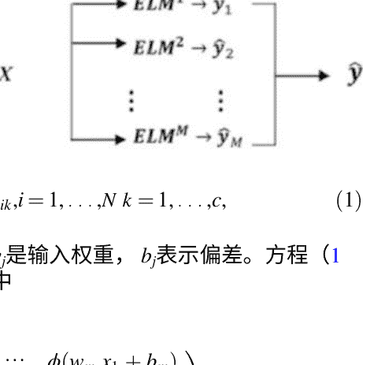

分类器`C^1(X), ..., C^M(X)`是基于数据集`{(x_1, y_1), (x_2, y_2), ..., (x_n, y_n)}`构建的。每个分类器提供一个输出`\hat{y}_M`，这些输出将被合并成最终的输出`\hat{y}`。

### 2.2.2 Bagging

Bagging (bootstrap aggregating的缩写) 是最初的集成技术之一 (Breiman, 1996)。它之所以受欢迎，是因为它直观简单，易于实现，并具有显著的性能。Bagging生成必要的差异性，以创建操作训练集的集成过程。在这方面，训练集样本被随机重采样，以生成多个不同的样本袋。因此，每个样本袋代表一组训练样本。最后，基分类器被应用于每个样本袋，并通过基分类器结果的多数投票进行分类。

Bagging技术通过减少方差的同时保持稳定或略微增加偏差，从而提高了泛化性能 (Grandvalet, 2004)。Bagging算法可以表示如下：给定数据集`{(x_1, y_1), (x_2, y_2), ..., (x_n, y_n)}`

1.  对于`i = 1, 2, ..., I`，重复以下步骤

    (a) 通过从数据集`{(x_1, y_1), (x_2, y_2), ..., (x_n, y_n)}`中有放回地随机选择`n`次，构建一个自助样本。

    (b) 适应对应的引导样本的引导分类器`C_i`。

2.  计算最终分类器的输出：

$$C(x) = I^{-1} \sum_{i} C_i(x).$$

### 2.2.3 提升

与装袋技术不同，提升技术将不准确和相对较弱的规则结合起来，产生高度准确的预测。也就是说，它逐渐给予之前生成的分类器错误分类的观测更多的权重，以生成新的分类器，然后将不同迭代的分类器以加权投票的方式组合起来进行最终预测。

由于提出了许多提升算法，我们使用Adaboost算法 (Freund & Schapire, 1996)，它是应用于模式识别的最流行的提升技术之一 (Verikas等, 2010)。Adaboost算法可以描述如下：

给定数据集`{(\boldsymbol{x}_1, y_1), (\boldsymbol{x}_2, y_2), \ldots, (\boldsymbol{x}_n, y_n)}`。

1.  初始化训练集的权重向量：

    `W_1(i) = 1/_N` for `i = 1, \ldots, N. \tag{5}`

2.  对于`t = 1, \ldots, T`，

    (a) 在加权训练样本上训练弱分类器`C_t`。

    (b) 计算`C_t`的加权错误之和：

    `\varepsilon_t = \sum_{i=1}^{N} W_i^t, Y_i \neq C_t \left( X_i \right). \tag{6}`

    (c) 选择`\alpha_t = \frac{1}{2} \ln \left( \frac{1 - \varepsilon_t}{\varepsilon_t} \right). \tag{7}`

    (d) 更新权重：

    `W_i^{t+1} = \frac{W_i^t \exp \left( -\alpha_t Y_i C_t \left( X_i \right) \right)}{Z_t}, \tag{8}`

    其中`Z_t`是一个归一化因子。

3.  输出：

    `f(x) = sign \left( \sum_{t=1}^{T} \alpha_t C_t \left( x \right) \right). \tag{9}`

### 2.2.4 随机子空间

随机子空间 (Ho, 1998) 的集成过程基于特征空间的修改。也就是说，它通过随机选择初始特征集合中的特征来创建不同的训练样本包。训练集`\boldsymbol{X} = (\boldsymbol{X}_1, \boldsymbol{X}_2, \ldots, \boldsymbol{X}_n)`中的训练样本`\boldsymbol{X}_i \, (i = 1, \ldots, n)`是一个`p`-维向量`\boldsymbol{X}_i = (x_{i1}, x_{i2}, \ldots, x_{ip})`，其中`p`表示特征的组成部分。

在随机子空间中，从原始的p维特征空间中随机选择k维子空间，`k < p`。新的学习样本`\boldsymbol{X}^b = \boldsymbol{X}_1^b, \boldsymbol{X}_2^b, \ldots, \boldsymbol{X}_n^b`在一个k维子空间中，`\boldsymbol{X}_{bi} = \boldsymbol{x}_{bi_1}, \boldsymbol{x}_{bi_2}, \ldots, \boldsymbol{x}_{bin}`，

其中，`x_{b(ij)} (j = 1, ..., r )`，然后在随机子空间`\boldsymbol{X}^b`中，使用多数投票将分类器组合起来创建最终的决策规则。因此，随机子空间可以按以下方式组织：

1.  重复`b`次，其中`b = 1, 2, ..., B`

    (a) 在初始的`p`-维特征空间`\boldsymbol{X}`中随机选择一个`k`-维子空间`\boldsymbol{X}^b`。

    (b) 使用样本`\boldsymbol{X}^b`设计一个分类器`C^b(x)`。

2.  将`C^b(x)`分类器的预测结果通过多数投票的方式组合成最终的决策规则。

$$Prev(x) = \underset{y \in \{ - 1, 1 \}}{\text{argmax}} \sum_{b=1}^{B} \delta_{sgn(C^{b}(x))y} \quad (10)$$

## 3 实验设计

### 3.1 数据

我们的实证研究使用了来自Bureau Van Dijk的Diane数据库中的非上市法国公司。根据法国法律，法国公司必须向法国商业法院提交年度报告，并向Bureau Van Dijk机构提供会计和收入报表。我们从2016年至2018年的各个行业（不包括金融公司）中抽取了公司，以便在实际情况下检验模型创建良好预测规则的能力。

Diane数据库提供了关于企业是否失败或保持健康的信息；在失败的情况下，它还提供了日期。如果企业被清算或重组，就被认为是失败的企业；而在研究期间至少持续一年的企业被认为是未失败的企业。我们决定在选择未失败企业时保守一些，以避免包括可能突然失败的健康企业，并确保可靠的样本不失败。

此外，那些财务报表中存在缺失值或异常值的企业被排除在外，以确保预测模型的稳定性。因此，收集到的数据集由3000个失败企业和3000个未失败企业组成。¹

> ¹ 企业失败在现实世界中是一个罕见的现象，因此失败企业明显少于未失败企业。这就是为什么样本选择过程成为一个重要的范例。如果基于实际人口设计模型，数据集必然不平衡。然而，这种方法有一个主要缺点：由于整个样本中失败企业的比例较低，很可能导致预测性能的显著降低（López等，2013；Shajalal等，2021）。因此，我们采用匹配对技术（Ciampi，2015），根据行业部门、规模和企业年龄将失败企业与未失败企业进行配对，收集了一个分层样本。

为了减小可能影响模型预测性能的偏差效应和样本变异性，我们采用了十折交叉验证方法，将数据集分为十个不同的训练集和测试集，以便学习和评估模型的预测能力。这个过程重复了十次，以确保我们结果的可靠性。因此，最终的预测性能是根据100次测试结果的平均值计算得出的。

### 3.2 变量

财务维度描述了企业失败的主要解释因素。因此，我们使用所收集公司的资产负债表和利润表来计算30个财务比率作为解释变量。这个表示层很重要，因为它保证了我们使用的变量实际上代表了现象的各个方面。

我们计算的初始财务比率集合包括至少四个指标，代表六个类别：流动性、偿债能力、盈利能力、财务结构、周转率和活动性。这些变量在表1中呈现。

然而，使用所有财务比率可能导致非常高维的特征空间，这可能会降低模型的预测能力。因此，进行了变量选择过程，以选择一组最相关的财务比率的子集。根据Kainulainen等人（2011）的研究，进行了前馈变量选择过程，以保留预测所需的信息。

### 3.3 评估指标

我们实验的评估标准采用了预测领域（Shahriare等人，2021）中建立的标准度量。这些度量包括平均准确率、类型I错误和类型II错误。下面给出了这些度量的公式，并结合表2中的混淆矩阵进行解释。

准确率 = \frac{TP + TN}{TP + FP + FN + TN}，

类型I错误 = \frac{TP}{TP + FN}，

类型II错误 = \frac{TN}{TN + FP}。

除了这些评估指标外，我们还使用接收器操作特征曲线下的面积（AUC）来估计模型性能。这是一个用于表示模型性能在改变截断值时的图形绘制。

## 表1 初始变量集

| 盈利能力 | 流动性 |
|----------|--------|
| X1 税前利润/股东资金 | X16 现金/总资产 |
| X2 净利润/股东资金 | X17 流动资产/流动负债 |
| X3 EBITDA/总资产 | X18 流动资产/总债务 |
| X4 EBIT/总资产 | X19 快速资产/总资产 |
| X5 净利润/总资产 | X20 (现金+市场证券)/总销售额 |
| **财务结构** | **周转率** |
| X6 股东资金/总资产 | X21 存货/总销售额 |
| X7 总债务/股东资金 | X22 净营运资金/总销售额 |
| X8 总债务/总资产 | X23 应收账款/总销售额 |
| X9 净营运资金/总资产 | X24 应付账款/总销售额 |
| X10 长期债务/总资产 | X25 流动资产/总销售额 |
| **偿债能力** | **活动能力** |
| X11 财务费用/总销售额 | X26 现金流量/总销售额 |
| X12 劳动力成本/总销售额 | X27 总销售额/总资产 |
| X13 财务债务/股权 | X28 附加值/总销售额 |
| X14 财务费用/EBITDA | X29 净收入/附加值 |
| X15 财务费用/净收入 | X30 EBITDA/总销售额 |

EBIT，利润前利息和税收；EBITDA，利润前利息、税收、折旧和摊销

## 表2 企业破产预测的混淆矩阵

| 预测\实际 | 失败 | 健康 |
|-----------|------|------|
| 失败 | 真正的正例 (TP) | 错误的正例 (FP) |
| 健康 | 错误的负例 (FN) | 真正的负例 (TN) |

在这种情况下，真正例和假正例的比例被绘制在曲线的x轴和y轴上。AUC已经成为企业失效预测中广泛使用的评估指标，因为它对误分类成本矩阵不敏感，可以评估模型的区分能力。总之，可以根据ROC曲线性能的差异轻松比较两个分类器。分类器应尽量靠近左上角，其值将接近1。分类器应尽量靠近左上角，其值将接近1。

使用上述数据集，进行了十折交叉验证循环（重复十次），以估计平均评估指标。为了比较分类器的性能，Demšar (2006)建议将一个失败的项目预测为健康时，会导致资本损失，而将一个健康的项目预测为失败时，只会导致商业交易的损失。这就是为什么将一个失败的项目错误分类被认为更加昂贵。

Wilcoxon符号秩检验是一种非参数检验方法，因为它只假设有限的可比性，并可应用于预测准确性、错误分类或任何其他评估指标。 它的表达式如下：

给定 $R^+$ 为第二个分类器优于第一个分类器时的秩和， $R^-$ 为相反情况下的秩和，而 $d_i =0$ 的秩均匀分配在这两个和之间：

$$R^+ = \sum_{d_i > 0} \mathrm{rank}(d_i) + \frac{1}{2} \sum_{d_i = 0} \mathrm{rank}(d_i), \qquad\qquad (14)$$

$$R^- = \sum_{d_i < 0} \mathrm{rank}(d_i) + \frac{1}{2} \sum_{d_i = 0} \mathrm{rank}(d_i). \qquad\qquad (15)$$

设 $T$ 为较小的和， $T =\min (R^+, R^-)$ ，可以使用正态近似，并使用以下统计量计算 $z$ 统计量和相应的 $p$ 值：

$$z = \frac{T - \frac{n(n+1)}{4}}{\sqrt{\frac{n(n+1)(2n+1)}{24}}} . \qquad\qquad (16)$$

然而，Garcia和Herrera（2008）警告说，我们进行的多次重复配对比较测试可能导致对家族错误的控制丧失。

## 4 结果

实验分析旨在比较基于极限学习机分类器的不同集成方法的预测能力。表3显示了评估指标以评估方法的性能。 此外，表4补充了表3，突出了方法之间的差异是否具有统计学意义。

我们首先分析方法的整体性能。 Boosting ELM和Bagging ELM实现了最佳的平均准确率值，分别为82.2%和82.6%， 而Random subspace ELM实现了81.7%的平均准确率值，Multiple ELM实现了81.4%的平均准确率值。所有集成方法的准确率都高于单一ELM（平均准确率为80.4%）。 因此，可以确认集成ELM方法相比单一ELM具有更强的预测能力。

附录1显示了使用ELM和ELM-ensemble方法对数据库进行的结果。 图2和图3显示了不同隐藏节点数量的测试结果以及ELM-ensemble方法的平均分类错误作为集成成员数量的函数。

## 表3 不同ELM集成方法的性能

| 方法 | 准确率 | 类型-I错误 | 类型-II错误 | AUC |
| --- | --- | --- | --- | --- |
| ELM | 80.4% | 21.7% | 17.5% | 0.821 |
| 多个ELM | 81.4% | 20.3% | 16.7% | 0.834 |
| 装袋ELM | 82.6% | 18.2% | 16.5% | 0.849 |
| 提升ELM | 82.2% | 18.8% | 16.8% | 0.842 |
| 随机子空间ELM | 81.7% | 20.0% | 16.6% | 0.836 |

## 表4 方法和评估指标的差异检验的显著性水平

| 评估指标 | 方法 | 多个ELM | 装袋ELM | 提升ELM | 随机子空间ELM |
| --- | --- | --- | --- | --- | --- |
| 准确率 | ELM | 0.0866* | 0.0001*** | 0.0012*** | 0.0338** |
| 准确率 | 多个ELM |  | 0.0463** | 0.0971* | 0.3372 |
| 准确率 | 装袋ELM |  |  | 0.2908 | 0.985* |
| 准确率 | 提升ELM |  |  |  | 0.2883 |
| 类型-I错误 | ELM | 0.0976* | 0.0001*** | 0.0001*** | 0.0652* |
| 类型-I错误 | 多个ELM |  | 0.0179** | 0.0751* | 0.7871 |
| 类型-I错误 | 装袋ELM |  |  | 0.5584 | 0.0386** |
| 类型-I错误 | 提升ELM |  |  |  | 0.182 |
| 类型-II错误 | ELM | 0.4275 | 0.0987* | 0.4752 | 0.1255 |
| 类型-II错误 | 多个ELM |  | 0.7213 | 0.6531 | 0.6466 |
| 类型-II错误 | 装袋ELM |  |  | 0.7889 | 0.6777 |
| 类型-II错误 | 提升ELM |  |  |  | 0.5133 |
| AUC | ELM | 0.0610* | 0.0001*** | 0.0001*** | 0.0462** |
| AUC | 多个ELM |  | 0.0133** | 0.1170 | 0.8674 |
| AUC | 装袋ELM |  |  | 0.2891 | 0.0811* |
| AUC | 提升ELM |  |  |  | 0.3746 |

*显著性水平为10%； **显著性水平为5%； ***显著性水平为1%

分类。 Bagging和Boosting集成导致泛化误差最小的事实并不完全令人惊讶，因为它们对过拟合具有很好的鲁棒性（Xiao等，2013；González等，2020）。 相反，类似Multiple ensemble和Random Subspace的参数变化可以产生更大的多样性（Bi，2012）。 然而，不同多样性所感知到的信息并不能提供一致的指导，以使集成分类器能够获得良好的泛化能力。 总的来说，Boosting和Bagging的关键在于它们构建了一组多样性的分类器，并且它们从多样性和准确性之间的平衡中获益，这是集成分类器性能的重要决定因素。

其次，我们发现集成方法中没有统一的改进。如果分析误分类错误，`Boosting ELM`和`Bagging ELM`在这里同样，对于失败的企业，`Boosting ELM`和`Bagging ELM`导致较低的误分类错误，分别为18.8%和18.2%，与`ELM`相比，在1%的阈值下显著。相反，我们观察不到任何集成方法在非失败的企业中的显著差异；相反，均值类型II错误范围从16.5%到18.8%的`Bagging ELM`和`Random Subspace ELM`。

最后，基于`Bagging`和`Boosting`的`ELM`方法导致比其他集成方法更高的`AUC`值，这与先前的结果一致。特别是，`Bagging ELM`似乎是最优的集成方法，因为其结果明显优于其他集成方法，但相对于`Boosting ELM`而言。总的来说，`Bagging`和`Boosting`方法相对于其他集成方法具有更好的预测能力，正如先前观察到的那样，这是因为它们能够更好地识别失败的企业。`Bagging ELM`的优越性在于为每个集成成员创建一个独特的训练集，因为在学习集中引入的扰动会导致预测结果发生显著变化。由于模型对大多数复制观测的预测是有序的，基于`Bagging`的`ELM`可以转化为一个几乎最优的预测器，特别是对于失败的企业。此外，提升`ELM`更好地识别失败的企业的一个主要原因可能是新的分类器生成更加重视被错误分类的观测值，主要是失败的企业。也就是说，先前生成的分类器错误分类的实例的可能性增加，而分类器集合逐渐变得更加多样化。这种趋势解释了为什么这种方法在不危及多数类准确性的情况下提供了较高的少数类准确性。

### 4.1 进一步验证

为了进一步评估集成极限学习机在企业失效预测任务中的有效性，收集了一个新的数据集。一般来说，没有普遍接受的企业失效定义；破产，即更严重的失效形式，通常被使用。将破产作为失效的定义的流行程度基于两个概念：一方面，它提供了一个客观的标准来区分失败和非失败的企业，另一方面，失败的时刻可以在企业进入破产程序时确定。

因此，破产概念为获得一个明确定义的二分法或至少一个企业失效的表示提供了一个区分标准，可以在方法上应用。然而，许多研究（Sun et al., 2014; Brédart et al., 2021）认为企业失效始于企业遭遇财务困境的时候。也就是说，当企业遇到财务困难或无法履行其义务时。因此，我们收集了一个数据集，将财务困境视为企业失效的定义。我们考虑了`Balcaen`等人（2011）提供的标准，将财务困境定义为连续负利润的企业。连续两年的税收。因此，收集的数据集由2500个失败和2500个非失败的企业组成。表5和表6中呈现的结果与先前的结果一致。`Boosting ELM`和`Bagging ELM`在减少类型-I错误方面的有效性使其达到了最高的准确性值，尤其是设计预测方法时，遵循了第3.2节中使用的相同过程。然后，它们基于10折交叉验证和使用上述评估指标进行评估。

表5 不同预测方法的性能

| 方法 | 准确率 | 类型-I错误 | 类型-II错误 | AUC |
|------|--------|------------|-------------|------|
| `ELM` | 78.2% | 24.7% | 18.9% | 0.790 |
| 多个`ELM` | 79.5% | 23.0% | 18.0% | 0.804 |
| 装袋`ELM` | 81.1% | 20.7% | 17.1% | 0.824 |
| 提升`ELM` | 80.5% | 21.4% | 17.6% | 0.812 |
| 随机子空间`ELM` | 80.0% | 22.1% | 17.9% | 0.808 |

表6 方法和评估指标之间差异的显著性水平

准确率

| | 多个`ELM` | 装袋`ELM` | 提升`ELM` | 随机子空间`ELM` |
|---|---|---|---|---|
| `ELM` | 0.0753* | 0.0001*** | 0.0032** | 0.0217** |
| 多个`ELM` | | 0.0265** | 0.1333 | 0.2766 |
| 装袋`ELM` | | | 0.1267 | 0.0836* |
| 提升`ELM` | | | | 0.3045 |

类型-I错误

| | 多个`ELM` | 装袋`ELM` | 提升`ELM` | 随机子空间`ELM` |
|---|---|---|---|---|
| `ELM` | 0.0592* | 0.0001*** | 0.0001*** | 0.0154** |
| 多个`ELM` | | 0.0144** | 0.0869* | 0.1936 |
| 装袋`ELM` | | | 0.1709 | 0.0935* |
| 提升`ELM` | | | | 0.2423 |

类型-II错误

| | 多个`ELM` | 装袋`ELM` | 提升`ELM` | 随机子空间`ELM` |
|---|---|---|---|---|
| `ELM` | 0.2611 | 0.0348** | 0.0107 | 0.2414 |
| 多个`ELM` | | 0.2560 | 0.3987 | 0.5612 |
| 装袋`ELM` | | | 0.6214 | 0.3521 |
| 提升`ELM` | | | | 0.3951 |

`AUC`

| | 多个`ELM` | 装袋`ELM` | 提升`ELM` | 随机子空间`ELM` |
|---|---|---|---|---|
| `ELM` | 0.0509* | 0.0001*** | 0.0028*** | 0.0131** |
| 多个`ELM` | | 0.0106** | 0.1635 | 0.5145 |
| 装袋`ELM` | | | 0.0958* | 0.0439** |
| 提升`ELM` | | | | 0.3153 |

*显著性水平为10%；**显著性水平为5%；***显著性水平为1%

单个`ELM`的预测性能在这个数据集中较之前的数据集要差。因此，在企业刚刚经历财务困境的初期阶段，区分失败的企业和健康的企业更加困难。文献记录表明，即使企业的财务状况类似于破产状况（`Iftikhar`等，2021），它们也表现出一定的韧性。相反，看起来完全正常的企业可能会突然失败。因此，无法确定财务困境的回声是否会导致企业失败，这使得捕捉可能增强模型准确性的可区分因素变得困难。这就是为什么当企业失败被表示为财务困境时，模型的性能较低，而当它被定义为破产时，模型的性能较高。

## 5 结论

在这项研究中，我们提出了评估几种集成方法应用于企业破产预测的方法，以提高`ELM`的分类性能。将个体模型的预测组合起来的集成策略比依赖单个模型的预测能力更加基于性能。我们的结果表明，基于极限学习机的集成模型比“最佳个体”`ELM`模型在两个真实财务数据集上更准确和稳健。特别是，本研究中使用的集成方法平均增加了单个`ELM`的分类准确率，分别为破产数据和财务困境数据增加了1.6和2.1个百分点。这种预测性能的提高可能看起来很温和，但读者需要理解，财务机构和银行可以通过能够提高预测能力2%的决策技术节省大量有限的财务资源。

由于`Bagging ELM`和`Boosting ELM`给出了类似的结果–有证据表明使用`ELM`进行企业失败预测时，`Bagging`策略更有效–对于哪种方法更优的设计建议是困难的。然而，我们注意到这两种方法都是通过使用不同的训练集多次调用基学习器来操作的，在集成`ELM`预测方法中最有效。我们还注意到，袋装`ELM`在计算上更加高效，因为它只需要40–50个集成成员，而提升集成则需要60–70个成员。

致谢我们衷心感谢`Abedin`教授和`Hajek`教授的帮助。

附录2以图形方式显示了不同隐藏节点的测试结果（图4）以及`ELM-ensemble`方法的平均分类错误作为集成成员数量的函数（图5）。

## 附录

### 附录 1

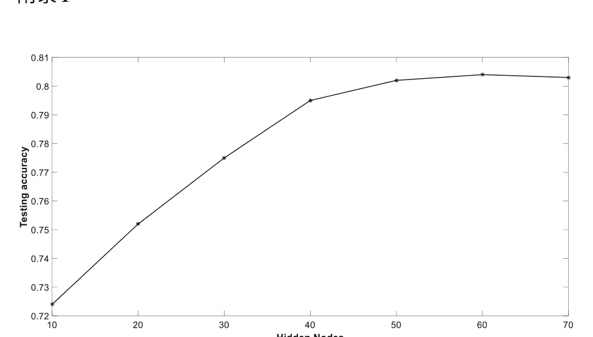

图2 使用`ELM`进行破产数据的不同隐藏节点的测试结果

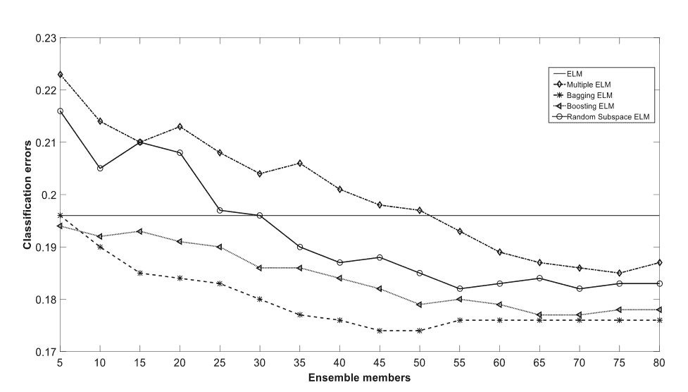

图3 使用集成`ELM`方法的平均分类错误率，由集成成员对破产数据进行分类

### 附录2

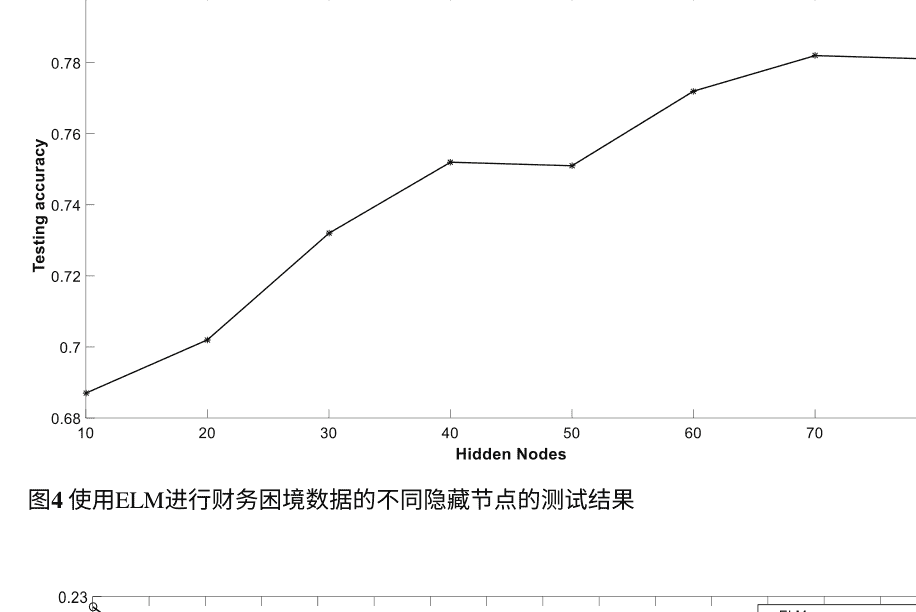

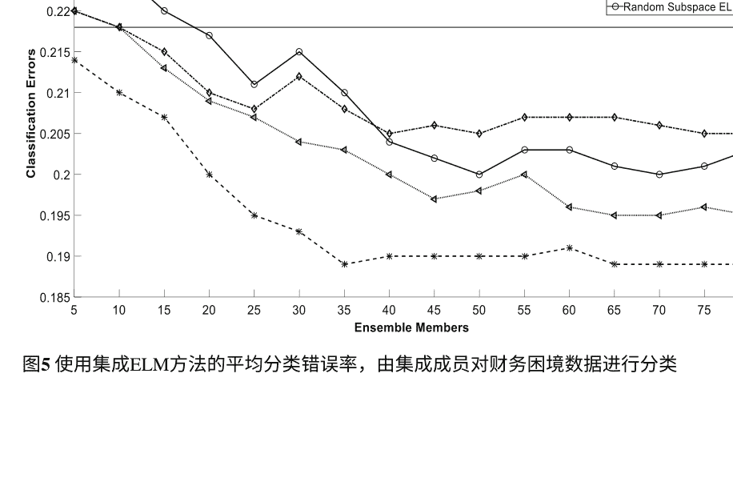

## 参考文献

`Abedin`, M. Z., `Chi`, G., `Colombage`, S., & `Moula`, F. E. (2018). 使用支持向量机和概率神经网络进行信用违约预测。信用风险杂志, 14(2), 1–27.

`Abedin`, M. Z., `Hassan`, M. K., `Petr`, H., & `Uddin`, M. M. (2021). 机器学习在金融和会计中的应用。在金融和会计中的机器学习基本原理, `Taylor & Francis`.

`Abedin`, M. Z., `Chi`, G., `Hajek`, P., & `Tong`, Z. (2022). 将加权`SMOTE`与集成学习相结合，预测小企业信用风险。复杂智能系统。 https://doi.org/10.1007/s40747-021-00614-4

Akusok, A., Veganzones, D., Miche, Y., Björk, K. M., Du Jardin, P., Severin, E., & Lendasse, A. (2015). MD-ELM: 使用OP-ELM模型进行原始错误标记样本检测。Neurocomputing, 159, 242–250.

Altman, E. I. (1968). 财务比率、判别分析和公司破产预测。金融学杂志, 23(4), 589–609.

Balcaen, S., Manigart, S., & Ooghe, H. (2011). 从困境到退出: 退出时间的决定因素。进化经济学杂志, 21, 407–446.

Beaver, W. H. (1966). 财务比率作为失败预测指标。会计研究杂志, 4, 71–111.

Bi, Y. (2012). 多样性对证据分类器集成准确性的影响。近似推理国际期刊, 53(4), 584–607.

Brédart, X., Séverin, E., & Veganzones, D. (2021). 人力资源和企业失败预测建模: 比利时的证据。预测杂志, 40(7), 1325–1341.

Breiman, L. (1996). Bagging预测器。机器学习, 24(2), 123–140.

Ciampi, F. (2015). 公司治理特征和小企业违约预测建模: 意大利企业的实证分析。商业研究杂志, 68(5), 1012–1025.

Demšar, J. (2006). 多个数据集上分类器的统计比较。机器学习研究杂志, 7, 1–30.

Freund, Y., & Schapire, R. E. (1996). 使用新的增强算法进行实验。在第十三届国际机器学习大会上(第148–156页). IEEE.

Garcia, S., & Herrera, F. (2008). 对于所有两两比较的“分类器统计比较的扩展”。机器学习研究杂志, 9(12), 2677–2694.

González, S., García, S., Del Ser, J., Rokach, L., & Herrera, F. (2020). 基于装袋和增强的机器学习集成的实用教程: 算法, 软件工具, 性能研究, 实际视角和机会。信息融合, 64, 205–237.

Grandvalet, Y. (2004). 装袋均衡影响。机器学习, 55(3), 251–270.

Ho, T. K. (1998). 用于构建决策森林的随机子空间方法。IEEE模式分析与机器智能交易, 20(8), 832–844.

Huang, G. B., Zhu, Q. Y., & Siew, C. K. (2006a). 极限学习机: 理论和应用。神经计算, 70(1), 489–501.

Huang, G. B., Chen, L., & Siew, C. K. (2006b). 使用增量构建前馈网络和随机隐藏节点的通用逼近。IEEE神经网络交易, 17(4), 879–892.

Iftikhar, A., Purvis, L., & Giannoccaro, I. (2021). 关于韧性前因和结果的元分析综述。商业研究杂志, 135, 408–425.

Kainulainen, L., Miche, Y., Erola, E., Yu, Q., Frénay, B., Séverin, E., & Lendasse, A. (2011). 用于破产分析和预测的局部线性模型集合。商业、工业和政府统计案例研究, 4(2), 116–133.

Kim, M. J., & Kang, D. K. (2010). 用神经网络进行破产预测的集成模型。Expert Systems with Applications, 37(4), 3373–3379.

Kittler, J., Hatef, M., Duin, R. P. W., & Matas, J. (1998). 关于组合分类器的论文。IEEE Transactions on Pattern Analysis and Machine Intelligence, 20(3), 226–239.

Kumar, P. R., & Ravi, V. (2007). 银行和公司的破产预测：统计和智能技术综述。European Journal of Operational Research, 180(1), 1–28.

López, V., Fernández, A., García, S., Palade, V., & Herrera, F. (2013). 关于使用数据内在特征的不平衡数据分类的洞察：实证结果和当前趋势。信息科学, 250, 113–141.

Moula, F. E., Chi, G., & Abedin, M. Z. (2017). 信用违约预测建模：支持向量机的应用。风险管理, 19(2), 158–187.

Ouenniche, J., & Tone, K. (2017). 一种用于DEA的样本外评估框架，应用于破产预测。运筹学年鉴, 254(1), 235–250.

Rao, C. R., & Mitra, S. S. K. (1971). 矩阵的广义逆及其应用 (Wiley概率和数学研究系列). Wiley.

Rokach, L. (2010). 基于集成的分类器。人工智能综述, 33(1), 1–39.

Séverin, E., & Veganzones,D. (2021). 盈余管理信息能改善破产预测模型吗？运筹学年鉴, 306(1), 247–272.

Shahriare S, Khair A, Abedin MZ (2021年12月19–21). 预测酒店预订取消的机器学习技术在酒店业的应用分析。在ICCIT2020: 第23届国际计算机与信息技术会议, 达卡.

Shajalal, M., Abedin, M. Z., & Uddin, M. M. (2021). 处理商业领域中的类别不平衡数据。在:金融与会计中机器学习的基本原理. Taylor & Francis.

Sun, J., Li, H., Huang, Q. H., & He, K. Y. (2014). 预测财务困境和企业失败:从最新的定义、建模、抽样和特征方法进行综述。基于知识的系统, 57, 41–56.

Veganzones, D., & Severin, E. (2020). 二十一世纪的企业破产预测模型：一项综述。European Business Review, 33(2), 204–226.

Verikas, A., Kalsyte, Z., Bacauskiene, M., & Gelzinis, A. (2010). 基于混合和集成的软计算技术在破产预测中的应用：一项调查。Soft Computing, 14(9), 995–1010.

Xiao, T., Zhu, J., & Liu, T. (2013). Bagging和Boosting统计机器翻译系统。Artificial Intelligence, 195, 496–527.

Yu, Q., Miche, Y., Séverin, E., & Lendasse, A. (2014). 使用极限学习机和金融专业知识进行破产预测。Neurocomputing, 128, 296–302.

# 评估和预测小企业的信用评级：一种多准则方法

Baofeng Shi

摘要信用评级在帮助金融机构做出贷款决策和减少对中小企业的金融约束方面起着关键作用。然而，小企业使得金融机构（如商业银行）难以准确确定其信用风险，从而导致突出的贷款困难，原因是贷款的期限短、频率高、对信用的紧急需求以及贷款金额较小。为了缓解小企业融资的困难，本文结合高维属性约简方法和模糊决策方法，提出了一种评估小企业信用风险的新方法。基于中国某地区的一家地方商业银行的687家小企业，我们发现17个指标对小企业的违约风险有显著影响。然后，它利用TOPSIS和模糊C均值对申请贷款的企业进行信用评级。标准判别和ROC曲线双重测试结果显示，标准指标体系的预测准确率分别达到85.40%和90.09%，表明该评级体系具有较强的违约判别能力，并在商业银行和其他金融机构中具有实用性。

关键词 信用评级 · 违约风险 · 模糊C均值 · 小企业

## 1 引言

中国是世界上最大的发展中国家，中小企业发展迅速。根据统计数据，2021年中国中小企业占国家就业的80%以上，国内生产总值的60%以上（iResearch，2021年）。然而，中小企业普遍难以获得融资，尤其是贷款，严重限制了它们的发展，原因是金融信息不可靠，贷款金额巨大但金额较低，风险多样化（Lu等，2022年；Abedin等，2021年；Ciampi & Gordini，2013年；Shi等，2016年；Chi & Zhang，2017年；Ruan等，2018年；Sun等，2022年）。为了缓解这些金融困难，中国银行业监督管理委员会和其他机构要求建立一个“包容性金融业务部门”，为小微企业提供金融服务，并解决影响农业、农村地区和农民的问题，并加强对借款人的信用风险识别、监测、预警和评估（CBRC，2015年；SCPRC，2016年，2017年）。

许多学者对评估贷款企业的信用风险的最佳方法进行了有用的研究，包括信用评分、信用评级和其他系统的建立。在实施评级系统之前，通常需要对统计数据进行无量纲处理（Shi等，2015）。实际上，小企业的金融数据往往较少，更多是基于文本的非金融数据。因此，研究人员经常使用主观的德尔菲方法或层次分析法（`AHPs`）来处理无量纲数据（Liang，2007；Shi等，2018）。

关于指标体系的发展，Altman基于资产回报率和税前利润率等财务指标构建了Z分数和ZETA模型，以评估贷款人违约的概率（Altman，1968；Altman等，1977）。Gu等（2017）将（`AHP`）与数据包络分析（`DEA`）相结合，从财务状况、企业发展、信用状况和互联网金融状况的角度，使用现金比率、存货周转率和应收账款周转率等指标来预测贷款企业的违约情况。这项研究对于为小企业创建信用评级指标体系具有很大的参考价值，但其中很少研究批发和零售企业，并使用独特的违约变量来预测贷款客户的信用前景。

信用评分模型可以使用三种方法构建：气象统计学、模糊系统和人工智能。气象统计学包括判别分析、逻辑回归和线性回归（Reichert等，1983年；Yurdakul和Iç，2015年；Iç和Yurdakul，2010年）。人工智能方法包括人工神经网络（Marcano-Cedeño等，2011年；Rui和Mendes，2017年；Chi等，2017年）、支持向量机（Hens和Tiwari，2012年；Harris，2015年；Tomczak和Zięba，2015年；Abedin等，2018年；2019a，b）、决策树（Zhu和Hu，2013年；Florez-Lopez和Ramon-Jeronimo，2015年；Bahnsen等，2015年；Zhang等，2017年；Chern等，2021年）、集成学习（Abedin等，2022年）等等。最近，一些学者将这些方法与模糊评估相结合，并随后开发了信用评级系统。Akkoç（2012年）结合了模糊评估和人工智能，使用混合自适应神经模糊推理系统开发了一种预测土耳其信用卡持有人违约风险的信用评级系统。经验研究表明，该模型在正确平均分类和错误估计分类成本方面表现更好。

判别分析、逻辑回归和人工神经网络。Bai等人（2019年）使用模糊C均值（`FCM`）和模糊粗糙集在混合模型中计算农业贷款人的违约风险。本研究揭示了贷款违约的决定因素，而不对其信用进行分级或在评估结果中包含任何决策函数。

为了解决这个问题，一些学者已经开始将贷款客户的信用评级分为三个信用评级模型：客户信用评分区间、设定违约概率的阈值和贷款客户的违约损失（`LGD`）。中国工商银行（`ICBC`）（2005年）将其贷款客户的信用评分分为10个信用评级，包括`AA`、`AA-`等。Florez-Lopez（2007年）使用统计和人工智能方法估计贷款申请人的违约概率（`PD`），并将申请人分为五个评级类别。Chi和Zhang（2017年）采用非参数模型构建了一个专门为小企业设计的信用评级系统。他们根据其`LGD`评估贷款客户的信用评级。因此，基于客户信用评分区间的信用评级模型与基于违约概率阈值的模型给出不同的结果，因此不同的贷款审批人员可能对具有这些信用评分的贷款客户给出不同的信用评级结果。原因是评分区间和违约概率阈值是提前给定的，这增加了评级的主观性。关于基于`LGD`的信用评级方法，前提是必须了解每个客户的违约损失。然而，对于一些最近才申请贷款的小企业来说，违约损失数据是不可用的，这使得这种评级方法不可行。

通过我们的文献综述，我们发现没有现有的研究有适合的评级指标系统来衡量基于小型批发和零售企业贷款特征的信用风险。事实上，小企业之间的行业差异导致了他们在贷款和信用风险估计上的明显异质性。例如，商业银行对房地产开发和运营的小企业给予的贷款的平均最大值高达1700万元人民币（约合250万美元），而对批发和零售的小企业只有41万元人民币（大连银行，2014年）。在同一信用风险系统中比较这两种类型的公司，即使违约模型的误报率非常低，银行也会遭受完全不同的损失。因此，针对不同行业的小企业，需要不同的信用评级模型，以区分它们的信用风险与其他类型企业的风险。

鉴于前述，本文对文献做出了三个贡献。首先，在信用评级类别中，它通过关注中国小型批发和零售企业，为文献增添了内容。其次，通过为小型批发和零售企业建立适当的信用评级模型，它为商业银行、小额信贷机构和这些企业提供了决策参考。第三，我们提出了一种使用三角模糊数对小型批发和零售企业的非金融数据进行信用评分测量的过程。

这有助于避免由专家评分引起的主观性和随机性，并使定量处理的定性指标更加准确。本文的组织结构如下。第2节介绍了小型企业的信用评级模型。第3节基于中国城市商业银行向687家寻求贷款的小型批发和零售企业的信用数据构建了评级系统。第4节提供了我们的主要结论，并列举了本文的创新方面。

## 2 方法论

首先，我们根据小批发和零售贷款的特点建立了一个评估系统。其次，我们使用`TOPSIS`方法根据熵权重计算得到信用评分。最后，我们使用模糊C均值方法评估贷款客户的信用等级。该框架如图1所示。

### 2.1 信用评级系统的建立

建立这个信用评级系统分为两个步骤。首先，必须对初始数据进行标准化，以消除不同测量方法之间的不兼容性。其次，将概率回归和偏相关分析相结合，创建定量筛选以减少指标数量。

#### 指标数据的预处理

##### 1.定性指标的预处理

定性指标不能直接量化，而是通过描述来表达。例如，教育背景指标有五个可能的取值：“小学毕业证书”，“初中毕业证书”，“高中毕业证书”，“大专毕业证书”和“本科及以上学位”。定性指标与三角模糊数在处理具有多样性特征的数据方面具有类似的优势。为了量化定性指标，必须根据其语义将其转化为三角模糊数，然后使用去模糊化方法将三角模糊数转化为固定值。

设`A`为模糊集合，对于`x∈U`，如果`μA(x)∈[0, 1]`，则`μ(x)`表示`x`属于`U`的隶属度，`μA`表示`x`的隶属函数。此外，设`l`和`u`分别为模糊数的下限和上限，设`m`为中值，那么模糊数`(l,m,u)`如图所示。其隶属函数`μA`如公式(1)所示(Promentilla et al., 2008)。通常使用三个、五个和七个三角模糊数(Cheng et al., 2008; Khalili-Damghani et al., 2013; Wang et al., 2016)，如图3、4和5所示(Chai et al., 2019)。

###### 第一部分：建立信用评级指标体系

步骤1：指标数据预处理

-   - 大规模选择指标集

-   - 将定性指标转化为定量指标（三角模糊数）

-   - 标准化评估指标（去模糊化）

步骤2：偏相关分析

> `|r_ij| < 0.7`

计算指标的`F`值并删除`F`值最小的指标

基于偏相关分析的第一轮筛选：选择`F`值较大的两个指标中的一个，使得`r_ij`大于0.7，确保指标体系不会反映重复信息

步骤3：`Probit`回归（定量筛选）

-   - 建立默认状态`Y`和评估指标`X`的`Probit`回归方程

-   - 计算每个回归的`LR`值和`Sig`值

> 每个指标的显著概率`sig < 0.01`

删除指标其中`sig`值最大

基于`Probit`回归的第二轮筛选：确定保所选指标能够有效区分违约和非违约的小批发和零售企业

小批发和零售企业的信用评级指标体系

###### 第二部分：计算客户的信用评分

-   - 使用熵权法计算指标的权重

-   - 采用`TOPSIS`方法计算小型批发和零售企业的信用评分

###### 第三部分：划分客户的信用等级

使用`FCM`算法对客户的信用等级进行分类

### 图1信用评级模型框架

图2三角模糊数（`TFNs`）

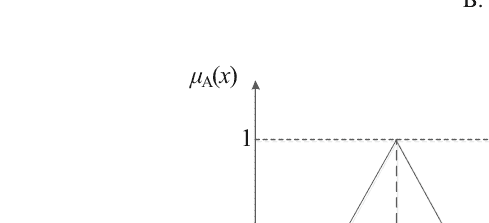

图3具有三个分类的`TFNs`

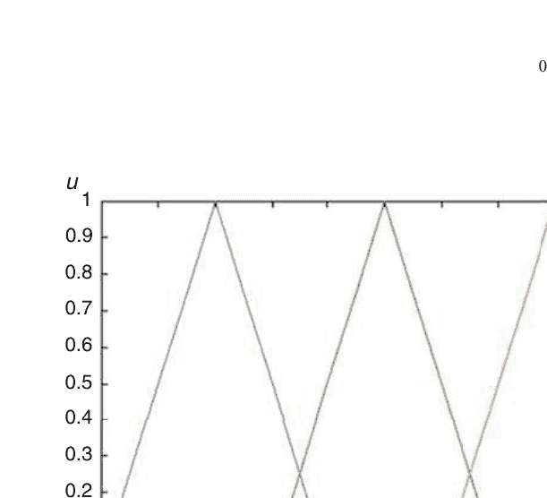

图4具有五个分类的`TFNs`

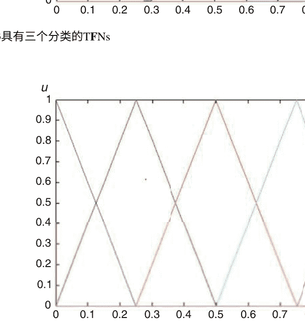

## 2.定量指标的预处理

定量指标通常包括四种类型的指标，即正向指标、负向指标、区间指标和调节指标。我们可以使用最大-最小标准化方法对指标进行标准化处理 (Chi & Zhang, 2017; Shi et al., 2018; Abedin et al., 2019a, b) ；为避免重复，此处不再详述。

##### 属性的降维

1.  基于偏相关分析的第一指标筛选

    在相同标准层中，使用偏相关分析（`PCA`）来去除冗余指标。设`$x_{ij}$`为企业`$j$`的指标`$i$`的值，`$r_{ik}$`为指标`$i$`和`$k$`之间的相关系数，则`$r_{ik}$`定义如下:

    $$

    r_{ik} = \frac{\sum_{j=1}^{n}(x_{ij}-\bar{x}_i)(x_{ij}-\bar{x}_k)}{\sqrt{\sum_{j=1}^{n}(x_{ij}-\bar{x}_i)^2}\sqrt{\sum_{j=1}^{n}(x_{ij}-\bar{x}_k)^2}}

    $$

    (3)

其中，$n$是企业数量，$\bar{x}_i$是指标$i$的平均值。假设 $R$是由 $r_{ik}$组成的相关矩阵，$m$是准则层的变量数量。相关矩阵 $R$如下所示：

$$
R = \begin{bmatrix} r_{11} & r_{12} & \cdots & r_{1m} \\ r_{21} & r_{22} & \cdots & r_{2m} \\ \vdots & \vdots & \cdots & \vdots \\ r_{m1} & r_{m2} & \cdots & r_{mm} \end{bmatrix}.
$$

(4)

相关矩阵 $R$的逆矩阵 $C$为：

$$
C = R^{-1} = \begin{bmatrix} c_{11} & c_{12} & \cdots & c_{1m} \\ c_{21} & c_{22} & \cdots & c_{2m} \\ \vdots & \vdots & \cdots & \vdots \\ c_{m1} & c_{m2} & \cdots & c_{mm} \end{bmatrix}.
$$

(5)

然后，可以得到指标 $i$和指标 $k$的偏相关系数$r'_{ik}$。

$$
r'_{ik} = \frac{-c_{ik}}{\sqrt{c_{ii}c_{kk}}}.
$$

(6)

偏相关系数 $r'_{ik}$越大，指标 $i$和指标 $k$之间的相关性越强。当 $r'_{ik} > 0.7$ 时，使用 $F$检验（Nami & Shajari, 2018）对这两个指标进行评估。随后，移除具有较低 $F$值的指标。

## 2. 基于 $Probit$回归的第二指标筛选

在相同的标准层中，使用最大似然函数获取$m$个指标与默认值$y$之间的 $Probit$回归系数，并确定每个指标的 $LR$统计量。使用$\chi^2$，我们移除具有最大 $Sig$值但对违约情况影响最不显著的指标（$Sig >0.01$），完成第一个指标的筛选。剩下的 $m-1$个指标将以相同的方式进行筛选，直到每个指标的显著性概率不再超过$0.01$，即 $Sig \leq 0.01$。然后完成指标筛选。现在，剩下的指标都能显著区分小企业的违约情况。具体的解析方程如下。

设 $X_j = (x_{1j},x_{2j},...,x_{mj})$ 为企业 $j$的行向量； $β = (β_0, β_1, ..., β_m)^T$为指标的回归系数向量； $m$表示指标的数量； $φ(z_j)$ 是标准化正态累积分布函数，$P(Y_j=1)$ 表示违约的概率； $z_j = α + X_jβ$。那么，

$$
P(Y_j=1)=\phi(z_j)=\int_{-\infty}^{z_j}\frac{1}{\sqrt{2\pi}}e^{\left(-\frac{s^2}{2}\right)}ds.
$$

最大似然方法可用于预测 probit 模型中的指标。其对数似然函数定义如下：

$$
\max \ln L=\sum_{j=1}^{n}[y_j\ln\left(\phi(z_j)\right)+(1-y_j)\ln\left(1-\phi(z_j)\right)].
$$

在方程 (8) 中，对数似然函数LnL越大，对违约Yj的估计越准确。

假设LRk是指标 $k$的LR统计值，$σ_{βk}$是回归系数 $β_k$的标准误差，$β̃_k$是估计的参数值，$σ̂_{βk}$是估计的参数值的标准误差，$β̂_k$以及$σ̂_{βk}$是独立于约束条件的估计值和标准误差。那么：

$$
LR_k=-2\left[\log L\left(\tilde{\beta}_k, \tilde{\sigma}^2_{\beta k}\right)-\log L\left(\hat{\beta}_k, \hat{\sigma}^2_{\beta k}\right)\right].
$$

### 2.2 信用评分解决方案

熵权法是一种基于信息熵描述指标之间信息差异的方法，常用于评价复杂系统 (Chi & Zhang, 2017; Bai & Zhao, 2022)。在本节中，使用熵来计算评价指标权重 $W = (w_i)$; 然后使用TOPSIS方法获得信用评分 (Yurdakul & Iç, 2015; Iç& Yurdakul, 2010; Wang & Leng, 2021)。具体步骤如下：

**步骤1：获取指标的最佳和最差分数。**

假设 $b_i^+$ 和 $b_i^-$ 分别是指标$i$的最佳和最差分数，而 $b_{ij}$是企业 $j$的分数；因此

$$
b_i^+= \begin{cases} \max(b_{ij}), & \text{表示第i个正指标} \\ \min(b_{ij}), & \text{表示第i个负指标} \end{cases}.
$$

$$
b_i^-= \begin{cases} \min(b_{ij}), & \text{表示第i个正指标} \\ \max(b_{ij}), & \text{表示第i个负指标} \end{cases}.
$$

**第2步：获得标准化得分，并计算最佳得分和最差得分之间的差异。**

假设 $d^+_j$（和 $d^-_j$）是企业$j$的最佳（最差）得分与实际得分之间的差异，则

$$
d_j^+ = \sqrt{\sum_{i=1}^{m} (w_i b_{ij} - w_i b_i^+)^2}, \quad d_j^- = \sqrt{\sum_{i=1}^{m} (w_i b_{ij} - w_i b_i^-)^2} \quad (12)
$$

**步骤3：独立解决最佳分数和最差分数之间的差异以及信用分数的相对接近程度。**

假设 $c_j$是分数的相对接近程度而 $P_j$是信用分数：

$$
P_j = c_j = \frac{d_j^-}{d_j^- + d_j^+} \quad (13)
$$

**步骤4：方程（13）中的信用分数 $P_j$的范围为0到1，这与常规评分规定不一致在100的范围内。鉴于此，我们将 $P_j$标准化，使其在0到100的范围内。**

$$
S_j = \frac{P_j - \min(P_j)}{\max(P_j) - \min(P_j)} \times 100, \quad (14)
$$

其中 $S_j$是企业 $j$的标准化信用分数。

本文采用违约区分和ROC曲线来评估系统对小企业的预测性能，具体如下：如果评级系统的信用分数满足“所有非违约小企业的信用分数高于违约小企业的信用分数”则指标系统对贷款企业违约的评估能力越强，银行等金融机构的损失越少。

与Chi和Zhang（2017）的一致，指标体系的合理性是确定的。

$$
S_c^1 = \frac{1}{m} \sum_{j=1}^{m} S_j^1, \quad (15)
$$

$$
S_c^0 = \frac{1}{n} \sum_{j=1}^{n} S_j^0, \quad (16)
$$

$$
s_c = \frac{\frac{1}{m} \sum_{j=1}^{m} S_j^1 + \frac{1}{n} \sum_{j=1}^{n} S_j^0}{2}, \quad (17)
$$

其中 $S_c^0$和 $S_c^1$分别表示非违约和违约样本的信用评分的平均值， $S_c =(S_c^1 + S_c^0)/2$。

ROC首次应用于评估信用评级的准确性（Sobehart和Keenan，2001）。首先，获取信用评级系统的敏感性和特异性。鉴于正确确定的违约样本数量（$y_j =1$)

TP（真正例）是正确确定为违约样本的数量；FN（假负例）是错误分类为非违约样本的数量；TN（真负例）是正确分类为非违约样本的数量；FP（假正例）是错误分类为违约样本的数量，可以通过以下方式计算灵敏度和特异度：

$$
\text{灵敏度} = \frac{\mathrm{TP}}{\mathrm{TP} + \mathrm{FN}}. \quad (18)
$$

$$
\text{特异度} = \frac{\mathrm{TN}}{\mathrm{FP} + \mathrm{TN}}. \quad (19)
$$

然后，可以使用灵敏度和特异度绘制系统的ROC曲线。ROC曲线下的面积越大，系统识别违约样本的能力越强。

### 2.3 划分贷款客户的信用评级

与传统的聚类算法相比，模糊聚类算法不需要严格确定属于特定类别的对象，展示了灵活的属性要求。因此，它适应了初始指标信息是三角模糊函数值的特殊要求。因此，本文采用了白等人（2019）的模糊C均值（FCM）算法对小企业的信用进行评级。原理如图5所示。

FCM使用实数值 \( u_{ij} \) 将每个样本与所有聚类进行比较，范围从0到1，反映了指标 \( j \) 在类别 \( i \) 中的隶属度。FCM将 \( m \) 个向量 \( S_j(j = 1, 2, \cdots, m) \) 划分为 \( c \) 个模糊聚类，并计算每个聚类的中心，以最小化非相似性目标函数。它的目标函数 \( J(U, c_1, \cdots, c_c) \) (Yu et al., 2010) 是：

$$
J(U, c_1, \cdots, c_c) = \sum_{i=1}^{c} \sum_{j=1}^{m} (u_{ij})^n d^2(x_j, c_i), \quad (20)
$$

其中 \( d(S_j, c_i) \) 是样本 \( S_j \) 中聚类中心 \( c_i \) 的欧氏距离；\( n \in [1, \infty) \) 是加权指标，控制模糊类别中分类对象的共享程度。

其结构如下所示的目标函数 \( \bar{J}(U, c_1, c_2\cdots, c_c, \lambda_1, \cdots \lambda_m) \) (Sun et al., 2022):

$$
\bar{J}(U, c_1, c_2\cdots, c_c, \lambda_1, \cdots \lambda_m) = J(U, c_1, c_2\cdots, c_c) + \sum_{j=1}^{m} \lambda_j \left( \sum_{i=1}^{c} u_{ij} - 1 \right) = \sum_{i=1}^{c} \sum_{j=1}^{m} (u_{ij})^n d_{ij}^2 + \sum_{j=1}^{m} \lambda_j \left( \sum_{i=1}^{c} u_{ij} - 1 \right) \quad (21)
$$

在这个方程中，\( \lambda_j \) 是拉格朗日乘子；\( c_i \) 和 \( u_{ij} \) 的定义如下 (Demircan & Kahramanli, 2016):

$$
c_{i}=\frac{\sum_{j=1}^{m}\left(u_{i j}\right)^{n} S_{j}}{\sum_{j=1}^{m}\left(u_{i j}\right)^{n}} \tag{22}
$$

$$
u_{i j}=\frac{1}{\sum_{k=1}^{c}\left(\frac{d_{i j}}{d_{k j}}\right)^{\frac{2}{n-1}}} \tag{23}
$$

在这两个条件下，FCM聚类算法的基本步骤如下：

1. 给定聚类数目 `c`，满足 `1 < c <= m`，其中 `m` 为样本数目。假设 `T` 为最大迭代次数， `\varepsilon` 为阈值， `\omega` 为模糊数；指标设置迭代计数器 `t=0`。
2. 使用公式 （21） 修正划分矩阵 `U^{(t)}`。
3. 使用公式 （20） 获取新的聚类中心 `c_{c}(t)`。
4. `t <- t+1`; 重复步骤2和3直到 `t >= T` 或 `|U^{(t)}-U^{(t-1)}| <= \varepsilon`。

## 3 经验分析

### 3.1 样本选择和数据来源

本文使用中国一家商业银行的687家小型零售和批发企业的信用统计数据，验证了第2节中开发的模型。关于这687家小型批发和零售企业的信用评级指标和违约情况的详细信息如下。我们首先选择信用评级指标，使用标准普尔、穆迪和惠誉等评级机构的标准变量（Standard and Pool’s Services,2011; Fitch Ratings,2013; Dagong,2010），其次从信用评级的论文中选择（Mijid & Bernasek, 2013; Hai et al.,2013; Shi & Chi, 2014; Shi et al.,2016; Abedin et al.,2018,2019a,b; Sun et al.,2022）。即，总共选择了107个关于偿还能力和偿还意愿等方面的指标。这些指标涵盖了七个次级标准层，如金融因素、非金融因素和小型批发和零售企业法定代表人的个人情况。此外，我们剔除了26个没有统计数据的指标，剩下81个指标，如表1所示。

### 3.2 小型批发和零售企业的信用评级

1. 建立信用风险评估指标体系

    表2和表3分别显示了687家小企业的原始和标准化数据。

#### 表1 小企业信用评级指标筛选标准

| (1) 否 | (2) 第一准则级别 | (3) 第二准则级别 | (4) 第三准则级别 | (5) 指标 | (6) 类型 | (7) 筛选结果 |
| :--- | :--- | :--- | :--- | :--- | :--- | :--- |
| 1 | 偿还能力 | 财务因素 | 偿债能力 | 债务资产比 | 负面 | Probit删除 |
| ... |  |  |  | ... | ... | ... |
| 28 |  |  |  | 偿还来源 | 定性 | 不可观察 |
| ... |  |  |  | ... | ... | ... |
| 55 |  |  | 增长能力 | 收入增长 | 正面 | 通过 |
| ... |  |  |  | ... | ... | ... |
| 63 |  |  |  | 工资、福利增长率 | 正面 | 不可观察 |
| 64 |  | 外部宏观经济条件 |  | 行业情绪指数 | 正面 | 通过 |
| ... |  |  |  | ... | ... | ... |
| 72 |  |  |  | 经济环境 | 定性 | 不可观察 |
| 73 |  | 内部非金融因素 |  | 多年相关行业 | 定性 | Probit删除 |
| ... |  |  |  | ... | ... | ... |
| 86 | 偿还意愿 | 法人情况 |  | 教育背景 | 定性 | 通过 |
| ... |  |  |  | ... | ... | ... |
| 98 |  |  |  | 业主素质 | 定性 | 不可观察 |
| 99 |  | 企业信用状况 |  | 注册资本分类 | 定性 | 部分相关分析删除 |
| ... |  |  |  | ... | ... | ... |
| 103 |  | 商业信誉 |  | 税务记录 | 定性 | 部分相关分析删除 |
| 104 |  |  |  | 法律争议 | 定性 | Probit删除 |
| ... |  |  |  | ... | ... | ... |
| 106 |  |  |  | 违约次数 | 定性 | Probit删除 |
| 107 | 质押担保因素 |  |  | 抵押/质押/担保 | 定性 | Probit删除 |

#### 表3 小型零售和批发企业样本的原始数据

| (a) 编号 | (b) 准则水平 | (c) 指标 | (1) C001 | C681 | (682) C682 | (687) C687 |
|---|---|---|---|---|---|---|
| 1 | C1内部非金融因素 | ... | 8 | 10 | 8 | 10 |
| ... | ... | ... | ... | ... | ... | ... |
| 10 | C2法人情况 | ... | 初级学历 | 学士学位 | 无 | 学士学位 |
| ... | ... | ... | ... | ... | ... | ... |
| 20 | ... | X汽车价值和法定代表人的房地产分类 | 1000 | 1000 | 无 | 100 |
| 21 | C3企业信用状况 | 分类 | 发现 | 发现 | 0.917 | 0.917 |
| ... | ... | ... | ... | ... | ... | ... |
| 27 | C5经营能力容量 | 周转率 | 5.00 | 13.19 | 0 | 9.17 |
| ... | ... | ... | ... | ... | ... | ... |
| 36 | ... | X36 现金转换周期 | -3973.69 | 7.50 | 无 | 2.72 |
| 37 | ... | X管理通股股东权益回报率 | 0.078 | 0.003 | 0.000 | 0.280 |
| ... | ... | ... | ... | ... | ... | ... |
| 49 | C7增长能力 | 经营活动产生现金流入A0 | 112,458,001 | 625,800,630 | 0.000 | 26,139,847.75 |
| 50 | ... | 净利润收入增长率 | 0.000 | 0.023 | 0.00 | 1.36 |
| ... | ... | ... | ... | ... | ... | ... |
| 54 | ... | 净利润收入增长率 | 0.076 | 1.251 | 0.510 | 0.507 |

表3 标准化数据

## （一）准则层、准则水平、指标与标准化数据

| （一）准则层 | （二）准则水平 | （三）指标 | 标准化数据 |
| --- | --- | --- | --- |
| | | | 681个非违约企业 | 6个违约企业 |
| | | | `C001` | ... | `C681` | `C682` | ... | `C687` |
| 1 | `C1`内部非金融因素 | `X1`相关行业年限 | 0.917 | ... | 0.917 | 0.917 | ... | 0.083 |
| ... | ... | ... | ... | ... | ... | ... | ... | ... |
| 9 |  | `X9`企业通过银行返还的总金额占比 | 0.667 | ... | 1.000 | 0.000 | ... | 0.000 |
| ... | ... | ... | ... | ... | ... | ... | ... | ... |
| 81 | `C10`质押担保因素 | `X81`抵押/质押/担保 | 0.650 | ... | 0.000 | 0.000 | ... | 0.700 |
| 82 | —— | 违约 | 0 | ... | 0 | 1 | ... | 1 |

以`C1`企业的内部非金融因素为例，说明了部分删除相关指标的过程（见表3）。我们将表3中与“企业`C1`的内部非金融因素”相关的九个指标数据分别代入方程（3）–（6）中，计算出指标的偏相关系数`r_kj`。我们分别计算偏相关系数超过0.7的指标对的F统计量。然后删除F统计量较小的指标，保留另一个指标。结果如表4所示。剩下的工作可以按照相同的方法进行。本文利用主成分分析方法去除了14个具有冗余信息的指标。

在使用主成分分析（PCA）删除一些指标后，我们通过概率回归在所有标准层中筛选剩余指标，并选择具有合理区分能力的违约状态指标。然后，我们将通过偏相关性筛选的剩余67个指标数据放入表3的方程（7）–（9）中，并使用`Stata`进行筛选。筛选后剩余的17个指标在表5中。

## 2. 小型批发和零售企业信用评分解决方案

表5中使用熵权法计算了17个变量的权重。通过方程（10）–（13），可以轻松计算企业的信用评分。结果呈现在表6中。

然后，我们将这些企业的信用评分放入方程（14）–（16）中，并随后获得85.40%的预测准确率。模型分类的结果呈现在表7中，相应的ROC曲线呈现在图6中，ROC曲线下的面积（AUC）为0.909，表明使用筛选的17个指标可以获得小型企业违约状态的强大预测准确性。

### 表4 与“内部非金融因素”相关的偏相关删除指标

| (1) 否 | (2) 指标1 | (3) 指标1的F统计量 | (4) 指标2 | (5) 指标2的F统计量 | (6) 偏相关系数 | (7) 已删除的指标 |
|--------|-----------|-------------------|-----------|-------------------|----------------|------------------|
| 1 | `X55`债务资产比率 | 2.370 | 活动净现金流比率 | 2.392 | 0.993 | `X55`债务资产比率 |
| 2 | `X`营业比率 | 1.284 | `X68`现金比率 | 0.907 | 0.967 | `X`营业比率 |
| 3 | `X57`速动比率 | 0.079 | 活动净现金流比率 | 0.753 | 0.809 | `X57`速动比率 |

### 表5 小型批发和零售企业的信用指标权重

| (a) 编号 | (b) 指标 | (c) 权重 | 标准化数据 (1) `C001` ... (687) `C687` |
|----------|----------|----------|--------------------------------------|
| 1 | `X10`教育背景 | 0.025 | 0.500 ... 0.700 |
| 2 | `X13`性别 | 0.003 | 1.000 ... 1.000 |
| 3 | `X14`年龄 | 0.006 | 0.970 ... 0.848 |
| 4 | `X18`家庭月收入 | 0.172 | 0.071 ... 0.071 |
| 5 | `X19`在当前职位的时间 | 0.047 | 0.250 ... 0.250 |
| 6 | `X20`法定代表人的汽车和房地产价值 | 0.095 | 0.917 ... 0.917 |
| 7 | `X31`固定资本比率 | 0.197 | 0.003 ... 0.029 |
| 8 | `X50`营业收入增长率 | 0.033 | 0.197 ... 0.201 |
| 9 | `X51`利润增长率 | 0.001 | 0.494 ... 0.530 |
| 10 | `X52`总资产增长率 | 0.027 | 0.271 ... 0.298 |
| 11 | `X53`资本积累率 | 0.001 | 0.496 ... 0.496 |
| 12 | `X54`留存收益增长率 | 0.017 | 0.510 ... 0.518 |
| 13 | `X75`行业情绪指数 | 0.001 | 0.633 ... 0.833 |
| 14 | `X77`年末城乡居民人均可支配收入 | 0.001 | 0.300 ... 0.002 |
| 15 | `X78`住宅价格指数 | 0.000 | 0.817 ... 0.988 |
| 16 | `X79`城市居民人均可支配收入 | 0.007 | 0.155 ... 1.000 |
| 17 | `X80`恩格尔系数 | 0.001 | 0.576 ... 0.821 |

### 表6 小企业信用评分

| (1) 否 | (2) 贷款编号 | (3) 原始信用评分 `Pj` | (4) 标准化信用评分 `Sj` |
|--------|--------------|---------------------|-----------------------|
| 1 | 200410270004 | 0.391 | 48.846 |
| 2 | 200412150123 | 0.243 | 0.759 |
| ... | ... | ... | ... |
| 687 | 2012060800099 | 0.453 | 89.149 |

### 表7 信用评级系统分类

| 实际违约状态 | 1 (违约) | 0 (非违约) | 总计 |
|--------------|----------|------------|------|
| 1 (违约) | 4 | 2 | 6 |
| 0 (非违约) | 96 | 585 | 681 |
| 总计 | 100 | 587 | 687 |

## 3. 小型批发和零售企业的信用评级

根据信用评级程序，首先我们将信用评级聚类数设置为9；最大迭代次数`T=1000`；阈值`ε=1E-5`；模糊数`ω=2` (Zhong et al., 2014; Robillard et al., 2014)。然后，我们使用`MATLAB`中的信用评分向量`Sj`获取相应的数据分布和分类聚类，如图7和图8所示；目标函数的变化趋势如下所示。

### 图6 ROC曲线 (AUC = 0.909)

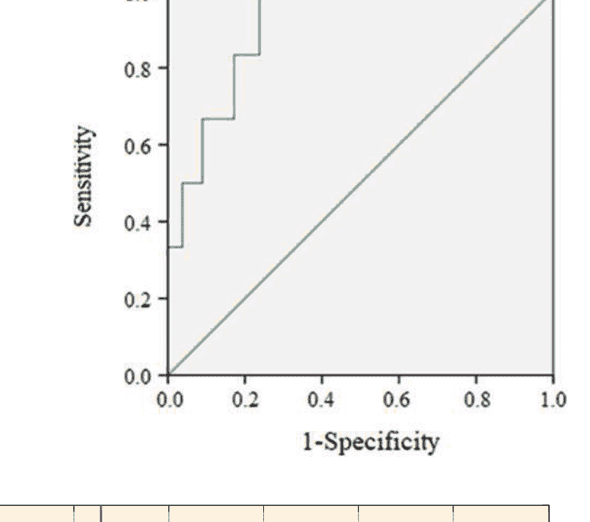

### 图7 687家小型批发和零售企业的信用评分数据分布

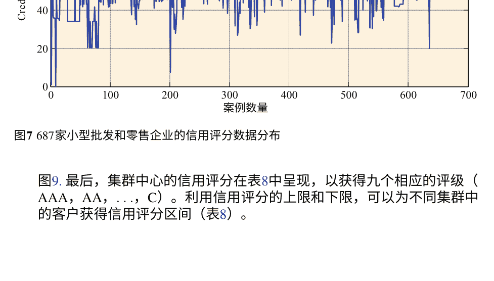

最后，集群中心的信用评分在表8中呈现，以获得九个相应的评级（AAA，AA，...，C）。利用信用评分的上限和下限，可以为不同集群中的客户获得信用评分区间（表8）。

### 图8 九个集群中心的分类进化

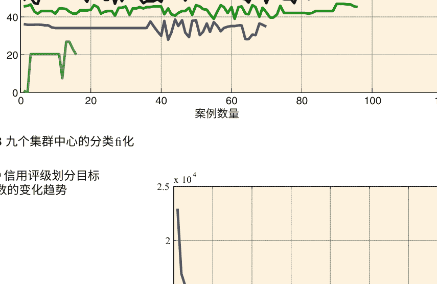

### 图9 信用评级划分目标函数的变化趋势

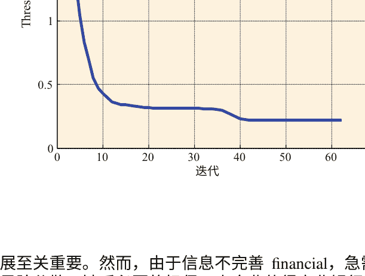

## 4 结论

中小企业对中国经济发展至关重要。然而，由于信息不完善，急需贷款但贷款金额较小，风险分散，缺乏必要的担保，使得商业银行等金融机构难以准确描述小企业的信用风险，从而带来融资困难和高贷款利率方面的明显贷款困难。本文使用687家小企业的样本，利用计量统计和模糊决策的组合，开发了这些企业的信用评级系统。首先，我们使用偏相关分析来消除具有重复信息的指标，并使用`Probit`回归来筛选明显影响小企业违约状态的指标，建立了由17个指标组成的信用风险评估指标体系，例如“`X18`家庭月收入”和“`X20`法定代表人的汽车和房地产价值”。其次，使用熵权`TOPSIS`方法计算贷款企业的信用分数。最后，使用模糊C均值（`FCM`）算法评估小企业的信用评级。通过违约状态测试，所提出的系统分别显示了85.40%和90.09%的预测准确率，确认了高违约预测能力，对商业银行有用。

本研究在以下三个方面具有创新性。首先，本研究提出了一个与小型零售和批发企业的信用特点一致的信用评级系统。它是现有信用评级文献的有效补充，并可以作为商业银行和小型批发和零售企业在信用评级方面的决策参考。其次，在评分过程中引入了三角模糊数，从而减少了客观的任意性。第三，本研究的实证研究表明，对于小型零售和零售企业来说，非金融指标比金融因素更重要。根据图5，在17个有影响力的评级指标中，非金融因素和外部微观指标的权重之和为0.752，远高于内部金融指标的权重0.248。因此，非金融因素和外部微观经济条件是影响中小型批发和零售信用评级的更重要素；在预测小企业违约方面应该研究非金融因素。

该研究在为小型批发和零售公司开发信用评级系统方面取得了进展，但仍存在一些限制。由于从贷款公司获取真实违约损失数据的困难，本文采用仅将违约状态`y_i`作为一个因变量。这种评级方法在解释两个不同的客户同时违约对同一家银行造成不同损失的客观现实方面存在困难。随着违约数据的积累和数据分析技术的进步，可以进一步突破和研究这些问题。

### 表8 小企业的信用评级

| (1) 否 | (2) 信用评分的聚类中心 | (3) 信用评级 | (4) 信用评分区间 | (5) 案例数量 |
|--------|------------------------|--------------|------------------|---------------|
| 1 | 85.497 | AAA | [80.447, 100] | 32 |
| 2 | 74.423 | AA | [71.347, 80.447) | 60 |
| 3 | 68.251 | A | [65.264, 71.347) | 54 |
| 4 | 62.147 | BBB | [59.232, 65.264) | 68 |
| 5 | 56.153 | BB | [53.468, 59.232) | 120 |
| 6 | 50.746 | B | [47.179, 53.468) | 73 |
| 7 | 43.464 | CCC | [39.083, 47.179) | 79 |
| 8 | 34.279 | CC | [27.826, 39.083) | 68 |
| 9 | 19.883 | C | [0, 27.826) | 124 |

### 致谢

本研究得到了中国国家自然科学基金（编号：71873103、72173096、71503199和71731003）、陕西省社会科学基金（编号：2018D51）、西北农林科技大学唐学者计划（编号：2021-04）的支持。

## 参考文献

Abedin, M. Z., Chi, G. T., Colmbage, S., & Moula, F. E. (2018). 使用支持向量机和概率神经网络的信用违约预测。信用风险杂志, 14(2), 1–27.

Abedin, M. Z., Chi, G. T., Moula, F. E., Zhang, T., & Hassan, M. K. (2019a). 使用优化特征选择方法的优化支持向量机智能技术：来自中国信用批准数据的证据。风险模型验证杂志, 13(2), 1–46.

Abedin, M. Z., Guotai, C., Moula, F. E., Azad, A. S. M. S., & Khan, M. S. U. (2019b). 多层感知器和支持向量机在金融决策支持系统中的拓扑应用。国际金融与经济学杂志, 24, 474–507.

Abedin, M. Z., Guotai, C., Uddin, M. M., Shahriare, S., Imran, K., & Hajek, P. (2021). 基于特征转换的机器学习的税收违约预测。IEEE Access, 9, 19864–19881.

Abedin, M. Z., Chi, G. T., Hajek, P., & Tong, Z. (2022). 将加权SMOTE与集成学习相结合，用于小型企业信用风险的类别不平衡预测。复杂和智能系统. https://doi.org/10.1007/s40747-021-00614-4

Akkoç, S. (2012). 传统技术、神经网络和三阶段混合自适应神经模糊推理系统（ANFIS）模型在信用评分分析中的实证比较：以土耳其信用卡数据为例。欧洲运筹学杂志, 222(1), 168–178.

Altman, E. I. (1968). 财务比率、判别分析和企业破产预测。金融学杂志, 23(4), 589–609.

Altman, E. I., Haldeman, R., & Narayanan, P. (1977). ZETA分析: 一个识别企业破产风险的新模型。银行与金融学杂志, 1, 29–54.

Bahnsen, A. C., Aouada, D., & Ottersten, B. (2015). 基于样本相关成本的决策树。应用专家系统, 42(19), 6609–6619.

Bai, X. P., & Zhao, Z. C. (2022). 一种基于最大违约识别能力的最优信用评分模型，适用于中国小企业。离散动力学在自然与社会中的应用, 2022, 1551937.

Bai, C. G., Shi, B. F., Liu, F., & Joseph, S. (2019). 银行信用价值评估: 评估复杂关系. Ω, 83, 26–38.

大连银行. (2014).大连银行小企业信用体系. 大连银行.

Chai, N. N., Wu, B., Yang, W. W., & Shi, B. F. (2019). 一种多准则建模小企业信用评级的方法:来自中国的证据.新兴市场金融与贸易, 55(11),2523–2543.

Cheng, J., Feng, Y., Tan, J., & Wei, W. (2008). 基于模糊模具可塑性评估的注塑模具优化.材料加工技术杂志, 208(1), 222–228.

Chern, C. C., Lei, W. U., Huang, K. L., et al. (2021). 大数据环境中用于信用评估问题的决策树分类器. 信息系统与电子商务管理, 19, 363–386.

Chi, G. T., & Zhang, Z. (2017). 使用非参数方法的小企业多准则信用评级模型可持续性, 9(10), 1–23.

Chi, G. T., Abedin, M. Z., & Moula, F. E. (2017). 用神经网络建模信用批准数据: 一个实验研究和优化商业经济与管理杂志, 18(2), 224–240.

中国银行业监督管理委员会 (CBRC). (2015). 依法监管、依规监管、风险监管: 中国银行业监督管理委员会实施监管框架改革. 从http://www.cbrc.gov.cn/chinese/home/docView/67163D0D8293499BA499D2A9705C61CD.html 访问

Ciampi, F., & Gordini, N. (2013). 通过人工神经网络进行小企业违约预测建模: 对意大利小企业的实证分析小企业管理杂志, 51(1), 23–45.

大公国际信用评级有限公司 (2010年) 大公国际信用评级有限公司的信用评级方法框架.

Demircan, S., & Kahramanli, H. (2016). 模糊C均值聚类算法在语音情感分类中的应用神经计算与应用, 29(8), 1–8.

惠誉评级 (2013年) 惠誉评级全球公司金融2012年转型和违约研究. 信用市场研究, 惠誉评级.

Florez-Lopez, R. (2007). 保险公司评级决定因素的建模: 机器学习技术和统计模型的应用欧洲运筹学杂志, 183(3), 1488–1512.

Florez-Lopez, R., & Ramon-Jeronimo, J. M. (2015). 提高信用风险评估中集成策略的准确性和可解释性: 一种相关调整的决策森林提议. 专家系统与应用, 42(13), 5737–5753.

Gu, W., Meheli, B., Zhang, C., & Li, R. W. (2017). 一种用于互联网金融公司信用评估的统一框架: 基于AHP和DEA的多准则分析. 国际信息技术与决策制定杂志, 3(3), 597–624.

Hai, L., Shi, B. F., & Peng, G. (2013). 基于相关分析和显著判别的农民小额贷款信用风险评估指标体系建立. 软件杂志, 8(9), 2344–2351.

Harris, T. (2015). 使用聚类支持向量机的信用评分. 专家系统与应用, 42(2), 741–750.

Hens, A. B., & Tiwari, M. K. (2012). 信用评分的计算时间缩短: 基于支持向量机和分层抽样方法的综合方法. 专家系统与应用, 39(8), 6774–6781.

İç, Y. T., & Yurdakul, M. (2010). 使用模糊TOPSIS方法开发快速可信度评分决策支持系统. 应用专家系统, 37(1), 567–574.


中国工商银行. (2005). 关于印发中国工商银行小型工业企业信用评级办法的通知. 中国工商银行, 编号78.

艾瑞咨询. (2021). 2021年中国微型、中小企业融资发展报告. 艾瑞咨询公司.

Khalili-Damghani, K., Sadi-Nezhad, S., Lotfi, F. H., & Tavana, M. (2013). 一种用于可持续项目组合选择的混合模糊规则多准则框架. 信息科学, 220(1), 442–462.

梁, X. C., 陈, S. F., & 刘燕. (2007). 基于增量AntClust的小企业信用评估研究. 在IEEE国际灰色系统和智能服务会议上 (pp. 294–298). IEEE Xplore.

[PAGE 147]
| 序号 | 指标 | 值1 | 值2 | 值3 | 值4 | 值5 | 值6 |
|------|------|-----|-----|-----|-----|-----|-----|
| 55 | 债务资产比率 | 6.84 | 0.043 | 137.45 | 39.4 | 担保金额为500万元 | 0 |
| 74 | EBITDA/总债务比率 | 0.56 | 0.003 | 139.50 | 37.0 | 无保证 | 0 |
| 75 | 外部宏观经济条件 | 0 | -0.04 | 137.45 | 39.40 | 保证金额为18.9百万元 | 1 |
| 80 | C | 0.604 | 0.49 | 127.20 | 37.90 | 保证金额为300万元 | 1 |
| 81 | X_{81} 抵押/质押/担保 质押担保因子 | ... | ... | ... | ... | ... | ... |
| 82 | 违约 | ... | ... | ... | ... | ... | ... |

Lu, Y., Yang, L., Shi, B., Li, J., & Abedin, M. Z. (2022). A new framework for credit risk feature selection of SMEs in the era of Industry 4.0. Annals of Operations Research, 2022, 1–28.

Marcano-Cedeño, A., Marin-De-La-Barcena, A., Jimenez-Trillo, J., Piñuela, J. A., & Andina, D. (2011). Artificial metaplasticity neural network applied to credit scoring. International Journal of Neural Systems, 21(4), 311–317.

Mijid, N., & Bernasek, A. (2013). Gender and credit rationing of small businesses. The Journal of Social Economics, 50(1), 55–65.

Nami, S., & Shajari, M. (2018). Cost-sensitive payment card fraud detection based on dynamic random forest and K-nearest neighbors. Expert Systems with Applications, 110, 381–392.

Promentilla, M. A., Furuichi, T., Ishii, K., & Tanikawa, N. (2008). Multi-criteria evaluation of countermeasures for contaminated sites using fuzzy analytic network process. Journal of Environmental Management, 88(3), 479–495.

Reichert, A., Cho, C. C., & Wagner, G. (1983). A study of conceptual issues involved in developing credit scoring models. Journal of Business & Economic Statistics, 1(2), 101–114.

Robillard, M. P., Maaej, W., Walker, R. J., & Zimmermann, T. (2014). A method for diesel engine fault detection using symmetric polar coordinates and image recognition. Advances in Mechanical Engineering, 2014(4), 1–9.

Ruan, J. H., Wang, Y., Chan, F. T. S., Hu, X., Zhao, M., Zhu, F., Shi, B. F., Shi, Y., & Lin, F. (2018). A green IoT-based farm agricultural lifecycle framework with its finance, operation and management issues. IEEE Communications Magazine, 2018. https://doi.org/10.1109/MCOM.2018.1800332

Rui, L., & Mendes, R. V. (2017). Detection and quantification of fuzziness: a neural network approach. Soft Computing, 22(8), 1–9.

Shi, B. F., & Chi, G. T. (2014). A model for identifying key factors and its application in engineering. Mathematical Problems in Engineering, 2014(1), 368–381.

Shi, B. F., Wang, J., Qi, J., & Cheng, Y. (2015). A novel imbalanced data classification approach based on logistic regression and Fisher discriminant. Mathematical Problems in Engineering, 2015(6), 1–12.

Shi, B. F., Chen, N., & Wang, J. (2016). A credit rating model of micro-finance based on fuzzy cluster analysis and fuzzy pattern recognition: empirical evidence from 2,157 small private enterprises in China. Journal of Intelligent & Fuzzy Systems, 31(6), 3095–3102.

Shi, B. F., Meng, B., Yang, H. F., Wang, J., & Shi, W. L. (2018). A novel product modeling and application in finance using machine learning and deep learning algorithms 1–17. https://doi.org/10.1155/2018/1032643

Sobehart, J., & Keenan, S. (2001). Measuring default risk accurately. Risk, 14(3), 31–33.

Standard & Poor's Ratings Services. (2011). Standard & Poor's study of China's top enterprises highlights their significant/financial risk. Standard & Poor's.

State Council of the People's Republic of China. (2016). Notice of the State Council on issuing and promoting the development plan of inclusive finance (2016–2020). Retrieved from http://www.gov.cn/zhengce/Content/2016-01/15/content_10602.htm


## 第三部分

## 金融时间序列预测

# 一种用于原油价格预测的集成LGBM（轻梯度提升机）方法

Sad Wadi Sajid, Mahmudul Hasan, Md. Fazle Rabbi, 和 Mohammad Zoynul Abedin

摘要 原油被认为是世界上最重要的资源之一。今天使用的大部分燃料都是从原油中提炼出来的。燃料也对全球经济有着重大的影响。原油市场流动性大且不确定。预测原油市场价格已成为政府、工业和个人的必要性。预测原油价格有助于实现可持续经济。本研究的目标是使用机器学习和集成学习方法尽可能准确地预测原油市场价格。在本研究中，我们提出使用轻梯度提升（LGBM）、随机森林集成机器学习算法、Lasso回归和决策树机器学习算法预测原油。BRENT时间序列原油数据用于分析并形成一个给出较小误差和更高准确性的预测模型。我们将LGBM的预测结果与Lasso回归、随机森林回归和决策树回归分析进行了比较。使用比较曲线介绍结果，结果表明LGBM给出了最准确和高效的预测结果。我们通过评估均方根误差（RMSE）、平均绝对百分比误差（MAPE）、均方误差（MSE）、平均绝对误差（MAE）来验证我们的结果，所提出的模型的结果与真实结果非常接近且优越。

- 原油价格预测

- 集成学习

- 机器学习

- 时间序列分析

## 1 引言

原油基本上是当今主要石油和燃料的主要资源。原油是一种石油类型。它由天然的碳氢化合物沉积和其他有机物质组成。原油被发现为地下储层中的液体物质（Ashour等，2011年）。如果原油价格上涨，一般来说经济增长预期率会下降。这实质上降低了经济增长前景，反过来降低了公司的预期收益，从而对股票价格产生了抑制作用。与此相反，原油价格的波动对其他经济活动也有巨大影响，因为原油是能源市场中最大的来源（Zhao等，2017年）。原油价格预测对于公司、行业、研究人员、政府和个人非常有用和重要。

因为原油对世界经济和稳定有很大影响（Chen和Huang，2021年；Abedin等，2021年a）。像外汇市场一样，原油市场非常波动，因此一直是研究人员感兴趣的领域。已经有许多方法被开发出来用于预测原油价格。其中许多方法使用卷积神经网络（CNN）、人工神经网络（ANN）、深度神经网络（DNN）（Abedin等，2021年a,b；Rahman等，2021年；Kaur等，2013年）。根据EIA的数据，我们得知美国的石油产量在过去五年中从每天496万桶增加到每天559万桶。

OPEC最近的协议导致油价波动。因此，石油市场的环境正在发生变化，影响因素变得越来越复杂和多样化（Lu等，2021年）。因此，预测原油价格对研究人员来说变得更加困难；他们正在应用新的更高效的方法，如流学习、CNN模型、ANN、向量自回归模型等（Chen & Huang，2021年；Abedin等，2021a年；Rahman等，2021年；Kaur等，2013年）。这些研究的作者包括许多因素和不同的方法。在所有这些方法中，“集成机器学习”已被证明能够提供最理想的结果。本研究的作者打算获得最佳的预测结果；作者从机器学习方法Lasso回归、决策树回归和Bootstrap Aggregation（Bagging）集成随机森林分析开始。两者都给出了不错的结果，但为什么不使用更好、更高效的原油市场预测系统进行分析呢？因此，作者使用了一种名为“轻梯度提升机（LGBM）”的随机增强集成模型，该模型提供了最佳的预测结果。

尽管作者发现“随机森林分析”比“套索回归”在原油价格作为非线性时间序列数据方面提供了更好的结果。作者构建的预测模型很有前景，并将提供原油价格的即将到来的波动。使用不同类型的误差测量技术来衡量算法的性能，以表格形式显示。此外，误差通过折线图表示，清楚地表明Light GBM的性能优于其他算法。研究的后续部分对相关工作、方法论、性能测量、结果和讨论、结论以及未来工作进行了回顾。

## 2 文献综述

正如最近提到的，近年来在经济预测方面已经做了许多值得注意的工作。一项研究提出了一种基于双向长短期记忆（Bi-LSTM）的石油价格预测模型。这个提出的框架有两个模块（Vo等人，2020年）。Zhongpei Chen使用长短期记忆（LSTM）深度学习方法进行原油价格预测。他们提出了一种名为数据传输与先验知识的创新算法。该研究还将价格预测性能与其他三种训练模型进行了比较，但LSTM给出了最理想的结果（Cen & Wang，2019年）。该研究的作者引入了一种基于软计算的方法来预测西德克萨斯中质原油价格的变化。该研究使用一种简单而有效的数据过滤算法来实现价格预测（Ghaffari & Zare，2009年）。作者开发了一种名为“随机小波神经网络”的新型网络，结合了有效的随机时间函数，以提高原油价格波动的预测准确性。该研究使用自定义开发的模型预测了WTI和BRE原油价格（Huang & Wang，2018年）。引入了预测选择方法，而不是广泛使用的回归器，相对于基准模型，预测准确性提高了近10%。作者指出，众所周知的韦尔奇和戈亚尔数据集相对于其他替代方法具有一致和显著的准确性提升（Nonejad，2021年；Welch & Goyal，2008年）。在COVID-19大流行期间，已经应用了各种深度学习方法来预测汇率，本文作者使用了一些有趣的参数来优先考虑疫情对经济的影响（Shajalal等人，2021年）。LSTM和GRU是广泛应用于预测各种现象的循环神经网络。GA Busari对Adaboost-LSTM和Adaboost-GRU进行了比较，该研究的实证结果表明Adaboost-GRU在预测原油价格方面的表现优于Adaboost-LSTM（Busari & Lim，2021年）。预测现象一直是研究人员的最爱。有许多方法可以实现这一点，但传统和现代人工智能的结合已被证明能够提供更准确和高效的结果。本研究的作者提出了一种名为“混合模型”的方法来预测信用风险（Chi等人，2019年）。复杂而波动的金融市场非常适合灰色分析环境。因此，作者提出了一种显著提高性能的灰色预测模型（Norouzi & Fani，2020年）。Yanhui Chan提出了一种基于深度学习的混合原油价格预测模型，改进了以前的工作的预测准确性（Chen等人，2017年）。预测出更准确的油价，市场将更加稳定。原油价格预测中实时预测是罕见的；Yuan Zhao提出了一种新的混合模型，可以提供在线实时价格预测（Zhao等，2021年）。由于原油市场波动性很高，它就像是时间序列数据的不平衡。作者提出了一种新颖的集成方法来预测不平衡数据集（Abedin等，2019年）。Yifan Yang发现分而治之的策略可以获得更好的预测性能。他们提出了一种基于K-means + KPCA + KELM的混合方法（Yang等，2021年）。

许多研究人员致力于预测原油价格。自回归移动平均（ARMA）模型和向量自回归（VAR）模型每次使用不同的数据输入（Kulkarni & Haidar，2009年）。如果原油价格数据具有强非线性特征，则这些非线性模型可以产生更准确的结果（Bashiri Behmiri & Pires Manso，2013年）。在原油市场上，价格的不确定性是一个因素，因为其价值取决于许多参数。提出了一种基于自适应布谷鸟搜索算法（AGWOCS）的机器学习方法，用于预测原油市场价格的波动性。该方法的有效性以每日和每周的布伦特原油价格为案例研究（Wang等，2020年）。Binrong Wu提出了一种新颖的基于文本和大数据驱动的模型，该模型利用卷积神经网络（CNN）自动抓取原油新闻更新。该案例研究收集了4837条和3883条新闻标题，以开发基于文本的原油预测系统（Wu等，2021年）。基于这个分析，在本研究中，我们使用了最新的集成算法之一，称为轻量级梯度提升机（LGBM）来预测原油价格。

## 3 研究方法论

传统的机器学习分析方法被用于预测原油价格。数据在被分成训练集和测试集之前进行预处理。我们以80:20的比例随机分割数据集用于训练和测试数据。分析模型是通过机器学习和集成算法使用训练数据进行训练构建的，训练完成后使用测试数据作为输入来预测值。我们提出的方法的框图如图1所示。

### 3.1 数据集

用于分析的数据集是原油价格：布伦特-欧洲数据。该数据集来自美国能源信息管理局。它以现货价格发布，单位为美元/桶。数据频率为每日，但没有进行季节调整。这是从1987年5月20日到2021年9月10日的时间序列数据，总观测次数为8954。图2展示了数据集的信息。

在1987年至2000年期间，原油价格保持稳定。此后，价格以一定速率增加。在2008年至2009年期间达到最高点，然后价格下降。在2011年至2015年期间，价格处于稳定状态，之后它开始下降的时期。2020年原油价格因Covid-19大流行而下跌。现在情况将会好转，价格也在上涨。图表清楚地表明Covid-19对原油价格有很大影响。上述讨论表明原油市场并不完全稳定。许多变量影响着这个价格的变化。这个市场的预测真的很困难，需要进行特殊而深入的分析。数据集的数值描述见表1。

原油价格的标准差为32.01776，且没有太多的散点。原油价格逐日增长并保持稳定。但是，在2008年的最后三个月，原油价格达到了最高点，因为供应的物理中断和需求旺盛导致了库存的主要原因，而世界产量停滞不前（Ratti & Vespignani，2013）。

表1 布伦特原油数据的描述统计

| 统计均值 | 标准差 | 最小值 | 最大值 |
| :--- | :--- | :--- | :--- |
| 46.75337 | 32.01776 | 9.10000 | 143.95000 |

### 3.2 分析中使用的算法描述

本分析使用了两种集成机器学习算法，即轻量级梯度提升和随机森林回归，以及Lasso和决策树机器学习算法。以下是算法的简要描述。

**套索回归** 套索回归是一种线性回归的类型，它是一种像岭回归一样的收缩方法。它们之间有一点不同。LASSO代表最小绝对收缩和选择算子。套索回归的代价函数可以定义如下：

```
$\sum_{i=1}^{M} (y_i - \hat{y}_i)^2 = \sum_{i=1}^{M} \left(y_i - \sum_{j=0}^{p} w_j \times x_{ij}\right)^2 + \lambda \sum_{j=0}^{p} w_j$ 对于某些 $t>0$, $\sum_{j=0}^{p} w_j < t,$ (1)
```

岭回归和套索回归代价函数方程的主要区别在于套索回归考虑了大小而不是平方系数。这种归一化（L1）可能导致零系数，即某些属性在输出评估中完全被忽略。因此，套索回归不仅可以减少过拟合，还可以帮助选择有助于模型解释的特征。

**随机森林** 随机森林是一种集成分类器，使用随机化方法创建多个独立且非相同的决策树（Datta等，2021年）。这个算法是一种树预测器的混合体，用于分类和回归。每个决策树都包括一个随机向量作为参数，随机确定样本的特征，并从数据集的子集或整个数据集中随机选择训练数据集（Bradter等，2013年）。当使用随机选择特征来划分每个节点时，错误率与Adaboost相当，但在湍流方面更具弹性（Shakoor等，2017年）。随机森林是一种非常灵活且简单的机器学习技术，在大多数情况下，即使没有超参数调整，也能给出出色的结果。根据我们的需求，在本研究中，我们采用了随机森林进行回归部分的技术。利用随机森林回归，我们能够获得非常高的准确性。SK-learn提供了一个有用的工具，通过观察使用该特征的树节点在森林中减少了多少错误来量化该特征的重要性（Grange & Hand，1987年）。

过拟合是深度决策树的一个问题；然而，过拟合在随机森林中很少发生。它生成特征的随机子集，并使用这些选择形成较小的树，然后将它们合并。

#### Level-wise tree growth

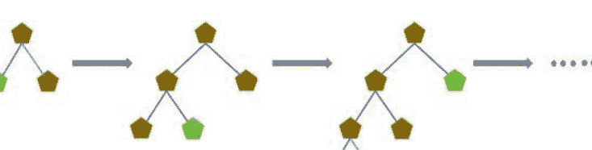

图3 Light Gradient Boosting Machine的叶子生长方式

决策树回归对于监督学习，决策树是一种常见的实用技术。它可以进行分类和回归估计。

决策树是一种树状分类器，包括根节点、内部节点和叶节点。根节点是第一个节点，代表整个样本，并可分为其他节点。内部节点反映数据集的特征，而分支表示决策规则。最后，叶节点表示结果。对于特定的数据点执行决策树，回答真/假问题直到到达叶节点。

在那个特定的叶节点上，依赖变量的平均值被用来产生最终的预测。通过多次迭代，决策树能够预测出适当的数据点值。决策树很有用，因为它们简单易懂，需要最少的数据清洗，不受非线性的影响，并且有少量的超参数需要调整。

轻量级梯度提升机Light GBM是一种基于树的学习算法，基于梯度提升框架（Rufo等，2021）。它旨在分布式和高效，并提供以下优势：减少内存使用，提高训练效率和速度，以及更好的准确性。该算法使用了两种新颖的技术，称为基于梯度的单边采样（GOSS）和独占特征绑定（EFB），使其更快。轻量级梯度提升机的方法是基于将连续特征值组织成离散区间的直方图，以加速训练过程。更低的内存使用：连续值被替换为离散区间，从而降低内存使用量。这使得该算法比其他算法更快。该算法的基于树的结构如图3所示。

### 3.3 绩效指标

机器学习和预测分析确实容易出现各种错误。我们使用四种常用的错误测量技术，并使用表格和图形形式进行比较。以下是错误的简要概述和参数：

$$\text{MAE} = \frac{1}{n} \sum_{i=1}^{n} |y_i - \hat{y}_i|, \text{MSE} = \frac{1}{n} \sum_{i=1}^{n} (y_i - \hat{y}_i)^2$$

$$\text{RMSE} = \sqrt{\frac{1}{n} \sum_{i=1}^{n} (y_i - \hat{y}_i)^2}, \text{MAPE} = \frac{1}{n} \sum_{i=1}^{n} \frac{|y_i - \hat{y}_i|}{y_i}$$

其中$n$是样本数量，$\Sigma$是求和符号（表示将它们全部加在一起），$y_i$是实际值，$\hat{y}_i$是预测值。`MAE`表示平均绝对误差。绝对误差是指预测值和实际值之间的绝对差异。`MAE`表示预测中预期的平均误差。

`MSE`表示均方误差。回归线的平均平方误差显示了与点集的距离。这是通过将点与回归线之间的距离（这些距离是“误差”）进行平方运算来实现的。需要进行平方运算以消除任何负号。

`RMSE`代表均方根误差，即预测误差的标准差。残差用于衡量数据点与回归线之间的距离；`RMSE`衡量这些残差的分布。换句话说，它揭示了数据在最佳拟合线周围的聚集程度。

`MAPE`代表平均绝对百分比误差。用于评估预测性能的最常用的关键绩效指标之一是`MAPE`。`MAPE`通过将总绝对误差除以期望数量（每个时期分别计算）来计算。这是以平均百分比误差计算的。

## 4 结果与讨论

在本文中，我们使用四种不同的模型来预测原油价格。在开发模型后，我们通过测试值进行测试，并生成实际与预测曲线。图4和图5给出了三种方法的曲线。

图4显示了原油价格预测的实际与预测曲线。蓝色表示实际值，红色表示预测值的布伦特原油价格数据。曲线显示了`Lasso`的性能良好，评估后得到0.01730的`MAE`、0.00046的`MSE`、0.02143的`RMSE`和0.40613的`MAPE`误差，这些数据在表2中列出。该曲线还表明原油价格没有遵循任何特定规律。它可以随时下跌，也可以随时上涨。其余算法的结果将逐一展示和讨论。

图5显示了原油价格预测的实际与预测曲线。蓝色表示实际值，红色表示预测值的布伦特原油价格数据。曲线显示了随机森林的性能良好，评估后得到0.01076的`MAE`，0.00020的`MSE`，0.01416的`RMSE`和0.26699的`MAPE`误差，详见表2。

### 使用Lasso回归进行原油价格预测

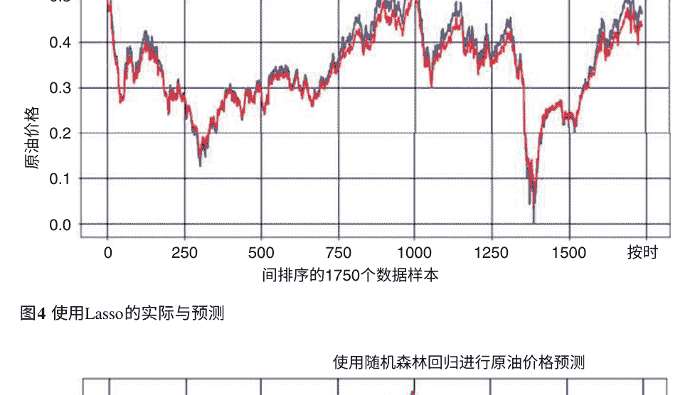

图4 使用Lasso的实际与预测

### 使用随机森林回归进行原油价格预测

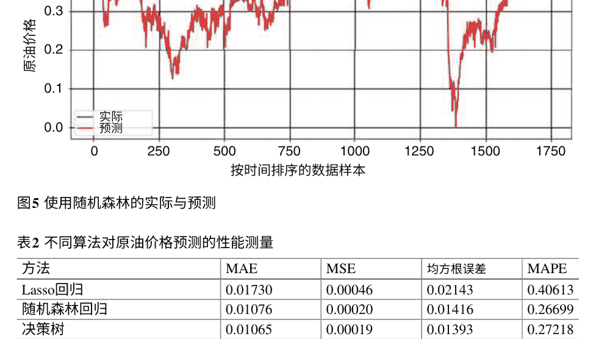

图5 使用随机森林的实际与预测

#### 表2 不同算法对原油价格预测的性能测量

| 方法 | MAE | MSE | 均方根误差 | MAPE |
| --- | --- | --- | --- | --- |
| Lasso回归 | 0.01730 | 0.00046 | 0.02143 | 0.40613 |
| 随机森林回归 | 0.01076 | 0.00020 | 0.01416 | 0.26699 |
| 决策树 | 0.01065 | 0.00019 | 0.01393 | 0.27218 |
| 轻梯度提升 | `0.00732` | `0.00009` | `0.00998` | 0.26201 |

粗体数值：最小误差率，表示最佳模型性能

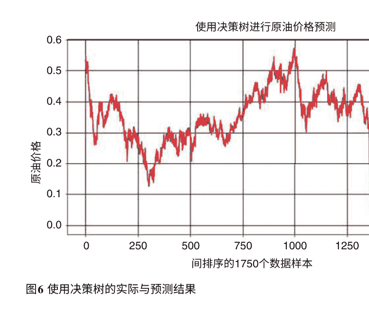

#### 图6 使用决策树的实际与预测结果

图6显示了原油价格预测的实际与预测曲线。蓝色表示实际值，红色表示预测值，这是布伦特原油价格数据的情况。曲线显示决策树的性能良好，在评估后得到0.01065的`MAE`、0.00019的`MSE`、0.01393的`RMSE`和0.27218的`MAPE`误差，这些数据在表2中呈现。

图7显示了原油价格预测的实际与预测曲线。蓝色表示实际值，红色表示预测值，这是布伦特原油价格数据的情况。曲线显示`LGBM`的性能良好，在评估后得到0.00732的`MAE`、0.00009的`MSE`、0.00998的`RMSE`和0.26201的`MAPE`误差，这些数据在表2中列出。

表2表示`Lasso`回归、随机森林回归、决策树和轻梯度提升的`MAE`、`MSE`、`RMSE`和`MAPE`误差值。它清楚地表明轻梯度提升的所有类型的误差都小于其他算法。这意味着轻梯度提升的预测比其他算法更好。为了更清楚地理解，我们在图7中用折线图表示这些误差。

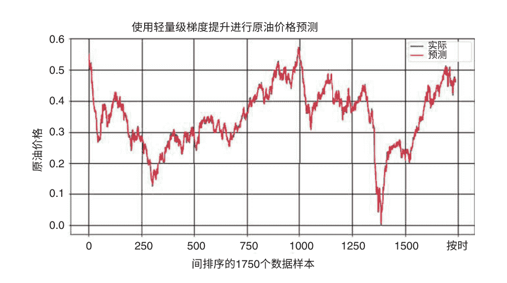

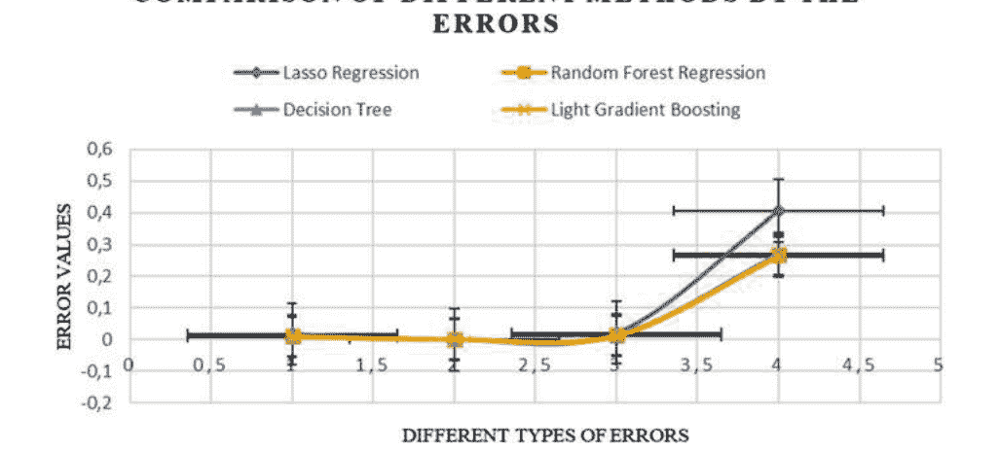

## 5 结论和未来工作

本研究重点预测布伦特原油价格。我们应用了两种机器学习算法和两种集成算法进行分析。整体上，轻量级梯度提升机器算法的性能优于其他算法。

所有测量结果都以表格和图形形式显示。其他算法的性能也令人满意，误差较低。这个分析有助于所有与此领域相关的人做出直接和间接依赖原油价格的具有挑战性的决策。

未来，我们希望建立一个`API`，显示原油实时价格的预测。作者希望将更多参数添加到输入中，并最大限度地减少模型的空间和时间复杂性，以确保准确的预测。作者还希望准备一个应用软件，任何人都可以使用该软件获取实时预测。

## 参考文献

- Abedin, M.Z., Guotai, C.和Moula, F.E., 2019年6月。加权SMOTE集成算法：来自中国不平衡信用批准实例的证据。在2019年第二届国际数据智能与安全会议（ICDIS）（第208–211页）。IEEE Xplore。

- Abedin, M. Z., Hasan, M. M., Hassan, M. K., & Hajek, P. (2021a年)。基于深度学习的COVID-19期间的汇率预测。运筹学年鉴, 1–52页。

- Abedin, M. Z., Hassan, M. K., Khan, I., & Julio, I. F. (2021b年)。企业税务违约预测的特征转换：机器学习方法的应用。亚太运筹学杂志, 39, 2140017页。

- Ashour, I., Al-Rawahi, N., Fatemi, A., & Vakili-Nezhaad, G. (2011). 在石油和天然气行业中应用状态方程动态系统的热力学动力学, 1, 165–178。

- Bashiri Behmiri, N., & Pires Manso, J. R. (2013). 原油价格预测技术：文献综述 可在SSRN 227 5428上获得。

- Bradter, U., Kunin, W. E., Altringham, J. D., et al. (2013). 使用随机森林算法在物种分布模型中识别适当的空间尺度生态学和进化方法, 4 (2), 167–174。

- Busari, G. A., & Lim, D. H. (2021). 原油价格预测：AdaBoost-LSTM和AdaBoost-GRU的比较，以提高预测性能计算机与化学工程, 155, 107513。

- Cen, Z., & Wang, J. (2019). 基于先验知识数据传输的长短期记忆深度学习原油价格预测模型。能源, 169, 160–171.

- Chen, Y. C., & Huang, W. C. (2021). 利用黄金和原油指标构建股价预测CNN模型。应用软计算, 112, 107760.

- 陈, Y., 何, K., & 蔡, G. K. (2017). 原油价格预测：基于深度学习的模型。计算机科学论文集, 122, 300–307。

- Chi, G., Uddin, M. S., Abedin, M. Z., & Yuan, K. (2019). 混合模型用于信用风险预测：神经网络方法的应用。国际人工智能工具期刊, 28(05), 1950017.

- 达塔, R. K., 萨吉德, S. W., 穆恩, M. H., & 阿贝丁, M. Z. (2021). 外汇汇率预测使用双向长短期记忆。在大数据驱动的数字经济中：人工智能和计算智能(pp. 213–227). Springer.

- Ghaffari, A., & Zare, S. (2009). 基于软计算的原油价格变动预测的新算法。能源经济学, 31(4), 531–536.

- Grange, R., & Hand, D. (1987). 大气湿度对园艺作物生长的影响综述。园艺科学杂志, 62(2), 125–134。

- Huang, L., & Wang, J. (2018). 全球原油价格预测和基于随机小波神经网络的同步精度评估。能源, 151, 875–888。

# 原油价格预测模型开发：集成和机器学习方法的比较评估

Mahmudul Hasan, Ushna Das, Rony Kumar Datta, 和 Mohammad Zoynul Abedin

摘要 原油市场不稳定，价格波动较大。由于Covid-19大流行，原油价格在短时间内不断上下波动。未来计划和项目的政策直接和间接取决于未来的原油价格。因此，本研究旨在利用机器学习和集成算法预测原油价格，并展示Ada Boost、Bagging Lasso和支持向量回归模型的性能比较。

该研究使用原油价格时间序列数据进行分析，并建立模型来预测未来价格。实际与预测曲线用于展示每个算法的性能。分析结果显示，集成AdaBoost算法的性能优于其他算法。使用均方误差（MSE）、均方根误差（RMSE）、平均绝对误差（MAE）、平均绝对百分比误差（MAPE）、两个准确度评分函数方差得分和R²score对结果进行验证。本研究将帮助原油行业的利益相关者基于预测的原油价格做出决策和制定政策。

- M. 哈桑

  计算机科学与工程系，哈吉·穆罕默德·达内什科学与技术大学，孟加拉国迪纳普尔

- U. 达斯

  电气与电子工程系，哈吉·穆罕默德·达内什科学与技术大学，孟加拉国迪纳普尔

- R. K. 达塔

  金融与银行学系，哈吉·穆罕默德·达内什科学与技术大学，孟加拉国迪纳普尔

  email: [rony.datta@hstu.ac.bd](mailto:rony.datta@hstu.ac.bd)

- M. Z. Abedin (✉)

  金融、绩效和营销学系，提赛德大学国际商学院，提赛德大学，米德尔斯堡，提斯河谷，英国

  电子邮件: [m.abedin@tees.ac.uk](mailto:m.abedin@tees.ac.uk)


关键词 原油 · 价格预测 · 集成学习 · 机器学习

## 1 引言

原油，也被称为液态石油，积聚在地球¹的地壳中的多孔岩层中，被用作燃料或用于化学化合物的加工。原油不仅是黄黑色的油，它还是地壳内有机物分解产生的黄金可能性的矿场。在全球变暖和环境问题的严重影响下，几乎所有人都依赖可再生能源来保护环境和保护未来的一代，从而对减少原油使用感到沮丧。但是原油是当今世界上最有价值的能源资源。原油对各种化学工业产品至关重要，包括塑料、溶剂、肥料和农药 (Dhifqaui等, 2022年)。原油价格和全球经济相互关联，相互依赖。如果由于任何原因原油价格波动，全球经济活动将发生巨大变化 (Baumeister和Kilian, 2016年)。原油价格的影响因素包括供需、金融因素和技术，直接影响原油市场内外环境的变化。日益复杂和多样化的影响因素使得准确的原油价格预测变得困难。因此，准确的原油价格预测现在是一个非常艰巨的过程 (Hamilton, 2009年; Kilian和Murphy, 2014年; Zhang等, 2015年; Wang等, 2015年; Tang等, 2012年)。许多研究人员已经应用各种机器学习方法来预测原油价格。通常使用支持向量机和神经网络 (Zhao等, 2017年)。除了多重递归网络 (Orojo等, 2019年)、LSTM (Dhifqaui等, 2022年; Hajek和Abedin, 2020年)、ARIMA (Abdollahi和Ebrahimi, 2020年) 和深度置信网络 (Chen等, 2019年) 被用于预测原油价格。原油价格的高预测准确性有助于资产配置，以减轻投资者的风险，并为政策制定者进行金融政策调整。它作为国家安全的保障，促进国家经济增长 (Abedin等, 2019年; Guotai等, 2017年)。数据处理和适当的模型选择已经展示了获得高预测准确性的可能性 (Abedin等, 2021年)。在这项研究中，作者应用AdaBoost、Bagging Lasso和支持向量回归机器学习方法来可靠地预测原油价格。最后，作者使用各种误差测量技术比较了这三种方法，并得出结论AdaBoost优于其他算法。这是一种非常适合预测原油价格的方法。

## 2 相关文献

供求、金融和技术等三个因素正在影响原油价格 (Lu等, 2021年)。考虑到这三个因素，我们必须澄清最佳的一致预测方案。时间序列模型，计量模型、定性模型和人工智能模型在石油价格预测和建模中非常可行。在最近的时代，预测原油价格对许多大型和小型行业、个人和国家来说是一大福音（Abedin等，2020年）。为了预测油价，许多经济学家和分析师使用自回归移动平均模型和向量回归模型（Chai等，2022年）。目前，人工智能方法和传统计量模型是两种高度响应的预测原油价格的方法。在准确性问题上，人工智能方法比传统计量模型更兼容（Song等，2020年）。集成概率预测比确定性预测更高效。确定性预测包含预测误差，这在原油市场的金融决策中造成了差异。但集成概率方法试图克服所有困难并减轻所有风险（Satu等，2020年）。全球经济与原油价格之间存在紧密的关系。对于全球原油市场指数，西德克萨斯中质原油和布伦特原油是最重要的（Li等，2021年）。良好的数据长度可以提高预测水平。此外，每日数据的长度相比每周和每月可以提供更好的预测水平（Zhao等，2021年）。

## 参考文献

- Kaur, J., Nathani, N., & Kaur, M. (2013). 原油价格波动和FOREX市场：来自OPEC国家的证据。国际商业与技术研究杂志, 3(3), 215–235。

- Kulkarni, S., & Haidar, I. (2009). 利用人工神经网络和商品期货价格预测原油价格的模型。a rXiv预印本 arXiv: 0906.4838.

- Lu, Q., Sun, S., Duan, H., & Wang, S. (2021). 基于变量选择-LSTM集成模型的原油价格分析和预测。能源信息学, 4(2), 1–20.

- Nonejad, N. (2021). 通过宏观经济变量条件化预测股票溢价: 使用原油价格的预测选择策略。金融研究快报, 41, 101792.

- Norouzi, N., & Fani, M. (2020). 黑金下跌，黑死病兴起 - 使用灰色预测模型预测OPEC原油价格。上游石油和天然气技术, 5, 100015.

- Rahman, M. M., Guotai, C., Das Gupta, A., Hossain, M., & Abedin, M. Z. (2021). 早期COVID-19大流行对美国和欧洲股市的影响和波动预测。经济研究-Ekonomska Istraživanja, 2021, 1–18.

- Ratti, R. A., & Vespignani, J. L. (2013). 为什么全球经济活动疲软时原油价格却很高? 经济学快报, 121 (1), 133–136.

- Rufo, D. D., Debelee, T. G., Ibenthal, A., & Negera, W. G. (2021). 使用梯度提升机（LightGBM）诊断糖尿病。诊断学, 11(9), 1714.

- Shajalal, M., Hajek, P., & Abedin, M. Z. (2021). 使用深度神经网络对不平衡数据进行产品缺货预测。国际生产研究杂志, 1–18.

- Shakoor, M. T., Rahman, K., Rayta, S. N., & Chakrabarty, A. (2017年7月). 使用监督机器学习技术进行农业生产输出预测。在2017年第一届国际下一代计算应用会议（Next Comp）(pp. 182–187).

- Vo, A. H., Nguyen, T., & Le, T. (2020年). 使用Bi-LSTM网络进行布伦特原油价格预测。智能自动化与软计算, 26(6), 1307–1317.

- Wang, J., Niu, T., Du, P., & Yang, W. (2020年). 集成概率预测方法用于原油价格的不确定建模。应用软计算, 95, 106509.

- Welch, I., & Goyal, A. (2008年). 对股权溢价预测的实证绩效进行全面研究。金融研究评论, 21(4), 1455–1508.

- 吴, B., 王, L., 吕, S.X., & 曾, Y.R. (2021年). 使用新的基于文本和大数据驱动模型的有效原油价格预测。测量, 168, 108468。

- 杨, Y., 郭, J.E., 孙, S., & 李, Y. (2021年). 使用新的混合方法和多源数据预测原油价格。人工智能工程应用, 101, 104217。

- 赵, Y., 李, J., & 于, L. (2017年). 一种用于原油价格预测的深度学习集成方法。能源经济学, 66, 9–16。

- 赵, Y., 张, W., 龚, X., & 王, C. (2021年). 一种用于在线实时预测原油价格的新方法。应用能源, 303, 117588。

由于经济危机、地缘政治和意外事件，原油价格受到了巨大的影响。模型的配置会影响模型的预测能力。原油价格预测的有效性会受到错误的模型配置的影响（Yu等，2016年）。线性、非线性、滞后、结构不连续性和不稳定性都是原油时间序列的方面。分解算法可以用来创建具有线性、非线性和不稳定性的子序列或组件（Yu等，2016年）。在原油价格中，传统方法可能无法检测到潜在的非线性特征。因此，需要一种新的技术来克服传统方法的缺点。根据先前的研究，具有强大自学能力的人工智能模型，如支持向量机（SVM）、人工神经网络（ANN）和其他智能算法，已经越来越受到原油价格预测的青睐。经验证据表明它们优于传统方法。人工智能模型承认其根本性限制，如耗时、松弛收敛和局部极小值（Yang等，2021年）。对于分析纠缠和异常数据，“分解和集成”原则被认为是一个优秀的工具（Datta等，2021年）。数据准备是一个关键阶段，包括数据清洗、数据转换和数据降维，其主要目的是生成适用于未来预测的最终数据集。在预测文献中，有各种各样的数据降维策略，包括特征选择和特征提取。特征选择可以检测和消除尽可能多的冗余和不必要的特征。大多数原油价格预测研究采用特征选择进行数据降维，因为特征保持其原始特性，可以提高模型的解释能力。特征选择通过定义阈值仅保留有效变量，因此丢弃了大量重要数据，而特征提取将原始特征空间减少为一个更简单的空间，保留更多数据（Abedin等，2019年）。

## 3 方法论

为了预测原油价格，应用传统的机器学习分析技术。在将数据分割为训练集和测试集之前，需要进行预处理。对于训练和测试数据，我们随机将数据集按照80:20的比例划分。使用机器学习和集成技术构建分析模型，然后使用训练数据对其进行训练，使用测试数据作为输入提供预测值。图1显示了我们提出的方法的框图。

### 3.1 数据集

用于分析的数据集是布伦特原油价格-欧洲数据。该数据集来自美国能源信息管理局。它以现货价格发布，价格以美元/桶计算。数据频率为每日，但没有进行季节调整。这是从1987年5月20日到2021年9月10日的时间序列数据，总观测次数为8954。图2展示了关于数据集的信息。

在1987年到2000年期间，原油价格保持稳定。此后，价格上涨。在2008年–2009年期间，价格达到最高点，然后下降。2011年至2015年期间，价格保持稳定，此后开始下降。2020年，由于Covid-19疫情，原油价格下跌。目前情况正在好转，价格也在上涨。图表清楚地显示了Covid-19对原油价格的巨大影响。上述讨论表明，原油市场并不完全稳定。许多变量影响着这个价格的变化。对这个市场的预测真的很困难，需要特殊而深入的分析。数据集的数值描述见表1。

1987年至2021年的原油价格数据

表1 布伦特原油数据的统计描述

| 统计量 | 值 |
| :--- | :--- |
| 平均值 | 46.75337 |
| 标准差 | 32.01776 |
| 最小值 | 9.10000 |
| 最大值 | 143.95000 |

### 3.2 算法描述

#### AdaBoosting

Boosting是一种集成技术，通过将多个弱学习器转化为强学习器来提高预测准确性。 Boosting算法的原理是在训练数据集上开发第一个模型，然后构建第二个模型来纠正第一个模型的错误。 这个过程迭代进行，直到错误最小化并且数据实例被准确预测。

对于每个特征，该算法生成一个弱回归器。 由于有效计算样本的权重将适当降低，而误分类样本的权重将适当提高，所以原始分类器不需要很高的准确性，只要准确性高于随机分类器即可。 结果是样本分布被改变。 通过合并从每个周期获得的弱样本，可以创建一个性能改进的强回归器。 这些强分类器使用的特征被很好地分类（图3）。

#### Bagging Lasso

套索是一种类似于岭回归的收缩方法，但有一些关键区别。

套索回归的成本函数可以定义如下：

$$ \sum_{i=1}^{M} (y_i - \hat{y}_i)^2 = \sum_{i=1}^{M} \left( y_i - \sum_{j=0}^{p} w_j \times x_{ij} \right)^2 + \lambda \sum_{j=0}^{p} |w_j| $$

对于某些 $w_j > 0$, $\sum_{j=0}^{p} |w_j| < t$. (1)

岭回归和套索回归成本函数的关键区别在于，在套索回归中，不是计算系数的平方，而是将其大小因素纳入方程中。这种正则化方法（L1）可能导致零系数，这意味着在评估输出时某些特征完全被忽略。因此，套索回归不仅有助于减少过拟合，还有助于选择使模型更易理解的特征。

Bagging Lasso是由Bagging集成过程构建的集成算法，其中Lasso被用作基础算法。数据被分成不同的部分，并通过Lasso回归进行训练。最终，最终结果出现，并且比基础Lasso模型具有更好的准确性。

#### SVR（线性、RBF、多项式）

在当今世界，最广泛使用和高性能的算法是支持向量机。这是一种有监督的机器学习方法，可用于分类和预测数据。然而，作者可以使用这种学习方法来解决回归问题。SVM的目标是构建一个模型（基于训练数据）。仅给出测试数据特征，模型预测测试数据的目标值输出。 线性SVM和核SVM是目前可用的两种形式的SVM。 线性SVM是一种非常快速的机器学习方法，用于解决大数据集中的多类问题（图4）。

SVM实现了一种独有的线性支持向量机设计算法。 该算法通过基于支持向量点生成决策边界来对数据进行分类（Yang等，2021年）。 在某些情况下，SVM的准确性高于其他分类算法。 由于现实世界中的数据不像之前的图片中的数据那样直观，所以使用核SVM来对非线性数据进行分类。 核SVM是一种修改过的SVM算法，可用于对这种类型的数据进行分类。 SVM的核包含多个算术运算。 这些函数将数据作为输入，并将其转换为所需的格式。 有各种类型的数学函数。 例如，多项式、Sigmoid、线性、非线性和径向基函数。

### 3.3 绩效指标

MAE：它只是绝对误差的算术平均值。 这是计算预测准确性的最简单的度量方法。 它用于计算连续变量的准确性，计算公式如下：

$$ \text{MAE} = \frac{1}{n} \sum_{i=1}^{n} |y_i - \hat{y}_i| \quad (2) $$

MSE：均方误差是实际值与估计值之间差异的平均值。 在这个过程中，所有的误差都是正的。 它对异常值非常敏感。 这个模型的小值代表了一个更好的模型。`MSE`被定义如下：

$$ \text{MSE} = \frac{1}{n} \sum_{i=1}^{n} (y_i - \hat{y}_i)^2. \tag{3} $$

`RMSE`：均方根误差是所有误差的平方的均值的平方根。这是一种衡量模型误差的标准方法，表示为：

$$ \text{RMSE} = \sqrt{ \frac{1}{n} \sum_{i=1}^{n} (y_i - \hat{y}_i)^2 }. \tag{4} $$

`MAPE`：每个时间段的平均百分比误差减去真实值，再除以真实值，以百分比的形式确定可靠性：

$$ \text{MAPE} = \frac{1}{n} \sum_{i=1}^{n} \frac{(y_i - \hat{y}_i)}{y_i}. \tag{5} $$

方差得分：方差是确定某物体变量性的度量标准。计算方差时使用均方偏差。通过变异度来测量收集到的数据的离散程度。平均值之间的差异越大，数据的分布越广。

`R^2`分数: `R^2`的取值范围为0到1。它决定了数据与回归线的匹配程度。对于预测模型来说，低的`R^2`值通常表示预测效果不好。在某些情况下，优秀的模型可能显示出较小的值。

## 4 结果与讨论

本文使用两种集成算法来预测原油价格。算法的实际值与预测值如图5所示。

图5显示了使用AdaBoost预测原油实际值与预测值的曲线。红色表示实际值，蓝色表示预测值，数据来自布伦特原油价格。曲线显示了AdaBoost的性能良好，经过评估得到0.00932的MAE、0.00015的MSE、0.01235的`RMSE`和0.24785的`MAPE`误差，详见表2。从表3可以看出，方差得分为0.98，`R^2`得分为0.98。该曲线还表明原油价格没有特定的规律。它可以随时下跌，也可以随时上涨。

使用AdaBoost进行原油价格预测

图5 使用AdaBoost预测的原油实际与预测价格曲线

表2 不同算法对原油价格预测的性能测量

| 方法 | MAE | MSE | 均方根误差 | MAPE |
| :--- | :--- | :--- | :--- | :--- |
| `AdaBoost` | 0.00932 | 0.00015 | 0.01235 | 0.24785 |
| Bagging Lasso回归 | 0.01738 | 0.00046 | 0.02152 | 0.40649 |
| 支持向量机（线性） | 0.01743 | 0.00042 | 0.02059 | 0.45646 |
| 支持向量机（RBF） | 0.01663 | 0.00039 | 0.01986 | 0.46593 |

## 表3 不同算法对原油价格预测的得分类型

| 方法 | 方差得分 | R² 得分 |
| :--- | :--- | :--- |
| **AdaBoost** | **0.98** | **0.98** |
| Bagging Lasso回归 | 0.95 | 0.95 |
| 支持向量机（线性） | 0.95 | 0.95 |
| 支持向量机（RBF） | 0.96 | 0.96 |
| 支持向量机（多项式） | 0.90 | 0.90 |
| 注意：最佳性能算法以粗体显示 | | |

表2表示`AdaBoost`、`Bagging Lasso`回归和支持向量回归的不同核函数的`MAE`、`MSE`、`RMSE`和`MAPE`误差值。明显表明`AdaBoost`的所有误差都小于其他算法的误差。而`SVR`（多项式核）回归模型在`MAE`（0.01663）、`RMSE`（0.01986）和 `R²score`（0.96）方面表现优越。实际上，`Bagging Lasso`回归高估了原油价格，而对于`SVR`模型来说，情况正好相反。

使用`Bagging Lasso`回归进行原油价格预测

使用支持向量机（线性）进行原油价格预测

其他算法。 这意味着`AdaBoost`的预测比其他算法更好。 为了清楚理解，我们在图10中用折线图表示误差。

图10表示三个模型的`MAE`、`MSE`、`RMSE`和`MAPE`。 橙色表示`AdaBoost`模型的误差，黄色表示`Bagging Lasso`的误差，绿色表示线性支持向量机的误差，紫色表示`RBF`支持向量回归的误差，咖啡色表示多项式支持向量回归的误差。

使用支持向量机（RBF）进行原油价格预测

图8 使用支持向量回归（RBF核）的实际与预测原油价格曲线

使用支持向量机（多项式）进行原油价格预测

图9 使用`SVR`（多项式核）回归预测原油价格的实际与预测曲线

数字值1、2、3、4分别表示`MAE`、`MSE`、`RMSE`和`MAPE`。

图中清楚地显示了`AdaBoost`的错误率低于`Bagging Lasso`的错误率。

表3显示了比较方法的方差和`$R^{2}$scores`，表明`AdaBoost`在解释方差方面也优于`Bagging Lasso`回归和三个支持向量回归模型，这表明`AdaBoost`得到的预测值很好地拟合了实际油价。

## 5 结论和未来工作

本研究的目的是预测布伦特原油价格。为了分析，我们使用了`SVR`机器学习算法和两种集成技术`AdaBoost`和`Bagging Lasso`回归。`AdaBoost`集成机器学习技术在整体性能方面表现优于其他技术。 所有数据以表格和图形形式呈现。其他算法的性能同样令人满意，误差率也很低。这项研究帮助所有涉及到这个行业的人做出受原油价格直接或间接影响的困难决策。

在未来，可以包括直接和间接因素，并且可以使用深度神经网络进行更好的预测。 此外，可以基于分析开发一个网站，可以实时显示未来原油价格数据的分析结果。

## 参考文献

- Abdollahi, H., & Ebrahimi, S. B. (2020). 一种新的混合模型用于预测布伦特原油价格。 能源，200，117520。
- Abedin, M. Z., Guotai, C., Moula, F. E., Azad, A. S., & Khan, M. S. U. (2019). 多层感知器和支持向量机在金融决策支持系统中的拓扑应用。国际金融与经济学杂志，24(1)，474–507。
- Abedin, M. Z., Chi, G., Uddin, M. M., Satu, M. S., Khan, M. I., & Hajek, P. (2020). 使用基于特征转换的机器学习进行税务违约预测。 IEEE Access, 9, 19864–19881。
- Abedin, M. Z., Moon, M. H., Hassan, M. K., & Hajek, P. (2021). 基于深度学习的COVID-19大流行期间的汇率预测。 运筹学年鉴, 2021, 1–52。 https://doi.org/10.1007/s10479-021-04420-6
- Baumeister, C., & Kilian, L. (2016). 四十年的油价波动：为什么油价可能仍然会让我们感到惊讶。经济展望杂志，30(1), 139–160。
- Chai, S., Chu, W., Zhang, Z., & Abedin, M. Z. (2022). 绿色经济、清洁能源和股票价格之间的动态非线性联系：COVID-19大流行的影响。运筹学与管理科学年鉴，2022, 1。
- 陈, J. H., 郝, Y. H., 王, H., 王, T., & 郑, D. W. (2019年)。基于DBN深度学习的期货价格预测建模和决策。智能数据分析，23 (S1), 53–65。
- Datta, R. K., Sajid, S. W., Moon, M. H., & Abedin, M. Z. (2021年)。使用双向长短期记忆进行外汇汇率预测。在A. M. A. Musleh Al-Sartawi (编辑) 的指导下，大数据驱动的数字经济：人工智能和计算智能。计算智能研究(Vol. 974)。Springer. https://doi.org/10.1007/978-3-030-73057-4_17
- Dhifqoui, Z., Khalfqoui, R., Abedin, M. Z., & Shi, B. (2022). 量化清洁能源、碳、石油和贵金属之间的信息传递：一种新颖的基于传输熵的方法。金融研究快报，49, 103138。
- Guotai, C., Abedin, M. Z., & Moula, F. E. (2017). 用神经网络对信用批准数据进行建模：实验研究和优化。商业经济与管理杂志，18(2), 224–240。
- Hajek, P., & Abedin, M. Z. (2020). 使用大数据分析的利润最大化库存缺货预测系统。IEEE Access, 8, 58982–58994。
- Hamilton, J. D. (2009). 理解原油价格。能源杂志，30(2), 179–206。
- Kilian, L., & Murphy, D. P. (2014). 库存和投机交易在全球原油市场中的作用。应用计量经济学杂志，29(3), 454–478。
- Li, R., Hu, Y., Heng, J., & Chen, X. (2021). 一种新颖的多尺度原油价格预测模型时间序列。技术预测与社会变革，173, 121181。
- Lu, Q., Sun, S., Duan, H., & Wang, S. (2021). 基于变量选择-LSTM集成模型的原油价格分析和预测。能源信息学，4(2), 1–20。
- Orojo, O., Tepper, J., McGinnity, T. M., & Mahmud, M. (2019年12月). 一种用于原油价格预测的多重递归网络。在2019年IEEE计算智能学术会议(SSCI)(pp. 2940–2945). IEEE。
- Satu, M. S., Rahman, S., Khan, M. I., Abedin, M. Z., Mahmud, M., & Kaiser, M. S. (2020年9月19日). 基于双向多层长短期记忆神经网络的认知性能改进检测。在LNAI论文集：第13届国际脑信息学会议：虚拟会议，pp. 297–306。
- 宋, X., 刘, Y., 薛, L., 王, J., 张, J., 王, J., &程, Z. (2020年)。基于长短期记忆 (LSTM) 神经网络模型的时间序列井产能预测。《石油科学与工程学报》，186, 106682。
- 唐, L., 于, L., 王, S., 李, J., &王, S. (2012年)。一种新型混合集成学习范式用于核能消耗预测。应用能源，93, 432–443。
- 王, Y., 吴, C., &杨, L. (2015年)。预测原油实际价格：一种动态模型平均方法。可在SSRN 2590195上获得。
- 杨, Y., 郭, J., 孙, S., &李, Y. (2021年)。用新的混合方法和多源数据预测原油价格。人工智能工程应用，101, 104217。
- Yu, L., Dai, W., & Tang, L. (2016). 一种新颖的深度学习算法和机器学习算法在金融应用中的产品建模和应用。人工智能工程应用/智能-智能, 47, 110–121。
- Zhang, J. L., Zhang, Y. J., & Zhang, L. (2015). 一种新颖的混合方法用于原油价格预测。能源经济学，49, 649–659。
- 赵, Y., 李, J., &于, L. (2017年)。一种用于原油价格预测的深度学习集成方法。能源经济学，66, 9–16。
- 赵, Y., 张, W., 龚, X., &王, C. (2021年)。一种用于在线实时预测原油价格的新方法。应用能源，303, 117588。

## 第四部分

## 金融

# 教育和医疗保健中的新兴技术

# 发现M-Learning在金融学生中的作用：在线教育的未来

Armana Hakim Nadi, Syed Far Abid Hossain, Al Mahmud Hasan, Mahbuba Rahman Sofin, Saadman Shabab, Md. Ahmedul Islam Sohan, 和Chunyun Yuan

摘要 本章旨在探讨M-Learning在金融学生中的作用，同时重点关注在线高等教育的未来。 进行这项研究的主要原因是探索在线课堂环境中金融专业学生的M-Learning的潜在问题。 该研究采用定性研究方法来发现这一现象。 作者对现有文献进行了全面的文献综述，并尝试通过定性研究方法填补研究空白。 结果显示，数字化教育为金融专业学生提供了使用互联网访问金融市场并获得个人和专业知识的机会，而不是传统学习。 结果还发现M-Learning与在线教育效果之间存在显著正向关系。 只有金融专业的学生参与了该研究，这可能影响其普适性。 该研究对教育政策制定者和从业人员具有重要意义。 该研究通过发现M-Learning在金融专业学生的在线教育环境中的作用，填补了当前文献中的空白。

A. H. Nadi

孟加拉国专业人士大学，达卡，孟加拉国

S. F. A. Hossain (✉)

BRAC商学院，BRAC大学，达卡，孟加拉国

A. M. Hasan · M. R. Sofin · M. A. I. Sohan

IUBAT大学，达卡，孟加拉国

e-mail: asohan@iubat.edu

S. Shabab

北南大学，达卡，孟加拉国

C. Yuan

艺术与科学大学经济管理学院，宝鸡，中国

## 1 引言

由于教育领域的技术进步，移动学习在现代世界中的重要性已经飙升到了一个很大的程度。 移动学习对教育的影响是当今全球现象。 特别是在这个后COVID时代，移动学习对全球的学者和学生产生了巨大的影响。 在全球COVID大流行爆发后，通过直接教学或面对面教学方法进行的传统学习变得几乎不可能。 相比之下，虽然“电子学习”在进行在线课程方面被证明有一定用处，但学生对所学材料的有效保留却不足。 智能手机在危机时期越来越成为娱乐、信息、通信和其他资源的主要来源，当个人必须在家里待更长时间时，智能手机变得越来越成为移动学习的主要平台。 移动学习是传统学习和电子学习的补充。 近年来，大数据科学、生物医学计算和精准医学都从不断增长的引入机器学习算法与多组学数据相结合以检测潜在基因型-表型关联的愿望中获益匪浅。移动学习将两者的优点结合起来，引入了教育的流动性，从而为便携式教育铺平了道路。

想象以下情景：你有一些新招募的员工你已经培训了一个月。 在培训结束时，他们应该能够在加入工作场所时完成分配给他们的所有任务。 然而，这是非常不可能的。“研究表明，在一个小时内，人们会忘记你呈现的信息的平均50%。 24小时内，他们已经忘记了新信息的平均70%，一周内，他们忘记了新信息的平均90%。”（“脑科学：遗忘曲线-企业培训的肮脏秘密”，2019年）。 因此，当你的新员工准备开始工作时，如果他们记得至少一半的培训内容，他们会很幸运，更别提记住培训师的名字了。 然而，通过移动学习，这种情况可以在一定程度上得到改善。

M-Learning将帮助这些员工在实际情况下获得所需的资源和培训。 员工只需拿出手机即可获得及时培训或支持材料，以便他们能够识别并完成手头的任务。 由于员工在执行任务的同时学习任务，他们将能够将所学的大部分内容应用于手头的任务。 因此，M-Learning通过提供简洁的信息，在移动中并及时提供任务或问题的解决方案来教育学习者。

对于受到金融服务知识影响的人来说，获得金融科技服务是相对广为人知的（Hasan等，2022年）。通过金融素养的提高，行为得到了显著改善（Wahyudi等，2020年）。然而，要实现金融素养，在当前的世界形势下实施M-Learning是至关重要的。

在高等教育领域，特别是金融专业中，学者们逐渐开始应用机器学习。众所周知，金融管理的高等教育非常注重数学数据的计算和分析。因此，在这方面传统的教育方法要求金融学生记忆大量的公式。然而，机器学习显著减少了学生的不便，并有助于高效学习。当前的文献已经探讨了教育中的物联网（IoT）（Nguyen等，2022年）与近期6G的机会；类别不平衡预测（Abedin等，2022年）；当代时代的深度学习（Abedin等，2021年）；技术应用（Abedin等，2019年）；利用先进技术实现教育可持续发展的途径（Hossain等，2022年）以及利用智能手机进行TPACK开发（Hossain等，2021年）。

在本章中，我们将研究移动学习在金融专业的学生中的作用，以及其在高等教育中的应用。

### 关于移动技术在教学中的文献综述

移动学习已成为当今世界上最热门的话题之一。由于最近的事件，移动学习已成为每个人日常生活中至关重要的一部分。从教师到企业员工，每个人都将移动学习作为学习常规的自然组成部分，以保持最新状态，即使在这个大流行期间也是如此。简单来说，移动学习是一种以手持设备为中心的教育形式。诸如智能手机、平板电脑甚至笔记本电脑等设备都可以用于移动学习（Guy，2009）。

然而，有一个普遍误解，即将个人台式电脑用于教育目的属于移动学习。这显然是错误的，因为移动学习利用手持设备的便携性，为用户提供了随时随地学习的机会。移动学习的高成功率主要归功于全球范围内智能手机的高渗透率。即使在2015年，研究已经显示，移动电话成功渗透了全球97%的人口（Criollo-C等，2018年）。近年来，全球几乎有80亿部移动设备。这只能说明移动设备多年来所获得的受欢迎程度。除了显而易见的优势外，移动学习还有许多优点。首先显而易见的优势是便携性。移动学习使用户能够在离开家、学校、办公室和其他传统学习场所时仍然学习和教学。移动学习的另一个重要优势是可访问性。过去，用户需要一个完整的台式电脑才能访问互联网。相反，智能手机使用户能够在手掌之间访问互联网上的任何内容。此外，智能手机现在具有额外的功能，比如可以用来查看3D图像的陀螺仪传感器，这些功能是桌面电脑无法提供的。移动学习对学生和教师都有帮助。移动学习使学生能够自我调节学习，同时也允许教师根据需要自定义指导（Naciri等，2020年）。移动学习的独特之处在于它不限制学生在特定的地点或特定的时间范围内学习。学生可以随时随地访问学习材料，这引入了根据自己方便进行培训的概念（Bazhenov，2011年）。另一项研究表明，大学生使用智能手机学习外语的能力更强。

这项研究还表明，虽然移动学习可能无法完全取代传统学习，但可以用来补充以实现增强的教学效果（Klimova，2019年）。还必须记住，信息质量和信息质量等因素也会影响学生对移动学习的接受程度和满意程度（Almaiah和Alismaiel，2018年）。教师能够在不牺牲传统或实体教室教育质量的情况下利用移动学习的能力，也可以在学生采用移动学习时起到重要作用（Pedr o等，2018年）。

## 3 移动学习对金融学生的影响

为了充分发挥移动学习在金融学生中的潜力和影响，我们必须首先了解金融学生如何利用移动学习。从一般意义上讲，移动学习有三种使用方式：在视频门户网站上提供教育视频内容，提供关于各种主题的小课程的移动应用程序，以及通过社交媒体上的学习小组进行小组学习。最后，通过社交媒体上的学习小组进行小组学习。毋庸置疑，目前几乎每个人的口袋里都有一部智能手机。如果你拥有一部智能手机，可以说你对YouTube、Vimeo、Daily Motion等视频门户网站很熟悉。这些视频门户网站提供了数以千计的教程视频，涵盖了各种主题。金融学生也可以轻松找到关于不同主题的教程，例如财务比率计算、财富管理、公司金融、投资银行等等。只需要搜索特定的主题并观看视频即可。移动应用一直是智能手机的重要组成部分，并将继续如此。应用程序的种类是无穷无尽的，不妨说是如此。与教育应用程序的互动可以提高学生的能力（Camilleri & Camilleri，2019）。许多教育应用程序对金融学生在他们的高等教育中证明是有用的。例如，Google Play商店中的Android应用程序，如“财务公式”和“财务比率计算器”，帮助学生学习和实施金融教育中所需的各种公式。社交媒体在金融学生的移动学习中也起着关键作用。据认为，社交媒体有潜力通过数字参与文化来弥合正式和非正式学习之间的差距（Greenhow & Lewin，2019）。社交媒体可以用于教育目的，以多种方式增强学生之间的沟通和互动以及教师与学生之间的互动，同时促进学生参与，因为它允许害羞、害怕或无聊的学生更舒适地分享思想和表达自己的观点（Faizi等，2013）。此外，社交媒体平台上的教育群组和页面（如Facebook）方便金融学生讨论和进行小组研究各种感兴趣的主题。在高等教育中主修金融的学生还可以及时了解他们领域的创新。通过社交媒体进行联系。最后但并非最不重要的，社交媒体为金融学生提供了与他们职业道路上成功人士建立联系的机会。

## 4 在线平台的可用移动应用程序

移动设备和应用程序在教学和学习（移动学习）中得到了关注。在许多国家和地区，Covid-19的传播导致了从传统教育转向在线教育平台的迅速转变。技术在教育中的使用显著影响学习，大学是在线教育的主要提供者（Aljaaidi等，2020年）。有不同的操作平台，如Android、iOS和Windows Mobile，构建移动应用程序（Hamilton，2019年）。移动应用程序使教育信息更易获取，每个应用程序都有其自己的特点，使其能够提供自己的一套服务。移动应用程序还通过电子书、电子图书馆、信息视频和游戏提供在线教育服务（Jaber等，2021年）。增强现实（AR）在教育中的使用具有多个优点，包括提高参与度和互动性，并可以缓解面对面教育中断的负面影响（Criollo-C等，2021年）。学习者可以通过学习方法随时随地通过移动应用程序访问材料，只需轻触按钮（Baharum等，2020年）。因此，移动应用程序对学习者非常有益。基于移动设备的评估在全球高等教育中越来越受欢迎，甚至每个学习材料都可以通过移动设备上的移动应用程序获得（Singh等，2021年）。

然而，技术的应用提高了教师减少数字鸿沟、提高数字创造力、增强意识、改善批判性思维以及在在线平台上建立可靠性的能力（Dorouka等，2020年）。根据一项研究，教师们在多个社交媒体平台上使用实时视频流传输（如实时社交媒体或链接实时）来进行在线教学，以提高学生的参与度（Chen等，2021年）。此外，移动学习技术为全球的教师和学习者提供基于网络的教学和学习平台（Akour等，2021年）。移动学习技术通过允许教师检查学生完成的作业、解决高等数学微积分部分的数值方法问题以及使用QR码应用程序来确定答案的正确性或错误性，帮助教师节省时间（Zhylenko等，2020年）。

根据研究，学生在采用英语游戏化移动应用程序（EBMA）进行学习后，学习活动和动机有所提高（Sofiana& Mubarok，2020年）。革命性的技术提供了许多应用程序可供在线学习。目前，著名的Google Drive应用程序（文档、电子表格、演示文稿、表单）正在流行，并且可以有效地用于在线教育，以促进学术专业人员和学生之间的交流。学习过程中，Google Keep、Microsoft Forms和mural.co都是为构建小组工作而设计的（Llerena-Izquierdo等，2020年）。每天都有许多免费的在线应用资源在更新，并且还为在线教育添加了新功能。即使有在线学习平台的可用性，也有助于学生通过应用程序获得不同的技能、学习活动和建立学习兴趣。特别是在COVID-19流行期间，移动学习帮助学生填补了他们学习中的空白（Biswas等，2020年）。对于学习者来说，对移动设备和技术的使用引起了极大的兴趣，并且有必要将它们更深入地整合到教师教育中的所有技术进步中（Connolly等，2021年）。

## 5 大学生的在线平台

尽管机构正在引入新的学习领域来利用在线学习平台，但它为大学生提供了更多学习选择。以前，远程教育、远程教育和函授课程通常被接受为非正规教育组成部分。然而，如果当前趋势继续下去，它似乎将逐渐取代传统的学校教育体系（Mishra等，2020年）。随着越来越多的大学生希望在线学习，在线教育已成为现代高等教育的重要组成部分（澳大利亚政府，2011年）。 Ted-Ed、Coursera、Google Classroom、Bakpax、Pronto和Skillshare是一些最受欢迎的在线社交网站的例子，它们将改变整个教育系统在COVID-19后的全球情景中的方向和路线（Mishra等，2020年）。由于在线学习很快将成为常态，政府、电信公司和大学应该为全国范围内的技术基础设施建设提供资金支持（Chung等，2020年）。此外，如果学生的经验符合他们的期望，他们更有可能感到自在并继续学习，反之亦然。如果学生错过课程，想要避免缺席并填补知识差距，他们可以参加在线培训课程并通过相关的在线测试。系统会自动向教师报告测试结果，当学生成功时，会批准会话评估并成功评估学生。为了使学生能够应对机器学习和自动化引起的就业市场波动，高等教育必须快速而持续地变革和发展。

沟通性在线平台系统可以与大学的学生信息系统相连，使其能够根据学生的实际进展修改外展活动。另一方面，电子学习平台的设计提升了高等教育学生的智力和创造力，帮助他们在职业发展中成长（Chansanam等，2021年）。

## 6 实施M-Learning对教育的影响

教学方法的革命扩大了在线教育的可能性，并通过在教育中实施M-Learning增强了学习者的机会。个人对M-Learning的接受对于发展中国家成功推广M-Learning至关重要（Pratama，2020年）。此外，为妇女、中学生和农村地区的儿童创造使用M-Learning的理想环境对于教育至关重要。实施在线资源是学习的关键因素（Herrador-Alcaide等，2020年）。尽管M-Learning在教育中的接受是有效的，但适当的实施是学习的更关键方面。

在教育中实施移动学习为基于距离用户之间的灵活互动和匿名或完美配置的教育环境创造了新的方法，以及学生社区之间的距离通信，学生和教师之间的通信，以及学生和机器之间的通信（Fombona等，2020年）。根据研究，分析发现移动学习对学生学习成绩的影响不因其教育水平或实施期间而异，但会因课程/科目而变化（Talan，2020年）。移动设备在教育中的广泛使用以及可转移课程的普及带来了许多学习过程和结果方面的好处，但也带来了一些问题。总体而言，当涉及这些问题时，它们可以分为以下几类：与技术相关的硬件和软件问题，互联网和基础设施问题，移动设备屏幕、键盘和电池问题（Kacetl & Klímová，2019年）。关于教育研究，作者探讨了在移动学习教育中非正式学习环境最常见，其次是正式环境和两者兼而有之（Aaron & Lipton，2017年）。由于在教育中实施移动学习，有效教学和学习的潜力正在增长（Abidin & Tho，2018年）。为了最大限度地提高移动学习的效果，应注意设计适合的课程以节省时间和提高学习效率，增加学生的流动性，并通过各种渠道为学习者提供课程系统的灵活性（Trinh等，2021年）。同时，今天有成千上万的应用程序对教师和教育工作者都具有挑战性和问题（Papadakis & Kalogiannakis，2017年）。尽管移动学习在世界其他国家已经处于非常早期的实施阶段，但移动学习仍然解决了问题。此外，移动学习的实施为教育带来了优势，但也很重要的是通过各种方法向学习者展示课程的便利性。最近的一项研究表明，移动学习的实施积极提高了学生对学习运动学的热情以及他们的自信心（Laurens Arredondo & Valdés Riquelme，2021年）。虽然移动学习的革命性适应可以在教育或其他领域中注意到，但在一些国家中，其实施需要时间。根据研究，学生对利用移动学习的态度和行为意图对其在高等教育中的长期可行性产生积极影响（Al-Rahmi等，2021年）。

## 7 未来可用数字在线内容的投影

在现代，数字在线内容对金融教育的贡献正在增加。目前，有全面的数字图书馆，允许学生深入研究重要的金融主题。网站如`teachbanzai.com`、`oecd.org`和`everfi.com`为金融学生提供数字课程交付，包括重要的金融管理主题。这种数字教育激励金融学生通过面对面互动和在线学习相结合进行深入讨论。未来，在金融管理领域，通过生成最新和创新的思想，这个领域有巨大的发展空间。

可以为全球组织使用的金融软件提供随时随地的课程。可以通过在线媒体和互动会议共享课程，使用户能够获得第一手使用金融软件的经验。

此外，随着现代世界技术进步的快速增长，可以毫无疑问地说，金融教育将受到创新技术的重大影响。新的改进技术可以积极促进直接教育和移动学习。例如，虚拟现实（VR）被认为在高等教育的学习和教学转型中起着关键作用。新的发展和完全沉浸在虚拟环境中无疑会增加学生的注意力（Slavova & Mu，2018年）。马克·扎克伯格宣布Facebook将更名为Meta，反映出其在创建元宇宙方面的新重点：一个覆盖整个数字社会和经济的广阔而一体化的在线世界（Oremus，2021年）。如果这种情况或者换句话说，虚拟宇宙成为现实，那么实施的可能性只能想象无限。世界各地的学生可以聚集在同一个地方参加虚拟课堂，同时利用虚拟教育资料。甚至可以创建虚拟图书馆，供学生学习教育资料。

此外，目前有很多用于金融教育的移动应用程序。引入更多小型课程以及可下载的材料，可以离线访问，这肯定会增加金融学生对移动学习的兴趣。然而，大多数这些应用程序只提供学习材料供学习。但是提供给学生进行练习的交互式解决方案的应用程序数量接近零。

因此，有机会使这些应用程序更加互动和丰富更新的信息。互动应用程序将允许学生了解股票市场和鼓励他们实施管理决策技能的挑战性应用程序。

最后但并非最不重要的是，确实有大量的视频内容在YouTube和其他视频门户上提供有关不同主题的金融管理教程。不幸的是，很少有视频内容展示了组织使用的金融管理软件。将来，更多的视频创作者可以为此做出贡献。

## 8 通过移动学习在教育中的发展

移动学习或者`m-learning`在近年来变得越来越流行。移动设备的普及在这一流行中起到了至关重要的作用。由于95%的人口生活在移动网络覆盖的地区，大多数成年人拥有多个移动设备，因此很容易理解`m-learning`在当今世界的角色和重要性（Crompton & Burke, 2018）。

`m-learning`的一个不太明显的应用领域是教育，这在最近的时期变得明显起来。在疫情之前，大多数人普遍认为教育是面对面的学习。然而，人类适应任何情况的能力证明了这个观念是错误的，而帮助证明这个概念错误的最大因素就是`m-learning`。`m-learning`不仅使学生能够在家中或者在移动中学习，而且对学生也产生了积极的影响。研究发现，学生通过移动技术进行协作学习时对此持积极态度（Heflin et al.,2017）。除此之外，移动技术对学生还有许多其他的影响。使用移动技术与学生的学业表现有关联。此外，使用移动技术进行学习还可以给经常使用移动设备的学生带来心理上的舒适感。移动技术甚至对学生产生了社会影响，例如将教育融入他们的生活中，而不是将其视为一种培训过程（Shyshkanova et al., 2017）。总的来说，移动技术增加了同伴之间的互动，并增加了学习活动的参与度（Fabian et al., 2015）。`m-learning`不仅改变了学生对教育的看法，也改变了教师的教学方式。一项研究表明，在以项目为导向的教育中，移动学习取得了很高的成功率（Hermann & Gruhn,2018）。`m-learning`改变了学生和教师的观念，因为每个新的主题都提供了一个从新的角度学习的机会。移动技术和增强现实在学习描述几何学方面的应用就是一个例子（Criollo-C et al., 2018）。

## 9 追求金融学学习的可负担性和可获得性

在现代，任何学生都可以在广阔的全球在线教育平台上追求他们的学业，这使得教育更加可获得和可负担。金融学学生和教师可以使用数字技术获取教育材料随时随地。使用信息技术的学生不再难以获取学习资源，这些资源现在在互联网上广泛可得（Hendra Divayana & Sanjaya, 2017）。金融学学生和教育工作者也从在线学习平台中受益，因为他们可以简单快速地获取高质量的教育材料；以前，这些材料只能在图书馆中获得。由于在线应用的快速发展，学生可以访问金融课程，甚至金融学生可以使用价格实惠的移动设备进行学习。根据研究，对于64%的学习者来说，从移动设备获取学习材料是必不可少的。

此外，89%的智能手机用户下载应用程序，50%的学生使用应用程序进行教育课程，包括金融课程（Klimova & Polakova, 2020年）。在外语课上，一些学生可能使用他们的移动设备查找翻译术语，可以是已安装的或基于网络的词典。由于移动设备是有效的教育平台，学生可以快速访问提供标准互联网技术支持的移动设备。金融学学生可以使用可用且价格合理的网站通过互联网获取知识并进行必要的交易计算。由于新型冠状病毒疾病，学生普遍面临教科书价格昂贵的问题，但在线平台提供了访问电子书的巨大机会。一些开放教育资源（OER）网站专门针对特定的资源类型，例如教科书；甚至`Open Stax`和`Open Textbook Library`都是两个值得注意的教科书可用网站（Murphy & Shelley, 2020年）。然而，金融学学生可以从上述网站获取书籍。作者认为，缺乏理解可能会阻碍高等学府移动学习的发展，包括对技术工具的可访问性和价格合理性的需求（Kamaghe等，2020年）。在线教育面临各种障碍，包括技术可用性和价格合理性，即使计划良好，也包括学习差异以及教师和学生的技术技能。移动应用程序的日益流行要求银行业对市场有更广泛的视野，并与金融科技行业合作（Waliszewski & Warchlewska, 2021年）。

## 10 结论

对于金融专业的学生来说，实际经验是具有挑战性的，因为它包括金融事务。本章确保金融课程在网上进行，并配备有效的教学材料。许多个人金融软件和应用程序可以在线获得，使金融学生在管理资金和实现长期金融目标方面更加高效。因此，金融学生必须了解市场上可用的移动应用程序，并通过在线课程为就业市场做好准备。此外，金融学生可以使用合适的工具在家中改善他们的财务管理。尽管将讲座广播到网站上供许多学生观看是经济实惠的，但具有学生和教师之间有意义互动的在线课程并不具备成本效益（Baum & Hai, 2020）。数字教育为金融学生提供了使用互联网访问金融市场并获得个人和专业知识的机会。此外，在线教学已国际化。例如，来自美国的知名金融教师可以与亚洲另一所大学的学生在线上进行课堂教学。因此，本章确保移动学习对金融专业学生非常重要。

致谢陕西省政府教育厅项目“关中天水文化产业链发展研究”（11JK0070）陕西省社会科学基金项目“陕西省文化产业梯度发展研究”（11E067），陕西省教育科学规划项目“高等教育人才培养整体设计研究”（SGH10107）

## 参考文献

- Aaron, L. S., & Lipton, T. (2017). 数字干扰：揭示21世纪大学课堂的光明《教育技术系统杂志》，46(3), 1–16. https://doi.org/10.1177/0047239517736876

- Abedin, M. Z., Guotai, C., Moula, F.-E., Azad, A. S. M. S., & Khan, M. S. U. (2019). 多层感知器和支持向量机在金融决策支持系统中的拓扑应用《国际金融与经济学杂志》，24(1), 474–507. https://doi.org/10.1002/ijfe.1675

- Abedin, M. Z., Moon, M. H., Hassan, M. K., & Hajek, P. (2021). 基于深度学习的COVID-19大流行期间的汇率预测。运筹学年鉴，2021,1. https://doi.org/10.1007/s10479-021-04420-6

- Abedin, M. Z., Guotai, C., Hajek, P., & Zhang, T. (2022). 将加权SMOTE与集成学习相结合，用于小型企业信用风险的类别不平衡预测。复杂和智能系统。https://doi.org/10.1007/s40747-021-00614-4

- Abidin, N. Z., & Tho, S. (2018). 使用智能手机和免费移动软件应用程序开展创新共振实验的发展，用于高等教育。国际教育与发展期刊，14(1), 164–174. 检索自https://www. learntechlib.org/p/183553/

- Akour, I., Alshurideh, M., Al Kurdi, B., Al Ali, A., & Salloum, S. (2021). 使用机器学习算法预测人们在COVID-19大流行期间使用移动学习平台的意图：机器学习方法。JMIR医学教育, 7(1), e24032. https://doi.org/10.2196/24032

- Aljaaidi, K. S., Bagais, O. A., & Sharma, R. B. (2020). 影响大学生使用大学移动应用的因素。亚洲金融、经济和商业杂志, 7(10), 1129–1136. https://doi.org/10.13106/jafeb.2020.vol7.no10.1129

- Almaiah, M. A., & Alismaiel, O. A. (2018). 考察影响移动学习系统使用的因素：一项实证研究。教育和信息技术, 24(1), 885–909. https://doi.org/10.1007/s10639-018-9810-7

- Al-Rahmi, A. M., Al-Rahmi, W. M., Alturki, U., Aldraiweesh, A., Almutairy, S., & Al-Adwan, A. S. (2021). 探索影响高等教育可持续发展的移动学习因素。可持续性，13(14), 7893。 https://doi.org/10.3390/su13147893

- 澳大利亚政府。(2011).高等教育标准框架。工业、创新、科学、研究和高等教育部。从https://www.legislation.gov.au/Details/F2012I00003/Html/Text#_Toc311791709检索

- Baharum, A., Wan, L. Y., Yahya, F., Nazlah, N. H., Nor, N. A., Ismail, I., & Noor, N. A. (2020). 移动学习应用：翻转课堂。印度尼西亚电气工程与计算机科学杂志，17(2), 1084–1090。 https://doi.org/10.11591/ijeecs.v17.i2.pp1084-1090

- Baum, T., & Hai, N. T. T. (2020). 酒店业，旅游业，人权和COVID-19的影响。当代酒店管理国际期刊，32(7), 2397–2407。

- Барыков, Р. И. (2011). 智能信息技术(p. 176). 以夏洛姆命名的PSU。

- Biswas, B., Roy, S. K., & Roy, F. (2020). 孟加拉国COVID-19期间移动学习的学生感知：大学生视角。*Aquademia*, *4*(2), ep20023。 https://doi.org/10.29333/aquademia/8443

- 脑科学：遗忘曲线-企业培训的肮脏秘密。 (2019). 检索自 https://learningsolutionsmag.com/articles/1379/brain-science-theforgetting-curvethe-dirty-secret-of-corporate-training

- Camilleri, A. C., & Camilleri, M. A. (2019). 通过教育应用进行移动学习。 在2019年第五届国际教育和培训技术会议-ICE TT2019的论文集中。 https://doi.org/10.1145/3337682.3337687

- Chansanam, W., Tuamsuk, K., Poonpon, K., & Ngootip, T. (2021). 为泰国大学生开发在线学习平台。国际信息与教育技术学报, *11*(8), 348–355。 https://doi.org/10.18178/ijiet.2021.11.8.1534

- Chen, X., Chen, S., Wang, X., & Huang, Y. (2021).“我曾害怕，但现在我喜欢做一个直播主！”了解使用直播流进行在线教育的挑战和前景。 *ACM人机交互会议论文集*, *4*(CSCW3), 1–32. https://doi.org/10.1145/3432936

- Chung, E., Subramaniam, G., & Christ Dass, L. (2020). 马来西亚大学生在COVID-19期间的在线学习准备情况。亚洲大学教育杂志， *16*(2)， 45。 https://doi.org/10.24191/ajue.v16i2.10294

- Connolly, C., Hijón-Neira, R., & Grádaigh, S. Ó. (2021). 移动学习支持初级教师教育中的计算思维。国际移动与混合学习杂志， *13*(1)， 49–62。 https://doi.org/10.4018/ijmbl.2021010104

- Criollo-C, S., Lujan-Mora, S., & Jaramillo-Alcazar, A. (2018). 移动学习在当前教育中的优缺点。 在2018年IEEE世界工程教育大会(EDUNINE)。 https://doi.org/10.1109/edunine.2018.8450979

- Criollo-C, S., Abad-Vásquez, D., Martic-Nieto, M., Velásquez-G, F. A., Pérez-Medina, J., & Luján-Mora, S. (2021). 通过移动应用程序和增强现实在工程教育中实现新的学习体验。应用科学, *11*(11), 4921. https://doi.org/10.3390/app11114921

- Crompton, H., & Burke, D. (2018). 移动学习在高等教育中的应用: 一项系统性综述。计算机与教育, *123*, 53–64. https://doi.org/10.1016/j.compedu.2018.04.007

- Dorouka, P., Papadakis, S., & Kalogiannakis, M. (2020). 平板电脑和应用程序在幼儿教育中促进机器人技术、数学、STEM教育和识字能力。国际移动学习与组织杂志, *14*(2), 255. https://doi.org/10.1504/ijmlo.2020.106179

- Fabian, K., Topping, K. J., & Barron, I. G. (2015). 移动技术和数学: 对学生态度、参与度和成绩的影响。教育计算机学报, *3*(1), 77–104. https://doi.org/10.1007/s40692-015-0048-8

- Faizi, R., El Afia, A., & Chiheb, R. (2013). 探索在教育中使用社交媒体的潜在益处。国际工程教育学报（*iJEP*）， *3*（4）， 50。 https://doi.org/10.3991/ijep.v3i4.2836

- Fombona, J., Pascual, M. A., & Pérez Ferra, M. (2020). 分析移动学习的教育影响及相关科学研究。新教育研究方法杂志， *9*（2）， 167。 https://doi.org/10.7821/naer.2020.7.470

- Greenhow, C., & Lewin, C. (2019). 社交媒体与教育：重新构想正式和非正式学习的界限。社交媒体与教育， 2019， 6–30。 https://doi.org/10.4324/9781315121697-2

- Guy, R. (2009). 移动教学和学习的演变。Informing Science.

- Hamilton, E. (2019).移动应用对您的业务的重要性? 从https://www.techtimes.com/brandspin/242588/20190504/why-mobile-apps-areimportant-for-your-business.htm检索

- Hasan, M., Noor, T., Gao, J., Usman, M., & Abedin, M. (2022). 金融知识对金融科技访问的影响: 来自孟加拉国客户的证据。知识经济学杂志。

- Heflin, H., Shewmaker, J., & Nguyen, J. (2017). 移动技术对学生态度、参与度和学习的影响。计算机与教育，107, 91–99。

- Hendra Divayana, D. G., & Sanjaya, D. B. (2017). 基于手机的CIPP评估模型在巴厘岛学校混合学习评估中的应用。国际互动移动技术杂志, 11(4)。

- Hermann, J., & Gruhn, V. (2018). 支持项目导向的软件工程高等教育的移动学习。在智能软件方法论、工具和技术的新趋势中(第303卷，第705–712页)。https://doi.org/10.3233/978-1-61499-900-3-705

- Herrador-Alcaide, T. C., Hernández-Solís, M., & Hontoria, J. F. (2020). M-learning时代的在线学习工具: 会计学院学生的效用和态度。可持续性, 12(12),5171。https://doi.org/10.3390/su12125171

- Hossain, S. F. A., Nurunnabi, M., & Hussain, K. (2021). 基于TPACK的课堂和大学生学业表现中的移动设备持续使用倾向。技术、教育学和教育学, 30(4), 589–607。https://doi.org/10.1080/1475939X.2021.1933160

- Hossain, S. F. A., Xi, Z., Nurunnabi, M., & Anwar, B. (2022). 高等教育中的可持续学术表现: 一种混合方法研究。互动学习环境, 30(4), 707–720。 https://doi.org/10.1080/10494820.2019.1680392

- Jaber, K., Abduljawad, M., Ahmad, A., Abdallah, M., Salah, M., & Alhindawi, N. (2021). 电子学习移动应用评估: 以阿尔扎托纳大学为案例研究。国际软计算及其应用进展杂志, 13(3), 89–99。https://doi.org/10.15849/ijasca.211128.07

- Kaceti, J., & Klímová, B. (2019). 智能手机应用在英语学习中的应用—对外语教育的挑战。教育科学, 9(3), 179。https://doi.org/10.3390/educsci9030179

- Kamaghe, J. S., Luhanga, E. T., & Michael, K. (2020). 在坦桑尼亚高等学府中采用移动学习辅助技术面临的挑战。

- Khan, M. N. R., Yesmin, S., Aktar, M., Chowdhury, K. B. Q., Labeeb, K., & Abedin, M. Z. (2021). 结合机器学习和系统基因组学的多组学数据技术。在 2021 第六届通信与电子系统国际会议(ICCCES) (第1524–1528页), IEEE.

# 探索移动技术在高等教育中的作用：在线教学对传统学习的影响

Syed Far Abid Hossain, Armana Hakim Nadi, Rahma Akhter, Md. Ahmedul Islam Sohan, Faiza Tanaz Ahsan, Mahbuba Rahman Shofin, Saadmann Shabab, Tanusree Karmoker, 和Krishna Paul

**摘要** 本章旨在探讨移动技术在高等教育中的作用，特别是在线教学对传统学习的影响。 在后疫情时代，教育环境从在线转向离线的转变受到研究者的有限关注。进行本章的主要原因是探索离线学习环境中学生应对策略的潜在问题。 此外，本章还探讨了高等教育中技术使用的机会和限制。 研究采用定性研究方法进行本章，并进行了广泛的文献综述。 研究结果显示，随着移动技术的先进使用，学术资源对所有学习者都是免费和可访问的，这可以确保有效的教学和学习，但是该研究仅在一个国家的有限受访者中进行。 这可能影响研究的概括。

**关键词** 移动技术 · 高等教育 · 在线教学 · 传统学习


S. F. A. Hossain (✉) · R. Akhter

孟加拉达卡BRAC大学BRAC商学院

电子邮件： rahma.akhter@bracu.ac.bd

A. H. Nadi

孟加拉国专业人士大学，达卡，孟加拉国

M. A. I. Sohan · M. R. Shofin · T. Karmoker

## 参考文献

- Khan, M., Nasfikur, R., Shakir, A. K., Nadi, S. S., & Abedin, M. Z. (2022). 一种面向危机情况的大学学术解决方案的安卓应用程序。情感分析和深度学习(pp. 653–663). Springer.

- Klimova, B. (2019). 移动学习对学生学习成绩的影响。教育科学, 9(2), 90。 https://doi.org/10.3390/educsci9020090

- Klimova, B., & Polakova, P. (2020). 学生对英语词汇学习移动应用程序的感知教育科学, 10(2), 37。

- Kumar Basak, S., Wotto, M., & Bélanger, P. (2018). 电子学习、移动学习和深度学习: 概念定义和比较分析。电子学习和数字媒体, 15(4), 191–216。 https://doi.org/10.1177/2042753018785180

- Laurens Arredondo, L. A., & Valdés Riquelme, H. (2021). 将M-learning适应于ARCS模型的动机，并应用于运动学课程。工程中的计算机应用教育。https://doi.org/10.1002/cae.22443

- Llerena-Izquierdo, J., Barcia-Ayala, O., & Ayala-Carabajo, R. (2020). 通过众包学习进行教师培训以应对新兴在线教育。在 *2020 IEEE ANDESCON*. https://doi.org/10.1109/andescon50619.2020.9272103

- Mishra, L., Gupta, T., & Shree, A. (2020). COVID-19大流行期间高等教育的在线教学学习。国际教育研究杂志开放, *1*, 100012. https://doi.org/10.1016/j.ijedro.2020.100012

- Murphy, J. A., & Shelley, A. (2020). COVID-19时期的教科书价格可负担性。 *Serials Review*, *46*(3), 232–237.

- Naciri, A., Baba, M. A., Achbani, A., & Kharbach, A. (2020). COVID-19期间高等教育中的移动学习：不可避免的替代方案。 *Aquademia*, *4*(1), ep20016. https://doi.org/10.29333/aquademia/8227

- Nguyen, D. C., Ding, M., Pathirana, P. N., Seneviratne, A., Li, J., Niyato, D., Dobre, O., & Poor, H. V. (2022). 6G物联网：一项综合调查。 *IEEE物联网杂志*, *9*(1), 359–383. https://doi.org/10.1109/JIOT.2021.3103320

- Oremus, B. (2021年12月30日).在2021年，科技大谈特谈‘元宇宙。’一个问题：它并不存在。检索自https://www.washingtonpost.com/technology/2021/12/30/metaverse-definition-facebookhorizon-worlds/

- Papadakis, S., & Kalogiannakis, M. (2017). 儿童移动教育应用：教育工作者和家长需要了解的内容。移动学习与组织国际期刊, *11*(3), 256. https://doi.org/10.1504/ijmlo.2017.085338

- Pedro, L. F., Barbosa, C. M., & Santos, C. M. (2018). 对正式教育背景中移动学习整合的批判性评论。高等教育中的教育技术国际期刊, *15*(1). https://doi.org/10.1186/s41239-018-0091-4

- Pratama, A. R. (2020). 有趣 first，以后有用：印度尼西亚中学生对移动学习的接受情况。教育与信息技术, *26*(2), 1737–1753. https://doi.org/10.1007/s10639-020-10334-w

- Shyshkanova, G., Zaytseva, T., & Frydman, O. (2017). 移动技术使教育成为日常生活的一部分。信息与学习科学, *118*(11/12), 570–582. https://doi.org/10.1108/ils-03-2017-0019

- Singh, R., Timbadia, D., Kapoor, V., Reddy, R., Churi, P., & Pimple, O. (2021). 通过Promexa移动应用程序进行问题纸生成和难度计算。教育与信息技术, *26*(4), 4151–4179. https://doi.org/10.1007/s10639-021-10461-y

- Slavova, Y., & Mu, M. (2018). 一项关于虚拟现实在教育中学习成果和体验的比较研究。在 *2018年IEEE虚拟现实和3D用户界面（VR）会议上*. https://doi.org/10.1109/vr.2018.8446486

- Sofiana, N., & Mubarok, H. (2020). 英语基于游戏的移动应用对学生阅读成就和学习动机的影响。国际教学杂志, *13*(3), 247–258. https://doi.org/10.29333/iji.2020.13317a

- Talan, T. (2020). 移动学习对学习表现的影响：一项荟萃分析研究。教育科学：理论与实践, *20*(1), 79–103. https://doi.org/10.12738/jestp.2020.1.006

- Trinh, L. T., Thao, T. T., Hang, T. T., Thanh, N. C., & Trung, T. (2021). 分析学生的能力接受M-learning技术：越南高中的探索性研究。国际交互式移动技术杂志（ijJIM）, *15*（12）, 86。 https://doi.org/10.3991/ijim.v15i12.22143

- Wahyudi, W., Tukan, B. A. P., & Pinem, D. (2020). 分析 financial litteration的影响，financial technology、收入和控制定位对讲师 financial行为的影响。 *AFEBl管理与商业评论*, *5*（1）, 37–46.

- Waliszewski, K., & Warchlewska, A. (2021). 我们如何在Covid-19大流行期间从个人finance管理应用中受益？波兰案例。创业与可持续发展问题, *8*（3）, 681。

- Zhylko, T. I., Martynova, N. S., Shuda, I. A., Chykalov, Y. A., & Kuzmuk, D. A. (2020).高等数学自动检查器 –移动云教育的一个组成部分。检索自 http://elibrary.kdpu.edu.ua/bitstream/123456789/3895/1/paper39.pdf

IUBAT大学，孟加拉达卡

电子邮件：`asohan@iubat.edu`

F. T. Ahsan · S. Shabab · K. Paul

北南大学，孟加拉达卡

电子邮件：`faiza.tanaz@northsouth.edu`

## 1 引言

如果移动技术在学生学习的社会和文化环境中得到适当的开发和应用，它们具有改变教育的巨大潜力。 在与工业4.0学习的时代（Yang等，2022年），移动技术的使用、实施和设计在高等教育环境中提供了技术和社会文化上的障碍。 各种研究表明，在美国、英国、德国、法国和日本等国家，具有5G互联网功能的移动电话（Nguyen等，2022年）比真正的台式电脑（Rmenardi，2012年）更多，这些移动电话具有相当的功能，可以增强深度学习（Abedin等，2021年）等学习轨迹。 移动技术被描述为所有便携和轻便的技术设备（Lai等，2022年），可以通过无线连接或数据线连接到互联网，例如智能手机、iPad和PDA。 移动学习也被定义为通过使用移动技术在教育领域创造的动态学习环境（Keengwe和Bhargava，2013年）。 鉴于21世纪的数字环境，将移动技术应用于教育对于研究这些应用如何改变不同学习环境中的社会结构以及移动技术如何塑造学习环境至关重要。 通过满足不同学习者的不同学习风格，并以播客、音频录音或视频等各种多样化的格式向每个人、任何地方和任何时间提供教育材料，移动技术可以在教育、战略、组织和内容方面提供巨大帮助。 在偏远地区工作的学生和实习生可以通过移动设备与讲师进行沟通并随时随地获取信息。 患者可以通过移动技术获得通知、提醒、语言习得、动力和指导等好处。 因此，移动技术可以提供一个便携、轻便的学习平台，可以实现私人和自发的学习（Traxler，2005年）。 移动电话的即时消息功能可以帮助创建改善知识转化的学习环境（Kekwaletswe，2007年）。 我们已经进入了移动时代，人们随时随地携带他们的移动设备。 移动技术有潜力在任何地方、任何时间和任何环境中促进非正式教育。 主要的重点应该放在认识到新的学习应用是通过开发周期的主要参与者之间的互动和交流产生的，并且移动技术正在促进技术的发展（Sharples，2007年）。 现代社会的发展需要受过良好教育的人。 移动技术有潜力将教育变成日常生活中无缝融入的一部分，以至于人们不再将其视为培训。 学习过程将变得自然和容易，学习质量将得到提高（Shyshkanova等，2017年）。 无线技术的进步以及移动应用程序的发展在教育中是令人震惊的。 移动技术在教育中已经成为近年来最重要的研究和应用领域之一。

对于许多教育机构来说，移动学习正在成为一个关键问题。由于新型设备和应用正在改变教育，因此确保移动学习的正确使用和实施至关重要（Sattarov & Khaitova，2019年）。

最近的文献发现了各种多样化的现象，例如利用移动应用程序进行金融决策支持系统（Abedin等，2019年），与基于TPACK的课程计划开发相结合的智能手机使用的持续趋势（Hossain等，2021年），评估组织的金融科技机会与更新的技术进步（Hasan等，2022年），高等教育中可持续的学术表现与尖端技术的智能手机（Hossain等，2022年），复杂和智能系统开发（Abedin等，2022年）等等；然而，在线教学对传统教学和学习方式的影响仍然在阴影之下（Hossain等，2019年）。

### 关于移动技术在教学中的文献综述

关于在教育中使用技术的辩论可以追溯到至少2500年前。为了更好地理解技术对教育的作用和影响，我们需要回到过去，因为历史中总是有值得学习的教训。保罗·塞特勒（Paul Saettler）在1990年出版了一本最全面的历史著作《美国教育技术的演变》，但它只涵盖到1989年。自那时以来，发生了很多事情。Teemu Leinonen在最近的历史研究文章中也有很好的研究成果（Leinonen等，2010）（图1）。

在1990年代，由于数字压缩和快速互联网接入，制作和传播视频的费用显著降低。这种录制和分发视频费用的降低也促进了对话捕捉系统的改进。这项技术允许学生在任何时间和地点通过互联网连接查看或复习讲座。YouTube于2005年开始，并越来越多地被用于短教学视频片段的制作和在线课程的整合。还可以看到，可汗学院（The Khan Academy）于2006年开始使用YouTube平台，用于录制配有数字黑板的语音讲座，包括方程式和图示。

苹果公司于2007年推出了iTunes U，成为一个门户网站或网页，学院教育的录像和其他数字化材料可以被最终用户免费收集和下载。

技术使学生能够个性化学习，掌握自己的学习，使教育与数字化生活相关，并为他们的未来做好准备。学生通过课外的技术和资源，被推动成为反思性的从业者、合作者、创造者和批判性思考者。当技术很好地融入课堂时，学生会拥有终身学习的热爱（Arnold & Sangrà, 2018）。教师们一直在努力为学生个性化学习。技术可以帮助他们实时访问学生数据，跨越信息、材料、应用等，使他们达到新的高度。软件可以改善教师在创建混合学习环境和使用数字工具进行总结性和形成性评估方面的努力，将教学和学习的新范式引入课堂。

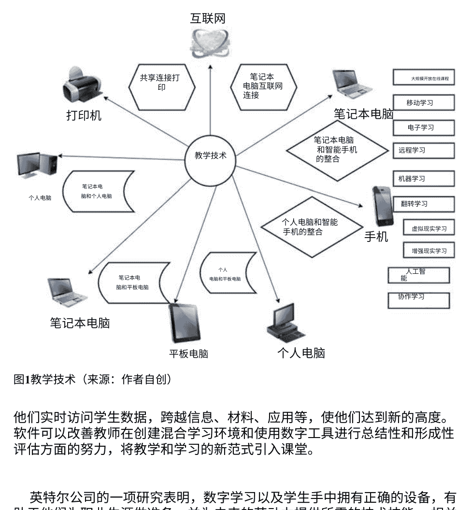

图1教学技术（来源：作者自创）

英特尔公司的一项研究表明，数字学习以及学生手中拥有正确的设备，有助于他们为职业生涯做准备，并为未来的劳动力提供所需的技术技能。相关的STEAM学习经验可以激发创造力，帮助学生将学习意义应用于实践，并规划未来的职业机会和未开发的职业。物理计算、编码、编程和计算机思维技能在这个职业中很常见。学生可以通过创作来提高他们的批判性思维和解决问题的能力，为21世纪做准备。

设计和适当的技术可以使与制造商和环境的学习变得非常激动人心。学校和大学面临着决定哪些设备和技术将帮助他们实现改变学习目标的困难。与各方利益相关者合作，评估教师和学生如何在日常学习中使用设备，应该使用设备来选择设备。利益相关者必须考虑可接受的内容要求、年级课程以及设备的使用方式。这不是一项简单的任务，但是像评估需求这样的因素，安全功能、兼容数字课程和材料、管理选择、设备性能和总拥有成本在选择正确设备时都起到了作用。 360度学习体验的基础是一个安全而强大的IT基础设施，支持数字材料，保护重要学生数据，提高运营效率，并确保学生的安全。

除了开发和使用虚拟教室和基于在线的教育平台之外，在线媒体实际上是PC创新的一个子类；然而，它们的发展在教育技术的整个历史中都值得单独讨论。 网络媒体涵盖了各种不同的技术，包括网站、维基、YouTube视频、手机（如手机和平板电脑）、Skype、Facebook和Twitter。Kaplan & Haenlein (2010) 将网络媒体统一定义为“基于互联网的应用程序，允许用户生成内容并进行交流，基于人与人之间的互动，在虚拟社区和组织中创建、分享或交换信息和思想。”

我们在本文中要解决的过去文献综述中存在的问题是由于COVID-19自2020年初以来的流行，网上课程是否可以替代传统的课堂学习。 网络学习的海啸已经发生。 许多学校为学生提供在线（虚拟）学习，作为在学年剩余时间内继续教育的一种方法。

对于那些在互联网上犹豫不决的教育家和主管来说，他们只有很少的选择来接受这十年前的创新。 一些教师在将他们的教室转移到互联网上时可能会遇到恐惧和担忧，但他们大多数人都能迅速适应，并在短时间内完成； 从长远来看，每个人似乎都适应得很好。 现在比以往任何时候都更明显的是数字分离（Guernsey等，2020）。那些能够带电脑的孩子已经准备好了。 教育者和教学策略稍微落后一步；然而，对于新学校模式的创造有着信心。 变革是有价值的。

## 3 移动技术在教学中的影响

在今天的世界中，大部分人口在很小的年龄就拥有智能手机（Han，2022年）。不言而喻，移动技术的应用远不止于通信。 事实上，移动技术是支持实际学习的最新工具之一（Hashim，2018年）。

与当代世界中其他可用技术一样，移动技术在积极和消极方面都对用户和利益相关者产生影响，特别是在享乐使用方面（Vujić& Szabo，2022年）。

研究表明，移动技术与学生在协作学习中的积极感知相关，但学生在课堂上更不满意（Heflin等，2017年）。 现代技术对教育的积极影响包括：全球化和教育和学习的改进，没有地理限制。 相反，负面影响包括：作弊事件增加，写作能力下降和缺乏专注力（Raja & Nagasubramani，2018年）。

目前，特别是在这个后COVID时代，移动技术的使用已经成为教育的重要组成部分。移动技术通过增加便携性和轻松访问互联网，促进了教育手段的改进。现在教师和学生可以搜索一个主题并随时随地学习。移动设备使学生能够轻松地从任何地方和任何时间访问教育内容（Criollo-C等，2018）。学生可以通过视频教程或可下载的互联网小课程自学。通过智能手机应用程序提供的在线教育手段，世界各地的学生现在能够熟悉国际背景。此外，来自世界各地不同地区的学生现在可以通过Zoom、Google Meet等虚拟会议应用同时参加在线课堂，大大降低了地理障碍。现代时代的学生可以通过移动技术轻松地在全球范围内进行沟通和拓展他们的网络。

然而，这个设施也存在一定的负面影响。的确，移动技术已经促进了随时随地的学习，但这也意味着任何人在任何地方都可以搜索他们想学习的主题，或者如果他们打算的话，可以在考试中抄袭。一些学生可能倾向于通过移动技术使用不公平手段来参加考试。此外，依赖他人编写的文本和材料也极大地降低了学生的创造力。学生们不再提出自己的想法，而是变得依赖已经通过在线媒体获得的信息。这反过来也导致学生缺乏专注力，并在课堂上对在线教育材料产生依赖的心态。

## 通过在线平台提供的4种移动技术

即使在最近的过去，智能手机被认为对学生的教育福祉有害，根据现有文献，家长的控制似乎非常严格（Hadad等，2020年）。然而，目前这种情况已经发生了很大变化。利用技术的新创新，智能手机应用在教育领域做出了重要贡献。目前，全球各地有数百，如果不是数千个提供教育支持的移动应用程序供学生、学者和教师使用。此外，大多数这些教育应用程序都是免费的。在最显著的免费教育应用程序中，下表列出了十个最重要的应用程序（Mindster，2020年）（表1）。

除了上表中提到的移动应用程序之外，还有其他移动技术可用于教育领域。图2表示不同收入群体的预期寿命。总收入或国内生产总值是个人拥有的技术设备使用的指标。

根据预期寿命数据，教室中的技术使用可能会有很大差异。例如：基于云的学习管理系统（如`Moodle`、`Blackboard`等）与网络会议平台（如`Zoom`、`Google Meet`等）的结合已经彻底改变了教育行业。

### 表1 在在线平台上可用的各种教育用途的移动应用程序

| 移动应用 | 描述 | 来源 |
| :--- | :--- | :--- |
| 谷歌课堂 | 一个虚拟教室，方便提交和评分作业，发送公告，开始讨论，创建班级，共享资源，提出评论和答案等。 | Tarteer等人 (2021) |
| edX | 来自哈佛、麻省理工学院、哥伦比亚等顶级大学的教育材料，包括超过2000门课程，如工程学、计算机科学、语言学、商业研究等等的汇编。 | 石和林 (2021) |
| 可汗学院 | 以视频教程的形式提供课程的平台。视频显示了虚拟黑板上记录的绘画，讲述者展示了它。可汗学院还提供在线课程，准备SAT、MCAT和LSAT等标准化考试。 | Massey等人 (2022) |
| Duolingo | 语言学习应用程序，通过迷你游戏以互动的方式促进学习30多种语言。该应用程序还跟踪学习者的表现并提供见解。 | Ahmed等人 (2022) |
| Remind | 帮助学生组成学习小组并保持联系的社区。Remind还用于向整个班级发送消息、提交作业、分享照片和讲义，并与朋友们个别或合作解决疑问。 | Jones等人 (2022) |
| Photomath | 通过提供逐步解释和指导学习者的方式来解决数学问题，利用提交的照片（手写或打印） | Long和 Bouck (2022年) |
| SoloLearn | 一个提供学习编程语言教程的平台，如C++、Java、Python、Swift、JavaScript、CSS、PHP、HTML等 | Elsisi等人 (2022) |
| Quizlet | 帮助学生练习和掌握任何他们喜欢的主题的简单工具Quizlet允许学习者设计自己的集合或从其他贡献者那里收集集合并学习它们 | Senior (2022年) |
| Kahoot | 提供任何感兴趣主题的现成测验学习者可以参加个人测验或与其他学习者一起参加实时测验 | Vijayakumar (2022) |
| uDemy | 拥有超过130,000个视频教程，涵盖从商业和技术到个人发展的各种课程如果学习者在某个课程中感到困惑，他们可以向其他学生和教师提问并解决疑问 | Moslehi等人 (2022) |

学生和教师都通过这些服务享受在线教育的好处。

## 高等教育中的5个热门应用

高等教育机构已经开始使用移动技术来提高教育质量（Han & Shin, 2016）。尽管机构不仅改善了高等教育的质量，还帮助学生学习。有许多工具和

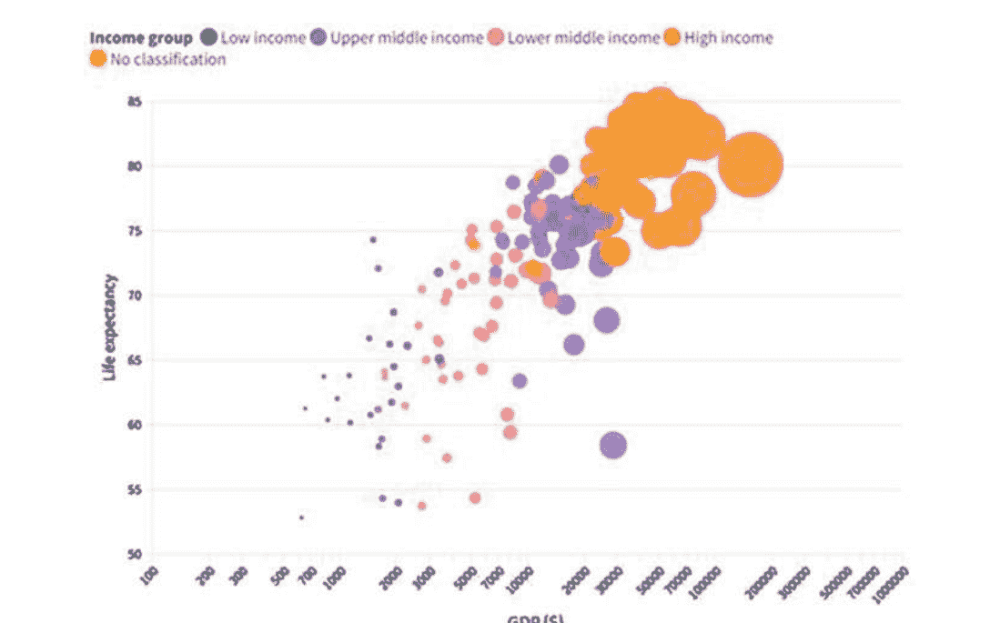

图2 不同收入群体的预期寿命

应用程序可用于实施整体高等教育系统。最常见的应用程序包括虚拟现实应用程序（Radianti等, 2020年），基于游戏的学习应用程序（Subhash & Cudney, 2018年），基于区块链的应用程序（Awaji等, 2020年）等等。

然而，二十一世纪的学习辅助工具是虚拟现实（Rogers, 2019年）。根据一项研究，在参与虚拟现实活动后，学生可以保留更多信息并更好地应用所学到的信息（Krokos等, 2019年）。作者建议集成的游戏功能在增加学习者参与度方面更加高效（Scholz等, 2021年）。基于游戏的应用可以帮助学生评估学习者并在团队游戏中进行个性化协作，提高知识水平（Troussas等, 2020年）。学生和教育机构还可以使用基于区块链的应用程序创建更多个性化的数字协议，包括任务标准、时间框架和评分程序（Chen等, 2018年）。尽管如此，`EduCTX`是一个基于区块链的去中心化学分网络（Turkanovic等, 2018年）。这些系统由于其全球存储能力和资源共享而具有灵活、安全和可靠的特点（Coulouris等, 2012年）。根据研究，大多数高等教育机构通过网站、学习平台、视频会议（`Google Meet`、`Google Duo`、`Google Hangout`和`Zoom`）、`YouTube`、社交媒体（`Facebook`和`Twitter`）以及其他几个免费的混合学习工具网站向学生提供在线课程（Shahzad等, 2020年）。此外，新兴技术改善了几个学生参与度的三个维度中，网络会议软件、数字游戏和`Facebook`似乎是最重要的（Schindler等，2017年）。移动技术的特点，如便携性和移动性，通过使用数字化图书馆和信息访问改善了其在教育中的潜在应用；全球许多高等教育机构正在探索其在高等教育中的可能用途（Yip等，2020年）。它可以消除教育中的空间和时间限制，从而大大扩大了高等教育的参与度。因此，在现代时代，在线应用已成为必要且持续的投资，大多数教育机构必须筹集额外资金来满足其不断扩大的技术资源需求（Baldwin，2021年）。毫无疑问，技术将是高等教育发展的推动力之一。在现有模型中，技术应被视为影响学生参与度的一个组成部分。不久之后，教育应用程序的发展将是开发者的一次千载难逢的机会。

### 从在线到离线的6种高等教育方式

全球大流行病稳定后，教育系统将从在线平台转向离线平台。在离线环境中，教授们花费了大量课堂时间与学生一起通过讲座和后续讨论来分发材料。作为大量参与者，大学被迫采取类似的预防措施，以最小化COVID-19对高等教育及其以后的影响（Liguori & Winkler，2020）。教育的当前增长是将在线和离线教学信息相结合的技术。然而，当高等教育机构采用在线学习模式时，他们面临挑战，但是考虑到在线学习转向离线学习时，似乎回到了传统的学习过程。作者调查了数字技术和学术教学的高度结合，以培养学生的自主学习能力和增加课堂活力，这对于改善课堂教学是有价值和相关的（Chen等，2020）。在线学习中的高等教育有正式和非正式的方法；另一方面，离线学习是正式的，以增加其作为学习平台的作用，为学生提供各种学习机会。离线教学增加了教师和学生之间的积极互动，尽管在线学习允许学生独自通过互联网学习。在COVID-19大流行和后流行时代，教学模式将在线和离线学习的好处结合起来（Gao & Lu，2021）。目前，在线实践与离线教学相结合，以更好地理解学习材料。根据一项研究，在线教学比面对面学习效果差（Liu & Han，2020）。此外，从在线到离线的转变方法增强了学生与教师的沟通，积极学习，并减少拖延。

## 7 移动技术对大学学生的影响

移动技术自问世以来已经取得了长足的发展。过去，人们使用的移动电话就像哑铃一样沉重。然而，由于移动技术的进步，人们现在使用的手机可以放在手掌中，并且主要由屏幕组成。移动技术影响着各个年龄段的人，但最近对其影响最大的是学生群体。研究发现，学生通过移动技术进行协作学习时持积极态度（Heflin等，2017年）。

除此之外，移动技术对学生还有许多其他影响。使用移动技术与学生的学业表现更好相关联。此外，使用移动技术进行学习还可以给经常使用移动设备的学生带来心理上的舒适感。移动技术甚至对学生产生了社会影响，例如将教育融入他们的生活中，使其成为一种自然过程而不是训练过程（Shyshkanova等，2017年）。总的来说，移动技术增加了同行之间的互动，并增加了学习活动的参与度（Fabian等，2015年）。然而，移动技术并非对学生都有积极影响。移动技术还可能对学生产生许多负面影响。

移动技术在增加学生参与度的同时，也可能导致分心。由于学生主要通过移动设备访问社交生活，他们在尝试参与任何学习活动时很容易被社交媒体分心。移动技术对学生的另一个负面影响是，它可能增加使用不公平手段进行考试和评估的学生人数，因为他们可以完全访问互联网而无人监督。

另一项研究发现，移动技术在社交互动方面的使用越多，对面对面互动的数量和质量产生的负面影响就越大（Elsobeihi和Abu Naser，2022）。换句话说，由于过度依赖移动技术进行社交互动，用户对面对面社交互动变得越来越不参与。

## 8 高等教育评估变异的影响

Covid-19已经对每个人的几乎所有方面都造成了变化。从人们的工作方式到人们的通勤方式。这次大流行再次证明了人类的适应能力。然而，Covid-19影响最大的行业之一是教育行业。教育部门已经朝着电子学习和移动学习的方向发生了巨大变化。尽管大部分影响都是积极的，但移动学习对教育产生了一些负面影响。移动学习在一个领域产生了积极和消极的影响：评估过程。

一项研究指出，缺乏准备和远程评估的固有缺点对高等教育评估构成了巨大挑战。其中一些挑战包括不诚实、缺乏适当的基础设施、提交截止日期的承诺等等（Guangul等，2020年）。由于教师和教职员工没有办法在受控环境中实时观察他们的学生，学生使用不公平和不诚实的手段完成评估的可能性很高。尽管评估技术在短短几年内取得了很大进展，但它仍然不能被视为完全消除评估中不诚实手段的解决方案。同样，学生并不总是有错。有时候学生是受到缺乏适当基础设施的影响，导致提交延迟甚至错过评估。

然而，并非所有在线评估的影响都是负面的。移动学习使学生和教师都能够在自己方便的时间和地点进行评估。教师在进行在线评估时也面临挑战。由于移动学习中没有面对面的互动，教师在传达自己的意图时遇到困难（Kearns，2012年）。在线评估中常见的另一个重大问题是学生提前获得评估答案的风险。这可能是由于各种因素，如故障的基础设施、黑客甚至不诚实的助手引起的。当然，由于每个人都在自己方便的时间进行在线评估，因此学生可以轻松地与在不同时间进行评估的同学分享答案（Rowe，2004年）。总的来说，在线学习是M-或E-learning中最需要发展的部分，尽管在线评估有一定的优势，但在线评估的缺点超过了它们的优点。

## 9 传统、在线或混合学习？

传统学习是一种面对面的互动过程；通过这种方式，在传统教育中不需要担心安全和保密问题，而在线教育中存在这样的问题；在这个过程中，高等教育的学生可以获得联系、灵感、可用性、结构等（Razeeth等，2019年）。此外，连接性导致学生和教授之间的直接沟通，因此高等教育作为结果，学生能够扩大他们的合作活动，并及时消除对特定问题的直接疑虑，这与在线学习不同。此外，大部分时间在传统学习中教授呈现和讨论主题；另一方面，学生密切关注并努力理解这些主题（Azzalis等，2009年）。各种学术文章表明，这种学习方式提高了学生回忆和掌握新内容的能力（Hyun等，2017年）。

但在技术进步的时代，学生希望能够随时随地阅读材料，这在高等教育的在线学习中已经成为可能。由于这种需求，在线教育已成为一种有效和理想的选择。对于高等教育，学生希望在不放弃就业、家庭生活或交通成本的情况下获得更好的教育。此外，在线学习学生有机会与教授联系，与朋友和同学互动，学习文档，并通过任何可访问互联网的地方完成所有课程任务，而不需要在特定时间和地点。随着在线学习的普及，各个高等教育机构都在努力确定将课程内容分发给在线学生的最佳方式。因此，高等教育机构已经开始采用移动技术来满足学生的需求。

如今学习在线的首要原因是Covid-19病毒的袭击，这导致大规模从传统面对面学习转向在线学习。2020年初，全球范围内的数百万教师开始在电子屏幕前讲课，而他们的学生则需要留在家中通过互联网参加课程。另一个原因是在线学习比传统学习更灵活。为了应对新冠病毒在全球范围内迅速传播的担忧，全球许多教育机构暂停了面对面授课，以防止病毒传播，导致全球大学更加倾向于在线学习，其他研究作者也提出在线和远程教育是社交距离和封锁期间的必要条件。新冠病毒还向整个教育系统展示了新的威胁，表明社会需要一个可靠和灵活的教育系统来应对不确定的未来。

另一个学习术语是混合学习（BL），它将传统面对面学习与在线学习相结合，是一种在高等教育中彻底改变教学和学习的技术进步，并在高等教育中越来越受欢迎。混合学习经常与合并灵活、混合模式或混合学习等短语结合使用（Anthony等，2019）。以前的研究通过比较传统教学和在线教学来测试混合学习的有效性，混合学习取得了巨大的进展，强调改善学习和教学成果（Van Laer和Elen，2020）。

在线学习教育材料的布局和执行包括单词书、学习指南、在线写作工具、讨论论坛、网址、视频教程、相关材料、模型、练习、测验等。相反，传统面对面教育包括讲座、实验活动、面对面实践和技能评估、个人/小组报告和教授主持的讨论，以评估学生的学术表现。

根据以前一篇研究论文的结果，混合学习方法提高了知识的获取、学习参与度和智慧，因为它对学生的意识和学习背景产生了显著影响，并强调从混合学习中学习（Edward等，2018），从而引导学生更加参与学习过程并使他们更加热情，这增强了他们的耐心和奉献精神（Ghazal等，2018）。混合学习使用在线和传统面对面（F2F）学习的混合方式，帮助教授在高等教育学生中实现教育目标，建立高效和有生产力的逻辑知识，帮助改善教育方面，并建立社会纪律（Subramaniam & Muniandy，2019）。

考虑到学生和讲师的观点，混合学习致力于在高等教育中建立在线信息可用性和传统学习之间的和谐、繁荣和健康的组合（Bervell & Umar，2018）。以前的研究还提到，混合学习包括多种活动的组合，通过将70%的在线学习和30%的面对面互动相结合来实现（Anthony等，2019）。学生对混合学习的热情增长，使他们能够按照自己的节奏学习，并通过提供实际的知识和技能为未来做准备（Ustunel & Tokel，2018），这使学生能够迅速运用他们的学术能力、自学能力和显然的计算机知识在工作场所（Yeou，2016）。作者还指出，混合学习对高等教育中的社交化产生积极影响，提高学生的智力能力和自立能力，提高学生的学习质量，提高他们的批判性思维能力，并将先进技术作为操作工具来展示课程给学生（Al-shami等，2018）。然而，以前的研究作者大多推荐混合学习作为高等教育中的一种积极教育方式。

## 10 金融专业效益和学习者之间的复杂性

移动和电子学习过程已经在学习者中引入，以消除教育障碍。不可否认的是，移动学习降低了学习者的成本，并可能使整个过程得以实现。根据最近的理论发展，这种学习方式使学习者能够获得便利。移动学习的引入使人们能够持续接受教育。除了移动学习的好处外，它还有一些明确的复杂性。本报告将发现学习者在获取这种学习方式时可能面临的金融效益和复杂性。

### 10.1 金融效益

技术的进步正在迅速变得更加高效和快速。移动学习得到了帮助增强学生和教师之间协作的技术的推动。改变学习方法不仅仅是这个过程的动机，也使得教育对学习者更加负担得起。

在可用性的背景下，学习的讲座、工具和其他材料都可以在所需的应用程序或网站上获得。这有助于学习者随时练习。移动技术有助于采用改进传统学习方法的新学习过程。

无可争议地，在线学习有助于节省金钱，也允许用户访问任何内容。对于一些来自发展中国家或欠发达国家的偏远地区的人来说，书籍可能是负担不起的。在线课程和课堂对学生来说是经济上方便的。这个过程在经济上有利于学习者的同时，也改善了教育系统。

通过在线学习，学习者可以获得诸如节省金钱、在舒适的地方适应、通勤费用、购买材料的费用等方面的经济利益。没有其他替代方式可以通过移动学习来访问所有内容，从而降低购买书籍和其他配件的成本。

盈利能力表明学生可以可持续学习。学习者可以在线连接并与教师合作，这确保了成本效益。成本包括考试监考，这可以帮助监考员和学生节省交通费用。移动学习和电子学习等在线学习不需要学习者或培训者购买书籍，因为所有材料和PDF文件都已经上传到网上。移动技术已经建立了移动教育，使学习变得负担得起和可访问。

学习者可以通过移动学习技术参加课程，帮助他们实现虚拟学习，而不需要花费交通或其他住宿费用。由于移动电话教育，人们不需要离开他们所在的城市或地区进行培训、上大学或任何其他机构。一些人可能在在线学习或通过手机阅读内容时工作，这不会妨碍工作。这种方法具有影响力，因为学习者可以节省运营成本和打印成本。以前，他们需要购买打印副本，并以费用打印文件。在线课程帮助他们减少了这些工具的成本。在线教育不仅提供教育上的财务收益，还有助于减少额外的费用，包括餐饮计划和住宿费用。

### 10.2 金融复杂性

生活在偏远地区的学生无法承担互联网和高端设备的费用。移动设备的成本是学习者面临的一个具有挑战性的金融问题，从金融的角度来看，移动教育的影响可能会影响学习过程。有时，在线学习需要一台高配置的计算机和可用工具，这些工具往往难以获得。

## 11 结论

通过移动教育学习和实践是一种渐进的学习方式。移动教育技术是一种主流媒介，可以帮助学生获取内容、PDF文件并节省时间。对过去几十年的分析表明，在线学习已经将远程教育的学生整合到了全球范围内。新兴的移动教育技术以极大的方式增加了教育水平。结果表明，学习者对移动学习和在线教育持有积极态度，与当前现象相一致。教育技术正在不断发展中的学习过程中出现。学术资源对所有学习者都可用和可访问，使教育更加灵活。通常通过评估学习者的态度来克服与学习者需求相关的问题。在线学习易于采用，适用于与教师和学生交流信息，无论身在何处，还可以学习新的技术特点。然而，一些学习者和教师在在线工作和使用技术时报告了问题。技术的进步使学习者产生了自卑感，并减少了社交互动，使人们变得不善于社交。大学、学院和其他机构应该分析效果，并在研究和学习过程中提供适当的知识。移动教育技术应该以学生能够负担得起的方式进行制造。

学者们应该制定一项关于在教育中使用和操作手机的适当政策，以避免滥用和欺凌。毫无疑问，互动是学习的关键要素，而在线学习确保及时对他们的表现给予反馈。在高等教育中实施在线学习是一个巨大的举措，这使得教育更具创造性和可行性。

## 参考文献

| 作者 | 年份 | 标题 | 期刊/来源 | 链接 |
| :--- | :--- | :--- | :--- | :--- |
| Abedin, M. Z., Guotai, C., Moula, F.-E., Azad, A. S. M. S., & Khan, M. S. U. | 2019 | 多层感知器和支持向量机在金融决策支持系统中的拓扑应用 | 国际金融与经济学杂志，24(1)，474–507 | https://doi.org/10.1002/ijfe.1675 |
| Abedin, M. Z., Moon, M. H., Hassan, M. K., & Hajek, P. | 2021 | 基于深度学习的COVID-19大流行期间的汇率预测 | 运筹学年鉴，2021.1. | https://doi.org/10.1007/s10479-021-04420-6 |
| Abedin, M. Z., Guotai, C., Hajek, P., & Zhang, T. | 2022 | 将加权SMOTE与集成学习相结合，用于小型企业信用风险的类别不平衡预测 | 复杂与智能系统 | https://doi.org/10.1007/s40747-021-00614-4 |
| Ahmed, A. A. A., Hassan, I., Pallathadka, H., Keezhatta, M. S., Noorman Haryadi, R., AlMashhadani, Z. I., Attwan, L. Y., & Rohi, A. | 2022 | MALL和EFL学习者的口语能力: Duolingo和WhatsApp应用对口语准确性和流利度的影响 | 教育研究国际, 2022, 1–10 | https://doi.org/10.1155/2022/6716474 |
| Ali, W. | 2020 | COVID-19大流行背景下高等教育机构的在线和远程学习成为必要 | 高等教育研究, 10(3), 16 | https://doi.org/10.5539/hes.v10n3p16 |
| Al-shami, S. A., Aziz, H., & Rashid, N. | 2018 | MOOC在马来西亚理工大学墨尔本校本科生中的应用 | 基础与应用科学杂志, 10(6), 2634–2654 | https://www.ajol.info/index.php/jfas/article/view/172198 |
| Anthony, B., Kamaludin, A., Romli, A., Raffei, A. F., Nincarean, A., Eh Phon, L., Abdullah, D., Ming, G. L., Shukor, N. A., Nordin, M. S., & Baba, S. | 2019 | 探索混合学习在高等教育机构中的教学和学习效果的角色：一项实证调查 | 教育和信息技术, 24(6), 3433–3466 | https://doi.org/10.1007/s10639-019-09941-z |
| Arnold, D., & Sangrà, A. | 2018 | 教育技术研究的第五个时代的黎明或黄昏？关于高等教育中技术增强学习的(e-)领导力的文献综述 (2013-2017) | 高等教育中教育技术国际期刊, 15(1), 24 |  |
| Awaji, B., Solaiman, E., & Alhshri, A. | 2020 | 基于区块链的高等教育应用 | 第五届国际信息与教育创新会议论文集 | https://doi.org/10.1145/3411681.3411688 |
| Azzalis, L., Sato, S., De Mattos, M., Fonseca, F., & Giavarotti, L. | 2009 | 主动学习与传统教学 | Revista de Ensino de Bioquímica, 7(2), 2 | https://doi.org/10.16923/reb.v7i2.186 |
| Baldwin, R. | 2021 | 教育中的技术 |  | https://education.stateuniversity.com/pages/2496/Technology-in-Education-HIGHER-EDUCATION.html |
| Bao, W. | 2020 | COVID-19和在线教育在高等教育中的教学案例研究：以北京大学为例 | Human Behavior and Emerging Technologies, 2(2), 113–115 | https://doi.org/10.1002/hbe2.191 |
| Bervell, B., & Umar, I. N. | 2018 | 混合学习还是面对面？导师焦虑是否阻碍了远程教育中学习管理系统的采用？ | 开放学习：开放、远程和电子学习杂志, 35(2), 159–177 | https://doi.org/10.1080/02680513.2018.1548964 |
| Chang-Tik, C. | 2018 | 学习风格对多学科混合学习环境中的探究社区存在的影响 | 互动学习环境, 26(6),827–838 | https://doi.org/10.1080/10494820.2017.1419495 |
| Chen, G., Xu, B., Lu, M., & Chen, N. | 2018 | 探索区块链技术及其在教育中的潜在应用 | 智能学习环境, 5(1) | https://doi.org/10.1186/s40561-017-0050-x |
| 陈, H., 吴, S., & 施, J. | 2020 | 在线和离线混合教学模式的设计 | 2020年IEEE第二届计算机科学与教育信息化国际会议(CSEI) | https://doi.org/10.1109/csei50228.2020.9142519 |
| Coulouris, G. F., Dollimore, J., & Kindberg, T. | 2012 | 分布式系统：概念与设计 | Springer |  |
| Criollo-C, S., Lujan-Mora, S., & Jaramillo-Alcazar, A. | 2018 | 移动学习在当前教育中的优缺点 | 2018年IEEE世界工程教育大会(EDUNINE) | https://doi.org/10.1109/edunine.2018.8450979 |
| Dumford, A. D., & Miller, A. L. | 2018 | 高等教育中的在线学习：探索参与的优势和劣势 | 高等教育计算杂志, 30 (3) , 452–465 | https://doi.org/10.1007/s12528-018-9179-z |
| Edward, C. N., Asirvatham, D., & Johar, M. G. | 2018 | 混合学习和学习者特征对学生能力的影响：学习东方音乐的实证证据 | 教育与信息技术, 23(6), 2587–2606 | https://doi.org/10.1007/s10639-018-9732-4 |
| Elsisi, M., Tran, M., Mahmoud, K., Mansour, D.-E. A., Lehtonen, M., & Darwish, M. M. F. | 2022 | 基于物联网的深度学习平台对电力变压器的在线故障诊断进行抗网络攻击和数据不确定性的有效性研究 | 测量, 190, 110686 | https://doi.org/10.1016/j.measurement.2021.110686 |
| Elsheikh, M., & Abu Naser, S. | 2022 | 移动技术对人际关系的影响 | 检索于2022年1月13日，来自 http://hdl.handle.net/10419/167579 |  |
| Fabian, K., Topping, K. J., & Barron, I. G. | 2015 | 移动技术和数学：对学生态度、参与度和成绩的影响 | 教育计算机杂志, 3(1), 77–104 | https://doi.org/10.1007/s40692-015-0048-8 |
| Gao, P., & Lu, M. | 2021 | 从学生的第一视角研究闭环在线和离线混合教学 | 在2021年第16届计算机科学与教育国际会议（ICCSE）中 | https://doi.org/10.1109/iccse51940.2021.9569389 |


Ghazal, S., Al-Samarraie, H., & Aldowah, H. (2018). “我仍在学习”: 在混合学习环境中建模LMS关键成功因素以促进学生体验和满意度。IEEE Access, 6, 77179–77201. https://doi.org/10.1109/access.2018.2879677

Guangul, F. M., Suhail, A. H., Khalil, M. I., & Khidhir, B. A. (2020). COVID-19背景下高等教育远程评估的挑战：中东学院的案例研究。教育评估、评估和问责制, 32(4), 519–535. https://doi.org/10.1007/s11092-020-09340-w

Guernsey, L., Ishmael, K., & Prescott, S. (2020). COVID-19后的在线学习: 关注公平性的PreK-12年级的提示和资源, 新美国。 检索自 https://www.newamerica.org/education-policy/edcentral/online-learning-wakecovid-19/

Hadad, S., Meishar-Tal, H., & Blau, I. (2020). 父母的故事: 为什么父母抵制学校使用智能手机进行教育? 计算机与教育, 157, 103984. https://doi.org/10.1016/j.compedu.2020.103984

Han, S. (2022). 智能手机对学生的影响: 首次使用年龄和使用时长对学习和学业进展的影响。 科技与社会, 70, 102002. https://doi.org/10.1016/j.techsoc.2022.102002

Han, I., & Shin, W. S. (2016). 使用移动学习管理系统和在线学生的学术成就。 计算机与教育, 102, 79–89. https://doi.org/10.1016/j.compedu.2016.07.003

Hasan, M., Noor, T., Gao, J., Usman, M., & Abedin, M. Z. (2022). 农村消费者的金融素养和金融科技服务的获取。 知识经济学杂志。 https://doi.org/10.1007/s13132-022-00936-9

Hashim, H. (2018). 技术在数字时代教育中的应用。 咨询与教育研究国际期刊, 1(2), 1. https://doi.org/10.24036/002za0002

Heflin, H., Shewmaker, J., & Nguyen, J. (2017). 移动技术对学生态度、参与度和学习的影响。 计算机与教育, 107, 91–99. https://doi.org/10.1016/j.compedu.2017.01.006

Hossain, S. F. A., Shan, X., & Nurunnabi, M. (2019). M-learning是一个挑战吗? : 学生对可持续学习和绩效的态度。国际电子协作杂志, 15(1), 21–37. https://doi.org/10.4018/IJeC.2019010102

Hossain, S. F. A., Nurunnabi, M., & Hussain, K. (2021). 基于TPACK的课堂和大学生学业表现中的移动设备持续使用倾向。 技术、教育学和教育学, 30(4), 589–607. https://doi.org/10.1080/1475939X.2021.1933160

Hossain, S. F. A., Xi, Z., Nurunnabi, M., & Anwar, B. (2022). 高等教育中的可持续学术表现: 一种混合方法研究。 互动学习环境, 30(4), 707–720. https://doi.org/10.1080/10494820.2019.1680392

Hyun, J., Ediger, R., & Lee, D. (2017). 学生对主动学习和传统课堂学习过程的满意度。国际高等教育教学与学习杂志, 29(1), 108–118. https://doi.org/10.1186/s41239-017-0041-6

Jones, A., Fouladi-Nashta, S., Eady, N., Bedeau, S., & Hafezi, H. (2022). “Just say no”(或者至少问一下为什么) STOMP药物评估在塔哈姆雷茨社区学习障碍服务中。BJPsch Open, 8(S1), S182–S182. https://doi.org/10.1192/bjo.2022.504

Kaplan, A. M., & Haenlein, M. (2010). 全球用户, 团结起来! 社交媒体的挑战和机遇。 商业视野, 53(1), 59–68.

Kearns, L. R. (2012). 在线学习中的学生评估：挑战和有效实践。MERLOT在线学习与教学杂志, 8(3).

Keengwe, J., & Bhargava, M. (2013). 移动学习和移动技术在教育中的整合。教育与信息技术, 19(4), 737–746. https://doi.org/10.1007/s10639-013-9250-3

Kekwaletswe, R. (2007). 移动学习环境中的知识转化的社交存在感。国际教育与发展使用ICT的期刊, 3(4), 102–109.

Krokos, E., Plaisant, C., & Varshney, A. (2019). 更正：虚拟记忆宫殿：沉浸帮助回忆。虚拟现实, 23(1), 17–17. https://doi.org/10.1007/s10555-018-0360-5

Lai, J. W. M., De Noble, J., Bower, M., & Breyer, Y. (2022). 对教育中技术使用的全面评估–与全球开放在线学习者群体的验证。教育与信息技术, 27, 9877. https://doi.org/10.1007/s10639-022-10986-w

Leinonen, R., Sugawara, H., Shumway, M., & International Nucleotide Sequence Database Collaboration. (2010). 序列读取存档。核酸研究, 39(suppl_1), D19–D21.

Liguori, E., & Winkler, C. (2020). 从离线到在线：COVID-19大流行后创业教育的挑战与机遇。创业教育与教学法, 3(4), 346–351. https://doi.org/10.1177/2515127420916738

Liu, Z., & Han, Z. (2020). 探索COVID-19疫情期间高等教育虚拟平台上在线课堂潜在用户体验的趋势：以中国为例。在2020IEEE国际工程教育教学、评估和学习会议（TALE）。 https://doi.org/10.1109/TALE48869.2020.9368349

Long, H. M., & Bouck, E. C. (2022). 计算器和在线游戏：支持学习障碍的学生在数学上。干预学校和诊所, 2022, 105345122210937. https://doi.org/10.1177/10534512221093787

Massey, C. C., Dogan, S., Muhammad, E., Hogan, E., Head, C., & Kim, J. (2022). 翻转教学对特殊教育预备教师的影响看法。国际教学与学习学术期刊, 16(2), 10.20429/ijsotl.2022.160213.

Mindster. (2020, December 25). 10个最佳免费教育应用程序，供学生和儿童学习。从 https://mindster.com/free-educational-appsstudents/#Best_10_Free_Educational_Apps_for_Students 检索

Moslehi, P., Rilling, J., & Adams, B. (2022). 关于新一代软件开发人员采用基于众包的软件工程教学屏幕录像的用户调查。系统与软件杂志, 185, 111144. https://doi.org/10.1016/j.jss.2021.111144

Nguyen, D. C., Ding, M., Pathirana, P. N., Seneviratne, A., Li, J., Niyato, D., & Poor, H. V. (2022). 6G物联网：一项综合调查。IEEE物联网杂志, 9(1), 359–383. https://doi.org/10.1109/JIOT.2021.3103320


Paul, J., & Jefferson, F. (2019). 2009年至2016年在线与面对面环境科学课程学生表现的比较分析 (p. 1)。计算机科学前沿。 https://doi.org/10.3389/fcomp.2019.00007

Radianti, J., Majchrzak, T. A., Fromm, J., & Wohlgenannt, I. (2020). 关于高等教育的沉浸式虚拟现实应用的系统综述：设计要素、经验教训和研究议程。计算机与教育, 147, 103778. https://doi.org/10.1016/j.compedu.2019.103778

Raja, R., & Nagasubramani, P. C. (2018). 现代技术对教育的影响。应用与高级研究杂志, S33–S35. https://doi.org/10.21839/jaar.2018.v3is1.165

Razeeh, M. S. S., Kariapper, R. K. A. R., Pirapuraj, P., Nafrees, A. C. M., Rishan, U. M., & Nusrath Ali, S. (2019). 家庭远程学习与传统学习在高等教育学生中的比较：基于调查的分析。在第9届国际研讨会2019。检索自 http://ir.lib.seu.ac.lk/handle/123456789/3909

Richardson, J. C., & Swan, K. (2003). 研究在线课程中社交存在与学生感知的学习和满意度之间的关系。异步学习网络杂志, 7, 68–88.

Rmenardi. (2012). 智能手机比台式电脑多吗？是时候了. 检索自 http://torsionmobile.com/2012/01/26/more-smart-phones-than-desktop-computers-its-time/

Rogers, S. (2019). 虚拟现实：21世纪的学习辅助. 检索自 https://www.forbes.com/sites/solrogers/2019/03/15/virtual-reality-the-learning-aid-of-the-21st-century/?sh=39d4bda0139b

Rowe, N. C. (2004). 在线学生评估中的作弊行为：超越抄袭. 在线远程学习管理杂志, 7(2), 1–10.

Sattarov, A., & Khaitova, N. (2019). 移动学习作为提高教育效果的新形式和方法. 欧洲研究与教育科学中的研究和反思, 7(12), 1169–1175.

Schindler, L. A., Burkholder, G. J., Morad, O. A., & Marsh, C. (2017). 基于计算机技术的学生参与度：文献的关键回顾. 高等教育中的国际教育技术, 14(1), 1–28. https://doi.org/10.1186/s41239-017-0063-0

Scholz, K. W., Komornicka, J. N., & Moore, A. (2021). 游戏化历史：设计和实施基于游戏的学习课程设计框架. 教学与学习探究, 9(1), 99–116. https://doi.org/10.20343/teachlearningu.9.1.9

Senior, J. (2022). 通过移动应用程序游戏化教学的词汇：Quizlet和Quizlet live教学的词汇的可接受性、可生产性和长期可用性. 在2022年国际商业分析与技术安全会议(ICBATS)上 (pp. 1–7). IEEE. https://doi.org/10.1109/ICBATS54253.2022.9759019

Shahzad, A., Hassan, R., Aremu, A. Y., Hussain, A., & Lodhi, R. N. (2020). COVID-19对高等教育机构学生的影响：男性和女性之间的群体比较. 质量与数量, 55(3), 805–826. https://doi.org/10.1007/s11135-020-01028-z

Sharples, M. (2007). 移动学习中的重大问题：万花筒卓越网络移动学习倡议的研讨会报告. 诺丁汉大学学习科学研究所.

Shi, Y., & Lin, X. (2021). 探索成年人的在线学习活动特征：EdX在线学院案例研究. 学习技术研究, 29, 1–13. https://doi.org/10.25304/rlt.v29.2622

Shyshkanova, G., Zaytseva, T., & Frydman, O. (2017). 移动技术使教育成为日常生活的一部分. 信息与学习科学, 118(11/12), 570–582. https://doi.org/10.1108/ils-03-2017-0019

Subhash, S., & Cudney, E. A. (2018). 高等教育中的游戏化学习：文献系统综述. 人机行为中的计算机, 87, 192–206.

Subramaniam, S. R., & Muniandy, B. (2019). 翻转课堂对学生参与度的影响. 技术, 知识与学习, 24(3), 355–372. https://doi.org/10.1007/s10758-017-9343-y

Sun, Z., & Qiu, X. (2017). 在EFL课堂中开发混合学习模型. 国际继续工程教育与终身学习杂志, 27(1/2), 4. https://doi.org/10.1504/ijceell.2017.080998

Tarteer, S., Badah, A., & Khlaif, Z. N. (2021). 在COVID-19大流行期间使用Google Classroom教授女性学生. 学校中的计算机, 38(4), 300–321. https://doi.org/10.1080/07380569.2021.1988318

Traxler, J. (2005). Defining移动学习. IADIS国际会议移动学习. 从 http://iadis.net/dl/final_uploads/200506C018.pdf 检索

Troussas, C., Krouska, A., & Sgouroupoulou, C. (2020). 协作和模糊建模的个性化移动游戏学习在高等教育中的应用. 计算机与教育, 144, 103698. https://doi.org/10.1016/j.compedu.2019.103698

Turkanovic, M., Holbl, M., Kosic, K., Hericko, M., & Kamisalic, A. (2018). EduCTX: 基于区块链的高等教育学分平台. IEEE Access, 6, 5112–5127. https://doi.org/10.1109/access.2018.2789929

Ustunel, H. H., & Tokel, S. T. (2018). 分布式脚手架: 技术增强学习环境中的协同作用。技术、知识与学习, 23(1), 129–160. https://doi.org/10.1007/s10758-017-9299-y

Van Laer, S., & Elen, J. (2020). 成人的自我调节行为在混合学习环境中的特征及其对设计的影响。Technology, Knowledge and Learning, 25(3), 509–539. https://doi.org/10.1007/s10758-017-9351-y

Vijayakumar, S. (2022). COVID-19之前、之后的外语学习：增强语言学习者的接受和表达技能的数字工具探索。在 A. Hamdan, A. E. Hassanieh, T. Mescon, & B. Alareeni (Eds.), Technologies, artificial intelligence and the future of learning post-COVID-19 (pp. 283–302). Springer. https://doi.org/10.1007/978-3-030-93921-2_17

Vujić, A., & Szabo, A. (2022). 享乐使用、压力和生活满意度作为智能手机成瘾的预测因素。成瘾行为报告, 15, 100411. https://doi.org/10.1016/j.abrep.2022.100411

Yang, F., Qiao, Y., Abedin, M. Z., & Huang, C. (2022). 隐私保护的信用数据共享集成区块链和联邦学习用于工业4.0。IEEE工业信息学报, 1-1. https://doi.org/10.1109/TII.2022.3151917


Yeou, M. (2016). 使用技术接受模型调查学生对混合学习环境中的Moodle的接受度。*教育技术系统杂志*, 44(3), 300–318. https://doi.org/10.1177/0047239515618464

Yip, K. H., Lo, P., Ho, K. K., & Chiu, D. K. (2020). 在高等教育中采用移动图书馆应用作为学习工具：香港和日本之间的故事。*在线信息评论*, 45(2), 389–405. https://doi.org/10.1108/oir-07-2020-0287

# 从健康数据中挖掘知识：特征选择方法的应用

Md. Rabiul Auwul, Md. Ajjul Hakim, Fahmida Tasnim Dhonno, Nusrat Afrin Shilpa和Mohammad Zoynul Abedin

## 摘要

本文旨在衡量从健康数据集中挖掘知识的特征选择方法的性能。 我们比较了七种流行的知识挖掘方法，包括放松的Lasso、随机森林、ReliefF、OneR、信息增益、T-检验和卡方检验。 支持向量机（SVM）分类器用于确定知识挖掘器的准确性和曲线下面积（AUC）值。 我们使用了六个流行的Affymetrix和cDNA数据集。

结果显示，放松的套索算法在Affymetrix上表现良好，而放松的套索与随机森林方法在cDNA数据集上表现良好。 本文将丰富现有文献，并帮助确定在健康信息学领域中进行知识挖掘的最佳特征。

**关键词** 知识挖掘 · 特征选择 · 分类 · 癌症数据 · SVM · Affymetrix · cDNA数据集

M. R. Auwul

数学系，理学与技术学院，美国国际大学孟加拉国分校，达卡，孟加拉国

M. A. Hakim

外汇和汇款部，特拉维夫卡塔尔，戈尔贝克斯商务中心，多哈，卡塔尔

F. T. Dhonno · N. A. Shilpa

金融与银行学系，哈吉·穆罕默德·达内什科学与技术大学，迪纳普尔，孟加拉国

M. Z. Abedin (✉)

金融、绩效和营销学系，提赛德大学国际商学院，提赛德大学，米德尔斯堡，提斯河谷，英国电子邮件：m.abedin@tees.ac.uk

## 1 引言

知识挖掘（数据挖掘）是对大量数据进行调查和探索，以发现重要的模式和方向。 从现有信息中提取知识是知识挖掘的主要任务。 知识挖掘依赖于两个参数；其中一个是通过对数据进行分析以产生关联规则，然后使用支持度和置信度准则在数据中发现最重要的关联。 第二个参数包括分类、序列或路径分析、聚类和预测。 在现代，各个领域的数据迅速增长，知识挖掘的重要性也随之增加（Lu等，2022年）。

健康领域是数据挖掘中发展最快、最具挑战性的部分之一，而且日益受到欢迎。健康领域的所有相关方都通过数据挖掘获得了巨大的好处，例如医疗保险公司可以识别欺诈和滥用行为；医疗团体可以制定客户关系管理决策；患者可以获得改善且更经济实惠的医疗设施（Koh和Tan，2005年）。在健康研究中使用的高维微阵列数据主要来自两种重要的芯片：Affymetrix和cDNA，这些芯片过于复杂和庞大，无法通过传统方法处理和研究。知识挖掘提供了将这些大量数据转化为有益决策材料的过程和工具。

这些微阵列数据以相关和冗余特征和样本的形式组成阵列。 特征选择是选择一组相关特征以构建有效预测模型的重要部分，特别是用于分类目的。

为了从高维数据中选择出显著特征，在文献中存在着几种方法。 但是没有人能够准确展示特征选择方法在Affymetrix和cDNA微阵列数据领域的应用（Rahman等，2021年）。

特征选择对于高维数据来说更加重要，通过消除无关和冗余的特征，可以提高癌症研究中基因表达数据的预测模型的性能，这些数据主要来自DNA微阵列技术。 当这些高维基因表达数据包含大量基因但只有少量样本时，研究人员面临问题。 特征选择的重要性在于从具有少量样本的高维数据中去除无关基因，以防止冗余基因对分类准确性的影响。 在本文中，我们探讨了七种最重要的特征选择方法，分别是Relaxed Lasso、Random Forest、ReliefF、OneR、Information Gain、T-test和Chi-squared test，应用于六个流行的Affymetrix和cDNA癌症基因表达数据集。

从对七种常用特征选择方法进行分析得到的结果表明，Relaxed Lasso在Affymetrix和Relaxed Lasso和Random Forest方法在cDNA数据集上的表现较好，相比其他方法。 本研究提供了应用评估的概要，以评估基因表达癌症数据集中特征选择的结果。

通过我们论文的发现，在医疗保健领域，特征选择方法将在预测医学、识别欺诈和误用、消费者关系管理、医疗保健控制和测量明确治疗的有效性等方面更加有效，同时用于通过提高效率、提高患者生活质量和可能最重要的是保护更多患者的生命来降低成本。 对于学术界，研究人员在进行知识挖掘（如聚类、分类等）时，可以轻松找到Affymetrix和cDNA数据的最佳特征选择方法，并为医疗保健领域做出贡献。

本文的其余部分组织如下。 第2节简要回顾了文献。 第3节介绍了本文中使用的方法和特征选择方法的简要描述。 第4节描述了结果和讨论。 最后，第5节总结了本文。

## 2 相关工作

为了降低维度并选择相关基因，存在各种特征/基因选择方法。 过滤器、包装器和嵌入方法是三种特征选择方法的类别。 通过测量个体特征与输出类标签之间的相关性来选择重要特征，而不涉及任何学习算法，通过诸如ReliefF（Kira & Rendell，1992）、信息增益（Dagliyan等，2011）、T-检验（Abedin等，2018）和卡方检验（Guotai等，2017）的过滤器方法。通过包装器方法，通过机器学习算法评估的特征子集采用搜索方法来查找潜在特征子集的空间，根据给定算法的性能质量评估每个子集。 顺序特征选择方法，如前向/后向选择，是包装器方法的一个示例，也被称为贪婪方法，因为其搜索策略。

包装器方法比简单的filter方法更复杂和昂贵。通过嵌入方法，添加了一个惩罚项来降低模型的复杂度，减少过度拟合或方差，例如通过添加更多的偏差，如广义线性回归的L1（或Lasso）回归（Tibshirani，1996），放松的Lasso（Abedin等，2019）。嵌入方法通常比包装器方法更快，并能为学习算法提供一个合适的特征子集。

Harb和Desuky使用基于相关性的特征选择方法来开发健康数据集的分类（Harb & Desuky，2014）。Jovičet al.（2015）回顾了几种filter，wrapper和embedded特征选择方法及其应用。他们展示了在文本挖掘，图像处理，计算机视觉和工业应用中的最佳效果。Kamkar等人比较了使用信息增益的Lasso特征选择方法来构建临床预测模型（Guo等，2015）。Lasso和岭回归正在被Fonti和Belitser用于高维数据集上的特征选择比较（Fonti & Belitser，2017）。B. Remeseiro和V. Bolon-Canedo（2019）对六种最先进的算法进行了回顾：CFS, INTERACT, InfoGain, CFS, ReliefF和SVM-RFE，用于医学应用中的四种分类算法，即：朴素贝叶斯，支持向量机，C4.5和K-NN。他们表明，选择的特征显著改善了分类器的性能。康传泽等人（2019）展示了特征基因选择ReliefF, Relaxed Lasso，信息增益和Kruskal–Wallis秩和检验在八个微阵列数据上的效果，使用了几种分类器。

对于所有微阵列数据集，放松的Lasso算法得到了更好的结果。ShrutiKaushik等人比较了传统的特征选择方法在一个涉及多个属性的医疗数据集上进行分类目的的效果（Kaushik等人，2019年）。

上述文献已经展示了特征选择方法在医疗数据上的应用，但是还没有人在Affymetrix和cDNA微阵列数据上进行分析。在本文中，我们比较了七种流行的特征选择方法，包括：放松的Lasso、随机森林、ReliefF、OneR、信息增益、T-检验和卡方检验，对六个流行的Affymetrix和cDNA数据集进行了比较。

## 3 材料和方法

### 3.1 数据集

在本文中，我们使用了三个Affymetrix和三个cDNA数据集来评估特征选择方法的性能。这些数据集已经在许多其他研究论文中使用过，其中我们只提到了一些例子。CNS、Lung DLBCL等数据集被Chuanze Kang等人用来分析选择显著特征对分类性能的影响（2019年）。Marcilio CP de Souto等人使用Shipp、Alizada、Bittner和Chen等癌症基因表达数据集进行了聚类算法的比较研究（2008年）（表1）。

**表1 本文中使用的Affymetrix和cDNA数据集**

| 数据集 | 芯片 | #样本 | 分布类别 | #基因 |
|--------|------|-------|----------|-------|
| CNS (Pomeroy等人, 2002年) | Affy | 60 | 21,39 | 7129 |
| 肺 (Beer等人, 2002年) | Affy | 86 | 62,24 | 7129 |

| DLBCL/Shipp (Shipp等人, 2002年) | Affy | 77 | 58,19 | 7129 |
| Alizadeh-V1 (Alizadeh等人, 2000年) | cDNA | 42 | 21,21 | 4022 |
| Bittner (Bittner等人, 2000年) | cDNA | 38 | 19,19 | 8067 |
| Chen (Chen等人, 2002年) | cDNA | 180 | 104,76 | 22,699 |

### 3.2 特征选择方法

放松的Lasso Meinshausen (2006年) 提出的一种广义方法，即软阈值和硬阈值，被定义为放松的Lasso:

```
β^{λ,φ} = argmin n^{-1} ∑ (X_i - Y_i^T {β.1ρ_λ})^2 + φλ||β||_1
```

对于 `λ ∈ [0,∞)` 和 `φ∈(0,1]`。变量集合上的指示函数 `ρ_λ ⊆ {1,...,p}` 表示为 `1 ρ_λ, ∀k ∈ {1,...,p}`:

```
β.1ρ_λ = \begin{cases} 0, & k\notinρ_λ \\ β_k, & k∈ρ_λ \end{cases}
```

集合 `ρ_λ`中的预测变量是松弛Lasso估计量的测量值。在变量选择部分，参数 `λ`控制普通Lasso估计。通过松弛参数 `φ`来控制系数的收缩。例如，对于 `φ=1`, 松弛Lasso估计量趋向于Lasso估计量。对于 `φ<1`, 松弛Lasso的收缩与普通Lasso估计量平行减少。上述定义在 `φ=0`的情况下会产生一种堕落的解决方案。因此，它最小化了上述定义中 `φ=0`的松弛Lasso的限制。模型中的所有系数 `ρ_λ`都是通过OLS解法估计的。

步骤1: 计算所有普通Lasso解，例如使用Efron等人 (2004) 的Lars算法进行Lasso修改。令 `ρ_1, ..., ρ_c`为结果集合的模型。令 `λ_1 > ... > λ_c = 0`为一系列惩罚项，使得 `ρ_λ = ρ_k`当且仅当， `λ∈(λ_k, λ_{k-1}]`。

步骤2: 令 `g(k) = (β^{λ_k} - β^{λ_{k-1}})/(λ_{k-1} - λ_k)` 对于每个 `k=1,...,c`。通过这个方向，可以估计普通Lasso解。如果至少有一个分量 `l` 使得 `sign(β_l) ≠ sign(β_l^{λ_k})`，那么松弛Lasso解 for `λ∈Λ_k` 必须按照简单算法的第2步进行计算。否则，所有 `λ∈Λ_k` 和 `φ∈[0,1]`的松弛Lasso解都由线性插值给出between `β^{λ_{k-1}}`。

设 `Y~N(0,Σ)`, 则响应变量可以用以下线性组合表示:

```
X = Y^T β + ε
```

其中 `ε~N(0,σ^2)`, 在参数 `λ` 和 `φ` 下, 放松Lasso的损失函数定义为:

```
L(\lambda, \varphi) = E(X - Y^T \beta^{\lambda, \varphi})^2 - \sigma^2.\hfill(4)
```

对于零散的高维数据，放松Lasso更合适。

#### 随机森林

随机森林 (RF) 是由Breiman (2001) 提出的一种嵌入式特征选择方法，它基于对训练集的响应变量进行随机选择生成多个决策树。在数据集 `Z_n = \{ (a_j, b_j) \}, j = 1, 2, ...n`通过将随机森林拟合到数据中来衡量，并计算每个数据点的误差并对森林进行平均。对于 `j^{th}` 特征，通过对所有树的排列前后误差的平均差值进行平均计算重要性分数。选择那些产生较大值的特征。

#### ReliefF

Relief (Kira & Rendell, 1992) 的扩展版本，每次从训练样本中随机选择一个样本 `S`，称为ReliefF (Robnik-Sikonja & Kononenko, 2003)。权重值的计算和更新通过从与 `S` 相同类别的样本和与 `S` 不同类别的样本中找到 `k` 个最近邻样本来完成，具体如下：

```
W_Z = W_Z - \sum_{i=1}^{k} diff(Z, S, H)/nk + \sum_{B \neq class(S)} [P(B)/P(class(S)) \times \sum_{i=1}^{k} diff(Z, S, N_i(B))]/nk.\hfill(5)
```

类别 `B` 中第 `i` 个最近邻样本表示为 `N i ( B )`，`d_i ff(g, t_1, t_2)`表示特征 `g` 中样本 `t_1` 和样本 `t_2` 之间的差异。如果特征 `g` 是离散的，则 `d_i ff( g, t_1, t_2)`的公式如下：

```
差异 g, t_1, t_2 = \begin{cases} 0, & t_1[g] = t_2[g] \ 1, & t_1[g] \neq t_2[g] \end{cases}.\hfill(6)
```

如果 `g` 连续，则差异`( g, t_1, t_2)`的公式为：

```
差异 g, t_1, t_2 = |t_1[g] - t_2[g]| / (\max(g) - \min(g)).\hfill(7)
```

与类别相关性高的特征具有最高权重，并根据权重顺序选择特征(Kang et a l., 2019)。

#### 信息增益

基于熵的特征选择方法计算每个属性和类别的互信息，然后根据信息增益(`I G`)对所有特征进行排序。如果 `X` 和 `Y` 是特征，`p(x)`是边际概率密度函数，则给定数据集的熵等于：

```
$H(X) = -\sum_{x \in X} p(x) \log_2[p(x)]$
```

给定条件概率 `p(x|y)`，当观察到 `Y`之前的条件熵为 `X`的条件熵，

```
$H(X|Y) = -\sum_{x \in X} p(x) \sum_{x \in X} p(x|y) \log_2[p(x|y)]$
```

最后，信息增益度量为：

```
$IG = H(X) - H(X|Y)$
```

特征根据信息增益值进行排序。 信息增益值较大的特征比其他特征更重要(Dagliyan et al., 2011)。

#### OneR

基于规则的嵌入式特征选择方法为每个属性在训练数据中构建一个规则，并选择具有最小错误和最大准确性的规则(Holte,1993)。 特征根据相应规则的准确性排序。 它采用决策树方法。 例如，如果`$R = (x, y)$`是一个具有前提条件 `$x$`的分类规则，执行一系列可以估计为真或假的测试，并且是一个可以适用于规则 `$R$`所包围的事件的类别。 对于OneR，一级决策树逐个属性构建和测试，并为每个属性的每个值分支。

#### T-检验

为了测试两个特征的独立性，使用Gosset提出的T-检验算法来量化每个单一特征相对于类别的显著性，通过确定以下统计量来计算每个单一特征的显著性：

```
$t = \frac{\bar{y}_1 - \bar{y}_2}{s_p \sqrt{2/n}}$
```

其中 `$s_p = \sqrt{(s_{y_1}^2 + s_{y_2}^2)/2}$` 对于 `$n = n_1 + n_2$`, `$s_{y_1}^2$` 以及 `$s_{y_2}^2$` 是两个样本方差的无偏估计量。 基于这些t分数计算出的p值，根据这些p值（p值越小，特征越重要），选择重要的特征。

#### 卡方检验

为了测试两个特征的独立性，使用卡方（`$\chi^2$`）检验来量化每个单一特征相对于类别的显著性，通过确定以下卡方统计量来计算每个单一特征的显著性：

```
> $$\chi^2_{d}=\sum\frac{(\text{观察}-\text{期望})^2}{\text{期望}}$$
```

(12)

其中观察值为Obs，期望值为Exp，自由度为d。每个特征选择方法的目标是选择那些与响应变量高度相关的特征。卡方值越大意味着观察值接近期望值，该特征的重要性越高。这种方法对于小频率（特别是 <5）给出误导性的结果。

### 分类器应用

分类是一种基于训练数据对测试数据进行分类的流行数据挖掘过程。为了找到特征选择方法的准确性，我们应用了一个带有十折交叉验证的SVM分类器（Boser等人，1992年）。还使用了每个特征的标准化，这减少了学习时间并使每个预测变量对目标变量的影响相等。SVM用于找到将两组不同特征分开的超平面，该超平面与两组特征中最近的特征之间的最大距离。

线性支持向量机的公式如下：

```
> $$S = \overline{w}.\overline{y} - b.$$
```

(13)

在这里，对于超平面，`y`是输入向量，`w`是法向量，具有以下距离：

```
> $$d = 1/\|w\|_2.$$
```

(14)

如果`y_j`是第`j`个训练样本，`z_j`是第`j`个训练样本的正确输出，则最大距离`d`可以表示为：

```
> $$\min_{w,b} \left[\frac{1}{2}\|w\|^2\right] \text{满足} \quad z_j(\overline{w} \cdot \overline{y}_j - b) \geq 1.$$
```

(15)

对于正样本和负样本，`z_j`分别为+1和-1。

### 性能分析

为了评估不同特征选择方法的性能，我们计算每种方法的接收操作特性曲线下面积（AUC）和准确性，准确性 = `(TP + TN)/(TP + FP + TN + FN)`，其中`TP`、`TN`、`FP`和`FN`分别表示真正例、真反例、假正例和假反例的数量。基于这两个参数，我们认为一个方法是良好的表现者，如果它产生更大的准确性和AUC值（图1）。

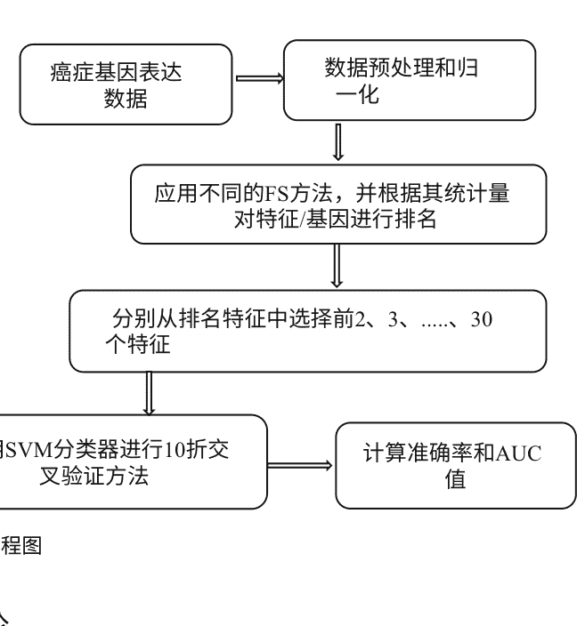

图1 本文方法的流程图

## 4 结果与讨论

Chuanze Kang等人（2019年）指出，对于所有数据集，当特征基因数目低于30时，分类准确率达到最高值。因此，在2到30个特征的范围内比较了本文中的特征选择方法的性能。

图2显示了在2-30范围内特征基因数目（NF）与分类准确率（ACC）之间的关联性，针对三个Affymetrix数据。图2a显示了CNS数据的性能，图2b显示了肺部数据的性能，图2c显示了Shipp数据的性能。对于Shipp数据集和CNS数据集，准确率接近100%，而其他方法在2-30个特征的准确率上有更大的变化，并且随着NF的增加没有发展。图2b显示Relaxed Lasso在肺部数据集上具有最高的准确率。当NF大于13时，其他三种方法选择的特征在准确率的变化上不起作用，除了T-test和随机森林与分类。

其他方法可能首先选择冗余基因来降低准确率随NF增加的情况。这个图表显示Relaxed Lasso具有最高的准确率。因此，我们可以得出结论，Relaxed Lasso在高维度和小样本Affymetrix数据的特征选择方面取得了更好的效果，并且更加适用。

图3显示了特征基因数量（NF）在2-30范围内与三个cDNA数据的分类准确率（ACC）之间的关联。图3a显示了Bittner数据的性能，图3b显示了Alizada数据的性能，图3c显示了Chen数据的性能。图3显示Relaxed Lasso具有最高的准确率。对于Bittner数据集和Alizada数据集，Relaxed Lasso的准确率几乎达到100%。

### (a) CNS数据

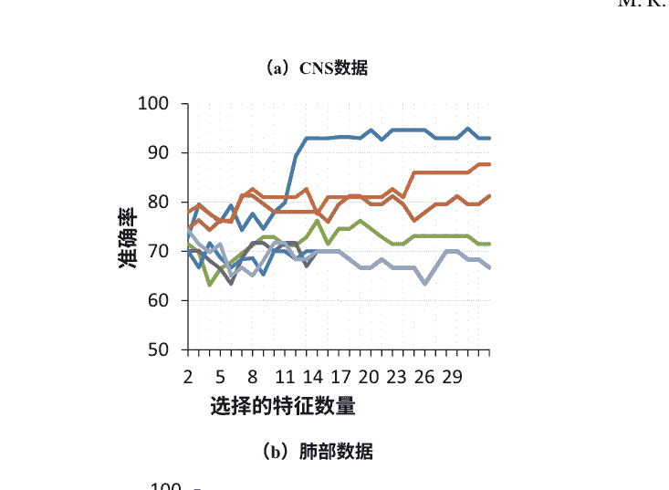

### (b) 肺部数据

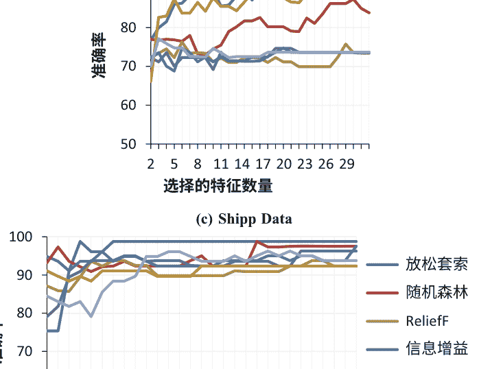

### (c) Shipp Data

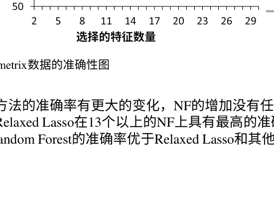

- 放松套索

- 随机森林

- ReliefF

- 信息增益

- OneR

- t检验

- 卡方检验

#### 图2 Affymetrix数据的准确性图

而其他方法的准确率有更大的变化，NF的增加没有任何发展。对于Chen数据集，Relaxed Lasso在13个以上的NF上具有最高的准确率，在13个以下的NF上，Random Forest的准确率优于Relaxed Lasso和其他方法。

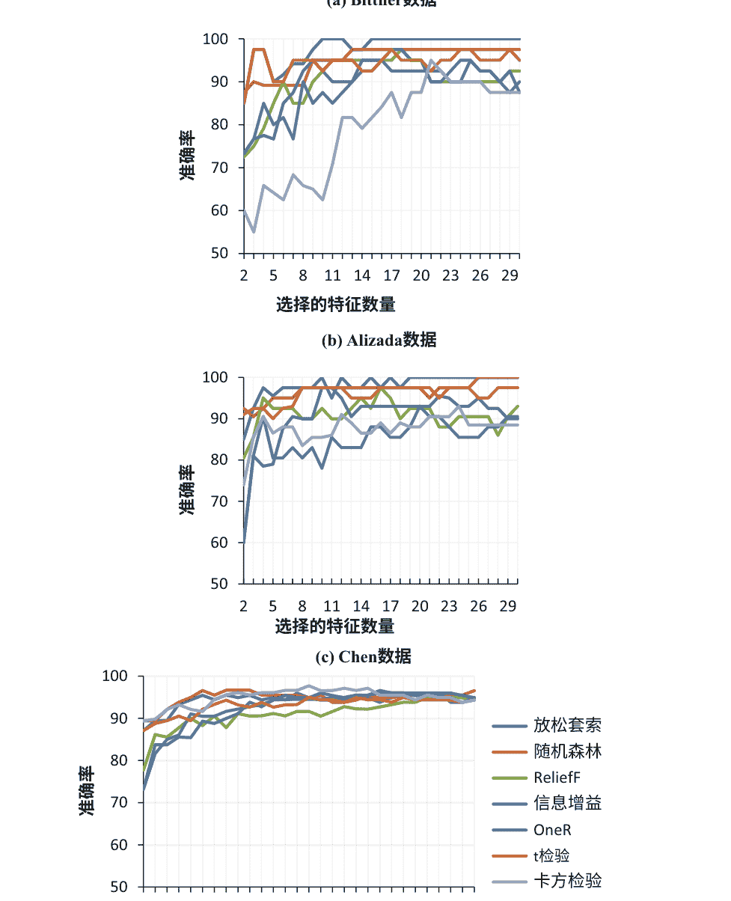

除了放松套索和随机森林在分类中的结果外，其他方法在准确性上的变化不大。其他方法可能首先选择冗余基因，从而降低准确性并增加NF。

#### 表2 特征选择方法平均AUC值的性能评估

| 特征选择方法 | Affymetrix数据集 CNS | Affymetrix数据集 肺 | Affymetrix数据集 Shipp | cDNA数据集 Alizada-V1 | cDNA数据集 Bittner | cDNA数据集 Chen |
| :--- | :--- | :--- | :--- | :--- | :--- | :--- |
| 放松的Lasso | **0.844** | **0.845** | **0.962** | **0.981** | **0.978** | 0.939 |
| 随机森林 | 0.733 | 0.703 | 0.929 | 0.970 | 0.951 | **0.945** |
| ReliefF | 0.625 | 0.531 | 0.874 | 0.910 | 0.916 | 0.904 |
| 信息增益 | 0.596 | 0.527 | 0.890 | 0.903 | 0.900 | 0.919 |
| OneR | 0.590 | 0.532 | 0.878 | 0.851 | 0.894 | 0.923 |
| T检验 | 0.795 | 0.847 | 0.923 | 0.958 | 0.945 | 0.928 |
| 卡方检验 | 0.586 | 0.538 | 0.870 | 0.879 | 0.812 | 0.944 |

粗体数值表示数据集和特征选择方法的最大AUC值

#### 表3 Mann-Whitney U检验对特征选择方法的效率测量

| 数据集 | 随机森林 | ReliefF | IG | OneR | T检验 | 卡方检验 |
| :--- | :--- | :--- | :--- | :--- | :--- | :--- |
| **CNS** | 629 | 817.5 | 841 | 841 | 578.5 | 839.5 |
| | 0.00115 | 6.03E-10 | 5.40E-11 | 4.90E-11 | 0.014 | 6.28E-11 |
| | 是 | 是 | 是 | 是 | 是 | 是 |
| **肺** | 777 | 841 | 841 | 841 | 592.5 | 840 |
| | 3.06E-08 | 6.20E-11 | 5.69E-11 | 5.33E-11 | 0.008 | 5.26E-11 |
| | 是 | 是 | 是 | 是 | 是 | 是 |
| **Shipp** | 753 | 823 | 779.5 | 786.5 | 823 | 786.5 |
| | 6.53E-08 | 8.16E-11 | 6.81E-09 | 3.38E-09 | 5.51E-11 | 3.56E-09 |
| | 是 | 是 | 是 | 是 | 是 | 是 |
| **Alizada-V1** | 577.5 | 795.5 | 783 | 822 | 673 | 813 |
| | 0.00875 | 3.19E-09 | 1.03E-08 | 2.52E-10 | 3.17E-05 | 6.42E-10 |
| | 是 | 是 | 是 | 是 | 是 | 是 |
| **Bittner** | 681 | 763 | 771.5 | 772.5 | 698 | 820 |
| | 2.23E-05 | 5.09E-08 | 2.44E-08 | 2.41E-08 | 8.72E-06 | 2.49E-10 |
| | 是 | 是 | 是 | 是 | 是 | 是 |
| **Chen** | 297 | 700 | 464.5 | 446 | 647.5 | 285.5 |
| | 0.05517 | 1.40E-05 | 0.498 | 0.697 | 4E-04 | 0.03629 |
| | 不 | 是 | 不 | 不 | 是 | 是 |

注意：每个数据集的第一、第二和第三行分别是曼-惠特尼U检验分数、p-值和关于放松Lasso效率是否更高（是）的陈述还是不是（否）

放松套索和随机森林取得更好的结果，并且更适用于高维度和小样本cDNA数据的特征选择。表2显示了特征选择方法的平均AUC值。放松套索平均具有最大的AUC值：对于CNS、Lung、Shipp、Alizada-V1和Shipp，图3(b)是Alizada数据，图3(c)是Chen数据。表3显示了六个数据集的曼-惠特尼U检验分数及其相应的p-值。结果表明，对于CNS、Lung、Shipp、Alizada-V1和Bittner数据集，放松Lasso特征选择方法比其他六种算法更高效，对于Chen数据集，放松Lasso的表现优于ReliefF和T-test。与其他方法相比，随机森林方法的效率相对较高，除了对于前五个数据集来说，对于Chen数据集，其性能优于放松Lasso。

## 5 结论

为了调查和探索大量现有信息，知识挖掘在健康领域起着重要作用。研究结果表明，知识挖掘对于癌症生物标志物、传染性疾病的遗传模式、药物分析等利益相关者来说是重要且必要的一部分。

微阵列数据的优势在于基因数量庞大，但样本数量较少，这为重要基因选择提供了先决条件。对于大量数据的分类，特征选择是一个重要的问题。有大量的研究关于使用微阵列基因表达数据识别癌症分类的特征选择。但是这些论文中没有包括特征选择方法在Affymetrix和cDNA微阵列数据集的不同部分的性能。

本文回顾和分析了七种常用的特征选择方法，分别是：`Relaxed Lasso`、`Random Forest`、`ReliefF`、`OneR`、`Information Gain`、`T-test`和`Chi-squared test`用于癌症分类。对六个`Affymetrix`和`cDNA`数据集分别进行了广泛的分析和比较这些特征选择方法。通过使用`SVM`分类器，对它们的准确性和`AUC`值进行了性能评估。从我们的调查中，我们发现`Relaxed Lasso`在`Affymetrix`上表现良好，而`Relaxed Lasso`和`Random Forest`方法在`cDNA`数据集上相对其他方法表现良好。

通过我们在医疗领域的论文发现，特征选择方法在寻找生物标志癌症基因、预测传染病（如`COVID-19`）的医学、提高方法效率以降低医疗成本、改善患者生活质量以及利用聚类、分类、模式识别和其他知识挖掘方法保护更多患者生命等方面将更加有效。在学术界，研究人员在使用知识挖掘方法处理`Affymetrix`和`cDNA`数据时，可以轻松找到最佳的特征选择方法，并为健康领域做出贡献。

关于未来的研究，我们将探索这些特征选择方法在深度学习中处理大数据的性能。 这将使结果更加可靠、信息丰富，并丰富现有的文献。

## 参考文献

- Abedin, M. Z., Guotai, C., Colombage, S., & Moula, F. E. (2018). 使用支持向量机和概率神经网络进行信用违约预测. 信用风险杂志, 14(2), 1–27.

- Abedin, M. Z., Guotai, C., Moula, F. E., Zhang, T., & Hassan, M. K. (2019). 一种使用优化特征选择方法的优化支持向量机智能技术：来自中国信用批准数据的证据. 风险模型验证杂志, 13(2), 1–46.

- Alizadeh, A. A., Eisen, M. B., Davis, R. E., Ma, C., Lossos, I. S., Rosenwald, A., 等 (2000). 基因表达谱鉴定出不同类型的弥漫性大B细胞淋巴瘤. 自然, 403, 503–511.

- Beer, D. G., Kardia, S. L., Huang, C. C., Giordano, T. J., Levin, A. M., Misek, D. E., Lizyness, M. L., Kuick, R., Hayasaka, S., Taylor, J. M., Iannettoni, M. D., Orringer, M. B., & Hanash, S. (2002). 基因表达谱预测肺腺癌患者的生存率. 自然医学, 8, 816–824.

- Bittner, M., Meltzer, P., Chen, Y., Jiang, Y., Seftor, E., Hendrix, M., 等 (2000). 基因表达谱对皮肤恶性黑色素瘤的分子分类. 自然, 406(6795), 536–540.

- Boser, B., Guyon, I., & Vapnik, V. (1992). 一种用于最优边界类别的训练算法. 在计算学习理论第5届年度研讨会论文集中(pp. 144–152). Springer.

- Breiman, L. (2001). 随机森林. 机器学习, 45, 5–32.

- Chen, X., Cheung, S., So, S., Fan, S., Barry, C., Higgins, J., 等 (2002). 人类肝癌中的基因表达模式. 细胞分子生物学, 13(6), 1929–1939.

- Dagliyan, O., Uney-Yuksektepe, F., Kavakli, I. H., & Turkay, M. (2011). 基于机器学习和深度学习算法的新型金融应用，产品建模和应用

- de Souto, M. C. P., Costa, I. G., de Araujo, D. S. A., Ludermir, T. B., & Schliep, A. (2008). 聚类癌症基因表达数据：一项比较研究. BMC生物信息学, 9, 1–14. https://doi.org/10.1186/1471-2105-9-497

- Efron, B., Hastie, T., Johnstone, I., & Tibshirani, R. (2004). 最小角度回归. 统计学年鉴, 32, 407–499.

- Fonti, V., & Belitser, E. (2017). 使用Lasso进行特征选择. VU阿姆斯特丹商业分析研究论文.

- Guo, X., Minai, A. A., & Lu, L. J. (2015). 稳定的临床预测特征选择: 利用树状Lasso算法利用ICD树结构. 生物医学信息学杂志, 27, 277–290.

- Guotai, C., Abedin, M. Z., & Moula, F. E. (2017). 用神经网络对信用批准数据进行建模：实验研究和优化. 商业经济与管理杂志, 18(2), 224–240.

- Harb, H. M., & Desuky, A. S. (2014). 基于粒子群优化的医学数据集分类特征选择. 国际计算机应用杂志, 104(5), 14–17.

- Holte, R. C. (1993). 非常简单的分类规则在大多数常用数据集上表现良好. Springer.

- Jovi, A., Brki, K., & Bogunovi, N. (2015). 特征选择方法综述及应用. 在2015年第38届国际信息与通信技术、电子和微电子会议 (MIPRO) 中 (第25–29页).

- 康，C.，霍，Y.，辛，L.，田，B.，于，B. (2019年)。使用放松的Lasso和广义多类支持向量机进行特征选择和肿瘤分类微阵列数据。理论生物学杂志，463，77–91。 https://doi.org/10.1016/j.jtbi.2018.12.010

- Kaushik, S., Choudhury, A., & Jatav, A. (2019). 在医疗保健中进行特征选择的比较分析 techniques for classification. MLDM，488–472。

- Kira, K., & Rendell, L. A. (1992). 特征选择问题：传统方法和一个新的 algorithm. 在AAAI-92会议记录（第129–134页）。

- Koh, H. C., & Tan, G. (2005). 数据挖掘在医疗保健中的应用。医疗保健信息管理杂志，19(2)，64–72。

- Lu, Y., Yang, L., Shi, B., Li, J., & Abedin, M. Z. (2022). 一种面向工业4.0中小企业的信用风险特征选择的新框架。运筹学年鉴。

- Meinshausen, N. (2006). 分位数回归森林。机器学习研究杂志，7, 983–999。

- Pomeroy, S. L., Tamayo, P., Gaasenbeek, M., Sturla, L. M., Angelo, M., McLaughlin, M. E., Allen, J. C., Zagzag, D., Olson, J. M., Curran, T., Wetmore, C., Biegel, J. A., Poggio, T., Mukherjee, S., Rifkin, R., Califano, A., Stolovitzky, G., & Louis. (2002). 基于基因表达的中枢神经系统胚胎瘤预测。自然，415(436)，436。

- Rahman, S., Shahriare, S., Khan, M. I., & Abedin, M. Z. (2021). 机器学习和深度学习算法在金融中的新颖应用、产品建模和应用 在计算健康信息学的信号处理技术中，智能系统参考库(第192卷)。斯普林格。

- Remeseiro, B., & Bolon-canedo, V. (2019). 医学应用中特征选择方法的综述。生物学和医学中的计算机，112, 103375.

- Robnik-Sikonja, M., & Kononenko, I. (2003). ReliefF和RReliefF的理论和实证分析。机器学习，53，23–69.

- Shipp, M., Ross, K., Tamayo, P., Weng, A., Kutok, J., Aguiar, R., et al. (2002). 通过基因表达谱和监督式机器学习预测弥漫性大B细胞淋巴瘤的结果。自然医学，8 ，68–74.

- Tibshirani, R. (1996). 通过套索进行回归收缩和选择。皇家统计学会杂志，58(1)，267–288.